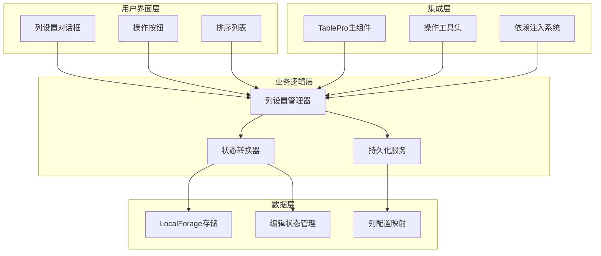
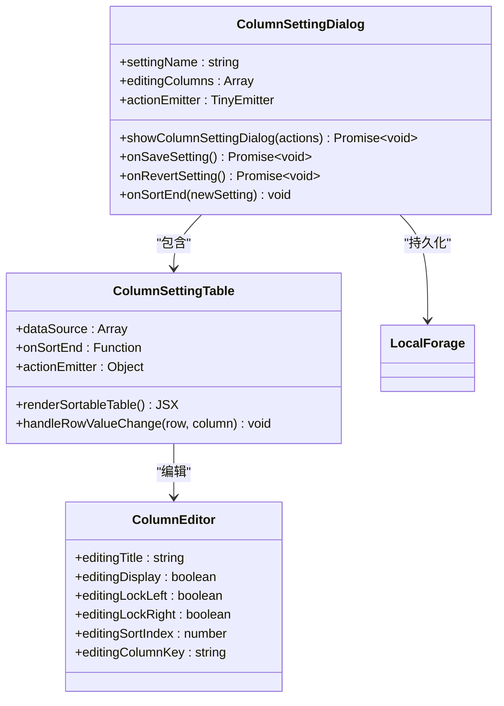
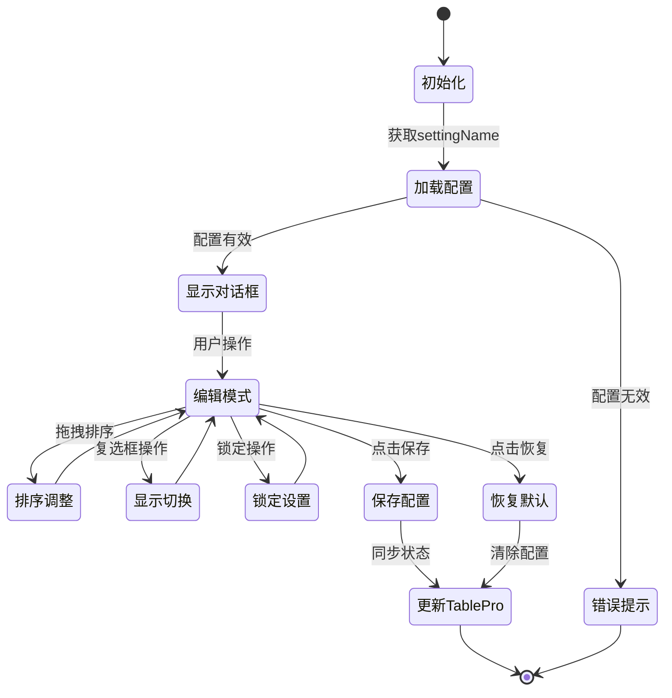
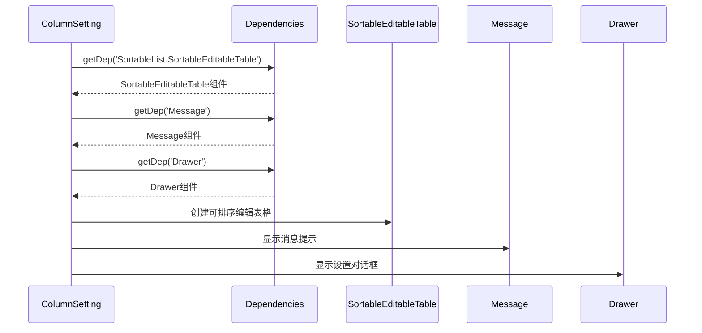
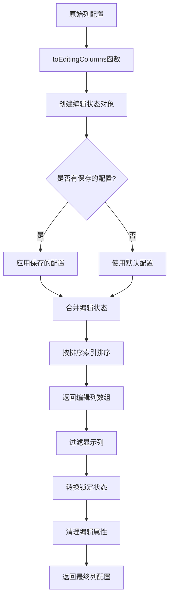
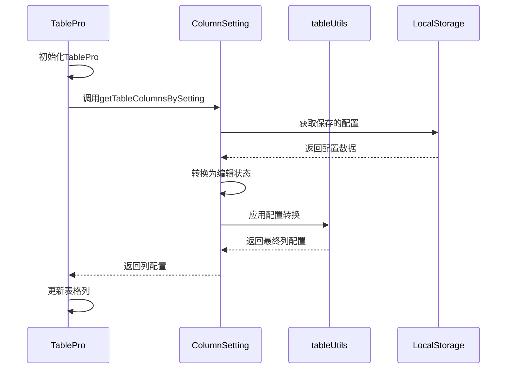

# 列配置系统

<cite>
**本文档引用的文件**
- [column-setting.tsx](file://src/table-pro/widget/column-setting.tsx)
- [useTablePro.tsx](file://src/table-pro/useTablePro.tsx)
- [types.ts](file://src/table-pro/types.ts)
- [table-pro.tsx](file://src/table-pro/table-pro.tsx)
- [operationsActions.tsx](file://src/table-pro/widget/operationsActions.tsx)
- [operations.tsx](file://src/table-pro/widget/operations.tsx)
- [renderToolbar.tsx](file://src/table-pro/widget/renderToolbar.tsx)
- [main.scss](file://src/table-pro/widget/main.scss)
- [column-setting.scss](file://src/table-pro/widget/styles/column-setting.scss)
- [deps.ts](file://src/table-pro/widget/deps.ts)
- [index.ts](file://src/table-pro/widget/index.ts)
</cite>

## 目录
1. [简介](#简介)
2. [系统架构](#系统架构)
3. [核心组件分析](#核心组件分析)
4. [功能特性详解](#功能特性详解)
5. [技术实现原理](#技术实现原理)
6. [使用指南](#使用指南)
7. [扩展与自定义](#扩展与自定义)
8. [性能优化](#性能优化)
9. [故障排除](#故障排除)
10. [总结](#总结)

## 简介

列配置系统是Fat Design TablePro组件的核心功能之一，它为用户提供了灵活的列管理能力。该系统允许用户通过可视化界面控制表格列的显示状态、调整列的显示顺序、设置列的锁定状态，并且能够持久化用户的个性化配置。

列配置系统的主要特点包括：
- **可视化列管理**：通过拖拽排序、复选框控制等方式直观地管理列
- **状态持久化**：使用LocalForage存储用户配置，实现跨会话的数据保持
- **响应式设计**：支持多种屏幕尺寸和设备类型
- **高度可定制**：提供丰富的配置选项和扩展点

## 系统架构

列配置系统采用模块化架构设计，主要由以下几个层次组成：



**图表来源**
- [column-setting.tsx](file://src/table-pro/widget/column-setting.tsx#L1-L311)
- [table-pro.tsx](file://src/table-pro/table-pro.tsx#L1-L214)

## 核心组件分析

### 列设置对话框组件

列设置对话框是整个系统的核心入口，负责提供用户交互界面和状态管理。



**图表来源**
- [column-setting.tsx](file://src/table-pro/widget/column-setting.tsx#L25-L120)
- [column-setting.tsx](file://src/table-pro/widget/column-setting.tsx#L140-L200)

### 状态管理系统

系统使用状态管理模式来管理列的编辑状态和持久化状态：



**图表来源**
- [column-setting.tsx](file://src/table-pro/widget/column-setting.tsx#L190-L280)

**章节来源**
- [column-setting.tsx](file://src/table-pro/widget/column-setting.tsx#L1-L311)
- [table-pro.tsx](file://src/table-pro/table-pro.tsx#L40-L50)

## 功能特性详解

### 列显示控制

列显示控制功能允许用户决定哪些列应该在表格中显示。系统通过以下机制实现：

1. **显示状态管理**：每个列都有一个`editingDisplay`属性，控制其可见性
2. **默认显示**：如果未设置显示状态，默认所有列都显示
3. **条件显示**：支持基于列配置的动态显示逻辑

```javascript
// 显示状态转换逻辑
const editingDisplay = column.editingDisplay as any;
return editingDisplay !== false;
```

### 列排序调整

列排序功能通过SortableEditableTable组件实现，支持以下特性：

1. **拖拽排序**：用户可以通过拖拽改变列的显示顺序
2. **索引管理**：每个列维护一个`editingSortIndex`属性
3. **实时更新**：排序变化时立即更新显示顺序

### 列锁定功能

列锁定功能允许用户固定某些列的位置：

1. **左锁定**：设置`editingLockLeft`为true
2. **右锁定**：设置`editingLockRight`为true
3. **互斥性**：同一列不能同时左右锁定

```javascript
// 锁定状态互斥逻辑
if (column.dataIndex === 'editingLockLeft') {
    if (row.editingLockLeft) {
        row.editingLockRight = false;
    }
}
```

### 持久化存储

系统使用LocalForage实现配置的持久化存储：

1. **键值命名**：使用`TableProColumnSetting_{settingName}`作为存储键
2. **JSON序列化**：配置对象以JSON格式存储
3. **异步操作**：所有存储操作都是异步的

**章节来源**
- [column-setting.tsx](file://src/table-pro/widget/column-setting.tsx#L120-L180)
- [column-setting.tsx](file://src/table-pro/widget/column-setting.tsx#L200-L260)

## 技术实现原理

### 依赖注入系统

列配置系统通过依赖注入获取所需组件：



**图表来源**
- [column-setting.tsx](file://src/table-pro/widget/column-setting.tsx#L190-L200)
- [deps.ts](file://src/table-pro/widget/deps.ts#L1-L11)

### 状态转换机制

系统实现了复杂的状态转换逻辑：



**图表来源**
- [column-setting.tsx](file://src/table-pro/widget/column-setting.tsx#L120-L180)

### CSS变量系统

系统使用CSS变量实现样式的动态定制：

1. **主题变量**：通过`$css-prefix`变量支持主题定制
2. **响应式设计**：支持不同屏幕尺寸的样式适配
3. **模块化样式**：样式文件按功能模块组织

**章节来源**
- [column-setting.tsx](file://src/table-pro/widget/column-setting.tsx#L190-L220)
- [main.scss](file://src/table-pro/widget/main.scss#L1-L8)

## 使用指南

### 基本使用方法

要启用列配置功能，需要在TablePro组件中设置`settingName`属性：

```jsx
<TablePro
    settingName="myTableSettings"
    // 其他配置...
/>
```

### 初始化默认列配置

系统会自动从TablePro的columns属性读取初始配置，并将其转换为编辑状态：

```javascript
// 转换为编辑状态的列配置
const editingColumns = columns.map((column, index) => {
    const editingTitle = getColumnTitleText(column, index);
    const editingColumnKey = `${editingTitle}_${column.dataIndex}`;
    
    return {
        ...column,
        editingColumnKey: editingColumnKey,
        editingTitle: editingTitle,
        editingLockLeft: column.lock === 'left',
        editingLockRight: column.lock === 'right',
        editingDisplay: typeof column.display === "boolean" ? column.display : true,
        editingSortIndex: index,
    };
});
```

### 处理列变更事件

当用户修改列配置时，系统会触发相应的事件处理：

```javascript
// 行值变化处理
onRowValueChange={(row: any, column: any) => {
    if (column.dataIndex === 'editingLockLeft') {
        if (row.editingLockLeft) {
            row.editingLockRight = false;
        }
    }
    if (column.dataIndex === 'editingLockRight') {
        if (row.editingLockRight) {
            row.editingLockLeft = false;
        }
    }
}}
```

### 持久化用户偏好设置

系统会自动保存用户的列配置到LocalForage：

```javascript
// 保存配置到LocalForage
const onSaveSetting = async () => {
    const editingColumns = dialogRef.editingColumns.map((c, index)=>{
        return {
            editingColumnKey: c.editingColumnKey,
            editingTitle: c.editingTitle,
            editingLockLeft: c.editingLockLeft,
            editingLockRight: c.editingLockRight,
            editingDisplay: c.editingDisplay,
            editingSortIndex: index,
        };
    });
    await storageInstance.setItem(LOCAL_FORAGE_KEY, JSON.stringify(editingColumns));
    actions.updateColumns();
};
```

**章节来源**
- [column-setting.tsx](file://src/table-pro/widget/column-setting.tsx#L120-L180)
- [column-setting.tsx](file://src/table-pro/widget/column-setting.tsx#L220-L250)

## 扩展与自定义

### 自定义列配置对话框

开发者可以通过以下方式扩展列配置功能：

1. **自定义列配置组件**：替换默认的SortableEditableTable
2. **添加新的配置选项**：扩展编辑状态对象
3. **自定义验证逻辑**：添加配置有效性检查

### 集成到现有工作流

列配置系统与TablePro的整体架构深度集成：



**图表来源**
- [table-pro.tsx](file://src/table-pro/table-pro.tsx#L40-L50)
- [column-setting.tsx](file://src/table-pro/widget/column-setting.tsx#L260-L310)

### 主题定制

系统支持通过CSS变量进行主题定制：

```scss
// 自定义列设置对话框样式
.#{$css-prefix}column-setting-dialog-title {
    width: 100%;
    box-sizing: border-box;
    position: relative;
}

.#{$css-prefix}column-setting-dialog-save-group {
    position: absolute;
    right: 26px;
    top: -5px;
}
```

**章节来源**
- [column-setting.tsx](file://src/table-pro/widget/column-setting.tsx#L260-L310)
- [column-setting.scss](file://src/table-pro/widget/styles/column-setting.scss#L1-L22)

## 性能优化

### 异步操作优化

系统采用异步操作避免阻塞主线程：

1. **异步加载配置**：配置获取不会阻塞页面渲染
2. **批量更新**：多个配置变更合并为一次更新
3. **防抖处理**：频繁的配置变更进行防抖处理

### 内存管理

系统实现了有效的内存管理策略：

1. **状态清理**：不再使用的状态及时清理
2. **事件监听器管理**：正确移除不需要的事件监听器
3. **组件卸载处理**：组件卸载时清理相关资源

### 缓存策略

系统使用多级缓存提高性能：

1. **本地缓存**：使用LocalForage缓存用户配置
2. **内存缓存**：缓存计算结果避免重复计算
3. **组件缓存**：缓存渲染结果减少重新渲染

## 故障排除

### 常见问题及解决方案

1. **设置名称无效**
   - **问题**：`settingName`长度小于等于10字符
   - **解决方案**：确保设置名称长度大于10字符

2. **配置无法保存**
   - **问题**：LocalForage存储失败
   - **解决方案**：检查浏览器存储权限和可用空间

3. **列配置不生效**
   - **问题**：TablePro未正确初始化
   - **解决方案**：确保正确传递`settingName`属性

### 调试技巧

1. **启用调试日志**：使用logger输出调试信息
2. **检查存储状态**：验证LocalForage中的配置数据
3. **监控网络请求**：检查配置同步过程中的网络状态

### 错误处理机制

系统实现了完善的错误处理机制：

```javascript
// 错误处理示例
try {
    const setting = await storageInstance.getItem(LOCAL_FORAGE_KEY);
    const settingArray = parseJsonObject(setting);
    // 处理配置...
} catch (error) {
    console.error('Failed to load column settings:', error);
    // 使用默认配置
}
```

**章节来源**
- [column-setting.tsx](file://src/table-pro/widget/column-setting.tsx#L190-L220)

## 总结

列配置系统是Fat Design TablePro组件的重要组成部分，它提供了完整的列管理功能。系统具有以下优势：

1. **用户体验优秀**：通过可视化界面提供直观的列管理体验
2. **技术架构先进**：采用模块化设计和依赖注入系统
3. **功能丰富完整**：支持显示控制、排序调整、锁定设置等多种功能
4. **性能表现良好**：通过异步操作和缓存策略保证良好的性能
5. **易于扩展**：提供丰富的扩展点和自定义选项

该系统为开发者提供了强大而灵活的列配置能力，能够满足各种复杂的业务需求。通过合理的使用和适当的扩展，可以构建出符合特定业务场景的表格配置系统。