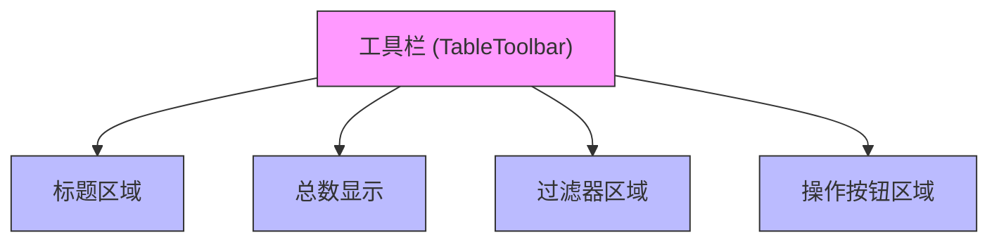
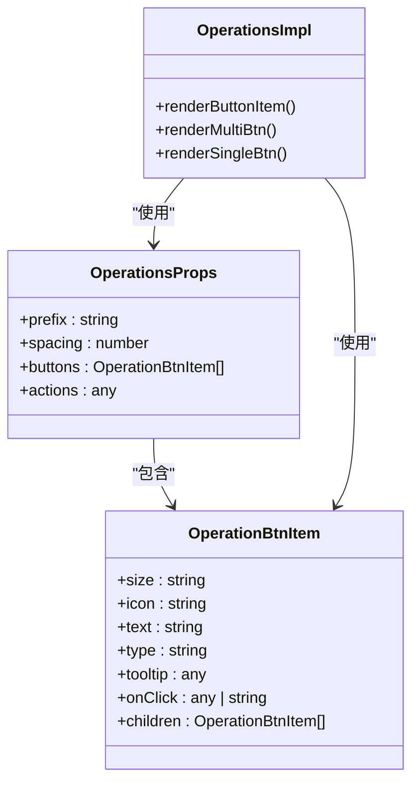
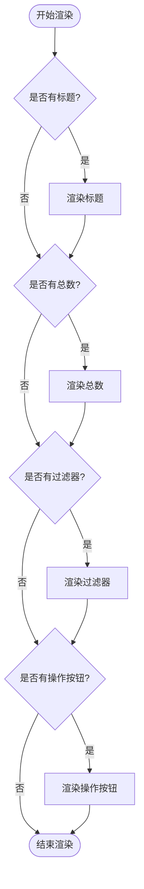
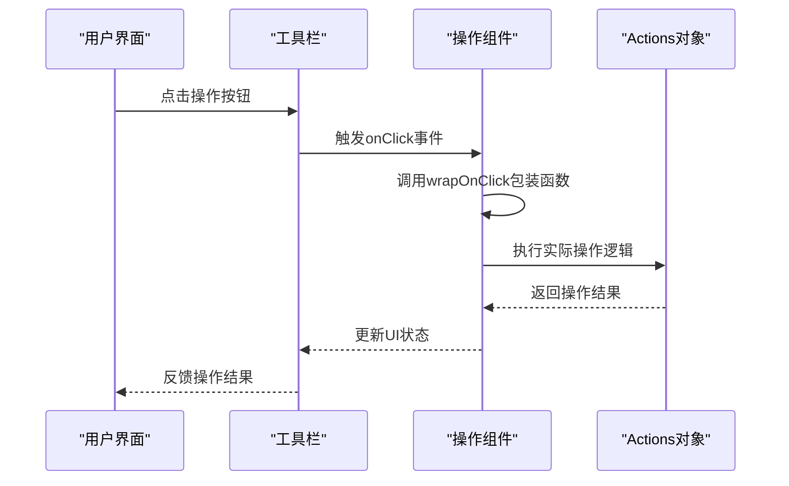

# 工具栏与批量操作

<cite>
**本文档引用的文件**
- [operationsActions.tsx](file://src/table-pro/widget/operationsActions.tsx)
- [renderToolbar.tsx](file://src/table-pro/widget/renderToolbar.tsx)
- [operations.tsx](file://src/table-pro/widget/operations.tsx)
- [types.d.ts](file://types/0buildTypes/table-pro/types.d.ts)
- [TablePro组件使用文档.md](file://demo-doc/TablePro组件使用文档.md)
</cite>

## 目录
1. [简介](#简介)
2. [工具栏结构](#工具栏结构)
3. [批量操作系统](#批量操作系统)
4. [动态渲染机制](#动态渲染机制)
5. [自定义操作按钮](#自定义操作按钮)
6. [批量删除与导出实现](#批量删除与导出实现)
7. [权限控制集成](#权限控制集成)
8. [操作确认对话框](#操作确认对话框)
9. [异步任务处理](#异步任务处理)
10. [最佳实践](#最佳实践)

## 简介
本文档详细阐述了工具栏（Toolbar）和批量操作功能的实现机制。系统介绍了工具栏的组成结构，包括操作按钮组、批量选择控件和自定义插槽。深入解析了`operationsActions`系统如何定义和管理批量操作逻辑，以及`renderToolbar`如何动态渲染工具栏UI。提供了代码示例展示如何添加自定义操作按钮、实现批量删除/导出功能，以及根据选中行数据动态更新操作可用状态。

**Section sources**
- [TablePro组件使用文档.md](file://demo-doc/TablePro组件使用文档.md#L787-L795)

## 工具栏结构
工具栏由多个组件构成，主要包括标题区域、总数显示、过滤器区域和操作按钮区域。工具栏通过`TableToolbarProps`接口定义其属性，包含`title`、`totalCount`、`filterProps`和`operationProps`等关键属性。

工具栏采用Flex布局，各组件按行排列。操作按钮区域位于工具栏右侧，通过绝对定位实现。工具栏支持自定义组件替换，可通过`components`属性指定自定义的过滤器或操作组件。

**Diagram sources**
- [renderToolbar.tsx](file://src/table-pro/widget/renderToolbar.tsx#L0-L71)
- [toolbar.scss](file://src/table-pro/widget/styles/toolbar.scss#L0-L35)

**Section sources**
- [renderToolbar.tsx](file://src/table-pro/widget/renderToolbar.tsx#L0-L71)
- [toolbar.scss](file://src/table-pro/widget/styles/toolbar.scss#L0-L35)

## 批量操作系统
批量操作系统通过`OperationsProps`接口定义操作按钮的配置，包含`buttons`数组和`actions`对象。每个操作按钮由`OperationBtnItem`接口定义，支持文本、图标、类型、提示和点击事件等属性。

批量操作支持单按钮和下拉菜单两种形式。当按钮有`children`属性时，会渲染为下拉菜单。系统通过`wrapOnClick`函数包装点击事件，支持函数和字符串两种事件处理方式。

**Diagram sources**
- [operations.tsx](file://src/table-pro/widget/operations.tsx#L0-L168)
- [types.d.ts](file://types/0buildTypes/table-pro/types.d.ts#L0-L95)

**Section sources**
- [operations.tsx](file://src/table-pro/widget/operations.tsx#L0-L168)
- [types.d.ts](file://types/0buildTypes/table-pro/types.d.ts#L0-L95)

## 动态渲染机制
工具栏的动态渲染通过`renderTableToolbar`函数实现。该函数接收`TableToolbarProps`作为参数，根据属性值动态决定渲染哪些组件。系统采用条件渲染策略，只有当相应属性存在且不为空时才渲染对应组件。

渲染机制支持组件替换，通过`components`属性可以指定自定义的过滤器或操作组件。这种设计提高了组件的可扩展性和灵活性，允许开发者根据具体需求定制工具栏外观和行为。

**Diagram sources**
- [renderToolbar.tsx](file://src/table-pro/widget/renderToolbar.tsx#L0-L71)

**Section sources**
- [renderToolbar.tsx](file://src/table-pro/widget/renderToolbar.tsx#L0-L71)

## 自定义操作按钮
自定义操作按钮通过`operationProps.buttons`数组配置。每个按钮可以定义文本、图标、类型、提示和点击事件。点击事件支持直接函数引用或字符串标识符两种方式。

对于复杂操作，可以使用`children`属性创建下拉菜单。系统会自动将包含子项的按钮渲染为菜单按钮，子项作为菜单选项显示。通过`actions`对象可以访问表格的上下文信息，实现更复杂的交互逻辑。

**Diagram sources**
- [operations.tsx](file://src/table-pro/widget/operations.tsx#L0-L168)
- [operationsActions.tsx](file://src/table-pro/widget/operationsActions.tsx#L0-L14)

**Section sources**
- [operations.tsx](file://src/table-pro/widget/operations.tsx#L0-L168)
- [operationsActions.tsx](file://src/table-pro/widget/operationsActions.tsx#L0-L14)

## 批量删除与导出实现
批量删除和导出功能通过定义相应的操作按钮实现。在`operationProps.buttons`数组中添加"批量删除"和"导出"按钮，设置相应的图标、文本和点击事件。

批量删除操作需要先获取选中的行数据，然后调用删除API。导出功能通常需要将表格数据转换为指定格式（如Excel、CSV），然后触发下载。两种操作都建议添加确认对话框，防止误操作。

**Section sources**
- [TablePro组件使用文档.md](file://demo-doc/TablePro组件使用文档.md#L787-L795)

## 权限控制集成
权限控制通过`operationCode`属性与权限系统集成。每个操作按钮可以设置`operationCode`，系统根据当前用户权限决定是否显示该按钮。

权限检查在渲染时进行，只有当用户具有相应权限时才渲染操作按钮。这种设计确保了安全性，防止未经授权的用户执行敏感操作。权限信息通常从`actions`对象中获取。

**Section sources**
- [TablePro组件使用文档.md](file://demo-doc/TablePro组件使用文档.md#L787-L795)

## 操作确认对话框
敏感操作（如删除）应使用确认对话框。系统通过`Balloon`组件实现提示功能，可以在按钮上添加`tooltip`属性显示操作说明。

对于需要用户确认的操作，可以在点击事件中调用确认对话框组件。确认对话框应清晰说明操作后果，并提供"确认"和"取消"选项。只有用户明确确认后才执行实际操作。

**Section sources**
- [operations.tsx](file://src/table-pro/widget/operations.tsx#L0-L168)

## 异步任务处理
批量操作通常涉及异步任务，如API调用或文件生成。系统通过`actions`对象提供状态管理功能，可以主动触发表格刷新等操作。

异步操作应显示加载状态，防止用户重复提交。操作完成后应及时更新UI状态，并提供成功或失败的反馈。对于长时间运行的任务，建议提供进度指示器。

**Section sources**
- [TablePro组件使用文档.md](file://demo-doc/TablePro组件使用文档.md#L787-L795)

## 最佳实践
1. **设置名称必填**：为表格设置唯一的`settingName`，用于保存用户的表格设置（列宽、排序等）
2. **性能优化**：大数据量时建议使用服务端分页，避免前端性能问题
3. **权限控制**：通过`operationCode`配合权限系统控制按钮显示，确保安全性
4. **状态管理**：通过`actions`对象可以主动触发表格刷新等操作，保持UI同步
5. **样式定制**：支持通过CSS变量和类名进行样式定制，满足不同设计需求
6. **用户体验**：为敏感操作添加确认对话框，防止误操作；为异步操作提供加载状态反馈

**Section sources**
- [TablePro组件使用文档.md](file://demo-doc/TablePro组件使用文档.md#L787-L795)