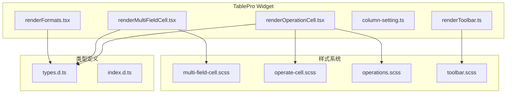
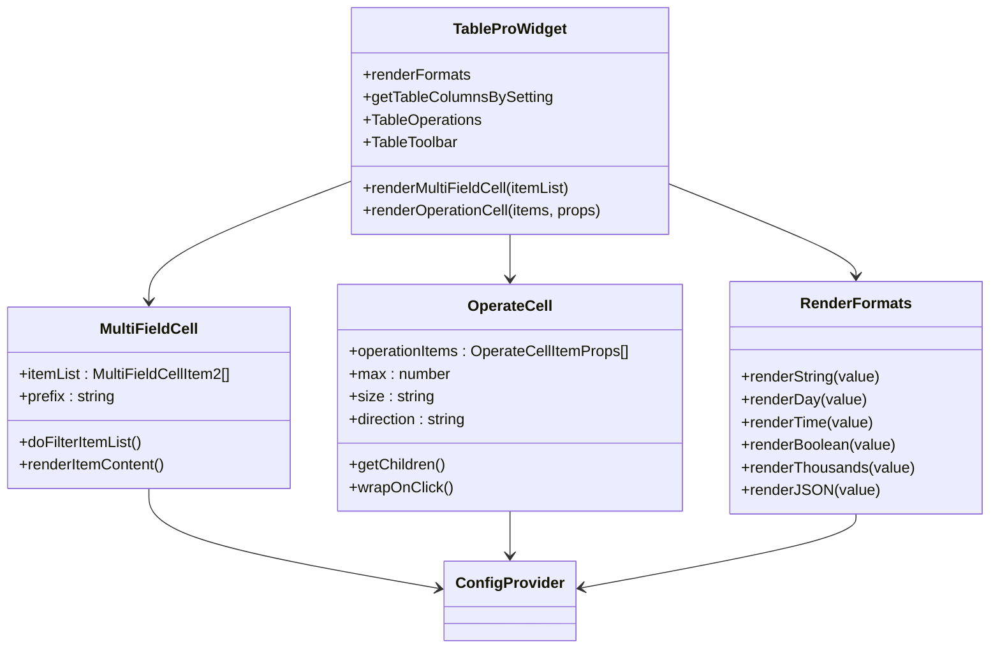
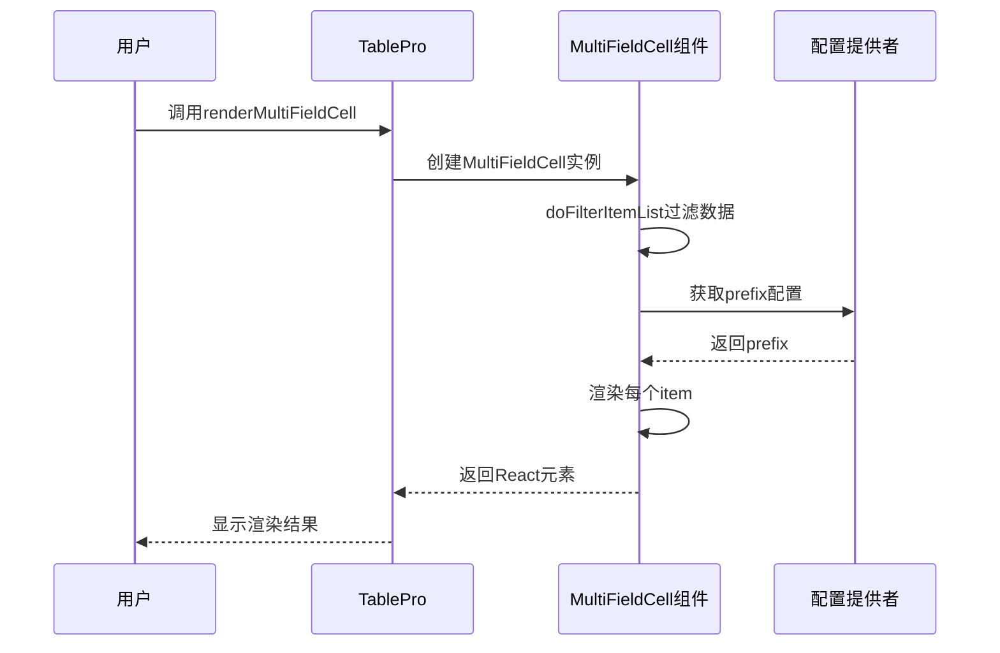
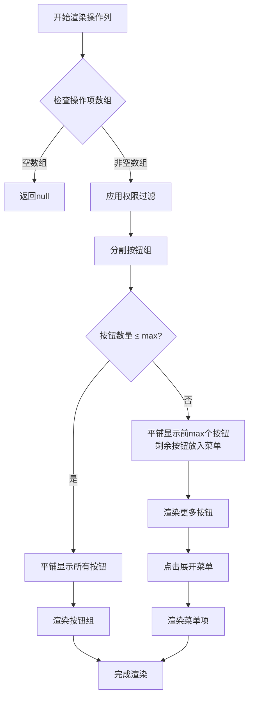
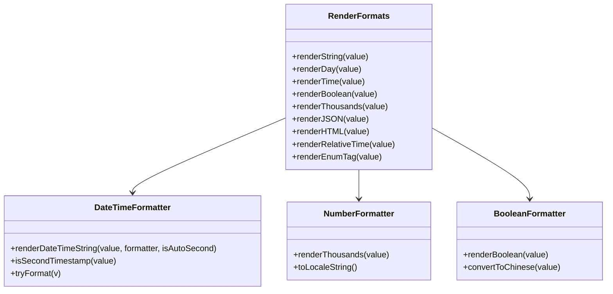
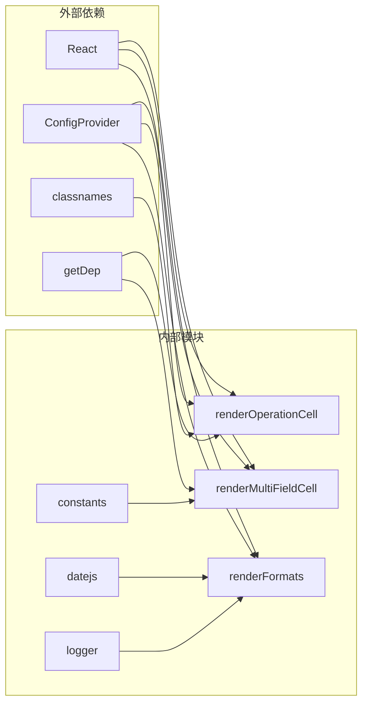

# TablePro高级渲染功能

<cite>
**本文档引用的文件**
- [renderMultiFieldCell.tsx](file://src/table-pro/widget/renderMultiFieldCell.tsx)
- [renderOperationCell.tsx](file://src/table-pro/widget/renderOperationCell.tsx)
- [renderFormats.tsx](file://src/table-pro/widget/renderFormats.tsx)
- [index.tsx](file://src/table-pro/widget/index.ts)
- [types.d.ts](file://types/0buildTypes/table-pro/types.d.ts)
- [demo-table-pro.tsx](file://demo/demo-table-pro.tsx)
- [multi-field-cell.scss](file://src/table-pro/widget/styles/multi-field-cell.scss)
- [operate-cell.scss](file://src/table-pro/widget/styles/operate-cell.scss)
</cite>

## 目录
1. [简介](#简介)
2. [项目结构](#项目结构)
3. [核心组件](#核心组件)
4. [架构概览](#架构概览)
5. [详细组件分析](#详细组件分析)
6. [依赖关系分析](#依赖关系分析)
7. [性能考虑](#性能考虑)
8. [故障排除指南](#故障排除指南)
9. [结论](#结论)

## 简介

TablePro高级渲染功能是一套强大的表格渲染工具集，专门设计用于提升表格数据展示的灵活性和用户体验。该功能包含三大核心特性：多字段单元格（Multi-field Cell）、操作列（Operation Cell）和数据格式化（Render Formats），为开发者提供了丰富的数据展示和交互能力。

这些高级渲染功能不仅简化了复杂的表格布局，还通过智能的权限控制、响应式设计和性能优化，确保了在各种场景下的稳定性和可维护性。

## 项目结构

TablePro高级渲染功能采用模块化设计，将不同类型的渲染功能分离到独立的模块中，便于维护和扩展。



**图表来源**
- [renderMultiFieldCell.tsx](file://src/table-pro/widget/renderMultiFieldCell.tsx#L1-L112)
- [renderOperationCell.tsx](file://src/table-pro/widget/renderOperationCell.tsx#L1-L227)
- [renderFormats.tsx](file://src/table-pro/widget/renderFormats.tsx#L1-L368)

**章节来源**
- [index.tsx](file://src/table-pro/widget/index.ts#L1-L30)
- [types.d.ts](file://types/0buildTypes/table-pro/types.d.ts#L1-L96)

## 核心组件

TablePro高级渲染功能的核心组件包括三个主要部分：

### 1. 多字段单元格（Multi-field Cell）
负责将多个数据字段聚合展示在一个单元格中，支持标题-内容对、纯文本和条件显示。

### 2. 操作列（Operation Cell）
提供安全的操作按钮渲染，支持权限控制、事件委托和响应式布局。

### 3. 数据格式化（Render Formats）
包含多种常用数据格式的快速转换功能，如日期、数字、布尔值等。

**章节来源**
- [renderMultiFieldCell.tsx](file://src/table-pro/widget/renderMultiFieldCell.tsx#L1-L112)
- [renderOperationCell.tsx](file://src/table-pro/widget/renderOperationCell.tsx#L1-L227)
- [renderFormats.tsx](file://src/table-pro/widget/renderFormats.tsx#L1-L368)

## 架构概览

TablePro高级渲染功能采用分层架构设计，确保了代码的可维护性和扩展性。



**图表来源**
- [index.tsx](file://src/table-pro/widget/index.ts#L1-L30)
- [renderMultiFieldCell.tsx](file://src/table-pro/widget/renderMultiFieldCell.tsx#L30-L112)
- [renderOperationCell.tsx](file://src/table-pro/widget/renderOperationCell.tsx#L70-L227)
- [renderFormats.tsx](file://src/table-pro/widget/renderFormats.tsx#L300-L368)

## 详细组件分析

### 多字段单元格（Multi-field Cell）分析

多字段单元格功能允许将多个相关数据字段组合展示在一个单元格中，提供灵活的数据组织方式。



**图表来源**
- [renderMultiFieldCell.tsx](file://src/table-pro/widget/renderMultiFieldCell.tsx#L95-L112)
- [renderMultiFieldCell.tsx](file://src/table-pro/widget/renderMultiFieldCell.tsx#L30-L50)

#### 核心实现特点

1. **智能过滤机制**：`doFilterItemList`函数会自动过滤掉无效或不需要显示的项目
2. **类型安全**：支持多种输入类型（对象、字符串、布尔值、数字）
3. **条件显示**：通过`display`属性控制项目的可见性
4. **空值处理**：统一的占位符处理机制

```typescript
// 类型定义
export interface MultiFieldCellItem {
    content?: any;
    title?: any;
    display?: boolean;
}

export type MultiFieldCellItem2 = MultiFieldCellItem | string | boolean | number;
```

**章节来源**
- [renderMultiFieldCell.tsx](file://src/table-pro/widget/renderMultiFieldCell.tsx#L1-L112)
- [types.d.ts](file://types/0buildTypes/table-pro/types.d.ts#L75-L85)

### 操作列（Operation Cell）分析

操作列功能提供了一个安全且高效的按钮渲染系统，支持权限控制和响应式布局。



**图表来源**
- [renderOperationCell.tsx](file://src/table-pro/widget/renderOperationCell.tsx#L25-L70)
- [renderOperationCell.tsx](file://src/table-pro/widget/renderOperationCell.tsx#L150-L200)

#### 安全特性

1. **权限控制**：基于`operationCode`进行权限验证
2. **事件委托**：通过`wrapOnClick`函数实现事件委托
3. **防抖处理**：避免重复点击
4. **错误边界**：防止单个按钮错误影响整体渲染

```typescript
// 权限过滤示例
const filteredItems = operationItems.filter((item) => {
    const operationCode = item.operationCode;
    if (!operationCode) {
        return true; // 无需鉴权
    }
    return Array.isArray(operationPerms) && operationPerms.indexOf(operationCode) >= 0;
});
```

**章节来源**
- [renderOperationCell.tsx](file://src/table-pro/widget/renderOperationCell.tsx#L1-L227)
- [types.d.ts](file://types/0buildTypes/table-pro/types.d.ts#L55-L75)

### 数据格式化（Render Formats）分析

数据格式化功能提供了丰富的数据转换工具，支持多种数据类型的标准化展示。



**图表来源**
- [renderFormats.tsx](file://src/table-pro/widget/renderFormats.tsx#L300-L368)
- [renderFormats.tsx](file://src/table-pro/widget/renderFormats.tsx#L40-L80)

#### 格式化功能详解

1. **日期时间格式化**：
   - 支持多种日期格式（YYYY-MM-DD、YYYY-MM-DD HH:mm:ss）
   - 自动识别时间戳单位
   - 支持数组格式化

2. **数值格式化**：
   - 千分位格式化
   - 固定小数位数
   - 错误处理机制

3. **布尔值格式化**：
   - 多种布尔值表示方式的统一转换
   - 中文语义化显示

**章节来源**
- [renderFormats.tsx](file://src/table-pro/widget/renderFormats.tsx#L1-L368)
- [types.d.ts](file://types/0buildTypes/table-pro/types.d.ts#L85-L95)

## 依赖关系分析

TablePro高级渲染功能具有清晰的依赖层次结构，确保了模块间的松耦合。



**图表来源**
- [renderMultiFieldCell.tsx](file://src/table-pro/widget/renderMultiFieldCell.tsx#L1-L5)
- [renderOperationCell.tsx](file://src/table-pro/widget/renderOperationCell.tsx#L1-L5)
- [renderFormats.tsx](file://src/table-pro/widget/renderFormats.tsx#L1-L10)

**章节来源**
- [renderMultiFieldCell.tsx](file://src/table-pro/widget/renderMultiFieldCell.tsx#L1-L112)
- [renderOperationCell.tsx](file://src/table-pro/widget/renderOperationCell.tsx#L1-L227)
- [renderFormats.tsx](file://src/table-pro/widget/renderFormats.tsx#L1-L368)

## 性能考虑

### 渲染性能优化

1. **React.memo优化**：所有核心组件都使用`React.memo`进行性能优化
2. **条件渲染**：根据数据状态决定渲染路径
3. **懒加载**：通过`getDep`动态获取依赖组件
4. **内存管理**：合理使用事件委托减少内存占用

### 内存泄漏防范

1. **事件清理**：及时清理DOM事件监听器
2. **组件卸载**：确保组件正确卸载
3. **循环引用检测**：避免深层嵌套引用
4. **缓存策略**：合理使用缓存避免重复计算

## 故障排除指南

### 常见问题及解决方案

1. **权限控制失效**
   - 检查`operationPerms`数组是否正确传递
   - 确认`operationCode`格式符合要求

2. **样式异常**
   - 验证`prefix`配置是否正确
   - 检查CSS类名冲突

3. **数据格式化错误**
   - 确认输入数据类型
   - 检查格式化函数的边界条件

4. **性能问题**
   - 使用React DevTools分析渲染性能
   - 检查是否存在不必要的重新渲染

**章节来源**
- [renderOperationCell.tsx](file://src/table-pro/widget/renderOperationCell.tsx#L25-L70)
- [renderFormats.tsx](file://src/table-pro/widget/renderFormats.tsx#L200-L250)

## 结论

TablePro高级渲染功能通过精心设计的架构和实现，为开发者提供了强大而灵活的表格渲染能力。其模块化的设计理念、完善的类型系统和丰富的功能特性，使得复杂的数据展示需求变得简单易行。

主要优势包括：
- **高度可定制**：支持自定义渲染函数和第三方组件集成
- **性能优异**：通过多种优化技术确保流畅的用户体验
- **安全可靠**：内置权限控制和错误处理机制
- **易于维护**：清晰的代码结构和完善的文档支持

这些功能不仅提升了开发效率，也为最终用户带来了更好的交互体验，是现代Web应用开发中不可或缺的重要工具。