# Tag 标签和 Badge 徽标组件技术文档

<cite>
**本文档中引用的文件**
- [src/tag/index.jsx](file://src/tag/index.jsx)
- [src/tag/tag.jsx](file://src/tag/tag.jsx)
- [src/tag/tag-group.jsx](file://src/tag/tag-group.jsx)
- [src/tag/selectable.jsx](file://src/tag/selectable.jsx)
- [src/tag/closeable.jsx](file://src/tag/closeable.jsx)
- [src/tag/scss/variable.scss](file://src/tag/scss/variable.scss)
- [src/tag/scss/mixin.scss](file://src/tag/scss/mixin.scss)
- [src/badge/index.jsx](file://src/badge/index.jsx)
- [src/badge/sup.jsx](file://src/badge/sup.jsx)
- [src/badge/main.scss](file://src/badge/main.scss)
- [src/badge/scss/variable.scss](file://src/badge/scss/variable.scss)
- [src/badge/scss/mixin.scss](file://src/badge/scss/mixin.scss)
- [demo/tmp-utils/tag-colors.js](file://demo/tmp-utils/tag-colors.js)
- [src/core/style/_color.scss](file://src/core/style/_color.scss)
</cite>

## 目录
1. [简介](#简介)
2. [项目结构](#项目结构)
3. [Tag 组件详解](#tag组件详解)
4. [Badge 组件详解](#badge组件详解)
5. [视觉样式与尺寸变体](#视觉样式与尺寸变体)
6. [颜色配置系统](#颜色配置系统)
7. [无障碍访问支持](#无障碍访问支持)
8. [实际应用场景](#实际应用场景)
9. [最佳实践建议](#最佳实践建议)
10. [总结](#总结)

## 简介

Fat Design 组件库提供了两个重要的数据展示组件：Tag 标签和 Badge 徽标。这两个组件都属于数据展示类别，但在功能和使用场景上各有特色。

**Tag 标签**：
- 支持可关闭、可选择状态
- 提供标签组（TagGroup）布局管理功能
- 支持多种尺寸和颜色配置
- 具备动画效果支持

**Badge 徽标**：
- 用于显示消息计数、状态提示
- 支持小红点和自定义内容
- 可以嵌套在其他组件内部
- 提供溢出计数处理机制

## 项目结构

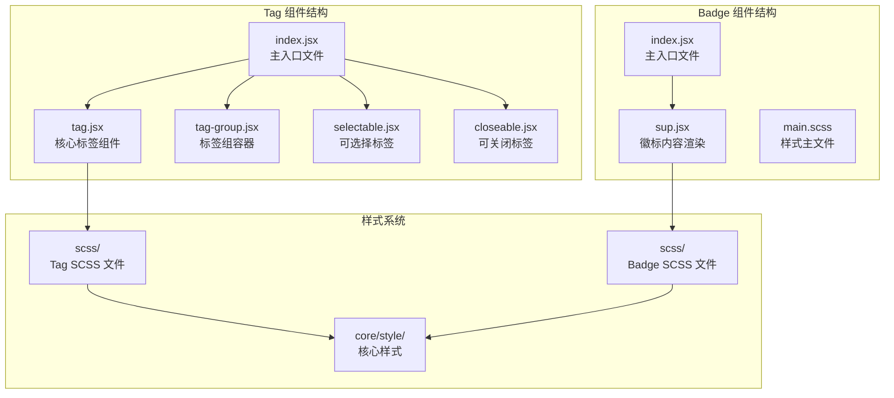

**图表来源**
- [src/tag/index.jsx](file://src/tag/index.jsx#L1-L37)
- [src/badge/index.jsx](file://src/badge/index.jsx#L1-L103)

## Tag 组件详解

### 核心架构设计

Tag 组件采用了模块化的设计理念，通过不同的子组件实现特定功能：

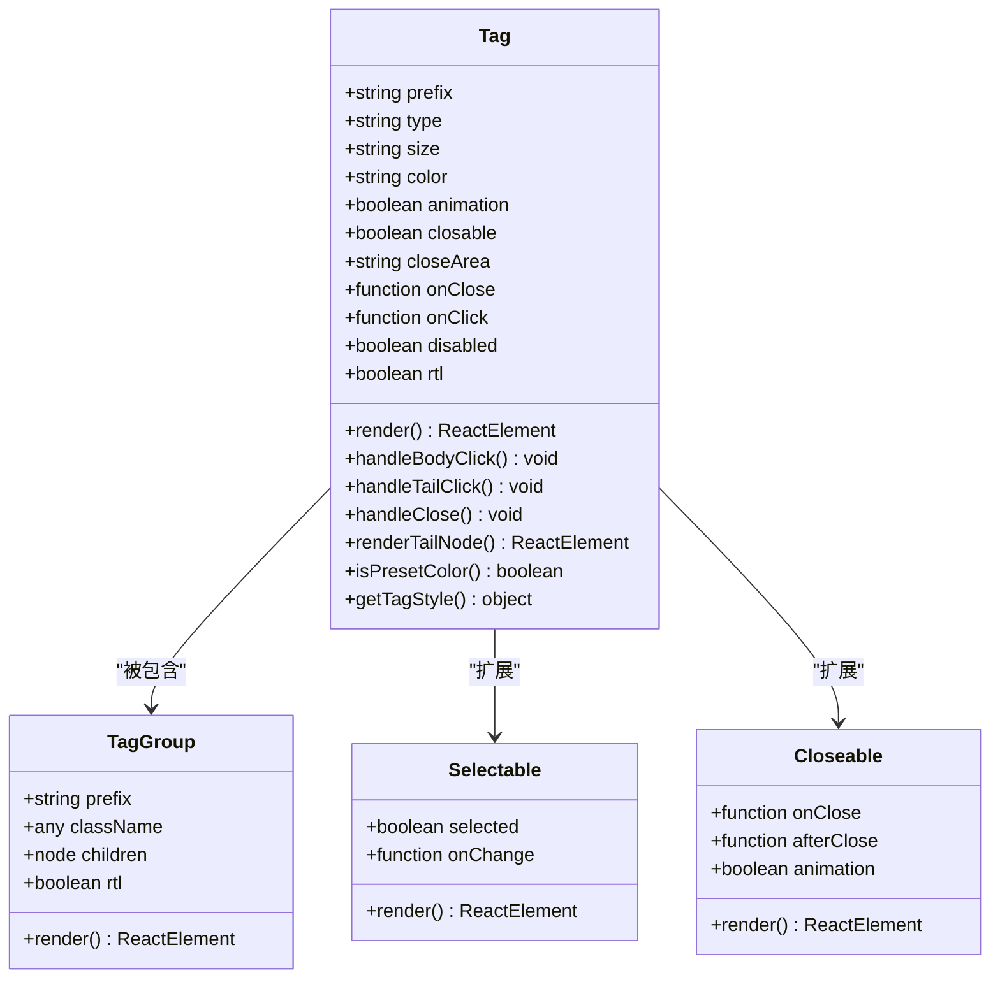

**图表来源**
- [src/tag/tag.jsx](file://src/tag/tag.jsx#L15-L100)
- [src/tag/tag-group.jsx](file://src/tag/tag-group.jsx#L1-L31)
- [src/tag/selectable.jsx](file://src/tag/selectable.jsx)
- [src/tag/closeable.jsx](file://src/tag/closeable.jsx)

### Tag 组件属性详解

Tag 组件提供了丰富的配置选项：

**基础属性**：
- `type`: 标签类型，支持 'normal' 和 'primary'
- `size`: 标签尺寸，支持 'small', 'medium', 'large'
- `color`: 自定义颜色，支持预设颜色（blue, green, orange, red, turquoise, yellow）和十六进制颜色值
- `animation`: 是否启用动画效果

**交互属性**：
- `closable`: 是否可关闭
- `closeArea`: 关闭区域设置，支持 'tag' 和 'tail'
- `onClose`: 关闭回调函数
- `onClick`: 点击回调函数
- `disabled`: 是否禁用状态

**节源**
- [src/tag/tag.jsx](file://src/tag/tag.jsx#L20-L60)

### 可关闭标签实现

可关闭标签通过 `closable` 属性实现，支持两种关闭区域设置：

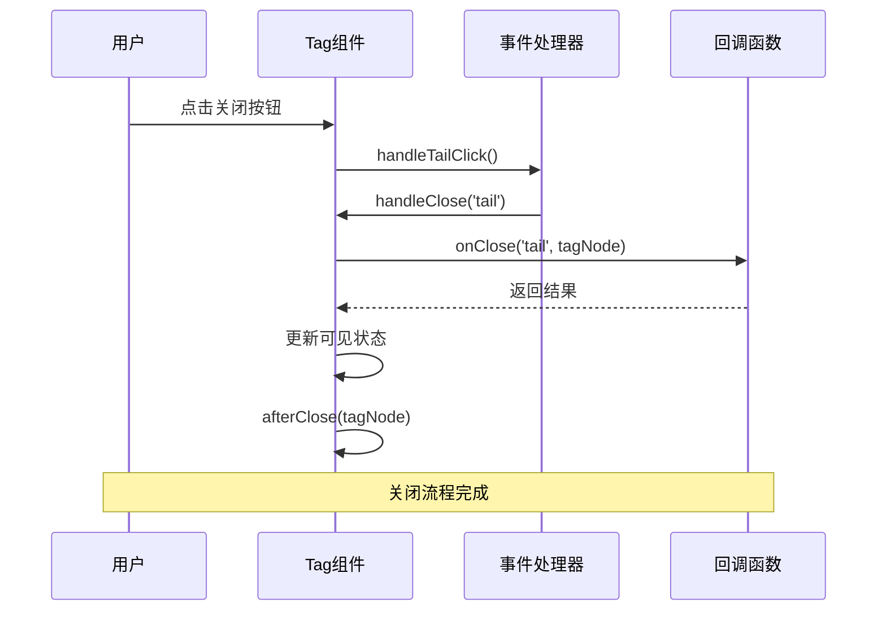

**图表来源**
- [src/tag/tag.jsx](file://src/tag/tag.jsx#L100-L150)

### 可选择标签功能

可选择标签通过 `Selectable` 子组件实现，支持选中状态管理和变更事件：

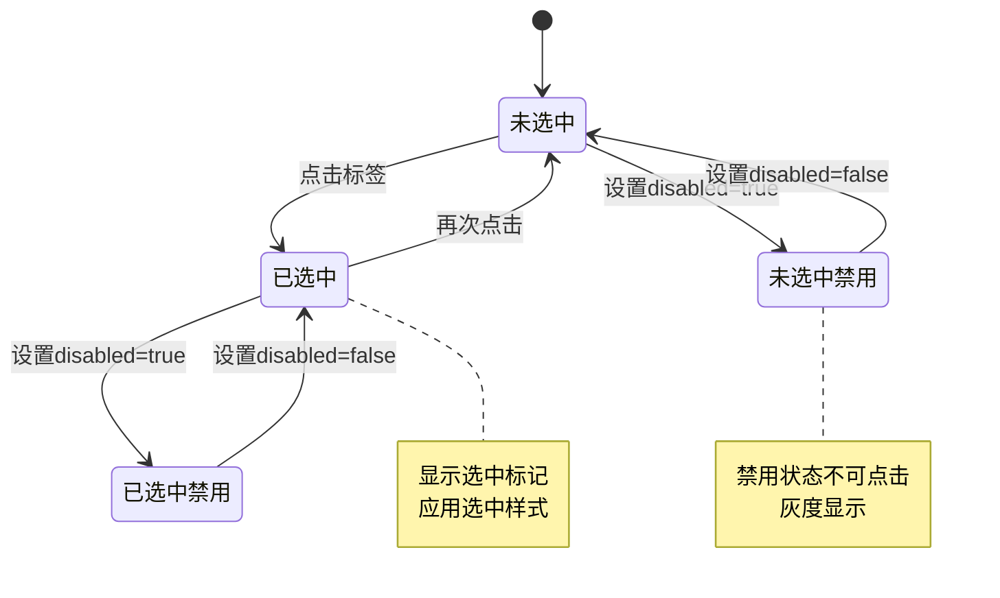

**节源**
- [src/tag/selectable.jsx](file://src/tag/selectable.jsx)

### 标签组布局管理

TagGroup 组件提供了标签的容器功能，支持水平和垂直排列：

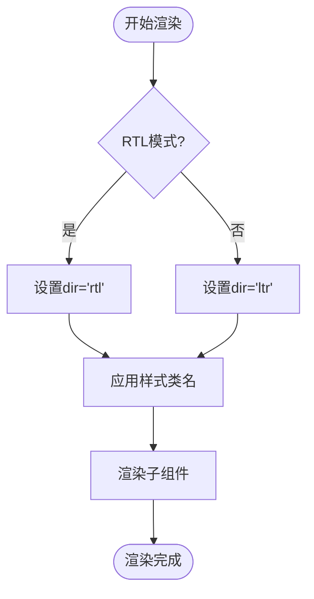

**图表来源**
- [src/tag/tag-group.jsx](file://src/tag/tag-group.jsx#L20-L31)

**节源**
- [src/tag/tag-group.jsx](file://src/tag/tag-group.jsx#L1-L31)

## Badge 组件详解

### Badge 核心架构

Badge 组件采用嵌套结构设计，通过 Sup 子组件处理数字滚动动画：

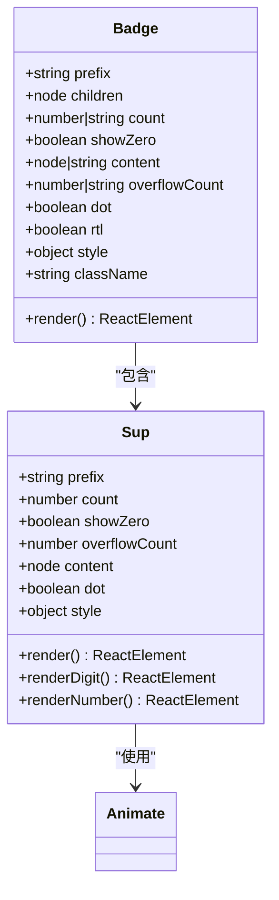

**图表来源**
- [src/badge/index.jsx](file://src/badge/index.jsx#L15-L80)
- [src/badge/sup.jsx](file://src/badge/sup.jsx#L15-L50)

### 数字滚动动画实现

Badge 的数字滚动动画通过 Sup 组件的 `renderNumber` 方法实现：

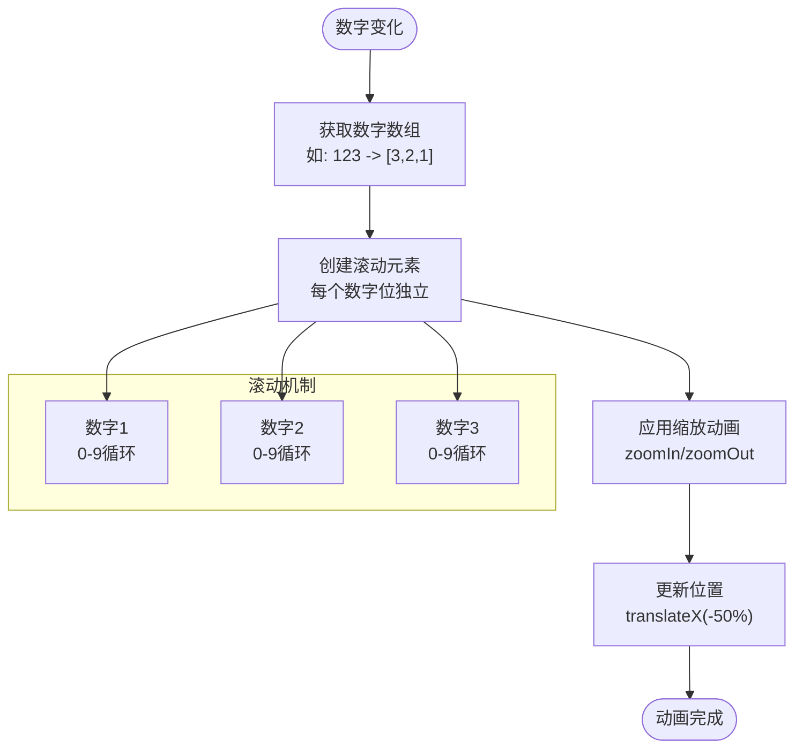

**图表来源**
- [src/badge/sup.jsx](file://src/badge/sup.jsx#L50-L100)

### 溢出计数处理

Badge 提供了智能的溢出计数处理机制：

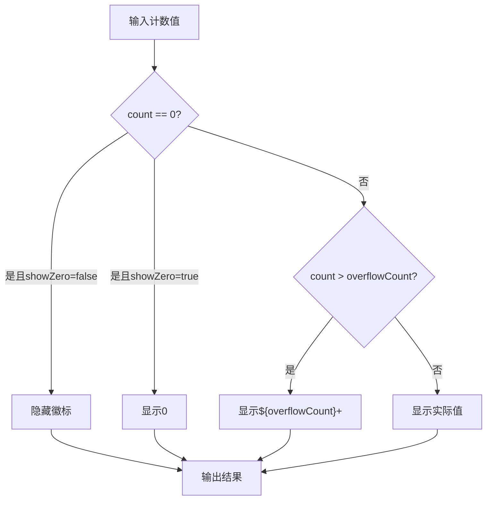

**图表来源**
- [src/badge/sup.jsx](file://src/badge/sup.jsx#L160-L180)

**节源**
- [src/badge/sup.jsx](file://src/badge/sup.jsx#L1-L204)

## 视觉样式与尺寸变体

### Tag 尺寸系统

Tag 组件提供了三种标准尺寸，每种尺寸都有对应的文本大小、高度和间距配置：

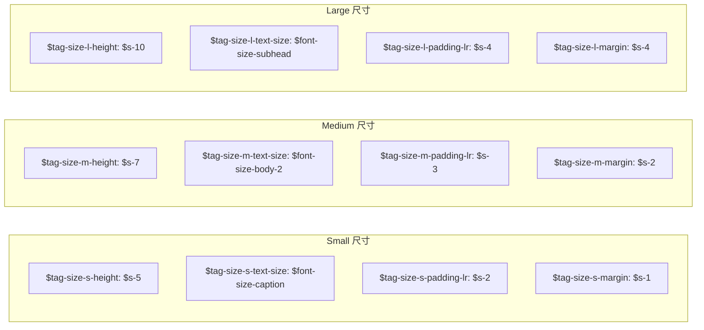

**图表来源**
- [src/tag/scss/variable.scss](file://src/tag/scss/variable.scss#L20-L60)

### Badge 尺寸配置

Badge 组件的尺寸配置相对简单，主要区分点状徽标和数字徽标：

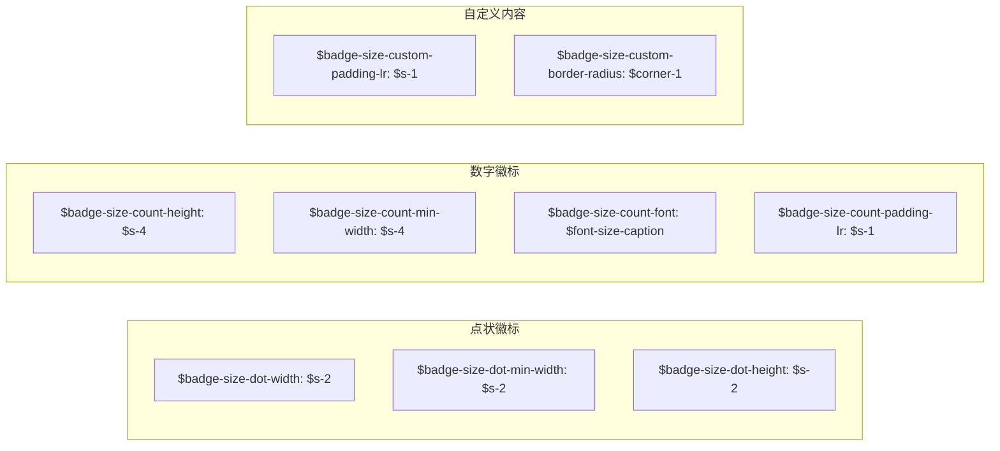

**图表来源**
- [src/badge/scss/variable.scss](file://src/badge/scss/variable.scss#L15-L45)

**节源**
- [src/tag/scss/variable.scss](file://src/tag/scss/variable.scss#L1-L70)
- [src/badge/scss/variable.scss](file://src/badge/scss/variable.scss#L1-L76)

## 颜色配置系统

### Tag 预设颜色

Tag 组件支持六种预设颜色，每种颜色都有对应的颜色变量：

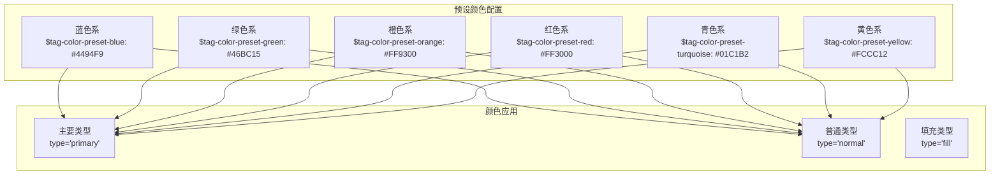

**图表来源**
- [src/tag/scss/variable.scss](file://src/tag/scss/variable.scss#L550-L569)

### Badge 颜色配置

Badge 组件的颜色配置相对简洁，主要关注背景色和边框色：

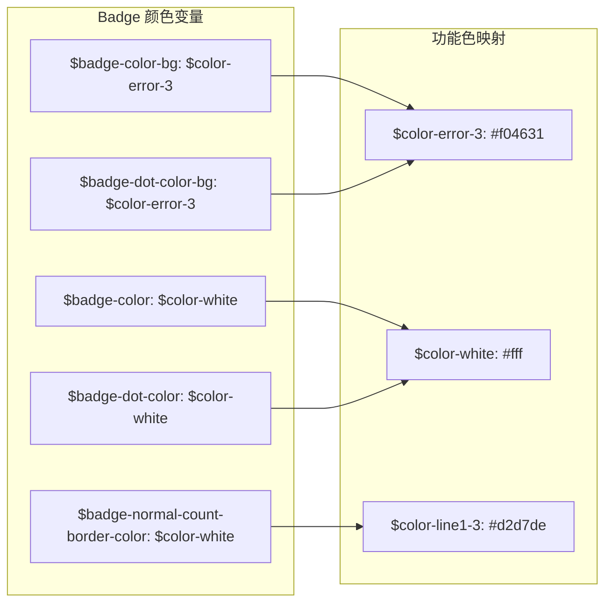

**图表来源**
- [src/badge/scss/variable.scss](file://src/badge/scss/variable.scss#L45-L75)
- [src/core/style/_color.scss](file://src/core/style/_color.scss#L60-L80)

### 自定义颜色支持

Tag 组件支持十六进制颜色值和 RGBA 颜色值，通过正则表达式检测预设颜色：

```javascript
// 预设颜色检测正则
const PRESET_COLOR_REG = /blue|green|orange|red|turquoise|yellow/;

// 自定义颜色样式计算
const customColorStyle = {
    backgroundColor: color,
    borderColor: color,
    color: '#fff',
};
```

**节源**
- [src/tag/tag.jsx](file://src/tag/tag.jsx#L180-L200)
- [src/tag/scss/variable.scss](file://src/tag/scss/variable.scss#L550-L569)

## 无障碍访问支持

### Tag 组件无障碍特性

Tag 组件充分考虑了无障碍访问需求：

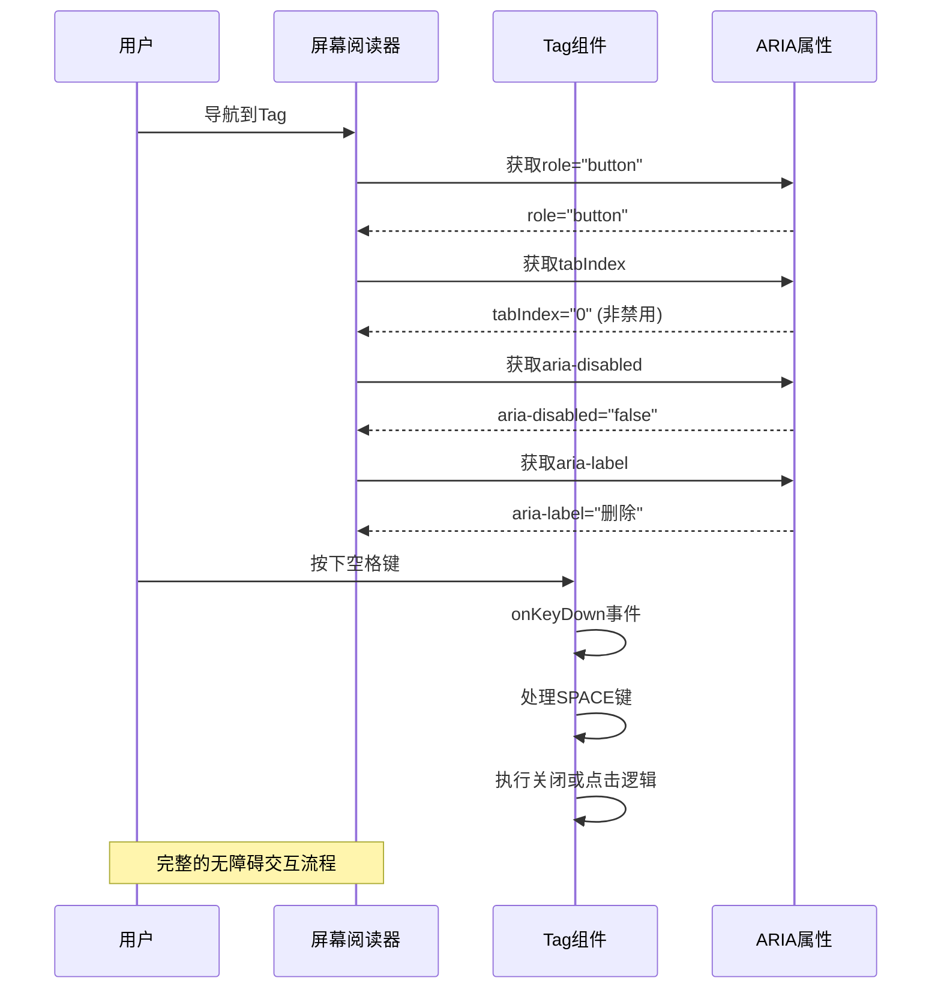

**图表来源**
- [src/tag/tag.jsx](file://src/tag/tag.jsx#L110-L130)

### Badge 组件无障碍特性

Badge 组件主要通过标题属性提供无障碍支持：

```javascript
// 数字徽标自动添加标题
if (count || (count === 0 && showZero)) {
    others.title = others.title || `${count}`;
}
```

**节源**
- [src/tag/tag.jsx](file://src/tag/tag.jsx#L110-L130)
- [src/badge/index.jsx](file://src/badge/index.jsx#L60-L70)

## 实际应用场景

### 在通知系统中的应用

Tag 组件常用于通知系统的标签分类：

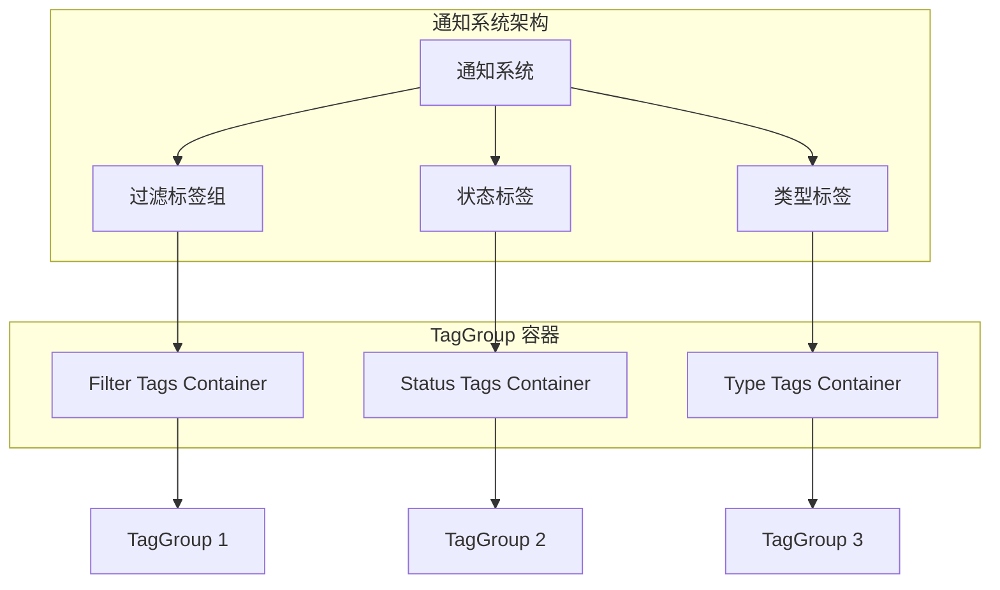

**图表来源**
- [demo/demo-filter.tsx](file://demo/demo-filter.tsx#L1-L30)

### 在用户界面状态标识中的应用

Badge 组件广泛应用于各种状态指示场景：

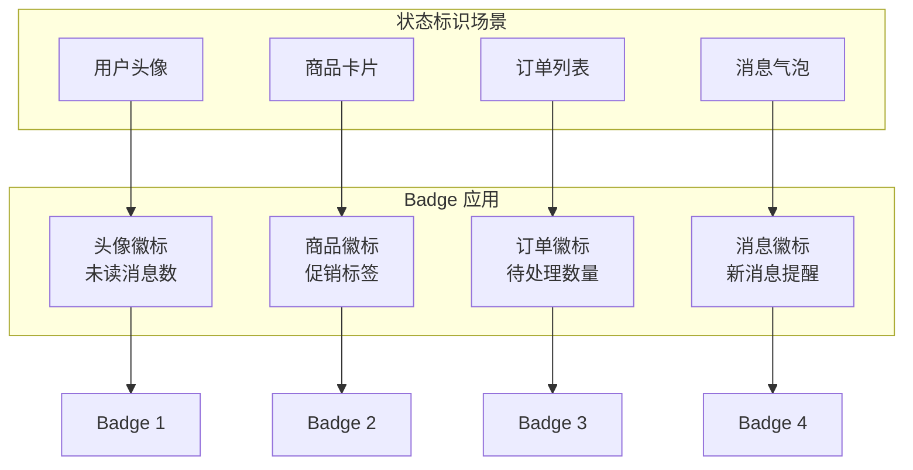

**节源**
- [demo/demo-filter.tsx](file://demo/demo-filter.tsx#L1-L30)

### 组合使用模式

Tag 和 Badge 经常配合使用，形成完整的状态管理系统：

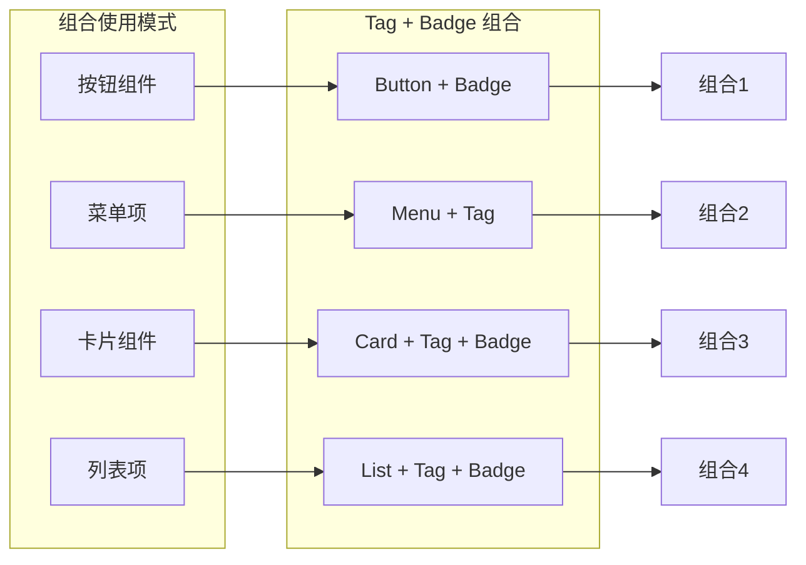

## 最佳实践建议

### Tag 组件使用建议

1. **颜色选择原则**：
   - 使用预设颜色保持一致性
   - 自定义颜色时注意对比度
   - 主要类型使用品牌色，普通类型使用中性色

2. **交互设计建议**：
   - 可关闭标签应提供明确的关闭提示
   - 可选择标签应有清晰的状态反馈
   - 禁用状态要有适当的视觉提示

3. **性能优化**：
   - 合理使用动画效果
   - 避免大量同时渲染的标签
   - 使用虚拟化处理长列表

### Badge 组件使用建议

1. **数字范围控制**：
   - 设置合理的 overflowCount 值
   - 对于大数值使用千分位格式
   - 考虑国际化数字格式

2. **视觉层次**：
   - 使用不同颜色突出重要信息
   - 控制徽标的大小和位置
   - 避免过多徽标堆叠

3. **用户体验**：
   - 提供清晰的数字含义
   - 考虑 RTL 语言支持
   - 确保无障碍访问支持

### Accessibility 无障碍访问最佳实践

1. **键盘导航**：
   - 确保所有交互元素可通过键盘访问
   - 提供清晰的焦点指示
   - 支持 Tab 键顺序导航

2. **屏幕阅读器支持**：
   - 正确设置 ARIA 属性
   - 提供有意义的标签文本
   - 包含必要的状态信息

3. **视觉辅助**：
   - 保证足够的颜色对比度
   - 提供替代的视觉提示
   - 支持高对比度模式

## 总结

Fat Design 的 Tag 和 Badge 组件提供了完整而灵活的数据展示解决方案。Tag 组件通过模块化设计支持多种交互状态，Badge 组件则通过精巧的动画效果提升用户体验。

**关键特性总结**：

- **Tag 组件**：支持可关闭、可选择状态，提供标签组布局管理，具备完整的无障碍访问支持
- **Badge 组件**：支持数字滚动动画，提供溢出计数处理，具有良好的性能表现
- **样式系统**：基于 SCSS 变量系统，支持主题定制和 RTL 语言支持
- **无障碍支持**：充分考虑屏幕阅读器和键盘导航需求

这两个组件在实际项目中有着广泛的应用场景，从简单的状态标识到复杂的通知系统，都能找到它们的身影。通过合理使用这些组件，可以显著提升用户界面的可用性和美观度。