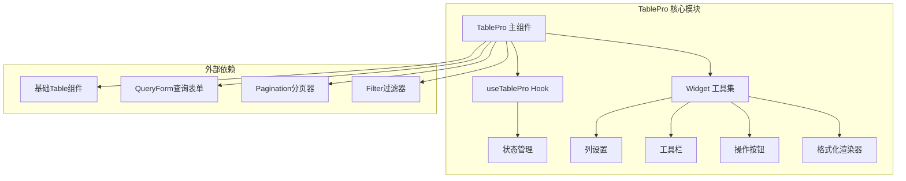
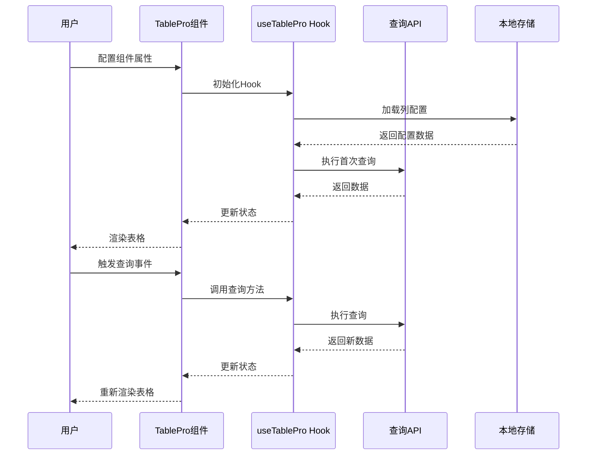
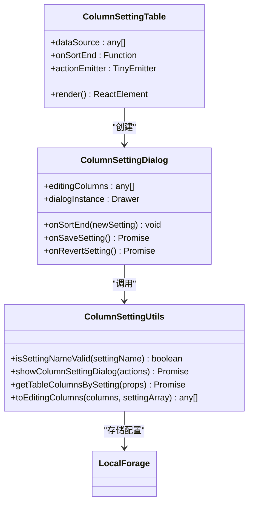
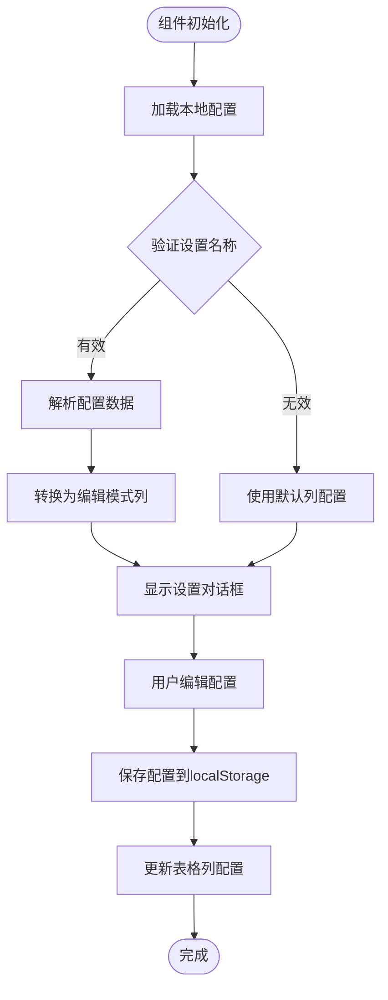
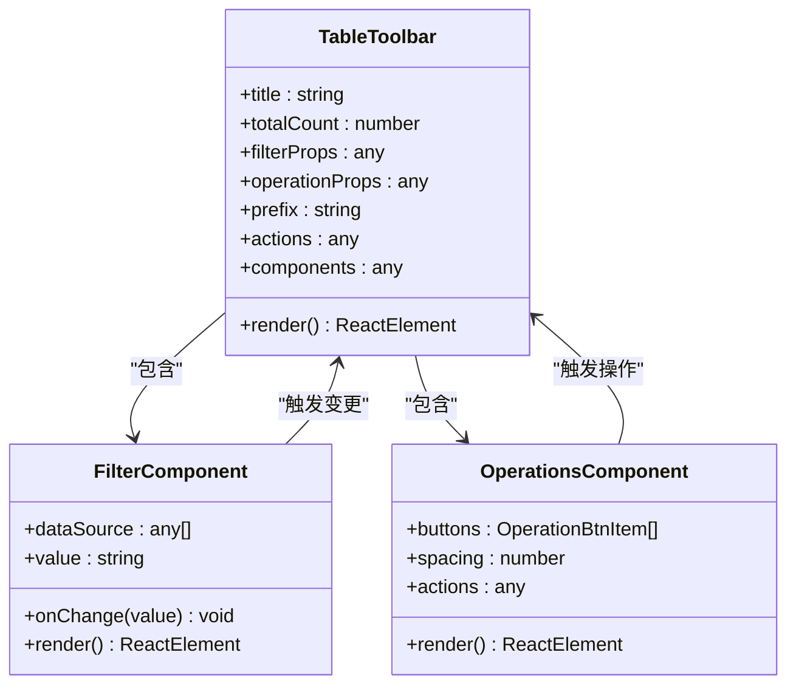
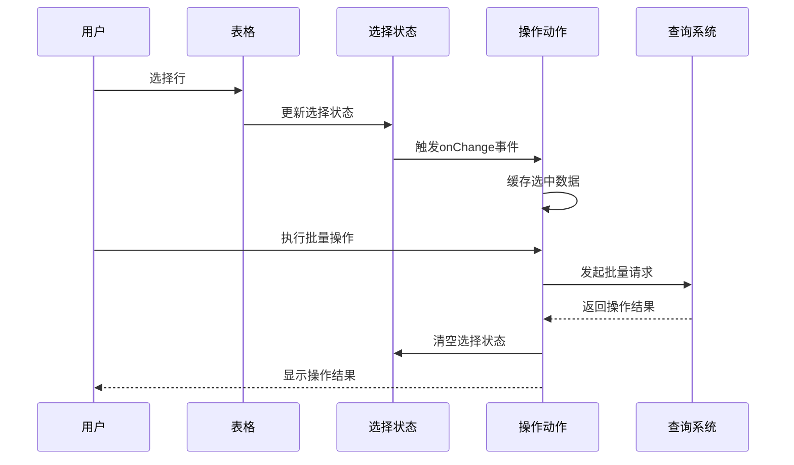
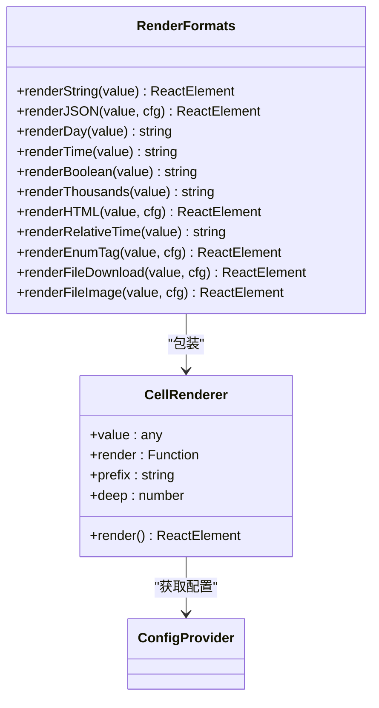
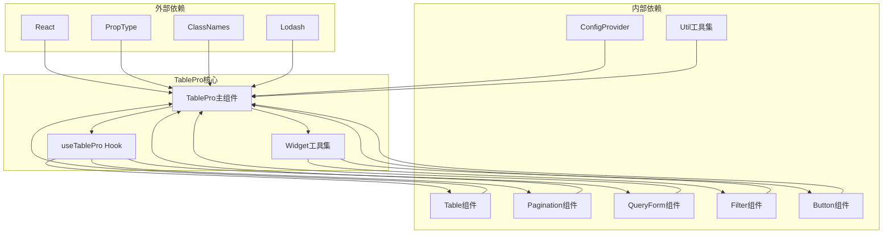

# 数据展示组件 - TablePro增强表格

<cite>
**本文档引用的文件**
- [src/table-pro/table-pro.tsx](file://src/table-pro/table-pro.tsx)
- [src/table-pro/useTablePro.tsx](file://src/table-pro/useTablePro.tsx)
- [src/table-pro/types.ts](file://src/table-pro/types.ts)
- [src/table-pro/widget/index.ts](file://src/table-pro/widget/index.ts)
- [src/table-pro/widget/renderToolbar.tsx](file://src/table-pro/widget/renderToolbar.tsx)
- [src/table-pro/widget/operations.tsx](file://src/table-pro/widget/operations.tsx)
- [src/table-pro/widget/column-setting.tsx](file://src/table-pro/widget/column-setting.tsx)
- [src/table-pro/widget/renderFormats.tsx](file://src/table-pro/widget/renderFormats.tsx)
- [demo/demo-table-pro.tsx](file://demo/demo-table-pro.tsx)
</cite>

## 目录
1. [简介](#简介)
2. [项目结构](#项目结构)
3. [核心组件](#核心组件)
4. [架构概览](#架构概览)
5. [详细组件分析](#详细组件分析)
6. [依赖关系分析](#依赖关系分析)
7. [性能考虑](#性能考虑)
8. [故障排除指南](#故障排除指南)
9. [结论](#结论)

## 简介

TablePro是Fat Design组件库中的增强型表格组件，它在基础Table组件的基础上提供了丰富的功能扩展，包括列配置、工具栏、批量操作、列拖拽等高级特性。该组件通过useTablePro Hook实现了统一的状态管理和数据流控制，为开发者提供了高效的数据展示解决方案。

TablePro的设计理念是提供一个开箱即用的表格解决方案，同时保持高度的可定制性和灵活性。它不仅简化了表格的配置过程，还通过智能的状态管理减少了开发者的负担。

## 项目结构

TablePro组件采用模块化的架构设计，主要分为以下几个核心模块：



**图表来源**
- [src/table-pro/table-pro.tsx](file://src/table-pro/table-pro.tsx#L1-L214)
- [src/table-pro/useTablePro.tsx](file://src/table-pro/useTablePro.tsx#L1-L390)

**章节来源**
- [src/table-pro/table-pro.tsx](file://src/table-pro/table-pro.tsx#L1-L214)
- [src/table-pro/types.ts](file://src/table-pro/types.ts#L1-L120)

## 核心组件

### TablePro主组件

TablePro主组件是一个高度封装的容器组件，负责协调各个子组件的工作。它通过配置化的方式接收各种属性，并自动渲染完整的表格界面。

```typescript
interface TableProProps {
    className?: string,
    settingName: string, // 设置名称，用于存储列配置
    prefix: string,
    components: any, // 自定义组件映射
    formProps: any, // 查询表单配置
    tableProps: any, // 表格配置
    paginationProps: any, // 分页配置
    filterProps: any, // 过滤器配置
    operationProps: OperationsProps, // 操作按钮配置
    slots?: QueryFormTableSlots, // 插槽配置
    actions?: any, // 动作接口
    styleMode: StyleModeEnum, // 样式模式
    stickyLock?: boolean, // 是否启用粘性锁定
    styleConfig?: any; // 样式配置
}
```

### useTablePro Hook

useTablePro Hook是TablePro的核心状态管理器，它封装了复杂的查询逻辑、状态同步和事件处理机制。

```typescript
interface IUseTableProParams {
    onQuery?: FnOnQuery; // 查询函数
    autoFirstQuery?: boolean, // 是否自动首次查询
    isReadyToFirstQuery?: FnOnQuery, // 判断是否可以进行首次查询
    isEnableRowSelection?: boolean, // 是否启用行选择
    isEnableCrossPageRowSelection?: boolean, // 是否启用跨页行选择
    isEnableFrontendPagination?: boolean, // 是否启用前端分页
    initFormProps?: any, // 初始化表单配置
    initTableProps?: any, // 初始化表格配置
    initPaginationProps?: any, // 初始化分页配置
    initFilterProps?: any, // 初始化过滤器配置
    initOperationProps?: any // 初始化操作按钮配置
}
```

**章节来源**
- [src/table-pro/table-pro.tsx](file://src/table-pro/table-pro.tsx#L1-L214)
- [src/table-pro/useTablePro.tsx](file://src/table-pro/useTablePro.tsx#L1-L390)
- [src/table-pro/types.ts](file://src/table-pro/types.ts#L1-L120)

## 架构概览

TablePro采用了分层架构设计，从上到下分为表现层、业务逻辑层和数据访问层：



**图表来源**
- [src/table-pro/useTablePro.tsx](file://src/table-pro/useTablePro.tsx#L50-L200)
- [src/table-pro/table-pro.tsx](file://src/table-pro/table-pro.tsx#L30-L80)

## 详细组件分析

### 列配置系统

TablePro的列配置系统是最核心的功能之一，它允许用户动态调整表格的列显示、顺序和锁定状态。



**图表来源**
- [src/table-pro/widget/column-setting.tsx](file://src/table-pro/widget/column-setting.tsx#L20-L100)
- [src/table-pro/widget/column-setting.tsx](file://src/table-pro/widget/column-setting.tsx#L150-L250)

#### 列设置对话框功能

列设置对话框提供了直观的界面让用户管理表格列：

- **拖拽排序**：通过SortableEditableTable实现列的拖拽重新排序
- **显示控制**：每个列都可以单独设置是否显示
- **锁定功能**：支持左锁和右锁列功能
- **持久化存储**：配置信息存储在localStorage中

#### 列配置的生命周期



**图表来源**
- [src/table-pro/widget/column-setting.tsx](file://src/table-pro/widget/column-setting.tsx#L250-L310)

**章节来源**
- [src/table-pro/widget/column-setting.tsx](file://src/table-pro/widget/column-setting.tsx#L1-L311)

### 工具栏组件

TablePro的工具栏组件提供了统一的操作界面，集成了标题、过滤器、操作按钮等功能。



**图表来源**
- [src/table-pro/widget/renderToolbar.tsx](file://src/table-pro/widget/renderToolbar.tsx#L10-L70)
- [src/table-pro/widget/operations.tsx](file://src/table-pro/widget/operations.tsx#L100-L168)

#### 操作按钮系统

操作按钮系统支持多种类型的按钮配置：

```typescript
interface OperationBtnItem {
    size?: string;
    icon?: string;
    text?: string;
    type?: string;
    tooltip?: any;
    onClick?: any | string; // 函数或内置函数
    children?: OperationBtnItem[] // 子菜单项
}
```

**特点**：
- **多级菜单**：支持嵌套的二级菜单结构
- **图标文本组合**：每个按钮可以包含图标和文字
- **权限控制**：通过operationCode进行权限过滤
- **内置操作**：支持预定义的内置操作函数

**章节来源**
- [src/table-pro/widget/renderToolbar.tsx](file://src/table-pro/widget/renderToolbar.tsx#L1-L72)
- [src/table-pro/widget/operations.tsx](file://src/table-pro/widget/operations.tsx#L1-L169)

### 批量操作功能

TablePro提供了强大的批量操作功能，支持跨页选择和实时状态同步。



**图表来源**
- [src/table-pro/useTablePro.tsx](file://src/table-pro/useTablePro.tsx#L150-L200)

#### 跨页选择机制

跨页选择功能允许用户在不同页面间保持选择状态：

```typescript
// 跨页选择的关键实现
const cacheEntireDataSourceMap = usePersistFn(() => {
    if (!isEnableCrossPageRowSelection) {
        // 如果未启用跨页选择，只缓存当前页数据
        tempVars.entireDataSourceMap = {}
    }
    
    const tableProps = getTableProps();
    if (!tableProps.primaryKey) {
        throw new Error('tableProps is missing the primaryKey parameter');
    }
    
    const dataSource = tableProps.dataSource || [];
    const dataSourceMap = toMap(dataSource, (r: any) => {
        return r[tableProps.primaryKey];
    });
    
    Object.assign(tempVars.entireDataSourceMap, dataSourceMap);
});
```

**章节来源**
- [src/table-pro/useTablePro.tsx](file://src/table-pro/useTablePro.tsx#L120-L180)

### 格式化渲染器

TablePro提供了丰富的数据格式化渲染器，支持各种复杂数据类型的展示。



**图表来源**
- [src/table-pro/widget/renderFormats.tsx](file://src/table-pro/widget/renderFormats.tsx#L300-L367)

#### 内置渲染器功能

1. **字符串渲染**：支持对象、数组的字符串化处理
2. **JSON格式化**：美观的JSON格式输出
3. **日期时间格式化**：支持多种日期格式
4. **布尔值转换**：智能的布尔值显示
5. **数值格式化**：千分位显示和小数点处理
6. **HTML安全渲染**：安全的HTML内容展示
7. **相对时间计算**：动态计算时间差
8. **枚举标签**：彩色标签显示
9. **文件预览**：图片和下载链接预览

**章节来源**
- [src/table-pro/widget/renderFormats.tsx](file://src/table-pro/widget/renderFormats.tsx#L1-L368)

### 性能优化策略

TablePro在大数据量场景下采用了多种性能优化策略：

#### 虚拟滚动配置

对于大量数据的表格，建议启用虚拟滚动：

```typescript
// 虚拟滚动配置示例
const tableProps = {
    virtual: true,
    height: 400, // 设置固定高度
    rowHeight: 40, // 行高
    overscan: 10 // 预渲染行数
};
```

#### 数据缓存机制

```typescript
// 数据源映射缓存
const dataSourceMap = toMap(dataSource, (r: any) => {
    return r[tableProps.primaryKey];
});

Object.assign(tempVars.entireDataSourceMap, dataSourceMap);
```

#### 组件记忆化

```typescript
// 操作组件记忆化
const Operations = React.memo(React.forwardRef(OperationsImpl), (prevProps, nextProps) => {
    return deepEqual(prevProps, nextProps);
});
```

**章节来源**
- [src/table-pro/useTablePro.tsx](file://src/table-pro/useTablePro.tsx#L120-L150)
- [src/table-pro/widget/operations.tsx](file://src/table-pro/widget/operations.tsx#L140-L169)

## 依赖关系分析

TablePro组件具有清晰的依赖层次结构：



**图表来源**
- [src/table-pro/table-pro.tsx](file://src/table-pro/table-pro.tsx#L1-L20)
- [src/table-pro/useTablePro.tsx](file://src/table-pro/useTablePro.tsx#L1-L20)

**章节来源**
- [src/table-pro/table-pro.tsx](file://src/table-pro/table-pro.tsx#L1-L214)
- [src/table-pro/useTablePro.tsx](file://src/table-pro/useTablePro.tsx#L1-L390)

## 性能考虑

### 大数据量优化

1. **虚拟滚动**：当数据量超过1000条时，建议启用虚拟滚动
2. **分页加载**：避免一次性加载所有数据
3. **列懒加载**：只渲染可见列，隐藏列延迟加载
4. **状态缓存**：合理使用状态缓存减少重复计算

### 内存管理

1. **事件监听器清理**：确保组件卸载时清理事件监听器
2. **定时器清理**：及时清除不必要的定时器
3. **引用清理**：避免循环引用导致内存泄漏

### 渲染优化

1. **组件记忆化**：对稳定组件使用React.memo
2. **条件渲染**：只渲染必要的子组件
3. **防抖节流**：对频繁触发的事件使用防抖节流

## 故障排除指南

### 常见问题及解决方案

#### 1. 列配置不生效

**问题描述**：设置了settingName但列配置没有保存或应用

**解决方案**：
- 确保settingName长度大于10字符
- 检查localStorage是否可用
- 验证列配置数据格式正确

```typescript
// 检查设置名称有效性
function isSettingNameValid(settingName: any) {
    return typeof settingName === "string" && settingName.length > 10;
}
```

#### 2. 查询无响应

**问题描述**：点击查询按钮后表格无反应

**解决方案**：
- 检查onQuery函数是否正确返回Promise
- 验证返回数据格式符合要求
- 确认网络连接正常

#### 3. 行选择状态异常

**问题描述**：跨页选择状态不正确

**解决方案**：
- 确保primaryKey配置正确
- 检查数据源中是否存在重复的主键值
- 验证isEnableCrossPageRowSelection设置

**章节来源**
- [src/table-pro/widget/column-setting.tsx](file://src/table-pro/widget/column-setting.tsx#L15-L20)
- [src/table-pro/useTablePro.tsx](file://src/table-pro/useTablePro.tsx#L120-L150)

## 结论

TablePro增强表格组件是Fat Design组件库中一个功能强大且设计精良的数据展示解决方案。它通过以下特点为开发者提供了优秀的使用体验：

### 主要优势

1. **功能完整**：集成了查询表单、分页、过滤、操作等完整功能
2. **配置灵活**：支持列配置、样式配置等多种自定义选项
3. **性能优秀**：针对大数据量场景进行了专门优化
4. **易于使用**：通过Hook模式简化了复杂的状态管理
5. **扩展性强**：良好的模块化设计便于功能扩展

### 适用场景

- **后台管理系统**：适合各种后台管理系统的数据展示需求
- **报表系统**：支持复杂的查询和筛选功能
- **数据分析**：提供丰富的数据可视化和交互功能
- **企业应用**：满足企业级应用的复杂业务需求

### 最佳实践建议

1. **合理使用列配置**：根据实际需求设置合适的列显示
2. **优化查询性能**：避免不必要的全量查询
3. **适当启用缓存**：利用跨页选择缓存提升用户体验
4. **监控性能指标**：关注大数据量场景下的性能表现
5. **定期更新版本**：及时跟进组件库的更新和优化

TablePro组件通过其强大的功能和优秀的架构设计，为现代Web应用的数据展示需求提供了可靠的解决方案。无论是简单的数据列表还是复杂的企业级应用，TablePro都能提供相应的支持和优化。