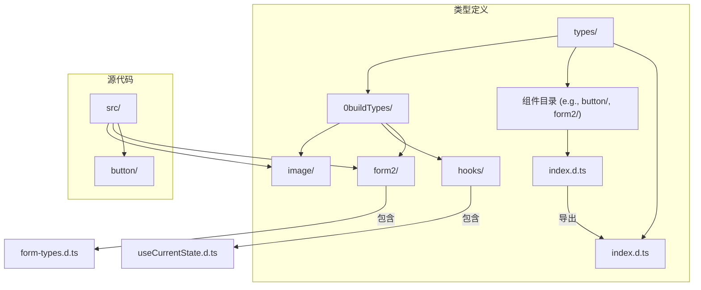
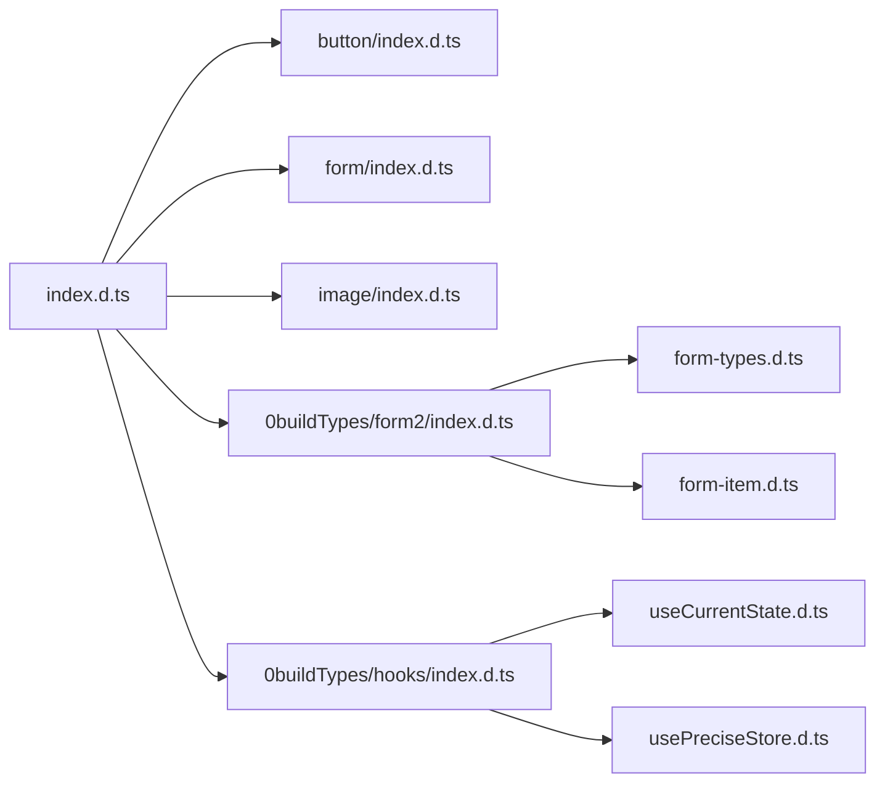
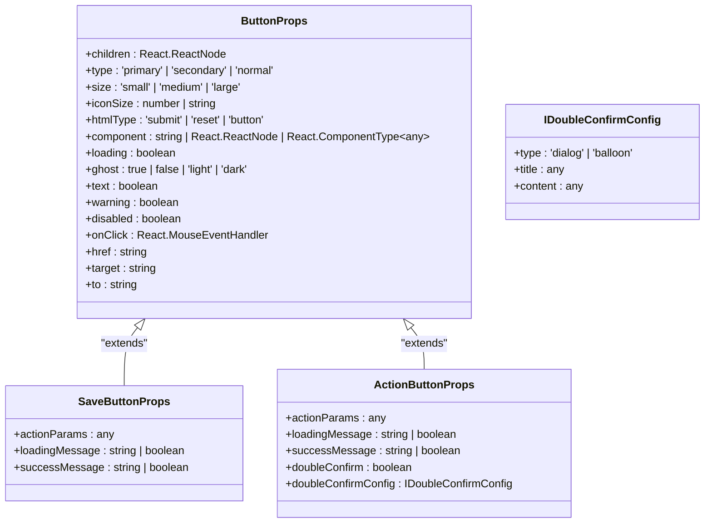
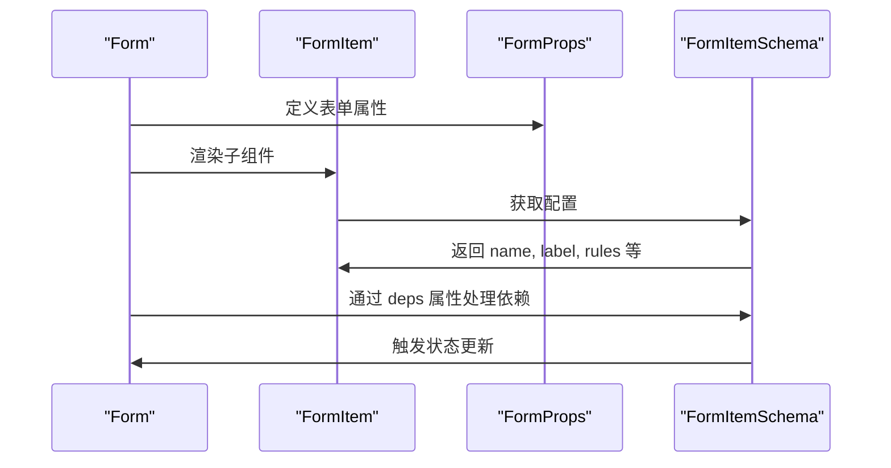
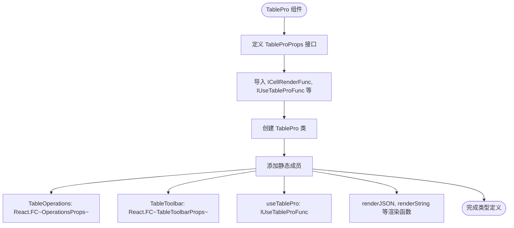
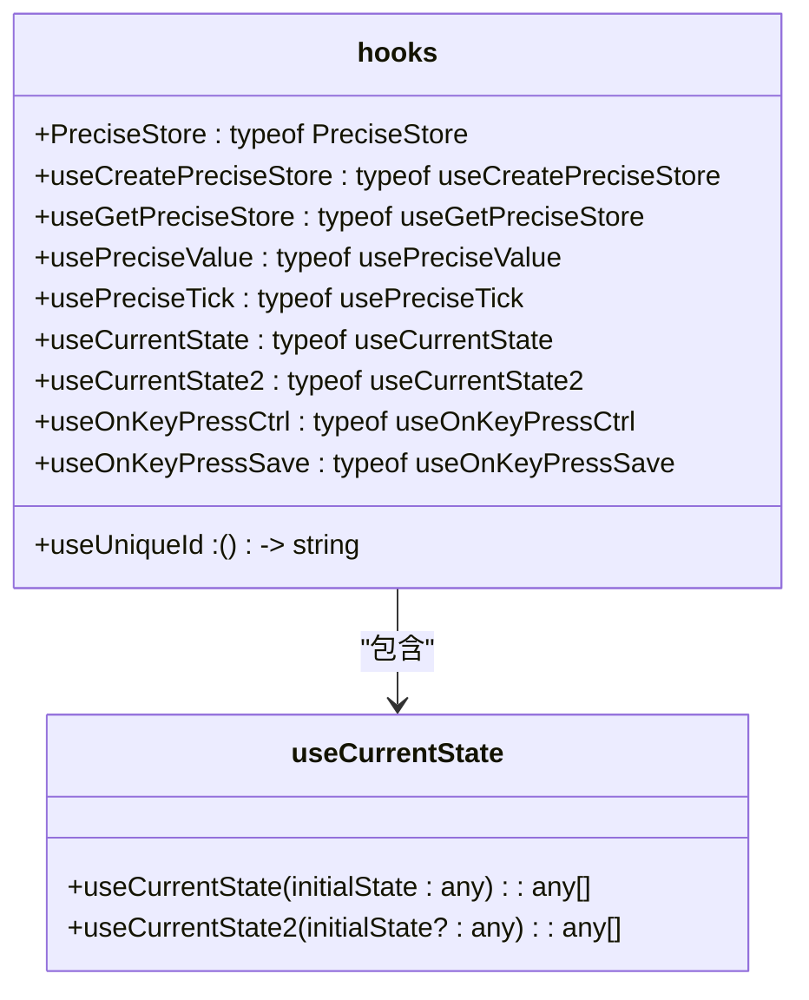
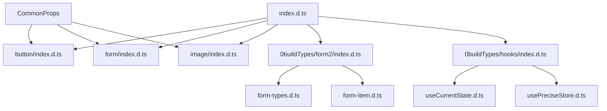

# 类型定义

<cite>
**本文档中引用的文件**  
- [index.d.ts](file://types/index.d.ts)
- [button/index.d.ts](file://types/button/index.d.ts)
- [0buildTypes/form2/index.d.ts](file://types/0buildTypes/form2/index.d.ts)
- [0buildTypes/form2/form-types.d.ts](file://types/0buildTypes/form2/form-types.d.ts)
- [0buildTypes/table-pro/index.d.ts](file://types/0buildTypes/table-pro/index.d.ts)
- [0buildTypes/hooks/index.d.ts](file://types/0buildTypes/hooks/index.d.ts)
- [0buildTypes/hooks/useCurrentState.d.ts](file://types/0buildTypes/hooks/useCurrentState.d.ts)
- [0buildTypes/image/index.d.ts](file://types/0buildTypes/image/index.d.ts)
- [0buildTypes/image/Image.d.ts](file://types/0buildTypes/image/Image.d.ts)
- [locale/default.d.ts](file://types/locale/default.d.ts)
- [config-provider/index.d.ts](file://types/config-provider/index.d.ts)
</cite>

## 目录
1. [简介](#简介)
2. [项目结构](#项目结构)
3. [核心组件](#核心组件)
4. [架构概述](#架构概述)
5. [详细组件分析](#详细组件分析)
6. [依赖分析](#依赖分析)
7. [性能考虑](#性能考虑)
8. [故障排除指南](#故障排除指南)
9. [结论](#结论)

## 简介
本指南旨在为 `fat-design` 组件库的 TypeScript 类型定义提供全面的使用说明。文档将解释 `.d.ts` 文件的生成机制和目录结构，指导如何在项目中正确引用组件库的类型定义以实现智能提示和类型检查，展示如何扩展组件的 Props 类型以支持自定义属性，提供泛型组件的类型使用示例，并说明类型定义与 JavaScript 运行时行为的一致性保证。

## 项目结构
`fat-design` 项目的类型定义系统采用分层结构，将类型定义与实现代码分离。主要类型定义位于 `types` 目录下，与 `src` 目录中的源代码相对应。每个组件都有一个独立的子目录，其中包含其类型定义文件。



**Diagram sources**
- [index.d.ts](file://types/index.d.ts)
- [button/index.d.ts](file://types/button/index.d.ts)
- [0buildTypes/form2/index.d.ts](file://types/0buildTypes/form2/index.d.ts)

**Section sources**
- [index.d.ts](file://types/index.d.ts)
- [button/index.d.ts](file://types/button/index.d.ts)

## 核心组件
`fat-design` 的类型定义系统围绕 `index.d.ts` 文件构建，该文件作为所有组件类型的入口点。它通过 `export` 语句将各个组件的类型定义聚合在一起，使得用户可以通过单一入口导入所有需要的类型。

**Section sources**
- [index.d.ts](file://types/index.d.ts)

## 架构概述
整个类型定义系统的架构遵循模块化设计原则。`types` 目录下的每个子目录对应一个 UI 组件或功能模块。`0buildTypes` 目录存放了更复杂组件（如 `form2`、`table-pro`）的内部类型定义，这些定义通过主 `index.d.ts` 文件对外暴露。



**Diagram sources**
- [index.d.ts](file://types/index.d.ts)
- [0buildTypes/form2/index.d.ts](file://types/0buildTypes/form2/index.d.ts)
- [0buildTypes/hooks/index.d.ts](file://types/0buildTypes/hooks/index.d.ts)

## 详细组件分析

### 按钮组件分析
按钮组件的类型定义展示了如何为 React 组件定义详细的 Props 接口。`ButtonProps` 接口继承了 `HTMLAttributesWeak` 和 `CommonProps`，并定义了特定于按钮的属性，如 `type`、`size`、`loading` 等。

#### 对于对象导向的组件：


**Diagram sources**
- [button/index.d.ts](file://types/button/index.d.ts)

**Section sources**
- [button/index.d.ts](file://types/button/index.d.ts)

### 表单组件分析
`form2` 组件的类型定义展示了复杂的表单系统如何通过 TypeScript 进行建模。它使用了枚举、函数类型和嵌套接口来描述表单的各个方面。

#### 对于 API/服务组件：


**Diagram sources**
- [0buildTypes/form2/index.d.ts](file://types/0buildTypes/form2/index.d.ts)
- [0buildTypes/form2/form-types.d.ts](file://types/0buildTypes/form2/form-types.d.ts)

**Section sources**
- [0buildTypes/form2/index.d.ts](file://types/0buildTypes/form2/index.d.ts)
- [0buildTypes/form2/form-types.d.ts](file://types/0buildTypes/form2/form-types.d.ts)

### 泛型组件分析
`table-pro` 组件的类型定义展示了如何为复杂的表格组件提供类型支持。它通过静态方法和函数类型为表格操作、工具栏和单元格渲染提供了类型定义。

#### 对于复杂逻辑组件：


**Diagram sources**
- [0buildTypes/table-pro/index.d.ts](file://types/0buildTypes/table-pro/index.d.ts)

**Section sources**
- [0buildTypes/table-pro/index.d.ts](file://types/0buildTypes/table-pro/index.d.ts)

### Hooks 组件分析
`hooks` 模块的类型定义展示了如何为自定义 React Hooks 提供类型支持。它将多个 Hook 函数聚合在一个默认导出的对象中。

#### 对于对象导向的组件：


**Diagram sources**
- [0buildTypes/hooks/index.d.ts](file://types/0buildTypes/hooks/index.d.ts)
- [0buildTypes/hooks/useCurrentState.d.ts](file://types/0buildTypes/hooks/useCurrentState.d.ts)

**Section sources**
- [0buildTypes/hooks/index.d.ts](file://types/0buildTypes/hooks/index.d.ts)
- [0buildTypes/hooks/useCurrentState.d.ts](file://types/0buildTypes/hooks/useCurrentState.d.ts)

### 图像组件分析
`image` 组件的类型定义展示了如何为复杂的多媒体组件提供类型支持。它使用了复合组件模式，将 `Image` 和 `PreviewGroup` 结合在一起。

#### 对于对象导向的组件：
```mermaid
classDiagram
class ImageProps {
+src : string
+wrapperClassName : string
+wrapperStyle : React.CSSProperties
+prefix : string
+preview : boolean | ImagePreviewType
+onPreviewClose : (value : boolean, prevValue : boolean) => void
+onClick : (e : React.MouseEvent~HTMLDivElement~) => void
+onError : (e : React.SyntheticEvent~HTMLImageElement, Event~) => void
}
class ImagePreviewType {
+src : string
+visible : boolean
+minScale : number
+maxScale : number
+onVisibleChange : (value : boolean, prevValue : boolean) => void
+getContainer : any | false
+mask : React.ReactNode
+imageRender : (originalNode : React.ReactElement, info : {transform : TransformType}) => React.ReactNode
+toolbarRender : (originalNode : React.ReactElement, info : Omit~ToolbarRenderInfoType, 'current' | 'total'~) => React.ReactNode
}
class CompoundedComponent~P~ {
+PreviewGroup : typeof PreviewGroup
}
ImageProps <|-- CompoundedComponent : "扩展"
```

**Diagram sources**
- [0buildTypes/image/Image.d.ts](file://types/0buildTypes/image/Image.d.ts)

**Section sources**
- [0buildTypes/image/index.d.ts](file://types/0buildTypes/image/index.d.ts)
- [0buildTypes/image/Image.d.ts](file://types/0buildTypes/image/Image.d.ts)

## 依赖分析
类型定义系统通过 `index.d.ts` 文件管理依赖关系。主入口文件导入并重新导出所有组件的类型，而复杂组件则在 `0buildTypes` 目录下管理其内部依赖。



**Diagram sources**
- [index.d.ts](file://types/index.d.ts)
- [0buildTypes/form2/index.d.ts](file://types/0buildTypes/form2/index.d.ts)
- [0buildTypes/hooks/index.d.ts](file://types/0buildTypes/hooks/index.d.ts)

**Section sources**
- [index.d.ts](file://types/index.d.ts)
- [0buildTypes/form2/index.d.ts](file://types/0buildTypes/form2/index.d.ts)
- [0buildTypes/hooks/index.d.ts](file://types/0buildTypes/hooks/index.d.ts)

## 性能考虑
类型定义系统的设计考虑了编译性能。通过将类型定义与实现代码分离，避免了在运行时加载不必要的类型信息。同时，使用模块化结构可以实现按需加载，减少类型检查的开销。

## 故障排除指南
当遇到类型定义问题时，首先检查是否正确安装了 `@types` 包或组件库本身。确保 `tsconfig.json` 中的 `typeRoots` 或 `types` 配置正确指向类型定义目录。对于复杂的类型错误，可以检查相关组件的 `.d.ts` 文件以理解其预期的 Props 结构。

**Section sources**
- [index.d.ts](file://types/index.d.ts)
- [button/index.d.ts](file://types/button/index.d.ts)

## 结论
`fat-design` 的类型定义系统通过清晰的目录结构和模块化设计，为开发者提供了强大的类型支持。通过遵循本指南中的实践，开发者可以充分利用 TypeScript 的类型检查和智能提示功能，提高开发效率和代码质量。