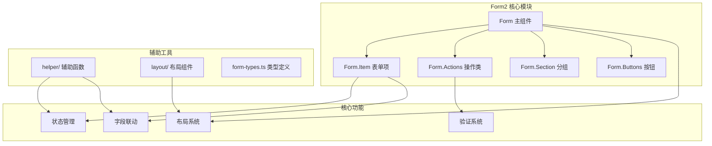
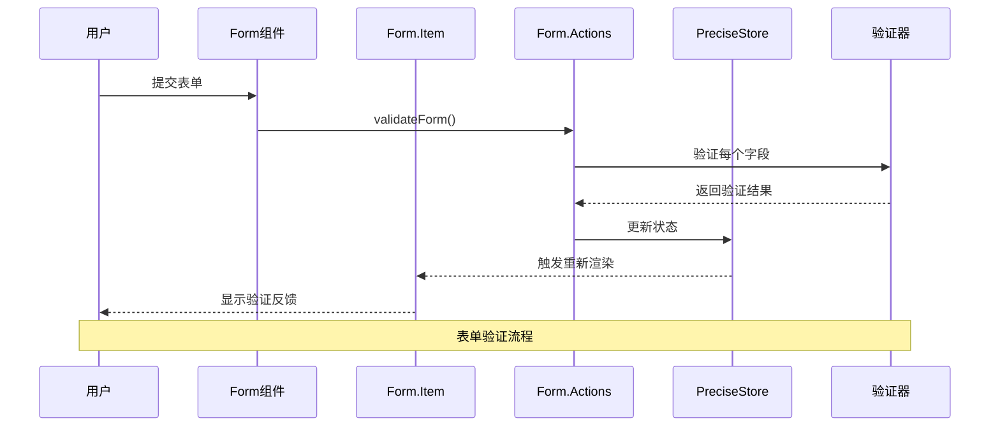
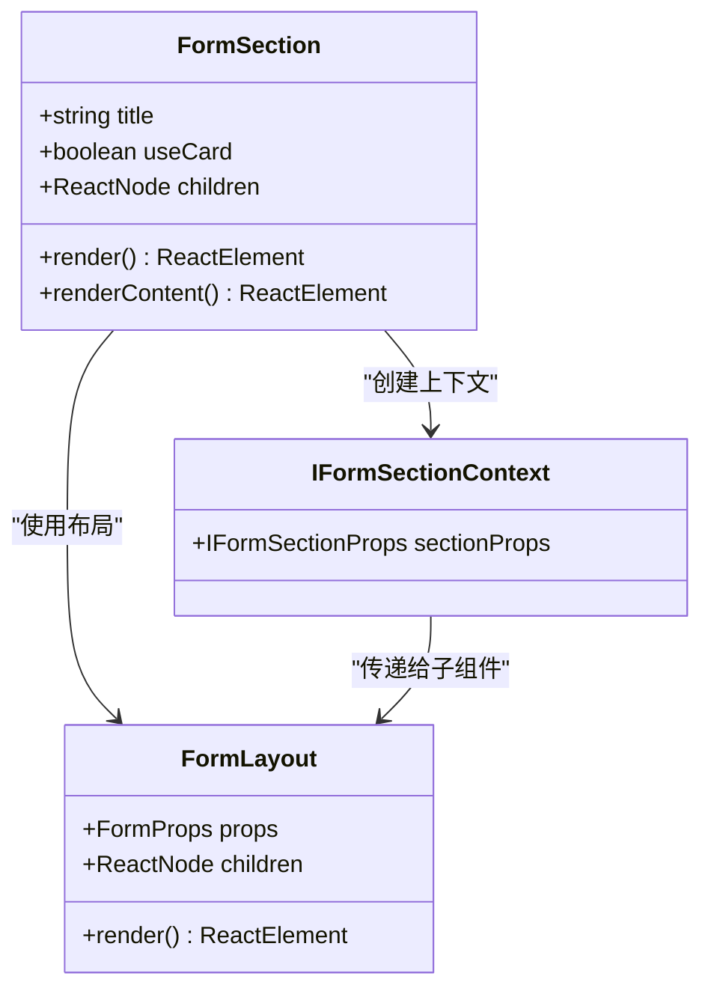
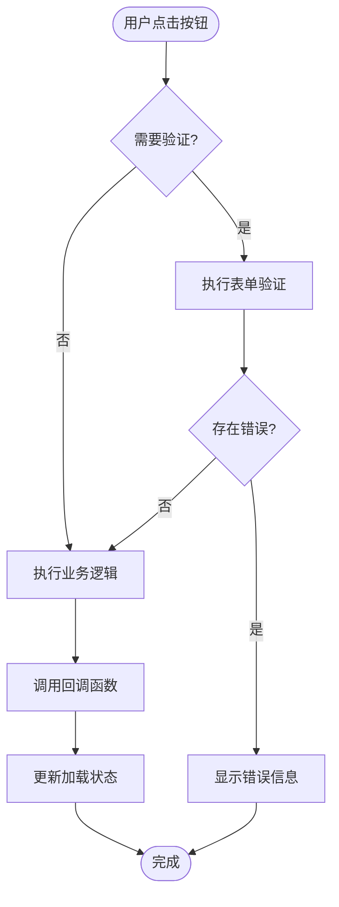
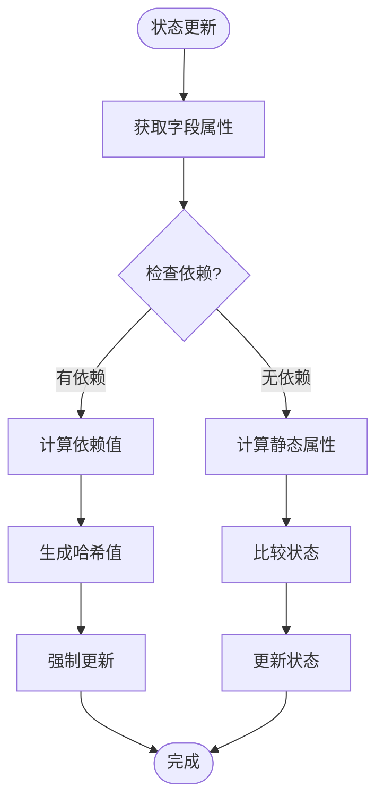
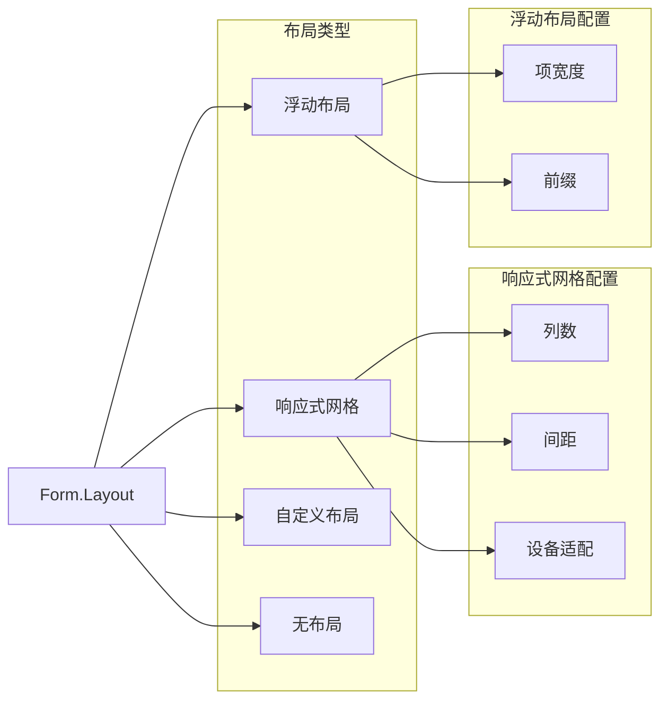
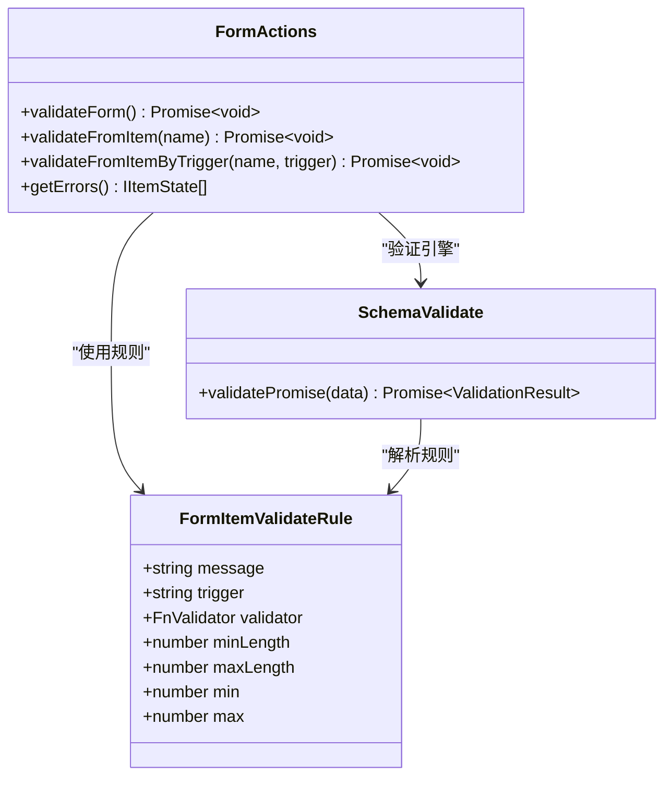

# Form2 高级表单系统

<cite>
**本文档中引用的文件**
- [src/form2/form.tsx](file://src/form2/form.tsx)
- [src/form2/form-item.tsx](file://src/form2/form-item.tsx)
- [src/form2/form-actions.ts](file://src/form2/form-actions.ts)
- [src/form2/form-section.tsx](file://src/form2/form-section.tsx)
- [src/form2/form-types.ts](file://src/form2/form-types.ts)
- [src/form2/form-buttons.tsx](file://src/form2/form-buttons.tsx)
- [src/form2/form-error.tsx](file://src/form2/form-error.tsx)
- [src/form2/form-item-label.tsx](file://src/form2/form-item-label.tsx)
- [src/form2/form-item-card.tsx](file://src/form2/form-item-card.tsx)
- [src/form2/form-layout.tsx](file://src/form2/form-layout.tsx)
- [src/form2/helper/useFormChildren.tsx](file://src/form2/helper/useFormChildren.tsx)
- [src/form2/helper/linkageFormState.ts](file://src/form2/helper/linkageFormState.ts)
- [src/form2/helper/useFormItemState.ts](file://src/form2/helper/useFormItemState.ts)
- [src/form2/helper/useFormChildren.tsx](file://src/form2/helper/useFormChildren.tsx)
- [demo/demo-form2.tsx](file://demo/demo-form2.tsx)
</cite>

## 目录
1. [简介](#简介)
2. [项目结构](#项目结构)
3. [核心组件](#核心组件)
4. [架构概览](#架构概览)
5. [详细组件分析](#详细组件分析)
6. [表单状态管理](#表单状态管理)
7. [布局系统](#布局系统)
8. [验证与错误处理](#验证与错误处理)
9. [性能优化策略](#性能优化策略)
10. [使用示例](#使用示例)
11. [最佳实践](#最佳实践)
12. [总结](#总结)

## 简介

Form2是Fat Design组件库中的高级声明式表单解决方案，专为企业级应用设计。它采用JSON schema驱动的配置方式，提供了强大的表单状态管理、字段联动、条件渲染和响应式布局等功能。Form2通过useFormChildren和linkageFormState等核心机制，实现了高效的表单状态同步和动态行为控制。

## 项目结构

Form2模块采用清晰的分层架构，将功能模块化以提高可维护性和扩展性：



**图表来源**
- [src/form2/form.tsx](file://src/form2/form.tsx#L1-L50)
- [src/form2/form-item.tsx](file://src/form2/form-item.tsx#L1-L30)
- [src/form2/form-actions.ts](file://src/form2/form-actions.ts#L1-L30)

**章节来源**
- [src/form2/index.tsx](file://src/form2/index.tsx#L1-L31)
- [src/form2/form-types.ts](file://src/form2/form-types.ts#L1-L50)

## 核心组件

### Form 主组件

Form是Form2的核心容器组件，负责整个表单的生命周期管理和状态协调。它采用了现代React的最佳实践，包括Context API、Hooks和精确的状态更新。

```typescript
// Form 组件的核心特性
class Form extends React.Component<FormProps, any> {
    static Item: typeof FormItem = FormItem;
    static ItemCard: typeof FormItemCard = FormItemCard;
    static Section: typeof FormSection = FormSection;
    static Submit: typeof Submit = Submit;
    static Reset: typeof Reset = Reset;
    static Button: typeof FormButton = FormButton;
    static ButtonGroup: typeof FormButtonGroup = FormButtonGroup;
    static schemaToFormItems = (schema: any) => {
        return schemaToFormItems(schema, FormItem)
    };
    static useFormChildren = (props: FormProps) => {
        return useFormChildren(props, FormItem);
    }
}
```

### Form.Item 表单项

Form.Item是表单的基础构建块，支持复杂的属性继承和状态管理。它通过useFormItemState hook实现智能的状态更新和依赖追踪。

```typescript
// Form.Item 的核心功能
function FormItem(props: FormItemProps) {
    const formContext = useContext(formContextDef) as IFormContext;
    const formSectionContext = useContext(formSectionDef) as IFormSectionContext;
    const runtimeId = useUniqueId();
    const formItemProps = fixItemPropsByInherit(props, formContext, formSectionContext, runtimeId);
    const formItemState = useFormItemState(formItemProps, formContext);

    // 全局存储
    formContext.formStore.extData1.propsMap[`${formItemProps.name}`] = formItemProps;

    return <FormItemImpl formItemProps={formItemProps} formItemState={formItemState} formContext={formContext}/>
}
```

### Form.Actions 操作类

Form.Actions提供了完整的表单操作API，包括数据获取、设置、验证和状态管理等功能。

```typescript
class FormActions {
    private formStore: PreciseStore;
    private schemaValidateOptions: any

    constructor(formStore: PreciseStore, locale: any) {
        this.formStore = formStore;
        this.schemaValidateOptions = {
            messages: locale.Validate || {},
            formStore: formStore
        }
    }

    async validate() {
        return this.validateForm();
    }

    async validateForm() {
        const {propsMap} = this.getExtData1();
        const nameList = Object.keys(propsMap);
        for (let i = 0; i < nameList.length; i++) {
            const name = nameList[i];
            const props = propsMap[name];
            if (props && props.name) {
                await this.validateFromItem(props.name);
            }
        }
        this.formStore.commit();
    }
}
```

**章节来源**
- [src/form2/form.tsx](file://src/form2/form.tsx#L151-L180)
- [src/form2/form-item.tsx](file://src/form2/form-item.tsx#L150-L190)
- [src/form2/form-actions.ts](file://src/form2/form-actions.ts#L1-L50)

## 架构概览

Form2采用了基于Context和Hook的现代化架构设计，确保了组件间的松耦合和高效的状态传递。



**图表来源**
- [src/form2/form-actions.ts](file://src/form2/form-actions.ts#L25-L45)
- [src/form2/form.tsx](file://src/form2/form.tsx#L60-L80)

### 核心架构原则

1. **声明式配置**: 通过JSON schema和属性配置实现表单的声明式构建
2. **状态隔离**: 每个表单项维护独立的状态，避免全局状态污染
3. **依赖追踪**: 通过deps属性实现字段间的智能依赖关系
4. **性能优化**: 使用React.memo和精确的状态更新减少不必要的渲染

**章节来源**
- [src/form2/form.tsx](file://src/form2/form.tsx#L1-L50)
- [src/form2/form-actions.ts](file://src/form2/form-actions.ts#L1-L30)

## 详细组件分析

### Form.Section 分组组件

Form.Section提供了表单分组功能，支持卡片式展示和自定义布局。



**图表来源**
- [src/form2/form-section.tsx](file://src/form2/form-section.tsx#L10-L30)

### Form.Buttons 按钮组件

Form.Buttons系列组件提供了完整的表单操作按钮，包括提交、重置和自定义按钮。



**图表来源**
- [src/form2/form-buttons.tsx](file://src/form2/form-buttons.tsx#L50-L100)

**章节来源**
- [src/form2/form-section.tsx](file://src/form2/form-section.tsx#L1-L52)
- [src/form2/form-buttons.tsx](file://src/form2/form-buttons.tsx#L1-L100)

## 表单状态管理

### useFormChildren 辅助函数

useFormChildren是Form2的核心辅助函数，负责处理表单子组件的合并和渲染。

```typescript
function useFormChildren(props: FormProps, FormItem: any) {
    const {children, schema, submitter} = props;

    let result: any[] = [];

    const schemaChildren: any = useMemo(() => {
        return schemaToFormItems(schema, FormItem);
    }, [schema]);

    result = mergeArray(result, schemaChildren);
    result = mergeArray(result, children);

    if (submitter === true) {
        result.push(createDefaultSubmitter(FormItem));
    }
    return result;
}
```

### linkageFormState 字段联动机制

linkageFormState实现了智能的字段状态联动，支持动态属性计算和依赖追踪。



**图表来源**
- [src/form2/helper/linkageFormState.ts](file://src/form2/helper/linkageFormState.ts#L40-L80)

### useFormItemState 状态钩子

useFormItemState提供了智能的表单项状态管理，自动处理属性继承和状态同步。

```typescript
function useFormItemState(formItemProps: FormItemProps, formContext: IFormContext) {
    const {formStore} = formContext;
    const {name} = formItemProps;

    const formItemState = useMemo(() => {
        const state = formStore.getValue(`stateMap.${name}`);
        return state || {};
    }, [formStore, name]);

    return formItemState;
}
```

**章节来源**
- [src/form2/helper/useFormChildren.tsx](file://src/form2/helper/useFormChildren.tsx#L30-L72)
- [src/form2/helper/linkageFormState.ts](file://src/form2/helper/linkageFormState.ts#L1-L96)

## 布局系统

### Form.Layout 布局组件

Form.Layout提供了灵活的布局系统，支持响应式网格、浮动布局和自定义布局。



**图表来源**
- [src/form2/form-layout.tsx](file://src/form2/form-layout.tsx#L10-L50)

### 响应式断点处理

Form2内置了完善的响应式断点处理机制，能够根据设备类型自动调整布局。

```typescript
function FormLayout(props: FormProps) {
    const {RGrid} = getDeps();
    const {children, layout, prefix, layoutProps = {}} = props;

    if (layout === LayoutEnum.responsive) {
        const responsiveGridProps = layoutProps as ResponsiveGridProps;
        const gridProps: ResponsiveGridProps = {
            gap: 8,
            columns: 3,
        };
        
        if (!RGrid) {
            return <div>RGrid is not found</div>
        }

        return <RGrid {...gridProps}>{children}</RGrid>
    }
}
```

**章节来源**
- [src/form2/form-layout.tsx](file://src/form2/form-layout.tsx#L1-L62)

## 验证与错误处理

### 验证规则系统

Form2提供了完整的验证规则系统，支持多种验证器和自定义验证逻辑。



**图表来源**
- [src/form2/form-actions.ts](file://src/form2/form-actions.ts#L30-L60)
- [src/form2/form-types.ts](file://src/form2/form-types.ts#L60-L80)

### 错误处理机制

Form2实现了多层次的错误处理机制，包括验证错误、渲染错误和运行时错误。

```typescript
export function FormError(props: WrapFormItemProps) {
    const prefix = props.formItemProps.prefix;
    const stateMessage = props.formItemState.stateMessage;
    const helpPos = props.formItemProps.helpPos;
    return <FormErrorImpl prefix={prefix} stateMessage={stateMessage} helpPos={helpPos}/>
}

const FormErrorImpl = React.memo((props: FormErrorImplProps) => {
    const {prefix, stateMessage, helpPos} = props;

    if (helpPos === 'tip') {
        return null; // TODO 使用TIP显示错误提示
    }

    return <div className={`${prefix}form-item-help`}>{stateMessage}</div>;
});
```

**章节来源**
- [src/form2/form-error.tsx](file://src/form2/form-error.tsx#L1-L28)
- [src/form2/form-actions.ts](file://src/form2/form-actions.ts#L1-L100)

## 性能优化策略

### 精确状态更新

Form2使用PreciseStore实现精确的状态更新，避免不必要的组件重新渲染。

```typescript
const formStore = useCreatePreciseStore(() => {
    const defaultValues = formProps.defaultValues || {};
    return {
        defaultValues: deepClone(defaultValues),
        runtimeParams: {}, // 运行时的临时参数，form本身不关注，不影响render
        valuesOfOnSearch:{},
        stateMap: {},
        values: deepClone(defaultValues)
    }
}, 'equal');
```

### 组件记忆化

Form2广泛使用React.memo和useMemo来优化性能，减少不必要的计算和渲染。

```typescript
const FormItemImpl = React.memo((props: WrapFormItemProps) => {
    const {formItemProps, formItemState} = props;
    
    return (
        <FormItemTag {...cellProps} className={itemClassName} style={style}>
            {
                labelAlign === 'inset' ? null : getFormItemLabel(formItemProps, formItemState)
            }
            {getFormItemElement(props)}
        </FormItemTag>
    );
}, comparePropsFormItemImpl);
```

### 依赖追踪优化

通过deps属性实现智能的依赖追踪，只有相关依赖变化时才会触发重新渲染。

```typescript
function computeStateLinkageByDeps(itemState: any, itemProps: FormItemProps, storeData: any) {
    const deps = itemProps.deps;
    if (!deps || !Array.isArray(deps)) {
        itemState.forceUpdateTick = 0;
        return;
    }
    const values = storeData.values;
    let forceUpdateTickArray: string[] = [];
    for (let i = 0; i < deps.length; i++) {
        const dep = deps[i];
        forceUpdateTickArray.push(`${i}_${values[dep]||""}`);
    }
    itemState.forceUpdateTick = forceUpdateTickArray.join('-');
}
```

**章节来源**
- [src/form2/form.tsx](file://src/form2/form.tsx#L60-L80)
- [src/form2/form-item.tsx](file://src/form2/form-item.tsx#L100-L150)
- [src/form2/helper/linkageFormState.ts](file://src/form2/helper/linkageFormState.ts#L40-L60)

## 使用示例

### 基础表单示例

```typescript
import React, {useState} from 'react'
import {Form, Input, Select, PageCard, Button} from '../src/index';

const FormItem = Form.Item as any;

export function DemoForm2() {
    const [state, setState] = useState(0);

    const onSubmit = (values: any, {formActions}: any) => {
        debugger;
    }

    const onChange = (values: any, {stateMap, formActions}: FnFormOnChangeParams) => {
        if (values.name1 === 'z') {
            formActions.setValue('name2','zzzzz')
            formActions.setState('name4',{display:false})
            formActions.setState('name5',{disabled:false})
        }
    }

    return (
        <Form defaultValues={initialValues}
              labelAlign={'top'}
              onSubmit={onSubmit}
              onChange={onChange}
              autoValidate={true}
              autoValidateOnCreated={true}
        >
            <FormItem label={'名字1'}
                      name={'name1'}
                      component={'Input'}
                      length={7}
                      required
            />
            
            <FormItem label={'Select1'}
                      name={'Select1'}
                      component={'Select'}
                      enums={() => {
                          return Promise.resolve([
                              {label: 'Label A', value: 'AAA'},
                              {label: 'Label B', value: 'BBB'}
                          ])
                      }}
            />
        </Form>
    )
}
```

### 复杂条件渲染示例

```typescript
<FormItem label={'名字3'}
          name={'name3'}
          component={'Input'}
          disabled={(values: any) => {
              return values.name1 === '333'
          }}
          isPreview={(values: any) => {
              return values.name1 === 'preview'
          }}
/>

<FormItem label={'Select2'}
          name={'Select2'}
          component={'Select'}
          enums={() => {
              return [
                  {label: 'Label A', value: 'AAA'},
                  {label: 'Label B', value: 'BBB'}
              ]
          }}
/>
```

### JSON Schema 配置示例

```typescript
const schema = {
    properties: {
        name: {
            label: '姓名',
            component: 'Input',
            required: true,
            maxLength: 50
        },
        age: {
            label: '年龄',
            component: 'NumberPicker',
            min: 0,
            max: 120
        }
    }
};

<Form schema={schema} />
```

**章节来源**
- [demo/demo-form2.tsx](file://demo/demo-form2.tsx#L1-L100)
- [src/form2/helper/useFormChildren.tsx](file://src/form2/helper/useFormChildren.tsx#L10-L30)

## 最佳实践

### 1. 合理使用deps属性

```typescript
<FormItem label="关联字段"
          name="relatedField"
          deps={['dependentField']}
          display={(values) => !!values.dependentField}
/>
```

### 2. 优化验证性能

```typescript
<FormItem label="验证字段"
          name="validationField"
          validator={(rule, value) => {
              // 异步验证逻辑
              return new Promise((resolve, reject) => {
                  setTimeout(() => {
                      if (value && value.length >= 5) {
                          resolve();
                      } else {
                          reject('长度至少为5');
                      }
                  }, 300);
              });
          }}
/>
```

### 3. 使用预览模式

```typescript
<FormItem label="预览字段"
          name="previewField"
          component="Input"
          isPreview={(values) => values.mode === 'preview'}
          renderPreview={(value, props) => {
              return <span>{value || '未填写'}</span>
          }}
/>
```

### 4. 实现字段联动

```typescript
const onChange = (values: any, {formActions}: FnFormOnChangeParams) => {
    if (values.category === 'product') {
        formActions.setState('productName', {display: true});
        formActions.setState('serviceType', {display: false});
    } else {
        formActions.setState('productName', {display: false});
        formActions.setState('serviceType', {display: true});
    }
}
```

## 总结

Form2高级表单系统是一个功能强大、性能优异的企业级表单解决方案。它通过以下核心特性为企业应用提供了卓越的开发体验：

### 核心优势

1. **声明式配置**: 通过JSON schema和属性配置实现表单的声明式构建，大大简化了复杂表单的开发
2. **智能状态管理**: 基于PreciseStore的精确状态更新机制，确保了高性能和低内存占用
3. **字段联动**: 强大的deps依赖追踪和状态联动机制，支持复杂的业务逻辑
4. **响应式布局**: 完善的响应式网格系统，适应各种屏幕尺寸和设备类型
5. **验证集成**: 与SchemaValidate深度集成的验证系统，支持异步验证和自定义验证器
6. **性能优化**: 广泛使用React.memo、useMemo和精确的状态更新，确保最佳性能

### 技术特色

- **现代化架构**: 基于React Hooks和Context API的现代架构设计
- **类型安全**: 完整的TypeScript类型定义，提供优秀的开发体验
- **可扩展性**: 模块化的组件设计，易于扩展和定制
- **企业级**: 经过大规模项目验证，稳定可靠

Form2不仅解决了传统表单开发中的痛点，还通过创新的设计理念为企业应用提供了更优雅的解决方案。无论是简单的表单还是复杂的业务场景，Form2都能提供出色的开发体验和运行性能。