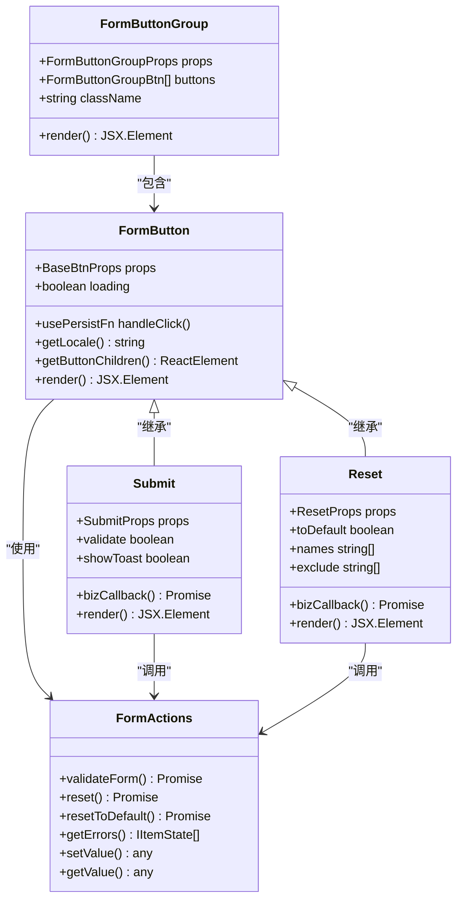
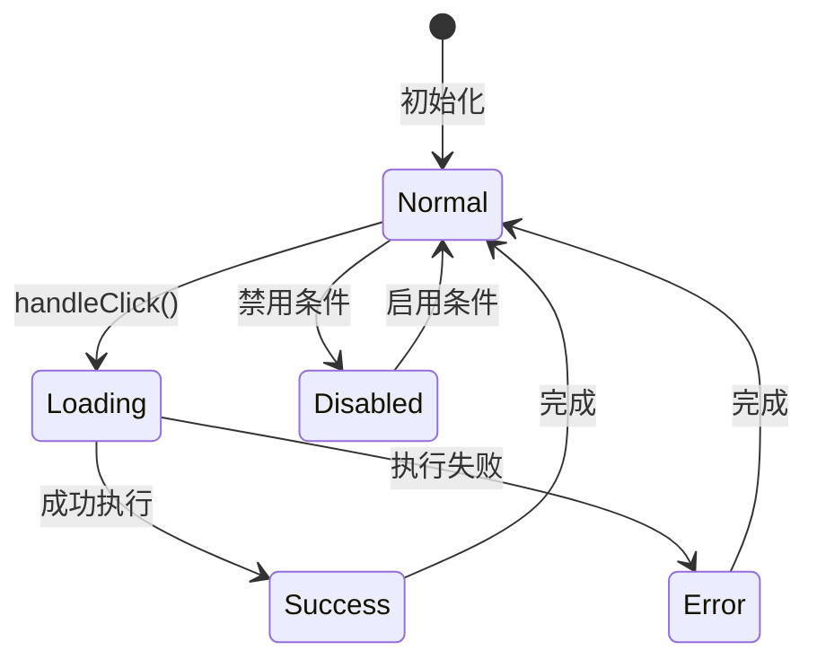

# 动作按钮组件

<cite>
**本文档中引用的文件**
- [form-buttons.tsx](file://src/form2/form-buttons.tsx)
- [form-actions.ts](file://src/form2/form-actions.ts)
- [form-types.ts](file://src/form2/form-types.ts)
- [form-context.ts](file://src/form2/form-context.ts)
- [constants.ts](file://src/form2/helper/constants.ts)
- [demo-form2.tsx](file://demo/demo-form2.tsx)
</cite>

## 目录
1. [简介](#简介)
2. [核心组件架构](#核心组件架构)
3. [FormButton组件详解](#formbutton组件详解)
4. [预设按钮类型](#预设按钮类型)
5. [FormButtonGroup组件](#formbuttongroup组件)
6. [按钮状态管理](#按钮状态管理)
7. [与弹层组件集成](#与弹层组件集成)
8. [自定义扩展指南](#自定义扩展指南)
9. [最佳实践](#最佳实践)
10. [故障排除](#故障排除)

## 简介

Form2动作按钮组件是Fat Design表单系统的核心组成部分，提供了标准化的表单底部操作按钮区域。该组件系统包括`FormButton`基础按钮、`Submit`提交按钮、`Reset`重置按钮以及`FormButtonGroup`按钮组容器，确保了一致的用户体验和统一的交互模式。

## 核心组件架构



**图表来源**
- [form-buttons.tsx](file://src/form2/form-buttons.tsx#L36-L258)
- [form-actions.ts](file://src/form2/form-actions.ts#L15-L275)

**章节来源**
- [form-buttons.tsx](file://src/form2/form-buttons.tsx#L1-L260)
- [form-actions.ts](file://src/form2/form-actions.ts#L1-L276)

## FormButton组件详解

`FormButton`是所有表单按钮的基础组件，提供了统一的按钮行为和状态管理。

### 核心功能特性

1. **异步加载状态管理**：通过`loading`状态防止重复点击
2. **国际化支持**：自动获取本地化文本
3. **错误处理**：统一的错误捕获和提示机制
4. **事件链式调用**：支持自定义点击事件和业务回调

### 实现原理

```typescript
// 按钮点击处理逻辑
const handleClick = usePersistFn(async (e: any, b: any, c: any) => {
    const innerFn = async (e: any, b: any, c: any) => {
        if (typeof onClick === "function") {
            const params = buildFnFormOnChangeParams(formStore, formActions);
            params.eventArgs = [e, b, c];
            await onClick(e, params);
        }
        await bizCallback(formStore, formActions, formContext);
    }

    if(loadingRef.current) {
        return;
    }

    setLoading(true);
    loadingRef.current = true;

    try {
        await innerFn(e, b, c);
    } catch (err: any) {
        log.error('[FormButton] handleClick error ', err);
        Message.error(pickErrorMessage(err));
    }

    loadingRef.current = false;
    setLoading(false);
});
```

### 属性配置

| 属性名 | 类型 | 默认值 | 描述 |
|--------|------|--------|------|
| `type` | `string` | - | 按钮类型（primary, secondary等） |
| `onClick` | `function` | - | 点击事件处理器 |
| `children` | `ReactNode` | - | 按钮内容 |
| `text` | `string` | - | 按钮文本 |
| `localKey` | `string` | - | 国际化键值 |
| `htmlType` | `string` | - | HTML原生type属性 |
| `xProps` | `object` | - | 扩展属性 |

**章节来源**
- [form-buttons.tsx](file://src/form2/form-buttons.tsx#L36-L110)

## 预设按钮类型

### Submit提交按钮

`Submit`按钮专门用于表单提交操作，内置表单验证和数据处理逻辑。

```typescript
function Submit(props: SubmitProps) {
    const { validate, showToast, ...others } = props;

    const bizCallback = async (formStore: PreciseStore, formActions: FormActions, formContext: IFormContext) => {
        if (validate) {
            await formActions.validateForm();
            const errors = formActions.getErrors();
            if (errors.length > 0) {
                if (showToast) {
                    const errors0 = errors[0] as any;
                    const errors00 = errors0?.errors[0];
                    const stateMessage = errors00?.message || "";
                    Message.error(stateMessage);
                }
                return;
            }
        }

        if (typeof formContext.formProps.onSubmit === "function") {
            const values = formActions.getValues();
            await formContext.formProps.onSubmit(values, buildFnFormOnChangeParams(formStore, formActions));
        }
    }

    return (
        <FormButton type={'primary'} {...others} localKey={'buttonSubmit'} bizCallback={bizCallback} htmlType="submit" />
    );
}
```

#### 提交按钮特性

- **自动验证**：可配置是否在提交前进行表单验证
- **错误提示**：支持显示验证错误信息
- **数据处理**：自动获取表单数据并传递给回调函数
- **异步支持**：支持异步提交操作

### Reset重置按钮

`Reset`按钮提供表单重置功能，支持多种重置模式。

```typescript
function Reset(props: ResetProps) {
    const {
        toDefault,
        names,
        exclude,
        ...others
    } = props;

    const bizCallback = async (formStore: PreciseStore, formActions: FormActions, formContext: IFormContext) => {
        if (toDefault) {
            await formActions.resetToDefault(names, exclude);
        } else {
            await formActions.reset(names, exclude);
        }

        if (typeof formContext.formProps.onReset === "function") {
            const values = formActions.getValues();
            await formContext.formProps.onReset(values, buildFnFormOnChangeParams(formStore, formActions));
        }
    }

    return (
        <FormButton {...others} localKey={'buttonReset'} bizCallback={bizCallback} htmlType="button" />
    );
}
```

#### 重置按钮特性

- **双重模式**：支持重置到当前值或默认值
- **选择性重置**：可指定重置特定字段
- **排除机制**：可排除某些字段不被重置
- **回调支持**：重置后触发onReset回调

**章节来源**
- [form-buttons.tsx](file://src/form2/form-buttons.tsx#L112-L200)

## FormButtonGroup组件

`FormButtonGroup`是一个容器组件，用于组织多个按钮形成按钮组。

### 使用方式

```typescript
<FormButtonGroup
    buttons={[
        {
            component: 'FormSubmit',
            children: '提交'
        },
        {
            component: 'FormReset',
            children: '重置',
            toDefault: true
        }
    ]}
/>
```

### 组件实现

```typescript
function FormButtonGroup(props: FormButtonGroupProps): React.JSX.Element {
    const buttons = props.buttons || [];
    const className = props.className || '';
    const formContext = useContext(formContextDef) as IFormContext;
    const prefix = formContext.formProps.prefix;
    const formComponents = formContext.formComponents;

    return (
        <div className={`${prefix}form-button-group ${className}`}>
            {buttons.map((btn: FormButtonGroupBtn, index: number) => {
                const {
                    component,
                    ...otherProps
                } = btn;

                const Tag = formComponents.getComponentTag(component);

                if (!Tag) {
                    return null;
                }

                return (
                    <Tag key={index} {...otherProps} />
                );

            })}
        </div>
    );
}
```

### 特性说明

- **动态组件渲染**：根据component属性动态渲染对应按钮
- **组件注册机制**：通过formComponents获取组件标签
- **灵活配置**：支持任意按钮类型的组合
- **样式隔离**：自动添加前缀类名避免样式冲突

**章节来源**
- [form-buttons.tsx](file://src/form2/form-buttons.tsx#L202-L258)

## 按钮状态管理

### 加载状态控制

按钮的加载状态通过以下机制实现：



### 禁用逻辑

按钮的禁用状态可以通过多种方式控制：

1. **表单验证状态**：当表单存在验证错误时自动禁用提交按钮
2. **外部条件**：通过disabled属性手动控制
3. **权限控制**：基于用户权限动态调整按钮状态

### 与表单验证的联动

```typescript
// 获取表单验证状态
const errors = formActions.getErrors();
const hasErrors = errors.length > 0;

// 根据验证状态更新按钮状态
<button disabled={hasErrors}>提交</button>
```

**章节来源**
- [form-actions.ts](file://src/form2/form-actions.ts#L100-L120)

## 与弹层组件集成

### Modal集成示例

```typescript
import { Dialog } from 'fat-design';

const FormWithModal = () => {
    const [visible, setVisible] = useState(false);

    return (
        <>
            <Button onClick={() => setVisible(true)}>打开表单</Button>
            
            <Dialog
                visible={visible}
                onClose={() => setVisible(false)}
                title="表单对话框"
            >
                <Form>
                    <FormItem label="名称" name="name" required />
                    
                    <FormButtonGroup
                        buttons={[
                            {
                                component: 'FormSubmit',
                                children: '保存'
                            },
                            {
                                component: 'FormReset',
                                children: '重置',
                                toDefault: true
                            }
                        ]}
                    />
                </Form>
            </Dialog>
        </>
    );
};
```

### Drawer集成示例

```typescript
import { Drawer } from 'fat-design';

const FormWithDrawer = () => {
    const [visible, setVisible] = useState(false);

    return (
        <>
            <Button onClick={() => setVisible(true)}>打开抽屉</Button>
            
            <Drawer
                visible={visible}
                onClose={() => setVisible(false)}
                title="表单抽屉"
            >
                <Form>
                    <FormItem label="名称" name="name" required />
                    
                    <FormButtonGroup
                        buttons={[
                            {
                                component: 'FormSubmit',
                                children: '保存'
                            },
                            {
                                component: 'FormReset',
                                children: '重置',
                                toDefault: true
                            }
                        ]}
                    />
                </Form>
            </Drawer>
        </>
    );
};
```

## 自定义扩展指南

### 创建自定义按钮

```typescript
import { FormButton } from 'fat-design';

const CustomButton = (props) => {
    const { formActions, formStore } = useFormContext();

    const handleCustomAction = async () => {
        // 自定义业务逻辑
        console.log('执行自定义操作');
        
        // 调用表单操作
        await formActions.setValue('customField', 'customValue');
    };

    return (
        <FormButton
            {...props}
            onClick={handleCustomAction}
            localKey="customButton"
        >
            自定义按钮
        </FormButton>
    );
};
```

### 修改默认样式

```scss
// 自定义按钮样式
.fat-form-button-group {
    margin-top: 20px;
    padding: 10px;
    border-top: 1px solid #eee;
    
    .fat-button {
        margin-right: 10px;
    }
}

// 自定义提交按钮样式
.fat-form-submit {
    background-color: #1890ff;
    border-color: #1890ff;
    
    &:hover {
        background-color: #40a9ff;
        border-color: #40a9ff;
    }
}
```

### 扩展按钮功能

```typescript
interface ExtendedButtonProps extends BaseBtnProps {
    confirm?: boolean; // 是否需要确认
    confirmText?: string; // 确认提示文本
}

const ExtendedButton = (props: ExtendedButtonProps) => {
    const { confirm, confirmText, ...restProps } = props;
    
    const handleClick = async (e, params) => {
        if (confirm) {
            const confirmed = await Dialog.confirm({
                title: '确认操作',
                content: confirmText || '确定要执行此操作吗？'
            });
            
            if (!confirmed) {
                return;
            }
        }
        
        // 执行原始点击事件
        if (props.onClick) {
            await props.onClick(e, params);
        }
    };
    
    return (
        <FormButton
            {...restProps}
            onClick={handleClick}
        />
    );
};
```

## 最佳实践

### 1. 按钮布局设计

```typescript
// 推荐的按钮布局
<FormButtonGroup
    buttons={[
        {
            component: 'FormSubmit',
            type: 'primary',
            htmlType: 'submit'
        },
        {
            component: 'FormReset',
            type: 'default',
            toDefault: true
        }
    ]}
    className="form-action-buttons"
/>
```

### 2. 错误处理策略

```typescript
const handleSubmit = async (e, params) => {
    try {
        // 表单提交逻辑
        await api.submit(params.values);
        
        // 显示成功消息
        Message.success('提交成功');
        
        // 关闭对话框或重置表单
        if (props.onSuccess) {
            props.onSuccess();
        }
        
    } catch (error) {
        // 错误处理
        Message.error(error.message || '提交失败');
        
        // 记录错误日志
        console.error('表单提交失败:', error);
    }
};
```

### 3. 性能优化

```typescript
// 使用useMemo缓存按钮配置
const buttonConfig = useMemo(() => ({
    buttons: [
        {
            component: 'FormSubmit',
            children: '提交',
            validate: true
        },
        {
            component: 'FormReset',
            children: '重置',
            toDefault: true
        }
    ]
}), []);

// 使用React.memo优化组件渲染
const MemoizedFormButtonGroup = memo(FormButtonGroup);
```

## 故障排除

### 常见问题及解决方案

#### 1. 按钮点击无响应

**问题描述**：按钮点击后没有任何反应

**可能原因**：
- 按钮处于加载状态
- 表单验证未通过
- 事件处理函数未正确绑定

**解决方案**：
```typescript
// 检查按钮状态
console.log('按钮状态:', { loading, disabled });

// 检查表单验证
const errors = formActions.getErrors();
console.log('验证错误:', errors);

// 确保事件处理函数正确
const handleClick = useCallback(async (e, params) => {
    console.log('按钮被点击');
    // 业务逻辑
}, []);
```

#### 2. 按钮样式异常

**问题描述**：按钮样式不符合预期

**可能原因**：
- CSS类名冲突
- 主题配置错误
- 样式覆盖问题

**解决方案**：
```scss
// 使用scoped样式
.form-action-buttons {
    .fat-button {
        // 确保样式优先级
        &.fat-button-primary {
            background-color: var(--primary-color);
        }
    }
}
```

#### 3. 表单验证失效

**问题描述**：提交按钮无法正确触发表单验证

**可能原因**：
- validate属性设置错误
- 表单项配置问题
- 验证规则未正确应用

**解决方案**：
```typescript
// 确保表单项配置正确
<FormItem
    name="requiredField"
    required
    rules={[{ required: true, message: '必填项' }]}
/>

// 确保提交按钮配置正确
<FormSubmit validate={true} />
```

**章节来源**
- [form-buttons.tsx](file://src/form2/form-buttons.tsx#L36-L258)
- [form-actions.ts](file://src/form2/form-actions.ts#L1-L276)