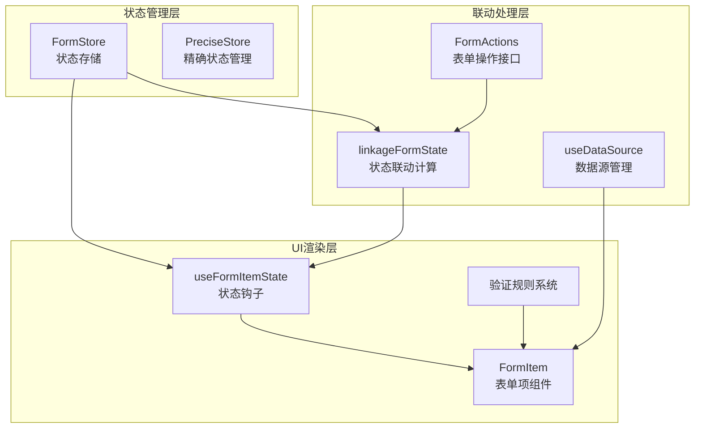
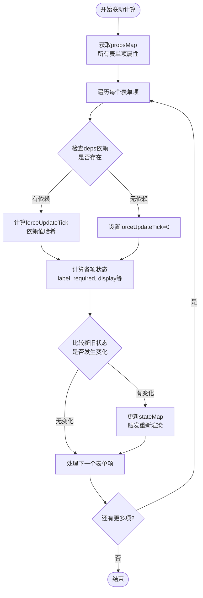
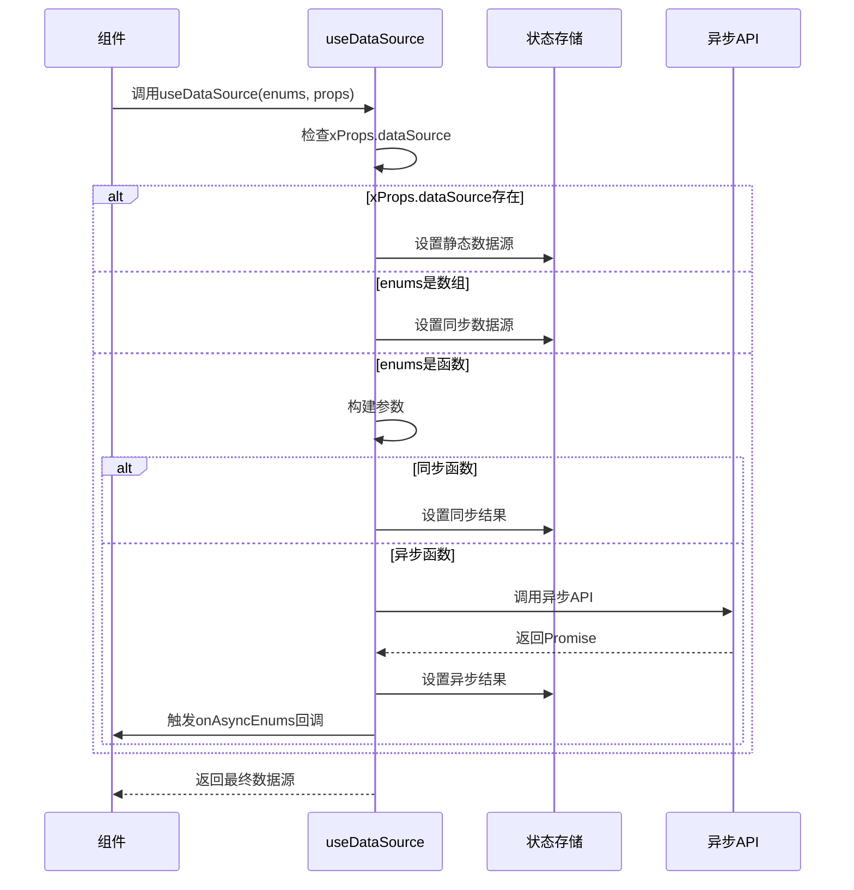
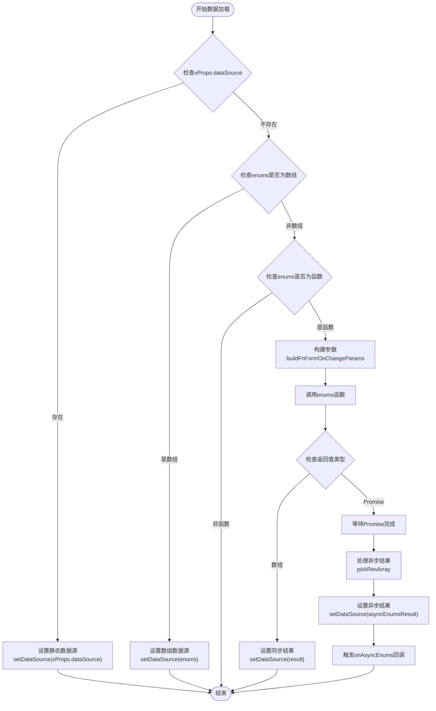
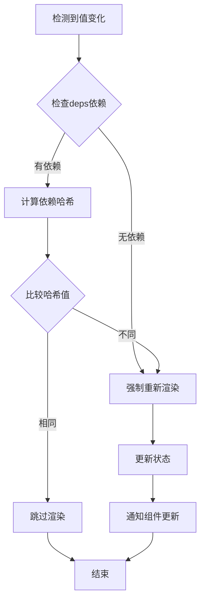

# Form2字段联动功能技术文档

<cite>
**本文档中引用的文件**
- [linkageFormState.ts](file://src/form2/helper/linkageFormState.ts)
- [useDataSource.ts](file://src/form2/helper/useDataSource.ts)
- [form-rules.ts](file://src/form2/form-rules.ts)
- [demo-form2.tsx](file://demo/demo-form2.tsx)
- [form-types.ts](file://src/form2/form-types.ts)
- [useFormItemState.ts](file://src/form2/helper/useFormItemState.ts)
- [form-actions.ts](file://src/form2/form-actions.ts)
</cite>

## 目录
1. [简介](#简介)
2. [核心架构](#核心架构)
3. [字段联动机制详解](#字段联动机制详解)
4. [useDataSource Hook详解](#usedatasource-hook详解)
5. [动态验证规则系统](#动态验证规则系统)
6. [实现示例](#实现示例)
7. [性能优化策略](#性能优化策略)
8. [调试技巧](#调试技巧)
9. [常见问题解决](#常见问题解决)
10. [总结](#总结)

## 简介

Form2字段联动功能是Fat Design表单系统的核心特性之一，它实现了复杂表单字段之间的依赖关系管理。该功能允许一个字段的值变化触发其他字段的显隐、值更新或验证规则变化，为构建智能表单提供了强大的基础。

主要特性包括：
- 基于函数的动态状态计算
- 支持异步数据源加载
- 完整的字段依赖追踪
- 性能优化的重新渲染控制
- 灵活的验证规则动态配置

## 核心架构

Form2字段联动功能基于以下核心组件构建：



**图表来源**
- [linkageFormState.ts](file://src/form2/helper/linkageFormState.ts#L1-L96)
- [useFormItemState.ts](file://src/form2/helper/useFormItemState.ts#L1-L68)
- [form-actions.ts](file://src/form2/form-actions.ts#L1-L276)

## 字段联动机制详解

### linkageFormState核心算法

字段联动的核心逻辑由`linkageFormState`模块实现，它负责计算和更新所有表单项的状态。



**图表来源**
- [linkageFormState.ts](file://src/form2/helper/linkageFormState.ts#L60-L96)

### 状态计算函数

`computeStateLinkage`函数是状态计算的核心，它支持多种类型的状态计算：

```typescript
// 计算状态的基本模式
function computeStateLinkage(itemState: any, itemProps: any, storeData: any, key: string, expectType: string) {
    if (!itemProps[key]) {
        return;
    }

    let result = itemProps[key];

    if (typeof result === "function") {
        result = result(storeData.values, storeData);
        if (typeof result === expectType) {
            itemState[key] = result;
        }
    }
}
```

支持的状态类型包括：
- **label**: 动态标签文本
- **required**: 必填状态
- **display**: 显示状态
- **disabled**: 禁用状态
- **isPreview**: 预览状态
- **xProps**: 扩展属性

### 依赖追踪机制

`computeStateLinkageByDeps`函数实现了基于依赖的重新渲染控制：

```typescript
function computeStateLinkageByDeps(itemState: any, itemProps: FormItemProps, storeData: any) {
    const deps = itemProps.deps;
    if (!deps || !Array.isArray(deps)) {
        itemState.forceUpdateTick = 0;
        return;
    }
    
    const values = storeData.values;
    let forceUpdateTickArray: string[] = [];
    for (let i = 0; i < deps.length; i++) {
        const dep = deps[i];
        forceUpdateTickArray.push(`${i}_${values[dep]||""}`);
    }
    itemState.forceUpdateTick = forceUpdateTickArray.join('-');
}
```

这种机制确保只有当依赖字段的值发生变化时，才会触发相关字段的重新渲染，有效避免了不必要的性能开销。

**章节来源**
- [linkageFormState.ts](file://src/form2/helper/linkageFormState.ts#L1-L96)

## useDataSource Hook详解

`useDataSource` Hook是处理异步数据源的核心组件，支持多种数据源配置方式：



**图表来源**
- [useDataSource.ts](file://src/form2/helper/useDataSource.ts#L25-L85)

### 数据源类型支持

`useDataSource`支持三种数据源配置方式：

1. **静态数组数据源**：
```typescript
enums: [
    {label: '选项A', value: 'A'},
    {label: '选项B', value: 'B'}
]
```

2. **同步函数数据源**：
```typescript
enums: (childProps, params) => {
    return fetchDataSync();
}
```

3. **异步函数数据源**：
```typescript
enums: async (childProps, params) => {
    const data = await fetchDataAsync();
    return data;
}
```

4. **xProps.dataSource直接指定**：
```typescript
xProps: {
    dataSource: [
        {label: '选项C', value: 'C'}
    ]
}
```

### 异步数据处理流程

异步数据源的处理遵循严格的顺序：



**图表来源**
- [useDataSource.ts](file://src/form2/helper/useDataSource.ts#L25-L85)

**章节来源**
- [useDataSource.ts](file://src/form2/helper/useDataSource.ts#L1-L104)

## 动态验证规则系统

Form2的验证规则系统支持基于其他字段值的条件性验证：

### 验证规则构建流程

```mermaid
flowchart TD
Start([开始构建验证规则]) --> InitResult["初始化结果数组"]
InitResult --> CheckRequired{"检查required属性"}
CheckRequired --> |true| AddRequired["添加required规则"]
CheckRequired --> |false| CheckLength{"检查长度限制"}
AddRequired --> CheckLength
CheckLength --> |有minLength或maxLength| AddLength["添加length规则"]
CheckLength --> CheckPattern{"检查pattern属性"}
AddLength --> CheckPattern
CheckPattern --> |有pattern| AddPattern["添加pattern规则"]
CheckPattern --> CheckFormat{"检查format属性"}
AddPattern --> CheckFormat
CheckFormat --> |有效格式| AddFormat["添加format规则"]
CheckFormat --> CheckMinMax{"检查min/max属性"}
AddFormat --> CheckMinMax
CheckMinMax --> |有min或max| AddMinMax["添加min/max规则"]
CheckMinMax --> CheckValidator{"检查validator函数"}
AddMinMax --> CheckValidator
CheckValidator --> |有自定义验证器| AddCustom["添加自定义验证器"]
CheckValidator --> CheckRules{"检查rules数组"}
AddCustom --> CheckRules
CheckRules --> |有额外规则| AddExtra["添加额外规则"]
CheckRules --> AddLabel["添加错误消息别名"]
AddExtra --> AddLabel
AddLabel --> End([返回验证规则数组])
```



**图表来源**
- [form-rules.ts](file://src/form2/form-rules.ts#L30-L110)

### 条件验证规则

验证规则支持基于其他字段值的动态配置：

```typescript
// 基于其他字段值的验证规则示例
const formItemProps = {
    name: 'email',
    required: (values) => values.useEmail === 'yes',
    validator: (rule, value) => {
        if (values.useEmail === 'yes' && !value.includes('@')) {
            return Promise.reject('请输入有效的邮箱地址');
        }
        return Promise.resolve();
    }
}
```

### 错误消息定制

系统支持灵活的错误消息定制：

```typescript
function getLabelForErrorMessage(props: FormItemProps) {
    const {errorMessageName, label, useLabelForErrorMessage} = props;

    if (errorMessageName) {
        return errorMessageName;
    }

    if (!label || typeof label !== 'string') {
        return null;
    }

    const newLabel = label.replace(':', '').replace('：', '');

    if (useLabelForErrorMessage && newLabel) {
        return newLabel;
    }

    return null;
}
```

**章节来源**
- [form-rules.ts](file://src/form2/form-rules.ts#L1-L137)

## 实现示例

### 基础字段联动示例

以下是一个完整的字段联动实现示例：

```typescript
// 基础联动示例
const formItemProps = {
    name: 'country',
    component: 'Select',
    enums: ['China', 'USA', 'Japan'],
    onChange: (value, {formActions}) => {
        if (value === 'China') {
            formActions.setState('province', {display: true});
            formActions.setState('city', {display: true});
        } else {
            formActions.setState('province', {display: false});
            formActions.setState('city', {display: false});
        }
    }
};

const provinceProps = {
    name: 'province',
    component: 'Select',
    display: false,
    deps: ['country']
};
```

### 级联选择器实现

```typescript
// 级联选择器示例
const cityDataSource = (childProps, params) => {
    const country = params.values.country;
    if (country === 'China') {
        return Promise.resolve([
            {label: '北京', value: 'beijing'},
            {label: '上海', value: 'shanghai'}
        ]);
    } else if (country === 'USA') {
        return Promise.resolve([
            {label: '纽约', value: 'newyork'},
            {label: '洛杉矶', value: 'losangeles'}
        ]);
    }
    return [];
};

const cityFormItem = {
    name: 'city',
    component: 'Select',
    enums: cityDataSource,
    deps: ['country']
};
```

### 动态验证规则示例

```typescript
// 动态验证规则示例
const passwordFormItem = {
    name: 'password',
    component: 'Input',
    validator: (rule, value) => {
        const confirmPassword = params.values.confirmPassword;
        if (confirmPassword && value !== confirmPassword) {
            return Promise.reject('两次输入的密码不一致');
        }
        return Promise.resolve();
    }
};

const confirmPasswordFormItem = {
    name: 'confirmPassword',
    component: 'Input',
    validator: (rule, value) => {
        const password = params.values.password;
        if (password && value !== password) {
            return Promise.reject('两次输入的密码不一致');
        }
        return Promise.resolve();
    },
    deps: ['password']
};
```

**章节来源**
- [demo-form2.tsx](file://demo/demo-form2.tsx#L1-L229)

## 性能优化策略

### 避免循环依赖

循环依赖会导致无限递归和性能问题。系统通过以下机制防止循环依赖：

1. **依赖追踪深度限制**：限制联动计算的递归深度
2. **状态比较优化**：使用`deepEqual`避免不必要的状态更新
3. **强制更新标记**：通过`forceUpdateTick`精确控制重新渲染时机

### 渲染优化策略



### 性能监控指标

关键性能指标包括：
- **联动计算频率**：监控`linkageFormState`的调用频率
- **状态比较次数**：跟踪`deepEqual`的调用次数
- **重新渲染计数**：统计组件的重新渲染次数
- **内存使用量**：监控状态存储的内存占用

## 调试技巧

### 开发者工具集成

系统提供了丰富的调试功能：

```typescript
// 启用调试模式
window.xx_formStore = formStore;
window.xx_formActions = formActions;

// 查看当前状态
console.log('当前值:', formStore.getValue('values'));
console.log('当前状态:', formStore.getValue('stateMap'));

// 查看表单项属性
console.log('表单项属性:', formActions.getFormItemProps('fieldName'));
```

### 调试工具函数

```typescript
// 状态对比工具
function debugStateComparison(oldState, newState) {
    const changedKeys = Object.keys(newState).filter(key => 
        JSON.stringify(oldState[key]) !== JSON.stringify(newState[key])
    );
    console.log('状态变化:', changedKeys);
    return changedKeys;
}

// 依赖追踪工具
function debugDependencies(fieldName) {
    const props = formActions.getFormItemProps(fieldName);
    console.log(`字段 ${fieldName} 的依赖:`, props.deps);
}
```

### 常见调试场景

1. **字段状态不更新**：
   - 检查`deps`数组是否正确配置
   - 验证回调函数是否返回正确的布尔值
   - 确认`forceUpdateTick`是否正确生成

2. **性能问题**：
   - 使用浏览器开发者工具的性能面板
   - 监控组件的重新渲染频率
   - 分析状态更新的触发链路

3. **验证规则失效**：
   - 检查验证函数的返回值类型
   - 确认`trigger`配置是否正确
   - 验证错误消息的格式

## 常见问题解决

### 问题1：字段联动不生效

**症状**：修改一个字段后，其他字段没有响应变化

**可能原因**：
1. 缺少`deps`配置
2. 回调函数返回值类型错误
3. 状态更新未正确触发

**解决方案**：
```typescript
// 正确配置deps
const itemProps = {
    name: 'dependentField',
    deps: ['sourceField'], // 确保包含依赖字段
    display: (values) => values.sourceField === 'expectedValue'
};
```

### 问题2：异步数据源加载失败

**症状**：`useDataSource`无法正确加载数据

**可能原因**：
1. 异步函数返回值格式错误
2. Promise未正确处理
3. 数据源配置错误

**解决方案**：
```typescript
// 正确的异步数据源配置
const asyncDataSource = async (childProps, params) => {
    try {
        const response = await fetchData(params.values);
        return response.data.map(item => ({
            label: item.name,
            value: item.id
        }));
    } catch (error) {
        console.error('数据加载失败:', error);
        return []; // 确保返回数组
    }
};
```

### 问题3：验证规则冲突

**症状**：多个验证规则同时触发冲突

**解决方案**：
```typescript
// 使用条件验证规则
const conditionalValidator = (rule, value) => {
    const condition = params.values.conditionalField;
    if (condition === 'specificValue') {
        // 特定条件下的验证逻辑
        if (!value) {
            return Promise.reject('特定条件下必填');
        }
    }
    return Promise.resolve();
};
```

### 问题4：内存泄漏

**症状**：长时间使用后内存占用持续增长

**解决方案**：
1. 确保正确清理事件监听器
2. 避免在回调函数中创建闭包
3. 使用`usePersistFn`优化函数引用

```typescript
import {usePersistFn} from '../../hooks/usePersistFn';

const persistentCallback = usePersistFn((value, params) => {
    // 持久化的回调函数
});
```

## 总结

Form2字段联动功能通过精心设计的架构和算法，为React应用提供了强大而灵活的表单状态管理能力。其核心优势包括：

1. **高度可配置性**：支持多种状态计算方式和数据源类型
2. **性能优化**：通过依赖追踪和精确渲染控制避免性能问题
3. **开发友好**：提供丰富的调试工具和错误提示
4. **扩展性强**：易于集成新的字段类型和验证规则

通过合理使用这些功能，开发者可以构建出响应迅速、用户体验良好的智能表单界面。建议在实际项目中结合具体需求，选择合适的联动策略，并充分利用系统的调试和监控功能来确保最佳的开发体验。