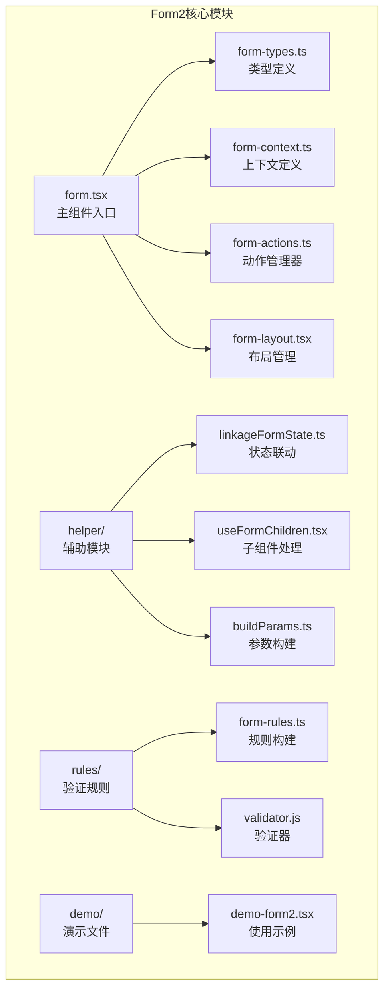
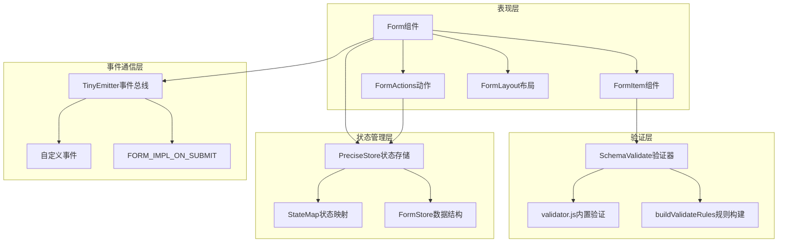
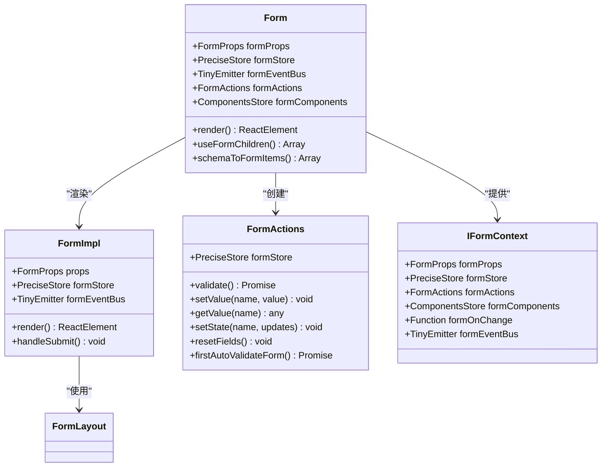
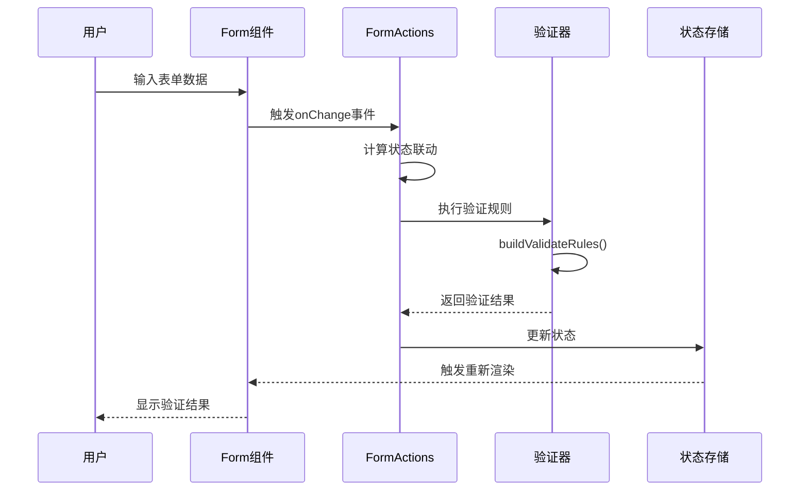
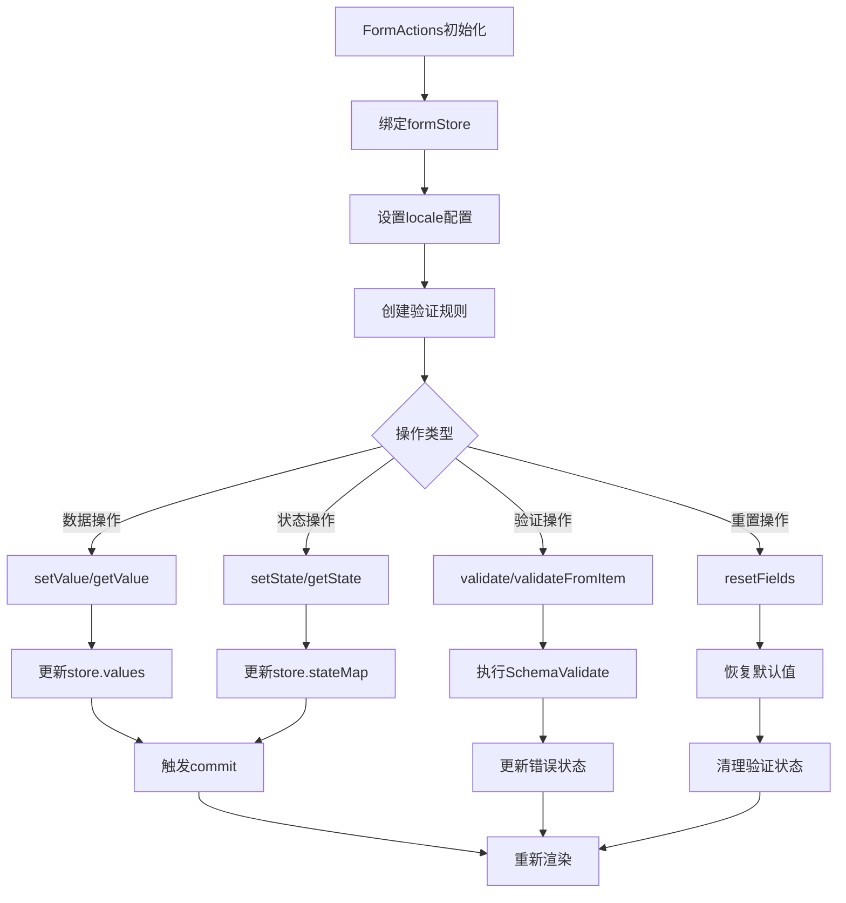
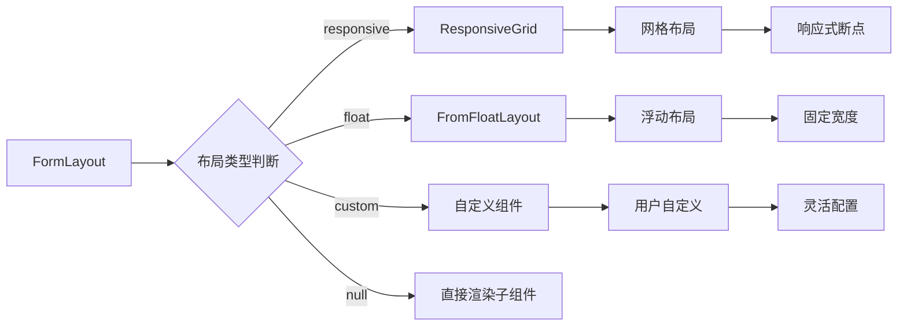
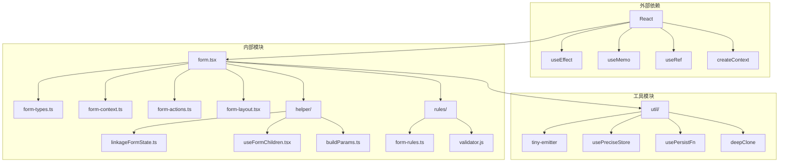

# Form2表单容器组件技术文档

<cite>
**本文档中引用的文件**
- [form.tsx](file://src/form2/form.tsx)
- [form-types.ts](file://src/form2/form-types.ts)
- [form-actions.ts](file://src/form2/form-actions.ts)
- [form-context.ts](file://src/form2/form-context.ts)
- [form-layout.tsx](file://src/form2/form-layout.tsx)
- [form-rules.ts](file://src/form2/form-rules.ts)
- [demo-form2.tsx](file://demo/demo-form2.tsx)
</cite>

## 目录
1. [简介](#简介)
2. [项目结构](#项目结构)
3. [核心组件](#核心组件)
4. [架构概览](#架构概览)
5. [详细组件分析](#详细组件分析)
6. [依赖关系分析](#依赖关系分析)
7. [性能考虑](#性能考虑)
8. [故障排除指南](#故障排除指南)
9. [结论](#结论)

## 简介

Form2是Fat Design设计系统中的高级表单容器组件，它作为表单状态管理的核心中心，提供了完整的表单构建、验证和交互功能。该组件通过React Context机制向下层组件传递表单状态和配置，支持多种布局方式，并集成了强大的验证规则系统。

Form2组件的设计理念是提供一个统一的表单管理平台，通过声明式的配置方式简化复杂表单的开发过程。它不仅管理表单数据的状态，还负责处理用户交互、验证逻辑和错误处理。

## 项目结构

Form2组件位于`src/form2/`目录下，包含以下核心文件：



**图表来源**
- [form.tsx](file://src/form2/form.tsx#L1-L182)
- [form-types.ts](file://src/form2/form-types.ts#L1-L493)

**章节来源**
- [form.tsx](file://src/form2/form.tsx#L1-L182)
- [form-types.ts](file://src/form2/form-types.ts#L1-L493)

## 核心组件

### Form主组件

Form组件是整个表单系统的入口点，它负责创建和管理表单状态、事件总线以及上下文提供者。

主要特性：
- **状态管理**：使用PreciseStore进行精确的状态管理
- **事件处理**：通过TinyEmitter实现事件总线通信
- **上下文提供**：通过React Context向子组件提供表单上下文
- **生命周期管理**：处理表单创建、更新和销毁的完整生命周期

### FormActions动作管理器

FormActions类提供了丰富的表单操作方法，包括数据获取、设置、验证等功能。

核心方法：
- `setValue(name, value)`：设置表单项值
- `getValue(name)`：获取表单项值
- `validate()`：执行表单验证
- `setState(name, updates)`：更新表单项状态
- `resetFields()`：重置表单项

### 表单上下文系统

通过React Context机制，Form组件为所有子组件提供统一的访问接口：

```typescript
interface IFormContext {
    formProps: FormProps;
    formStore: PreciseStore;
    formActions: FormActions;
    formComponents: ComponentsStore;
    formOnChange: Function;
    formEventBus: TinyEmitter;
}
```

**章节来源**
- [form.tsx](file://src/form2/form.tsx#L40-L182)
- [form-actions.ts](file://src/form2/form-actions.ts#L1-L199)
- [form-context.ts](file://src/form2/form-context.ts#L1-L11)

## 架构概览

Form2采用分层架构设计，确保了组件的可维护性和扩展性：



**图表来源**
- [form.tsx](file://src/form2/form.tsx#L40-L100)
- [form-actions.ts](file://src/form2/form-actions.ts#L1-L50)

## 详细组件分析

### Form组件详细分析

Form组件是一个高阶组件，它封装了复杂的表单管理逻辑：



**图表来源**
- [form.tsx](file://src/form2/form.tsx#L40-L182)
- [form-actions.ts](file://src/form2/form-actions.ts#L1-L199)
- [form-types.ts](file://src/form2/form-types.ts#L400-L420)

#### Props参数详解

Form组件支持丰富的配置选项：

**基础配置**
- `submitter`: 是否显示默认提交按钮
- `inline`: 是否启用内联布局
- `size`: 组件尺寸大小
- `fullWidth`: 是否全宽显示

**布局配置**
- `layout`: 布局方式（responsive、float、custom）
- `labelAlign`: 标签对齐方式
- `labelCol`: 标签列配置
- `wrapperCol`: 包裹列配置

**事件回调**
- `onCreated`: 表单创建完成回调
- `onChange`: 表单值变化回调
- `onSubmit`: 表单提交回调
- `onReset`: 表单重置回调

**验证配置**
- `autoValidate`: 是否自动验证
- `autoValidateOnCreated`: 创建时是否自动验证

#### 表单验证流程

Form2的验证系统基于SchemaValidate库，支持多种验证规则：



**图表来源**
- [form-actions.ts](file://src/form2/form-actions.ts#L20-L60)
- [form-rules.ts](file://src/form2/form-rules.ts#L40-L100)

**章节来源**
- [form.tsx](file://src/form2/form.tsx#L40-L182)
- [form-types.ts](file://src/form2/form-types.ts#L200-L400)

### FormActions详细分析

FormActions类提供了完整的表单操作接口：



**图表来源**
- [form-actions.ts](file://src/form2/form-actions.ts#L1-L199)

#### 核心方法实现

**数据操作方法**
```typescript
// 设置字段值
setValue(name: string, value: any): any {
    return this.formStore.setValue('values.' + name, value);
}

// 获取字段值
getValue(name: string): any {
    return this.formStore.getValue('values.' + name);
}

// 批量设置值
setValues(values: any): any {
    return this.formStore.setValue('values', values);
}
```

**验证方法**
```typescript
// 验证整个表单
async validateForm() {
    const {propsMap} = this.getExtData1();
    const nameList = Object.keys(propsMap);
    for (let i = 0; i < nameList.length; i++) {
        const name = nameList[i];
        const props = propsMap[name];
        if (props && props.name) {
            await this.validateFromItem(props.name);
        }
    }
    this.formStore.commit();
}
```

**章节来源**
- [form-actions.ts](file://src/form2/form-actions.ts#L1-L199)

### 表单布局系统

FormLayout组件负责处理不同类型的表单布局：



**图表来源**
- [form-layout.tsx](file://src/form2/form-layout.tsx#L1-L62)

#### 响应式断点配置

支持的布局类型：
- **responsive**: 响应式网格布局，根据屏幕尺寸自动调整
- **float**: 浮动布局，支持固定宽度配置
- **custom**: 自定义布局组件
- **null**: 无布局，直接渲染子组件

**章节来源**
- [form-layout.tsx](file://src/form2/form-layout.tsx#L1-L62)
- [form-types.ts](file://src/form2/form-types.ts#L30-L50)

### 验证规则系统

Form2集成了强大的验证规则系统：

```mermaid
flowchart TD
A[FormItemProps] --> B[buildValidateRules]
B --> C{规则类型}
C --> |required| D[必填验证]
C --> |length|minLength/maxLength]
C --> |range|min/max]
C --> |pattern|E[正则表达式]
C --> |format|F[格式验证]
C --> |custom|G[自定义验证器]
C --> |rules|H[规则数组]
D --> I[SchemaValidate]
E --> I
F --> I
G --> I
H --> I
I --> J[验证结果]
J --> K[更新stateMap.errors]
```

**图表来源**
- [form-rules.ts](file://src/form2/form-rules.ts#L40-L136)

#### 验证规则构建

验证规则的构建遵循以下优先级：
1. 内置规则（required、length、pattern等）
2. 自定义验证器
3. 规则数组
4. 标签名称替换

**章节来源**
- [form-rules.ts](file://src/form2/form-rules.ts#L1-L136)

## 依赖关系分析

Form2组件具有清晰的依赖层次结构：



**图表来源**
- [form.tsx](file://src/form2/form.tsx#L1-L20)

**章节来源**
- [form.tsx](file://src/form2/form.tsx#L1-L20)

## 性能考虑

### 避免不必要的重新渲染

Form2采用了多种优化策略来提升性能：

**精确状态管理**
- 使用PreciseStore进行细粒度的状态跟踪
- 仅在必要时触发重新渲染
- 避免深层比较带来的性能开销

**事件函数持久化**
```typescript
const formOnChange = usePersistFn((formStore: PreciseStore) => {
    // 根据配置联动计算状态
    linkageFormState(formStore, formActionsRef.current as any);
    
    // 调用Form的onChange函数
    const storeData = formStore.storeData;
    if (typeof formProps.onChange === "function") {
        const {values} = storeData || {};
        formProps.onChange(values, buildFnFormOnChangeParams(formStore, formActions));
    }
});
```

**记忆化优化**
```typescript
const formContext = useMemo(() => {
    const formComponents = new ComponentsStore({
        components: formProps.components || {}
    });
    
    const ss: IFormContext = {
        formStore: formStore,
        formProps: formProps,
        formActions: formActions,
        formComponents: formComponents,
        formOnChange: formOnChange,
        formEventBus: formEventBus
    };
    return ss;
}, [formProps, formStore, formActions, formOnChange, formEventBus]);
```

### 最佳实践建议

1. **合理使用autoValidate**: 在大型表单中谨慎使用自动验证
2. **优化验证规则**: 避免过于复杂的验证逻辑
3. **批量更新**: 使用setValues进行批量数据更新
4. **条件渲染**: 利用display属性控制组件渲染

## 故障排除指南

### 常见问题及解决方案

**问题1：表单验证不生效**
- 检查autoValidate和autoValidateOnCreated配置
- 确认验证规则正确设置
- 验证FormActions实例是否正确注入

**问题2：状态更新不触发重新渲染**
- 检查PreciseStore的commit调用
- 确认状态更新使用正确的键路径
- 验证usePersistFn的使用

**问题3：布局错乱**
- 检查layoutProps配置
- 确认响应式断点设置
- 验证CSS样式冲突

**章节来源**
- [form-actions.ts](file://src/form2/form-actions.ts#L20-L60)
- [form.tsx](file://src/form2/form.tsx#L80-L120)

## 结论

Form2表单容器组件是一个功能强大、设计精良的表单管理系统。它通过React Context机制实现了状态的统一管理，通过PreciseStore提供了精确的状态跟踪，通过FormActions类提供了丰富的操作接口。

该组件的主要优势包括：
- **模块化设计**：清晰的职责分离和模块划分
- **性能优化**：多层次的性能优化策略
- **扩展性强**：支持自定义组件和布局
- **验证完善**：集成的验证规则系统
- **类型安全**：完整的TypeScript类型定义

通过合理的使用这些特性，开发者可以快速构建出功能完善的表单应用，同时保持代码的可维护性和可扩展性。