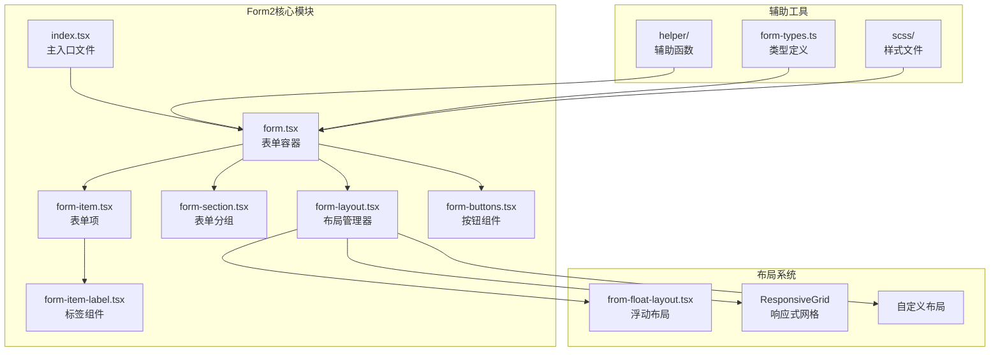
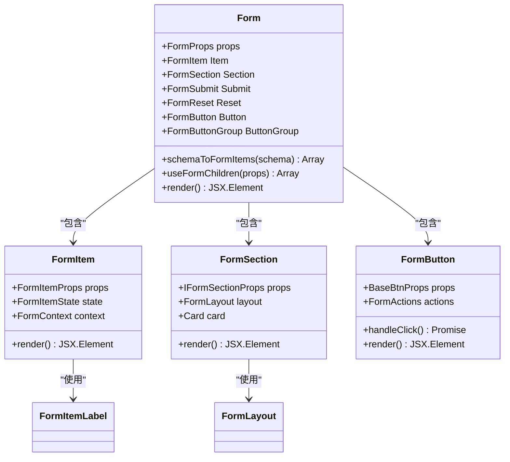
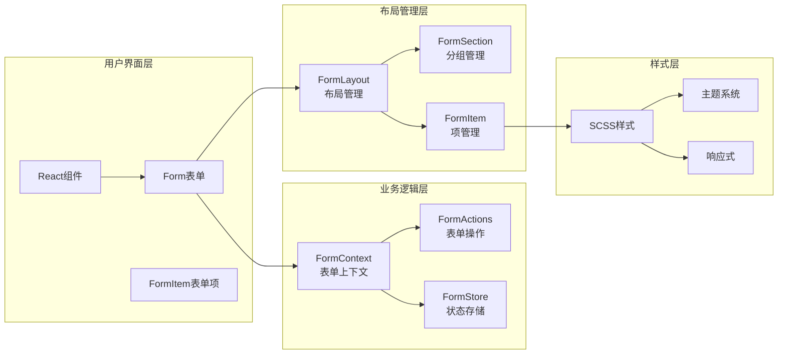
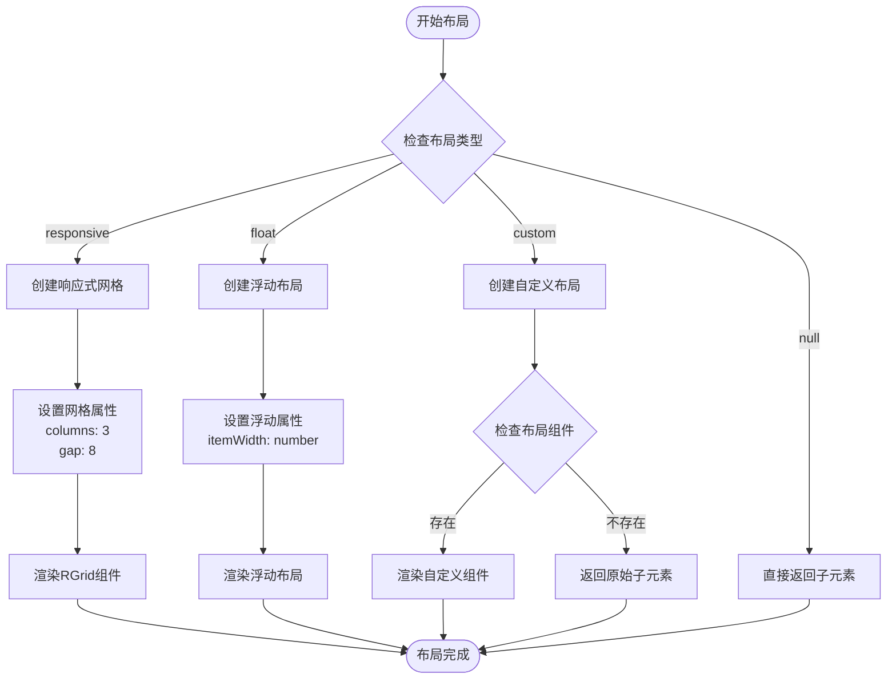
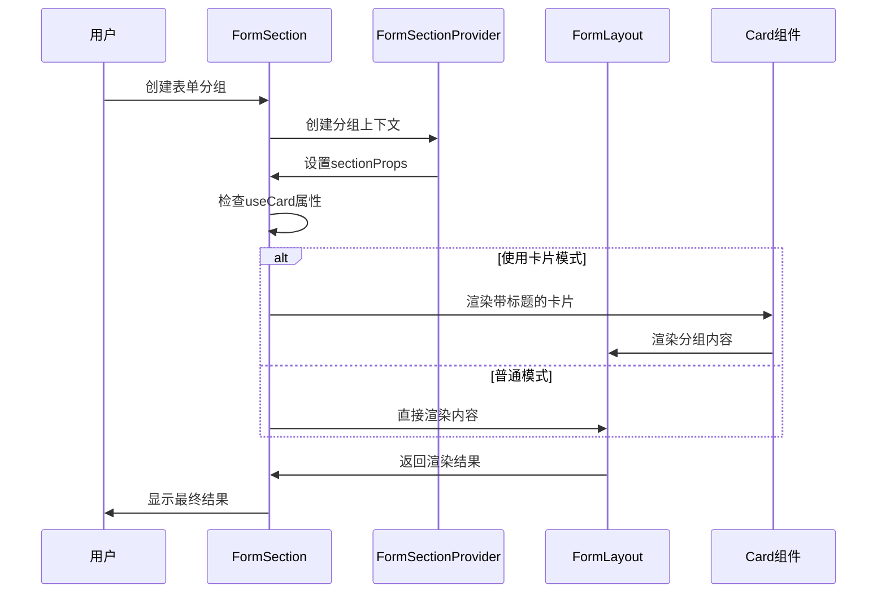
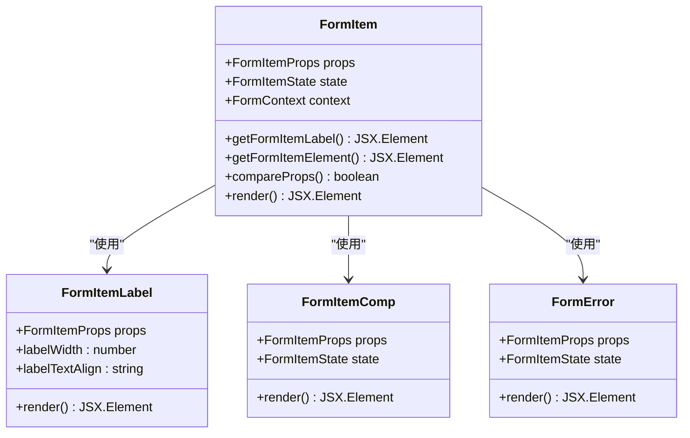
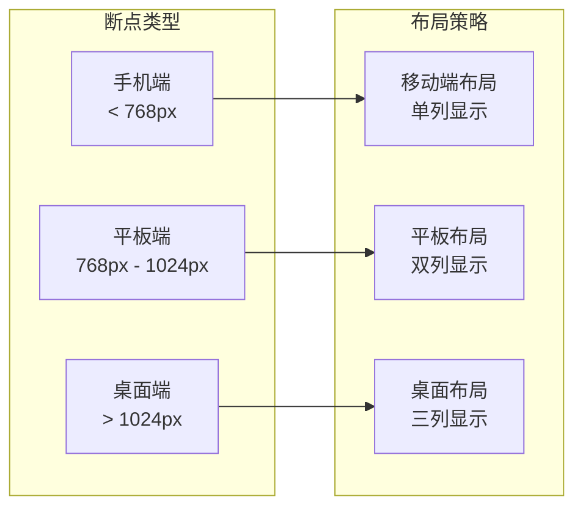
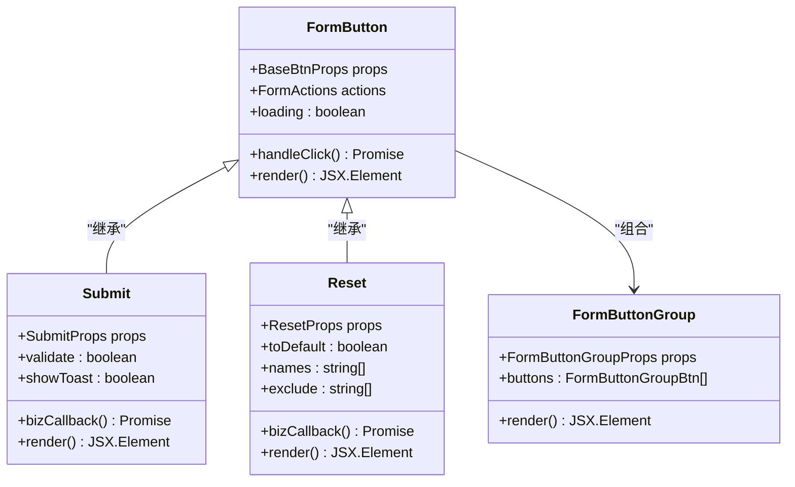
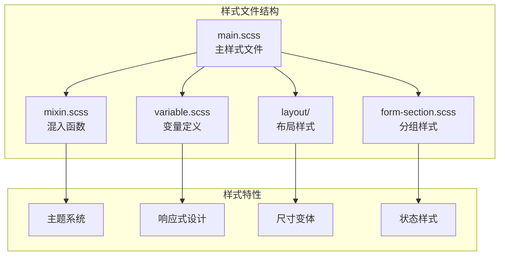

# Form2表单布局系统详细文档

<cite>
**本文档中引用的文件**
- [src/form2/index.tsx](file://src/form2/index.tsx)
- [src/form2/form-layout.tsx](file://src/form2/form-layout.tsx)
- [src/form2/form-section.tsx](file://src/form2/form-section.tsx)
- [src/form2/form-item-label.tsx](file://src/form2/form-item-label.tsx)
- [src/form2/form-item.tsx](file://src/form2/form-item.tsx)
- [src/form2/layout/from-float-layout.tsx](file://src/form2/layout/from-float-layout.tsx)
- [src/form2/form-types.ts](file://src/form2/form-types.ts)
- [src/form2/main.scss](file://src/form2/main.scss)
- [src/form2/form-section.scss](file://src/form2/form-section.scss)
- [src/form2/form-buttons.tsx](file://src/form2/form-buttons.tsx)
- [src/form2/helper/useFormChildren.tsx](file://src/form2/helper/useFormChildren.tsx)
- [demo/demo-form2.tsx](file://demo/demo-form2.tsx)
</cite>

## 目录
1. [简介](#简介)
2. [项目结构](#项目结构)
3. [核心组件](#核心组件)
4. [架构概览](#架构概览)
5. [详细组件分析](#详细组件分析)
6. [布局系统](#布局系统)
7. [响应式设计](#响应式设计)
8. [表单组件](#表单组件)
9. [样式系统](#样式系统)
10. [最佳实践](#最佳实践)
11. [故障排除](#故障排除)
12. [总结](#总结)

## 简介

Form2是Fat Design组件库中的高级表单布局系统，提供了灵活的表单结构组织能力。该系统支持多种布局模式，包括水平、垂直、内联等，并具备强大的响应式断点系统，能够根据屏幕尺寸自动调整表单项排列。Form2还提供了丰富的定制化选项，包括表单分组、标签对齐、宽度控制等功能。

## 项目结构

Form2表单布局系统采用模块化设计，主要包含以下核心模块：



**图表来源**
- [src/form2/index.tsx](file://src/form2/index.tsx#L1-L33)
- [src/form2/form-layout.tsx](file://src/form2/form-layout.tsx#L1-L62)
- [src/form2/form-section.tsx](file://src/form2/form-section.tsx#L1-L52)

**章节来源**
- [src/form2/index.tsx](file://src/form2/index.tsx#L1-L33)
- [src/form2/form-layout.tsx](file://src/form2/form-layout.tsx#L1-L62)

## 核心组件

Form2系统的核心组件提供了完整的表单功能，包括表单容器、表单项、标签、按钮等基础组件。

### 主要组件结构



**图表来源**
- [src/form2/index.tsx](file://src/form2/index.tsx#L8-L25)
- [src/form2/form-item.tsx](file://src/form2/form-item.tsx#L1-L191)
- [src/form2/form-section.tsx](file://src/form2/form-section.tsx#L8-L52)

**章节来源**
- [src/form2/index.tsx](file://src/form2/index.tsx#L8-L25)
- [src/form2/form-item.tsx](file://src/form2/form-item.tsx#L1-L191)
- [src/form2/form-section.tsx](file://src/form2/form-section.tsx#L8-L52)

## 架构概览

Form2采用了分层架构设计，通过上下文(Context)机制实现组件间的数据共享和通信。



**图表来源**
- [src/form2/form-context.ts](file://src/form2/form-context.ts)
- [src/form2/form-actions.ts](file://src/form2/form-actions.ts)
- [src/form2/form-layout.tsx](file://src/form2/form-layout.tsx#L1-L62)

## 详细组件分析

### FormLayout布局管理器

FormLayout是Form2的核心布局管理器，负责根据不同的布局模式渲染表单项。

```typescript
// 支持的布局类型
enum LayoutEnum {
    responsive = 'responsive',  // 响应式网格布局
    float = 'float',           // 浮动布局
    custom = 'custom',         // 自定义布局
    null = 'null'             // 无布局
}
```

#### 响应式网格布局



**图表来源**
- [src/form2/form-layout.tsx](file://src/form2/form-layout.tsx#L8-L60)

#### 浮动布局实现

浮动布局通过`from-float-layout.tsx`实现，支持固定宽度的表单项排列：

```typescript
interface FloatLayoutProps {
    className?: any,
    itemWidth: number,  // 每个表单项的宽度
}
```

**章节来源**
- [src/form2/form-layout.tsx](file://src/form2/form-layout.tsx#L1-L62)
- [src/form2/layout/from-float-layout.tsx](file://src/form2/layout/from-float-layout.tsx#L1-L27)

### FormSection表单分组

FormSection组件用于将表单划分为逻辑区块，支持折叠展开功能。



**图表来源**
- [src/form2/form-section.tsx](file://src/form2/form-section.tsx#L8-L52)

**章节来源**
- [src/form2/form-section.tsx](file://src/form2/form-section.tsx#L1-L52)

### FormItem表单项

FormItem是表单中最基本的单元，负责管理单个输入控件及其相关元素。



**图表来源**
- [src/form2/form-item.tsx](file://src/form2/form-item.tsx#L1-L191)
- [src/form2/form-item-label.tsx](file://src/form2/form-item-label.tsx#L1-L85)

**章节来源**
- [src/form2/form-item.tsx](file://src/form2/form-item.tsx#L1-L191)
- [src/form2/form-item-label.tsx](file://src/form2/form-item-label.tsx#L1-L85)

## 布局系统

Form2提供了三种主要的布局模式，每种都有其特定的应用场景和优势。

### 响应式网格布局

响应式网格布局是最常用的布局方式，基于CSS Grid技术实现：

```typescript
interface ResponsiveGridProps {
    prefix?: string,
    className?: any,
    device?: string,
    rows?: number | string,
    columns?: number | string,  // 默认3列
    gap?: number | number[],    // 间距
    component?: any,
    dense?: boolean,
    style?: any
}
```

#### 网格特性

- **自动列数分配**：默认3列布局，支持自定义列数
- **智能间距处理**：支持统一或分别设置行间距和列间距
- **设备适配**：支持不同设备类型的适配
- **密集模式**：支持紧凑布局以节省空间

### 浮动布局

浮动布局适用于需要精确控制每个表单项宽度的场景：

```typescript
interface FloatLayoutProps {
    className?: any,
    itemWidth: number,  // 固定宽度
}
```

#### 浮动布局特点

- **固定宽度**：每个表单项具有相同的固定宽度
- **流式排列**：超出容器宽度时自动换行
- **简洁直观**：适合简单的线性表单布局

### 自定义布局

自定义布局允许开发者完全控制表单项的排列方式：

```typescript
interface CustomLayoutProps {
    layoutComponent: any;  // 自定义布局组件
}
```

#### 自定义布局优势

- **完全控制**：开发者可以实现任何复杂的布局需求
- **灵活性**：支持任意HTML结构和CSS样式
- **扩展性**：易于与其他UI框架集成

**章节来源**
- [src/form2/form-layout.tsx](file://src/form2/form-layout.tsx#L1-L62)
- [src/form2/form-types.ts](file://src/form2/form-types.ts#L1-L70)

## 响应式设计

Form2的响应式设计基于CSS媒体查询和JavaScript断点检测，能够根据不同屏幕尺寸自动调整布局。

### 断点系统



### 响应式特性

1. **自动列数调整**：根据屏幕宽度自动调整列数
2. **间距自适应**：不同设备使用不同的间距值
3. **标签位置优化**：在小屏幕上自动切换标签位置
4. **组件尺寸适配**：根据设备类型调整组件大小

**章节来源**
- [src/form2/main.scss](file://src/form2/main.scss#L1-L330)

## 表单组件

Form2提供了丰富的表单组件，包括输入框、选择器、按钮等常用组件。

### 表单按钮组件



**图表来源**
- [src/form2/form-buttons.tsx](file://src/form2/form-buttons.tsx#L1-L260)

### 表单验证系统

Form2内置了强大的验证系统，支持多种验证规则和错误处理：

```typescript
interface FormItemValidateRule {
    message?: string;           // 错误消息
    trigger?: string;          // 触发时机
    validator?: FnValidator;   // 自定义验证器
    minLength?: number;        // 最小长度
    maxLength?: number;        // 最大长度
    min?: number;              // 最小值
    max?: number;              // 最大值
}
```

**章节来源**
- [src/form2/form-buttons.tsx](file://src/form2/form-buttons.tsx#L1-L260)
- [src/form2/form-types.ts](file://src/form2/form-types.ts#L1-L100)

## 样式系统

Form2的样式系统基于SCSS构建，提供了完整的主题定制能力和响应式支持。

### 样式层次结构



**图表来源**
- [src/form2/main.scss](file://src/form2/main.scss#L1-L330)
- [src/form2/form-section.scss](file://src/form2/form-section.scss#L1-L12)

### 主题定制

Form2支持多种主题定制方式：

1. **CSS变量覆盖**：通过修改SCSS变量重新编译
2. **CSS类名扩展**：通过添加自定义类名实现样式扩展
3. **主题包切换**：支持多个预设主题包

### 响应式样式

```scss
// 不同尺寸的样式变体
.#{$css-prefix}large {
    // 大尺寸样式
}

.#{$css-prefix}small {
    // 小尺寸样式
}

.#{$css-prefix}inline {
    // 内联样式
}
```

**章节来源**
- [src/form2/main.scss](file://src/form2/main.scss#L1-L330)
- [src/form2/form-section.scss](file://src/form2/form-section.scss#L1-L12)

## 最佳实践

### 表单设计原则

1. **清晰的标签**：确保每个输入字段都有明确的标签
2. **合理的布局**：根据内容重要性合理安排布局顺序
3. **适当的间距**：保持一致的间距和对齐方式
4. **响应式适配**：确保在各种设备上都能良好显示

### 性能优化建议

1. **懒加载**：对于大型表单，考虑使用懒加载减少初始渲染时间
2. **虚拟滚动**：对于长列表，使用虚拟滚动提高性能
3. **防抖处理**：对频繁触发的事件使用防抖处理
4. **内存管理**：及时清理不再使用的表单状态和事件监听器

### 代码示例

```typescript
// 基本表单结构
<Form layout="responsive" labelAlign="top">
    <Form.Section title="基本信息">
        <Form.Item 
            label="姓名" 
            name="name" 
            component="Input" 
            required 
        />
        <Form.Item 
            label="邮箱" 
            name="email" 
            component="Input" 
            validator={validateEmail}
        />
    </Form.Section>
    
    <Form.Section title="联系方式">
        <Form.Item 
            label="电话" 
            name="phone" 
            component="Input" 
            required 
        />
    </Form.Section>
    
    <Form.Item 
        label=" " 
        component="FormButtonGroup"
        xProps={{
            buttons: [
                { component: 'FormSubmit', children: '提交' },
                { component: 'FormReset', children: '重置' }
            ]
        }}
    />
</Form>
```

## 故障排除

### 常见问题及解决方案

1. **布局错乱**
   - 检查CSS类名冲突
   - 确认响应式断点设置正确
   - 验证网格属性配置

2. **样式不生效**
   - 确认SCSS文件正确导入
   - 检查主题包是否正确加载
   - 验证CSS优先级设置

3. **表单验证失败**
   - 检查验证规则配置
   - 确认数据类型匹配
   - 验证异步验证器实现

4. **性能问题**
   - 减少不必要的重新渲染
   - 优化大型表单的渲染逻辑
   - 使用虚拟滚动处理长列表

### 调试技巧

1. **使用React DevTools**：检查组件树和状态
2. **启用调试日志**：通过配置开启详细日志输出
3. **网络监控**：检查异步请求的状态和响应
4. **性能分析**：使用浏览器性能工具分析渲染性能

**章节来源**
- [src/form2/form-item.tsx](file://src/form2/form-item.tsx#L1-L191)
- [src/form2/form-layout.tsx](file://src/form2/form-layout.tsx#L1-L62)

## 总结

Form2表单布局系统是一个功能强大、设计精良的表单解决方案。它通过模块化的架构设计、灵活的布局系统和丰富的定制选项，为开发者提供了构建复杂表单应用的强大工具。

### 主要优势

1. **灵活的布局系统**：支持响应式网格、浮动和自定义布局
2. **强大的响应式设计**：自动适配不同设备和屏幕尺寸
3. **完善的组件生态**：包含表单、按钮、验证等完整组件
4. **优秀的开发体验**：提供丰富的API和良好的类型支持
5. **高度可定制**：支持主题定制和样式扩展

### 应用场景

- 复杂的企业管理系统表单
- 数据录入和编辑界面
- 多步骤向导式表单
- 动态表单生成系统
- 移动端和Web端通用表单

Form2将继续演进，为开发者提供更加强大和易用的表单解决方案。通过深入理解和合理运用这些特性，开发者可以构建出高质量、高性能的表单应用。