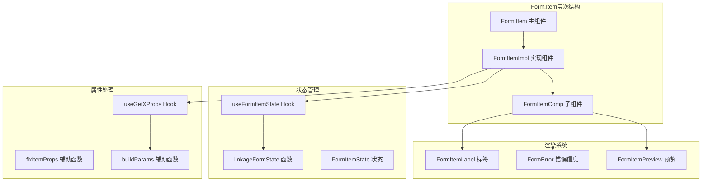
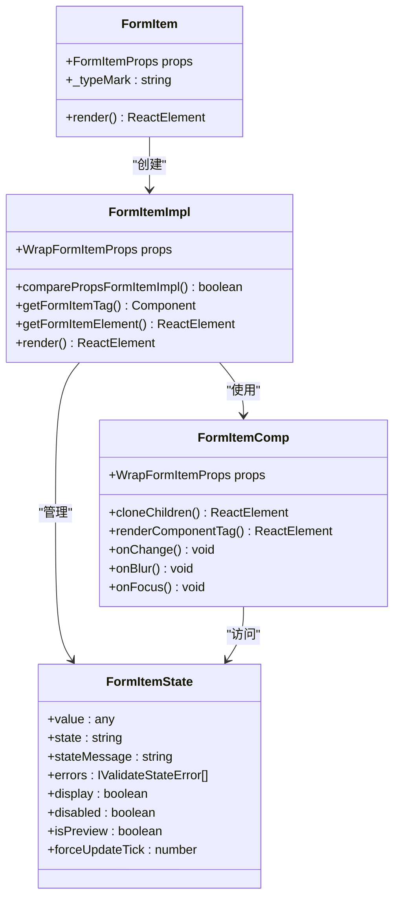
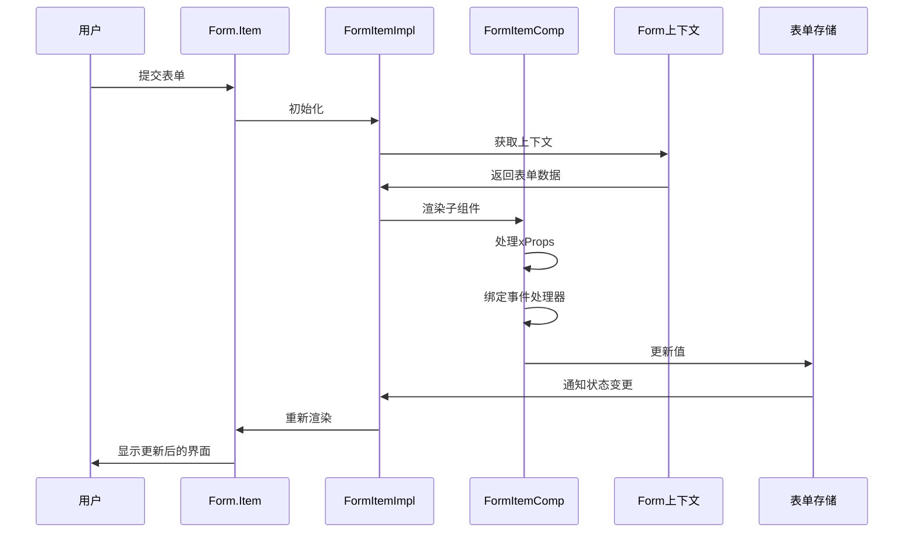
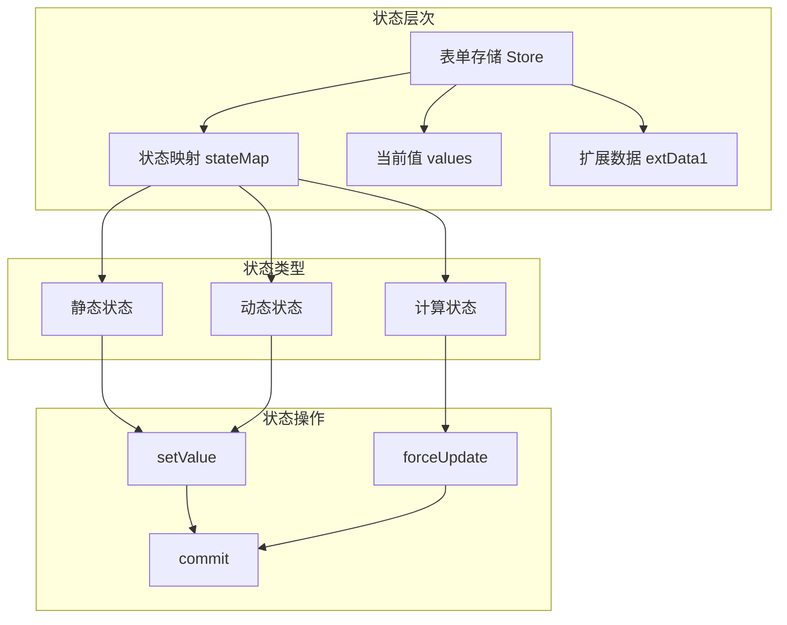
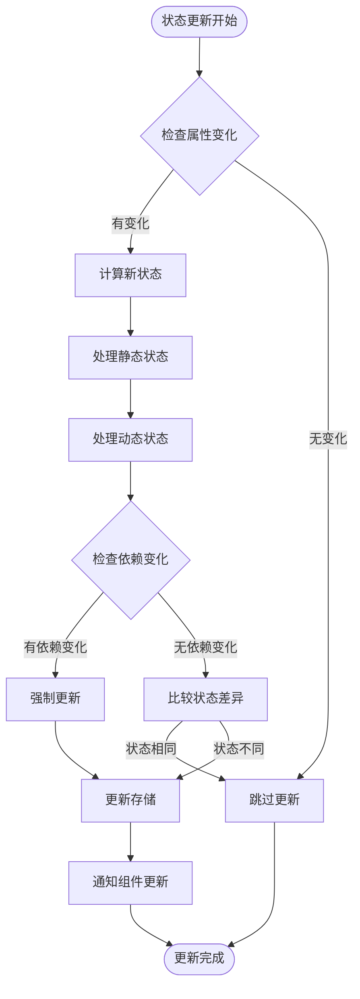
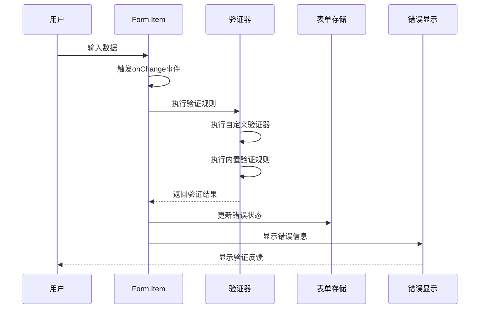
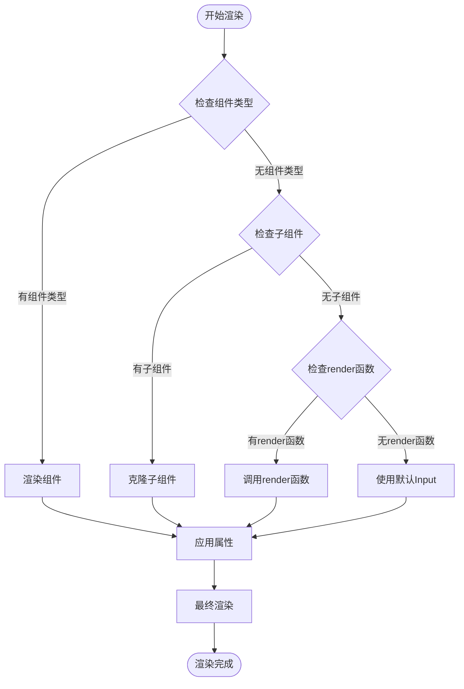

# Form2表单项组件文档

<cite>
**本文档引用的文件**
- [form-item.tsx](file://src/form2/form-item.tsx)
- [form-types.ts](file://src/form2/form-types.ts)
- [useFormItemState.ts](file://src/form2/helper/useFormItemState.ts)
- [useGetXProps.ts](file://src/form2/helper/useGetXProps.ts)
- [form-item-comp.tsx](file://src/form2/form-item-comp.tsx)
- [linkageFormState.ts](file://src/form2/helper/linkageFormState.ts)
- [form-context.ts](file://src/form2/form-context.ts)
- [demo-form2.tsx](file://demo/demo-form2.tsx)
</cite>

## 目录
1. [简介](#简介)
2. [核心架构](#核心架构)
3. [Form.Item组件详解](#formitem组件详解)
4. [属性配置](#属性配置)
5. [状态管理系统](#状态管理系统)
6. [验证机制](#验证机制)
7. [渲染逻辑](#渲染逻辑)
8. [性能优化](#性能优化)
9. [最佳实践](#最佳实践)
10. [故障排除](#故障排除)

## 简介

Form2表单项组件是Fat Design框架中用于构建表单的核心组件，它作为字段连接器，将UI控件与表单状态系统无缝集成。Form.Item不仅负责收集用户输入，还管理验证状态、错误信息展示以及与各种输入组件的兼容性处理。

## 核心架构

Form2表单项组件采用分层架构设计，通过多个辅助函数和钩子实现复杂的表单功能：



**图表来源**
- [form-item.tsx](file://src/form2/form-item.tsx#L1-L191)
- [useFormItemState.ts](file://src/form2/helper/useFormItemState.ts#L1-L68)
- [form-item-comp.tsx](file://src/form2/form-item-comp.tsx#L1-L221)

## Form.Item组件详解

### 组件结构

Form.Item组件采用高阶组件模式，通过包装器模式实现复杂的表单功能：



**图表来源**
- [form-item.tsx](file://src/form2/form-item.tsx#L150-L191)
- [form-item-comp.tsx](file://src/form2/form-item-comp.tsx#L70-L221)
- [form-types.ts](file://src/form2/form-types.ts#L60-L85)

### 核心渲染流程

Form.Item的渲染过程遵循严格的生命周期管理：



**图表来源**
- [form-item.tsx](file://src/form2/form-item.tsx#L150-L191)
- [form-item-comp.tsx](file://src/form2/form-item-comp.tsx#L70-L150)

**章节来源**
- [form-item.tsx](file://src/form2/form-item.tsx#L1-L191)
- [form-item-comp.tsx](file://src/form2/form-item-comp.tsx#L1-L221)

## 属性配置

### 基础属性

Form.Item支持丰富的属性配置，涵盖布局、验证、状态等多个方面：

```typescript
interface FormItemProps extends FormItemSchema {
    name: string;  // 必填：字段名称，用于表单值映射
}

interface FormItemSchema {
    // 布局相关
    label?: string | ReactElement;
    size?: SizeEnum | string;
    labelCol?: any;
    wrapperCol?: any;
    labelAlign?: LabelAlignEnum;
    labelTextAlign?: LabelTextAlignEnum;
    labelWidth?: number;
    colon?: boolean;
    
    // 样式相关
    className?: string;
    style?: React.CSSProperties;
    prefix?: string;
    fullWidth?: boolean;
    
    // 功能相关
    component?: string | ReactComponent;
    children?: any;
    render?: (value: any, childProps: any) => any;
    renderPreview?: (value: any, childProps: any) => any;
    renderExtra?: (value: any, wrapFormItemProps: any) => any;
    
    // 状态控制
    display?: boolean | FnGetStateBool;
    disabled?: boolean | FnGetStateBool;
    isPreview?: boolean | FnGetStateBool;
    
    // 验证相关
    required?: boolean | FnGetStateBool;
    requiredMessage?: string;
    rules?: FormItemValidateRule[];
    validator?: FnValidator;
    helpPos?: TypeHelpPos;
    
    // 数据源
    enums?: ILabelValue[] | FnGetEnums;
    deps?: string[];
    
    // 回调函数
    onChange?: FnFormItemOnChange;
    description?: string;
}
```

### 高级属性详解

#### 1. 条件性渲染属性

```typescript
// 显示控制 - 支持函数式返回
display: boolean | FnGetStateBool;

// 禁用控制 - 支持函数式返回
disabled: boolean | FnGetStateBool;

// 预览模式控制 - 支持函数式返回
isPreview: boolean | FnGetStateBool;

// 必填控制 - 支持函数式返回
required: boolean | FnGetStateBool;
```

#### 2. 数据源属性

```typescript
// 静态枚举值
enums: ILabelValue[];

// 异步枚举值 - 支持Promise
enums: FnGetEnums;

// 依赖追踪 - 当依赖值变化时强制重新渲染
deps: string[];
```

#### 3. 验证规则属性

```typescript
interface FormItemValidateRule {
    message?: string;           // 自定义错误消息
    trigger?: string;           // 触发时机：onChange, onBlur, onFocus
    validator?: FnValidator;    // 自定义验证函数
    minLength?: number;         // 最小长度
    maxLength?: number;         // 最大长度
    min?: number;              // 最小值
    max?: number;              // 最大值
}
```

**章节来源**
- [form-types.ts](file://src/form2/form-types.ts#L100-L200)
- [form-types.ts](file://src/form2/form-types.ts#L250-L350)

## 状态管理系统

### 状态架构

Form.Item采用分层状态管理架构，确保状态的一致性和可预测性：



**图表来源**
- [useFormItemState.ts](file://src/form2/helper/useFormItemState.ts#L20-L45)
- [linkageFormState.ts](file://src/form2/helper/linkageFormState.ts#L1-L96)

### 状态计算机制

Form.Item通过`linkageFormState`函数实现状态的自动计算和同步：

```typescript
// 计算状态联动
function computeStateLinkage(itemState: any, itemProps: any, storeData: any, key: string, expectType: string) {
    if (!itemProps[key]) return;
    
    let result = itemProps[key];
    if (typeof result === "function") {
        result = result(storeData.values, storeData);
        if (typeof result === expectType) {
            itemState[key] = result;
        }
    }
}

// 依赖追踪计算
function computeStateLinkageByDeps(itemState: any, itemProps: FormItemProps, storeData: any) {
    const deps = itemProps.deps;
    if (!deps || !Array.isArray(deps)) {
        itemState.forceUpdateTick = 0;
        return;
    }
    
    const values = storeData.values;
    let forceUpdateTickArray: string[] = [];
    for (let i = 0; i < deps.length; i++) {
        const dep = deps[i];
        forceUpdateTickArray.push(`${i}_${values[dep]||""}`);
    }
    itemState.forceUpdateTick = forceUpdateTickArray.join('-');
}
```

### 状态更新流程



**图表来源**
- [linkageFormState.ts](file://src/form2/helper/linkageFormState.ts#L25-L60)

**章节来源**
- [useFormItemState.ts](file://src/form2/helper/useFormItemState.ts#L1-L68)
- [linkageFormState.ts](file://src/form2/helper/linkageFormState.ts#L1-L96)

## 验证机制

### 验证流程

Form.Item实现了完整的验证机制，支持多种验证方式和触发时机：



**图表来源**
- [form-item-comp.tsx](file://src/form2/form-item-comp.tsx#L100-L150)

### 验证规则类型

#### 1. 内置验证规则

```typescript
// 基础验证规则
interface FormItemValidateRule {
    // 长度限制
    minLength?: number;
    maxLength?: number;
    length?: number;
    
    // 数值范围
    min?: number;
    max?: number;
    
    // 格式验证
    format?: string;  // 如："email", "phone"
    pattern?: string;
    
    // 自定义验证
    validator?: FnValidator;
    message?: string;  // 自定义错误消息
    trigger?: string;  // 触发时机
}
```

#### 2. 自定义验证器

```typescript
type FnValidator = (
    rule: FormItemValidateRule,
    value: any
) => Promise<string | FnValidatorObjRes> | string | FnValidatorObjRes | null;

// 使用示例
const customValidator: FnValidator = async (rule, value) => {
    if (!value) {
        return { message: '不能为空' };
    }
    
    if (value.length < 5) {
        return { message: '至少需要5个字符' };
    }
    
    // 异步验证示例
    const isValid = await checkUniqueValue(value);
    if (!isValid) {
        return { message: '该值已存在' };
    }
    
    return null; // 验证通过
};
```

### 验证触发机制

```typescript
// 验证触发器
const triggerAutoValidate = (triggerName: string) => {
    if (!formItemProps.autoValidate) return;
    
    triggerAutoValidateDebounce(triggerName, formItemProps, formActions);
};

// 事件绑定
const onChange = (nextValue: any, triggerType: any, valueDS: any) => {
    // 更新存储
    formStore.setValue(`values.${name}`, nextValue);
    formOnChange(formStore);
    formStore.commit();
    
    // 触发验证
    triggerAutoValidate('onChange');
};

const onBlur = () => triggerAutoValidate('onBlur');
const onFocus = () => triggerAutoValidate('onFocus');
```

**章节来源**
- [form-item-comp.tsx](file://src/form2/form-item-comp.tsx#L100-L150)
- [form-types.ts](file://src/form2/form-types.ts#L70-L90)

## 渲染逻辑

### 渲染优先级

Form.Item支持三种渲染方式，按照优先级顺序处理：



**图表来源**
- [form-item-comp.tsx](file://src/form2/form-item-comp.tsx#L180-L221)

### 子组件处理

Form.Item通过递归克隆机制处理嵌套子组件：

```typescript
function cloneChildren(children: any, childrenProps: any, formItemProps: FormItemProps) {
    if (typeof children === "function") return null;
    if (!children || children.length === 0) return null;
    
    return React.Children.map(children, (child, idx) => {
        let nextChildren = child.props.children;
        if (nextChildren) {
            nextChildren = cloneChildren(nextChildren, childrenProps, formItemProps);
        }
        
        // 检查组件类型标记
        const typeMark = "" + child.type._typeMark;
        const supportPreview = child.type._supportPreview;
        
        // 预览模式处理
        if (childrenProps.isPreview && !supportPreview) {
            return renderWrapPreview(childrenProps, formItemProps);
        }
        
        // 正常组件处理
        if (child && typeof child === "object" && 
            typeMark !== FORM_ITEM_TYPE_MARK && 
            typeMark.startsWith('FORM_COMP_')) {
            
            const extraProps = Object.assign({}, child.props, {...childrenProps, children: nextChildren});
            return React.cloneElement(child, extraProps);
        }
        
        return React.cloneElement(child, { children: nextChildren });
    });
}
```

### 属性透传机制

Form.Item通过`useGetXProps`钩子实现属性透传：

```typescript
function useGetXProps(formItemProps: FormItemProps, formItemState: FormItemState, formContext: IFormContext): any {
    const formStore = formContext.formStore;
    const formActions = formContext.formActions as FormActions;
    
    // 获取基础xProps
    let xProps = getXprops(formItemProps, formItemState);
    if (!xProps || typeof xProps !== "object") {
        xProps = {};
    }
    
    // 合并动态xProps
    const xProps2 = formItemState.xProps;
    if (xProps2 && typeof xProps2 === "object") {
        Object.assign(xProps, xProps2);
    }
    
    // 特殊处理：添加onSearch函数
    const {filterLocal, showSearch} = xProps;
    const xPropsClone = {...xProps};
    
    if (filterLocal === false && showSearch === true) {
        xPropsClone.onSearch = (value: any, event: any) => {
            const params = buildFnFormOnChangeParams(formStore, formActions);
            params.valuesOfOnSearch[formItemProps.name] = value;
            
            if (typeof xProps.onSearch === "function") {
                xProps.onSearch(value, {
                    event: event,
                    xProps: xPropsClone,
                    ...params,
                });
            }
            
            formActions.forceUpdate(formItemProps.name);
        };
    }
    
    return xPropsClone;
}
```

**章节来源**
- [form-item-comp.tsx](file://src/form2/form-item-comp.tsx#L25-L70)
- [useGetXProps.ts](file://src/form2/helper/useGetXProps.ts#L1-L62)

## 性能优化

### 渲染优化策略

Form.Item采用多种性能优化技术确保高效渲染：

#### 1. React.memo优化

```typescript
const FormItemImpl = React.memo((props: WrapFormItemProps) => {
    // 组件实现
}, comparePropsFormItemImpl);

function comparePropsFormItemImpl(prevProps: WrapFormItemProps, nextProps: WrapFormItemProps) {
    const formItemProps = prevProps.formItemProps;
    const formItemState = prevProps.formItemState;
    const formComponents = prevProps.formContext.formComponents;
    
    const formItemProps2 = nextProps.formItemProps;
    const formItemState2 = nextProps.formItemState;
    const formComponents2 = nextProps.formContext.formComponents;
    
    return deepEqual(formItemProps, formItemProps2, true) &&
           deepEqual(formItemState, formItemState2) &&
           isComponentsStoreEquals(formComponents, formComponents2);
}
```

#### 2. 防抖处理

```typescript
const triggerAutoValidateDebounce = debounce((triggerName: string, formItemProps: FormItemProps, formActions: FormActions) => {
    const name = formItemProps.name;
    formActions.validateFromItemByTrigger(name, triggerName);
}, 100);
```

#### 3. 条件渲染优化

```typescript
// 预览模式下的条件渲染
if (display === false) {
    return null;  // 跳过渲染
}

// 状态判断优化
const {state, isPreview, display } = formItemState;
if (display === false) {
    return null;
}
```

### 内存管理

Form.Item通过精确的状态订阅减少不必要的内存占用：

```typescript
// 使用精确值订阅
const [value] = usePreciseValue(formContext.formStore, `values.${name}`);
const [itemState] = usePreciseValue(formContext.formStore, `stateMap.${name}`);

// 依赖追踪优化
computeStateLinkageByDeps(itemState, itemProps, storeData);
```

**章节来源**
- [form-item.tsx](file://src/form2/form-item.tsx#L80-L120)
- [useFormItemState.ts](file://src/form2/helper/useFormItemState.ts#L20-L45)

## 最佳实践

### 1. 组件选择指南

```typescript
// 基础输入
<FormItem 
    label="用户名"
    name="username"
    component="Input"
    required
/>

// 下拉选择
<FormItem 
    label="性别"
    name="gender"
    component="Select"
    enums={[
        { label: '男', value: 'male' },
        { label: '女', value: 'female' }
    ]}
/>

// 复杂组件
<FormItem 
    label="日期范围"
    name="dateRange"
    component="RangePicker"
    xProps={{
        mode: 'date',
        format: 'YYYY-MM-DD'
    }}
/>
```

### 2. 验证规则配置

```typescript
// 多重验证规则
<FormItem 
    label="邮箱"
    name="email"
    component="Input"
    required
    rules={[
        { 
            validator: async (rule, value) => {
                if (!value) return null;
                const isValid = await validateEmailFormat(value);
                if (!isValid) {
                    return { message: '邮箱格式不正确' };
                }
                return null;
            }
        },
        { 
            validator: async (rule, value) => {
                if (!value) return null;
                const isUnique = await checkEmailUnique(value);
                if (!isUnique) {
                    return { message: '该邮箱已被注册' };
                }
                return null;
            }
        }
    ]}
/>
```

### 3. 动态状态管理

```typescript
// 条件显示
<FormItem 
    label="附加信息"
    name="additionalInfo"
    component="Input"
    display={(values) => values.hasAdditional}
/>

// 动态禁用
<FormItem 
    label="密码确认"
    name="confirmPassword"
    component="Input"
    disabled={(values) => !values.requireConfirm}
/>

// 依赖联动
<FormItem 
    label="子选项"
    name="subOption"
    component="Select"
    enums={(childProps, params) => {
        const parentValue = params.values.parentOption;
        return loadSubOptions(parentValue);
    }}
    deps={['parentOption']}
/>
```

### 4. 性能优化建议

```typescript
// 避免在render中直接定义组件
// ❌ 不推荐
const renderFormItem = () => (
    <FormItem 
        label="动态内容"
        name="dynamic"
        component="Input"
        render={() => <CustomComponent />}
    />
);

// ✅ 推荐
const CustomComponent = React.memo(() => {
    return <div>自定义组件</div>;
});

<FormItem 
    label="动态内容"
    name="dynamic"
    component="Input"
    render={() => <CustomComponent />}
/>
```

## 故障排除

### 常见问题及解决方案

#### 1. 验证不生效

**问题描述**: 设置了验证规则但验证不触发

**可能原因**:
- `autoValidate`未启用
- 验证规则配置错误
- 触发时机设置不当

**解决方案**:
```typescript
// 确保启用自动验证
<Form autoValidate={true}>
    <FormItem 
        label="测试"
        name="test"
        component="Input"
        rules={[
            { 
                validator: (rule, value) => {
                    if (!value) return { message: '必填项' };
                    return null;
                },
                trigger: 'onChange'  // 确保触发时机
            }
        ]}
    />
</Form>
```

#### 2. 状态更新异常

**问题描述**: 状态变化后界面没有更新

**可能原因**:
- 依赖追踪配置错误
- 状态计算函数返回值类型错误

**解决方案**:
```typescript
// 正确的状态计算函数
display: (values) => {
    // 确保返回布尔值
    return !!values.someCondition;
}

// 正确的依赖配置
deps: ['dependentField']  // 确保依赖字段名正确
```

#### 3. 性能问题

**问题描述**: 表单渲染缓慢或卡顿

**可能原因**:
- 过多的依赖追踪
- 复杂的渲染函数
- 不必要的重新渲染

**解决方案**:
```typescript
// 优化渲染函数
const memoizedRender = useCallback((value, childProps) => {
    return <OptimizedComponent value={value} />;
}, []);

<FormItem 
    label="优化内容"
    name="optimized"
    component="Input"
    render={memoizedRender}
/>

// 减少依赖数量
deps: ['importantField']  // 只保留关键依赖
```

#### 4. 类型错误

**问题描述**: TypeScript类型检查报错

**常见错误及解决**:
```typescript
// 错误：组件类型不匹配
<FormItem 
    label="错误组件"
    name="test"
    component={SomeComponent}  // SomeComponent不是标准组件
/>

// 解决：使用标准组件名称
<FormItem 
    label="正确组件"
    name="test"
    component="Input"  // 使用字符串组件名
/>
```

### 调试技巧

#### 1. 启用调试日志

```typescript
// 在开发环境中启用详细日志
import { log } from '../util';

log.debug('render FormItemImpl : ' + formItemProps.name);
```

#### 2. 状态监控

```typescript
// 监控状态变化
useEffect(() => {
    console.log('FormItem状态更新:', {
        name: formItemProps.name,
        value: formItemState.value,
        state: formItemState.state,
        errors: formItemState.errors
    });
}, [formItemState]);
```

#### 3. 性能分析

```typescript
// 性能监控
const startTime = performance.now();
// 组件渲染逻辑
const endTime = performance.now();
console.log(`FormItem渲染耗时: ${endTime - startTime}ms`);
```

**章节来源**
- [form-item.tsx](file://src/form2/form-item.tsx#L150-L191)
- [form-item-comp.tsx](file://src/form2/form-item-comp.tsx#L100-L150)