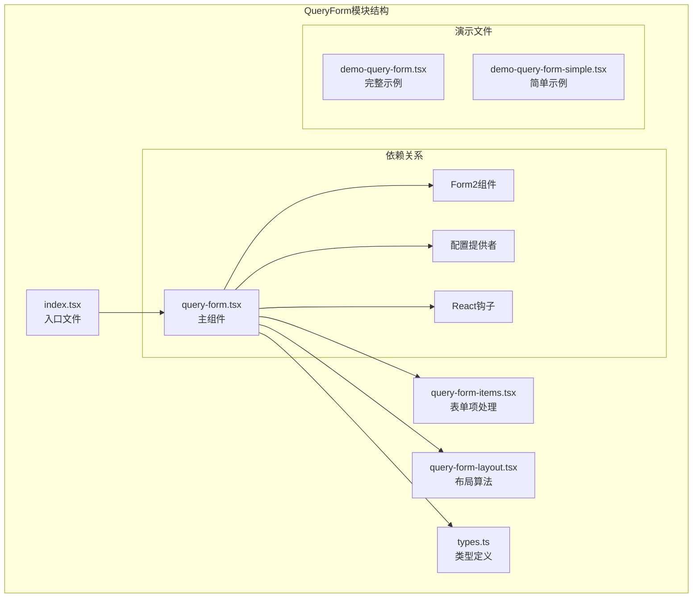
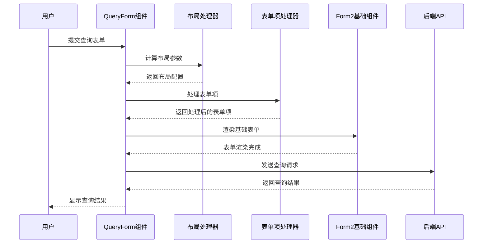
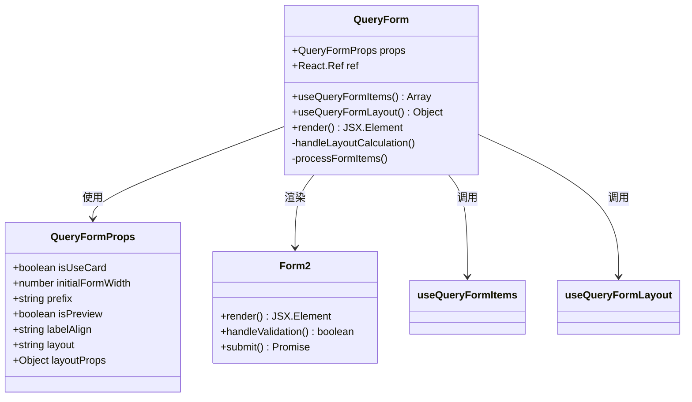
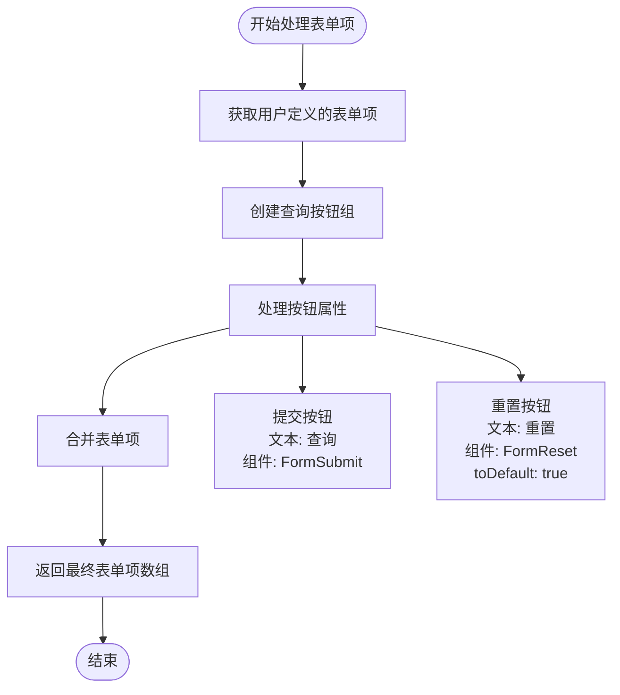
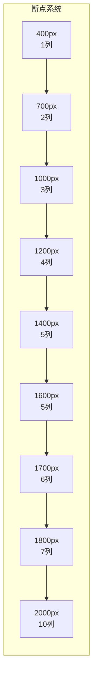
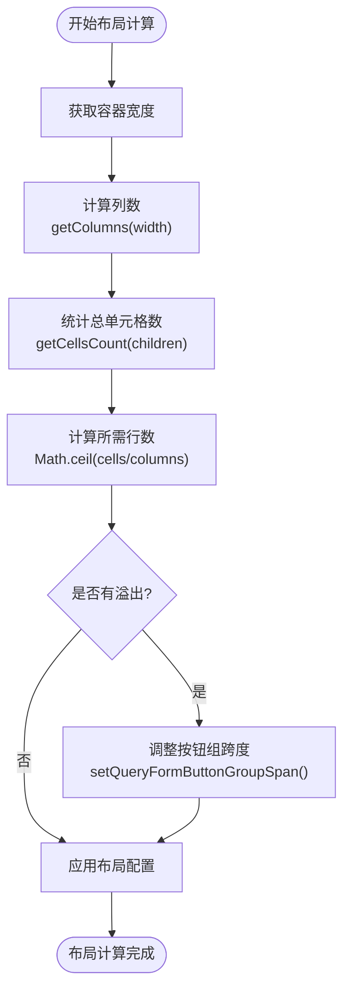
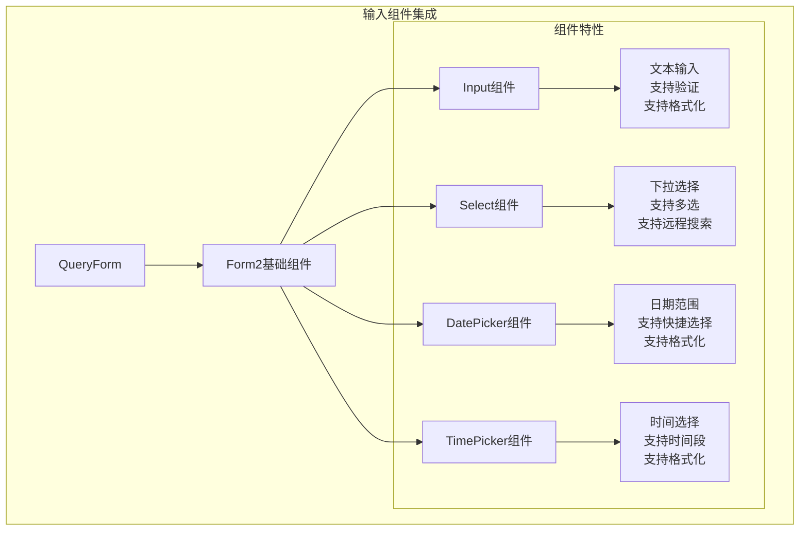
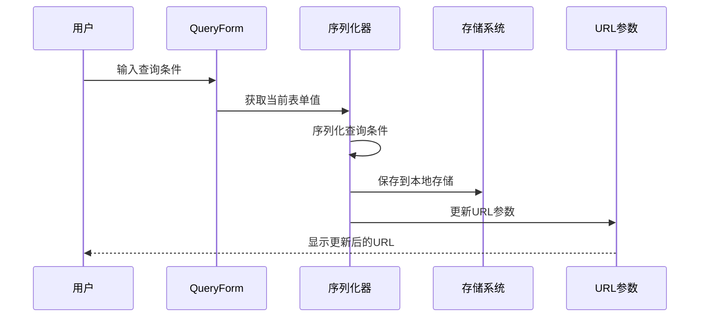
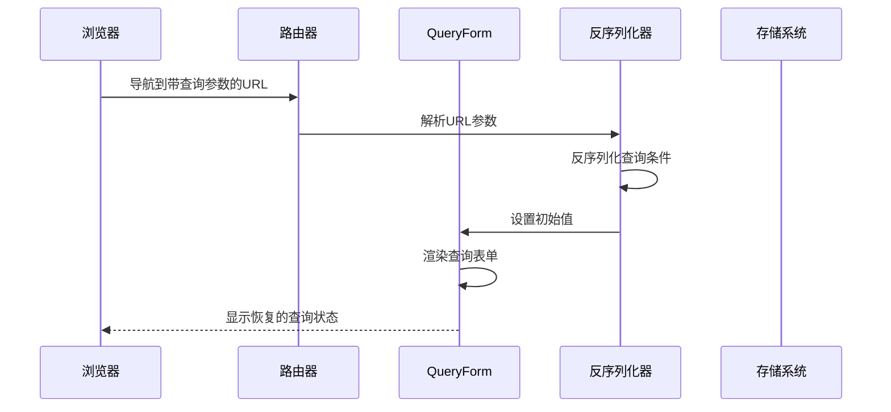
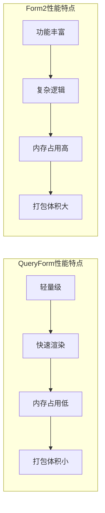

# QueryForm 查询表单

<cite>
**本文档中引用的文件**
- [src/query-form/index.tsx](file://src/query-form/index.tsx)
- [src/query-form/query-form.tsx](file://src/query-form/query-form.tsx)
- [src/query-form/query-form-items.tsx](file://src/query-form/query-form-items.tsx)
- [src/query-form/query-form-layout.tsx](file://src/query-form/query-form-layout.tsx)
- [src/query-form/types.ts](file://src/query-form/types.ts)
- [demo/demo-query-form.tsx](file://demo/demo-query-form.tsx)
- [demo/demo-query-form-simple.tsx](file://demo/demo-query-form-simple.tsx)
- [src/form2/form.tsx](file://src/form2/form.tsx)
- [src/filter/filter.tsx](file://src/filter/filter.tsx)
</cite>

## 目录
1. [简介](#简介)
2. [项目结构](#项目结构)
3. [核心组件](#核心组件)
4. [架构概览](#架构概览)
5. [详细组件分析](#详细组件分析)
6. [自动布局算法](#自动布局算法)
7. [查询字段类型与操作符](#查询字段类型与操作符)
8. [序列化与反序列化机制](#序列化与反序列化机制)
9. [与Form2的对比分析](#与form2的对比分析)
10. [性能优化建议](#性能优化建议)
11. [故障排除指南](#故障排除指南)
12. [结论](#结论)

## 简介

QueryForm是Fat Design组件库中的智能查询表单组件，专为构建动态查询界面而设计。它提供了自动布局、响应式断点系统、多种查询字段类型支持以及与后端API的无缝数据交互能力。QueryForm继承了Form2的强大功能，同时针对查询场景进行了专门优化，使开发者能够快速构建功能丰富的查询界面。

QueryForm的核心设计理念是简化查询表单的开发流程，通过智能的布局算法和灵活的配置选项，让开发者能够专注于业务逻辑而非复杂的UI实现。它支持从简单的单字段查询到复杂的多维度组合查询，适用于各种数据筛选和搜索场景。

## 项目结构

QueryForm组件位于`src/query-form/`目录下，采用模块化设计，主要包含以下核心文件：



**图表来源**
- [src/query-form/index.tsx](file://src/query-form/index.tsx#L1-L6)
- [src/query-form/query-form.tsx](file://src/query-form/query-form.tsx#L1-L68)

**章节来源**
- [src/query-form/index.tsx](file://src/query-form/index.tsx#L1-L6)
- [src/query-form/query-form.tsx](file://src/query-form/query-form.tsx#L1-L68)

## 核心组件

QueryForm的核心组件体系由以下几个关键部分组成：

### 主组件 (QueryForm)
QueryForm是整个组件的入口点，负责协调各个子组件的工作。它接收配置参数，管理状态，并将处理后的数据传递给底层的Form2组件。

### 表单项处理器 (useQueryFormItems)
这个函数负责处理查询表单的表单项，包括动态生成查询按钮组和整合用户定义的表单项。

### 布局处理器 (useQueryFormLayout)
实现了智能的响应式布局算法，根据屏幕宽度自动调整列数和表单项排列。

### 类型定义 (QueryFormProps)
定义了组件的所有属性接口，确保类型安全和良好的开发体验。

**章节来源**
- [src/query-form/query-form.tsx](file://src/query-form/query-form.tsx#L1-L68)
- [src/query-form/query-form-items.tsx](file://src/query-form/query-form-items.tsx#L1-L54)
- [src/query-form/query-form-layout.tsx](file://src/query-form/query-form-layout.tsx#L1-L108)

## 架构概览

QueryForm采用了分层架构设计，将功能模块化以便于维护和扩展：



**图表来源**
- [src/query-form/query-form.tsx](file://src/query-form/query-form.tsx#L10-L45)
- [src/query-form/query-form-layout.tsx](file://src/query-form/query-form-layout.tsx#L60-L107)

## 详细组件分析

### QueryForm主组件分析

QueryForm主组件是整个查询表单的核心控制器，它负责协调各个子组件的工作并管理整体的状态。



**图表来源**
- [src/query-form/query-form.tsx](file://src/query-form/query-form.tsx#L10-L45)
- [src/query-form/types.ts](file://src/query-form/types.ts#L1-L8)

QueryForm的主要特性包括：

1. **智能布局计算**：根据容器宽度自动调整列数
2. **表单项处理**：动态生成查询按钮组
3. **样式定制**：支持卡片式和普通布局模式
4. **响应式设计**：适配不同屏幕尺寸

### 表单项处理器分析

表单项处理器负责处理查询表单的表单项，包括动态生成查询按钮组和整合用户定义的表单项。



**图表来源**
- [src/query-form/query-form-items.tsx](file://src/query-form/query-form-items.tsx#L10-L35)

**章节来源**
- [src/query-form/query-form-items.tsx](file://src/query-form/query-form-items.tsx#L1-L54)

## 自动布局算法

QueryForm的自动布局算法是其核心功能之一，它能够根据屏幕尺寸动态调整表单项的排列方式。

### 响应式断点系统

布局算法基于预定义的断点系统，每个断点对应特定的列数：



**图表来源**
- [src/query-form/query-form-layout.tsx](file://src/query-form/query-form-layout.tsx#L8-L20)

### 布局计算流程



**图表来源**
- [src/query-form/query-form-layout.tsx](file://src/query-form/query-form-layout.tsx#L60-L107)

### 动态按钮组调整

当表单项数量不足以填满所有列时，布局算法会自动调整查询按钮组的跨度，确保界面美观：

```typescript
// 动态调整按钮组跨度的实现
function setQueryFormButtonGroupSpan(children: any, addedCellsCount: number) {
    for (let i = 0; i < children.length; i++) {
        const child = children[i];
        if (child && child.props && child.props.name === 'QueryFormButtonGroup') {
            const newProps = {...child.props};
            const colSpan = _get(newProps, 'cellProps.colSpan', 1);
            _set(newProps, 'cellProps.colSpan', colSpan + addedCellsCount);
            children[i] = React.cloneElement(child, newProps);
        }
    }
}
```

**章节来源**
- [src/query-form/query-form-layout.tsx](file://src/query-form/query-form-layout.tsx#L1-L108)

## 查询字段类型与操作符

QueryForm支持多种查询字段类型，每种类型都针对不同的数据筛选需求进行了优化。

### 支持的查询字段类型

1. **文本输入 (Input)**
   - 用于字符串匹配查询
   - 支持模糊匹配和精确匹配
   - 可配置验证规则

2. **下拉选择 (Select)**
   - 单选和多选支持
   - 动态选项加载
   - 远程搜索功能

3. **日期选择 (DatePicker)**
   - 单日期和日期范围选择
   - 预设时间范围快捷选择
   - 日期格式化处理

4. **时间选择 (TimePicker)**
   - 时间段选择
   - 时间格式验证
   - 时区处理

### 操作符选择机制

虽然QueryForm本身不直接提供操作符选择器，但它通过Schema配置支持多种操作符：

```typescript
// 示例Schema配置
const schema = {
    type: 'object',
    properties: {
        username: {
            label: '用户名',
            component: 'Input',
            required: true,
            // 支持的操作符可以通过onChange事件处理
        },
        status: {
            label: '状态',
            component: 'Select',
            enums: [
                {label: '启用', value: 'active'},
                {label: '禁用', value: 'inactive'}
            ],
        }
    }
};
```

### 值输入组件集成

QueryForm通过Form2组件系统实现与各种输入组件的无缝集成：



**章节来源**
- [demo/demo-query-form.tsx](file://demo/demo-query-form.tsx#L10-L80)

## 序列化与反序列化机制

QueryForm提供了完整的查询条件序列化与反序列化机制，确保查询状态能够在页面刷新或路由跳转时得到正确保存和恢复。

### 查询条件序列化



### 反序列化与状态恢复



### 数据交互机制

QueryForm与后端API的数据交互遵循标准的RESTful规范：

```typescript
// 查询提交处理
const onSubmit = (values: any, formActions: any) => {
    return new Promise((resolve, reject) => {
        // 构建查询参数
        const queryParams = {
            ...values,
            page: paginationProps.current,
            pageSize: paginationProps.pageSize
        };
        
        // 发送查询请求
        api.query(queryParams)
            .then((response) => {
                // 处理响应数据
                resolve(response.data);
            })
            .catch((error) => {
                reject(error);
            });
    });
};
```

**章节来源**
- [demo/demo-query-form.tsx](file://demo/demo-query-form.tsx#L80-L100)

## 与Form2的对比分析

QueryForm与Form2存在显著差异，各自适用于不同的使用场景。

### 功能对比矩阵

| 特性 | QueryForm | Form2 |
|------|-----------|-------|
| 专用查询场景 | ✓ | ✗ |
| 自动布局算法 | ✓ | ✗ |
| 响应式断点系统 | ✓ | ✗ |
| 查询按钮组 | ✓ | ✗ |
| 卡片式布局 | ✓ | ✗ |
| Schema驱动 | ✗ | ✓ |
| 表单验证 | ✗ | ✓ |
| 动态表单 | ✗ | ✓ |

### 设计理念差异


### 适用场景分析

**QueryForm适用场景：**
- 数据查询和筛选界面
- 快速构建查询表单
- 移动端和桌面端适配
- 简单到中等复杂度的查询需求

**Form2适用场景：**
- 表单填写和编辑
- 复杂的表单验证逻辑
- 动态表单生成
- 企业级表单应用

### 性能对比



**章节来源**
- [src/query-form/query-form.tsx](file://src/query-form/query-form.tsx#L45-L68)
- [src/form2/form.tsx](file://src/form2/form.tsx#L1-L182)

## 性能优化建议

为了充分发挥QueryForm的性能优势，建议遵循以下优化策略：

### 渲染性能优化

1. **合理使用initialFormWidth**
```typescript
// 推荐：提供初始宽度避免闪烁
<QueryForm 
    initialFormWidth={800}
    schema={schema}
/>
```

2. **避免不必要的重新渲染**
```typescript
// 使用useCallback包装回调函数
const handleSubmit = useCallback((values) => {
    // 处理查询逻辑
}, []);
```

### 内存优化策略

1. **及时清理事件监听器**
```typescript
useEffect(() => {
    return () => {
        // 清理资源
    };
}, []);
```

2. **合理使用缓存**
```typescript
// 缓存计算结果
const memoizedLayout = useMemo(() => {
    return calculateLayout(width);
}, [width]);
```

### 网络性能优化

1. **防抖查询提交**
```typescript
const debouncedSubmit = useDebounce((values) => {
    onSubmit(values);
}, 300);
```

2. **批量查询优化**
```typescript
// 批量处理查询条件变化
const batchUpdate = useCallback((updates) => {
    // 批量更新状态
}, []);
```

## 故障排除指南

### 常见问题及解决方案

**问题1：布局计算失败**
- **症状**：表单无法正确显示或布局错乱
- **原因**：容器宽度计算异常
- **解决方案**：检查父容器的CSS样式，确保有明确的宽度设置

**问题2：查询按钮组位置异常**
- **症状**：查询按钮组不在预期位置
- **原因**：表单项数量不足导致的自动调整
- **解决方案**：增加表单项数量或手动设置colSpan属性

**问题3：响应式断点不生效**
- **症状**：屏幕尺寸变化时布局没有相应调整
- **原因**：initialFormWidth设置不当
- **解决方案**：移除initialFormWidth或设置合理的初始值

### 调试技巧

1. **启用调试日志**
```typescript
// 在开发环境中启用详细日志
logger.setLevel('debug');
```

2. **使用React DevTools**
- 检查组件树结构
- 分析组件性能
- 查看组件状态

3. **网络请求监控**
- 使用浏览器开发者工具
- 监控API请求频率
- 分析响应时间

**章节来源**
- [src/query-form/query-form-layout.tsx](file://src/query-form/query-form-layout.tsx#L60-L107)

## 结论

QueryForm作为Fat Design组件库中的智能查询表单组件，为开发者提供了一个强大而灵活的查询界面构建工具。通过其自动布局算法、响应式断点系统和丰富的查询字段类型支持，QueryForm能够满足各种复杂的查询需求。

### 主要优势

1. **智能化布局**：自动适应不同屏幕尺寸，提供最佳用户体验
2. **简洁易用**：通过Schema配置即可快速构建查询表单
3. **性能优异**：轻量级设计，渲染速度快，内存占用低
4. **扩展性强**：支持自定义查询字段和操作符
5. **与Form2深度集成**：充分利用Form2的强大功能

### 最佳实践建议

1. **合理选择使用场景**：对于简单的查询需求优先考虑QueryForm
2. **优化性能配置**：正确设置initialFormWidth等参数
3. **充分利用响应式特性**：设计时考虑移动端适配
4. **注意错误处理**：完善查询失败的处理逻辑
5. **持续性能监控**：定期检查组件性能表现

QueryForm将继续演进，未来可能会增加更多高级功能，如查询历史记录、查询模板等功能，进一步提升查询体验和开发效率。