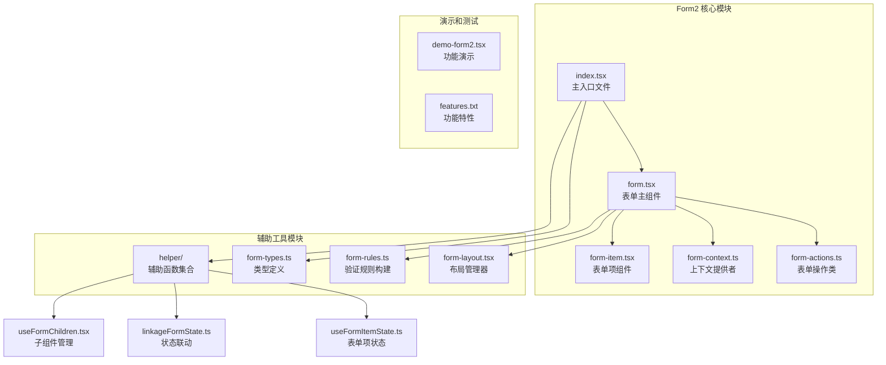
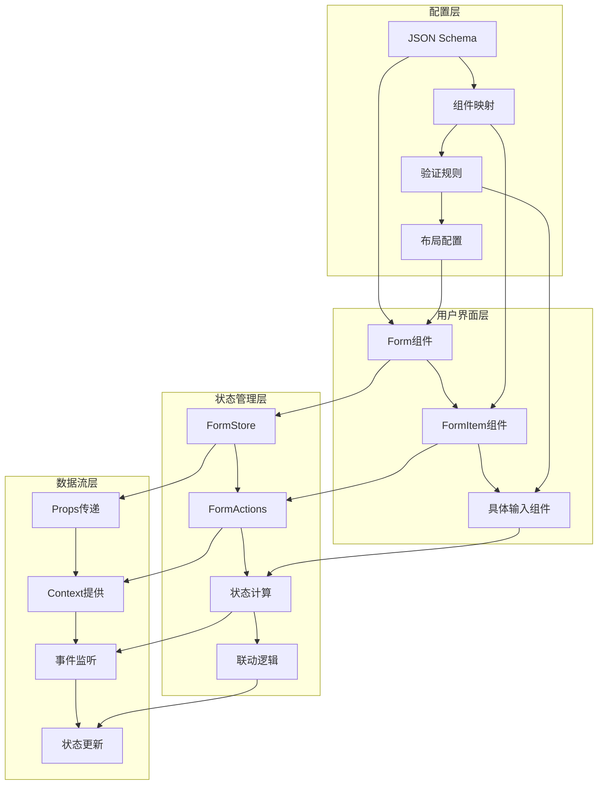
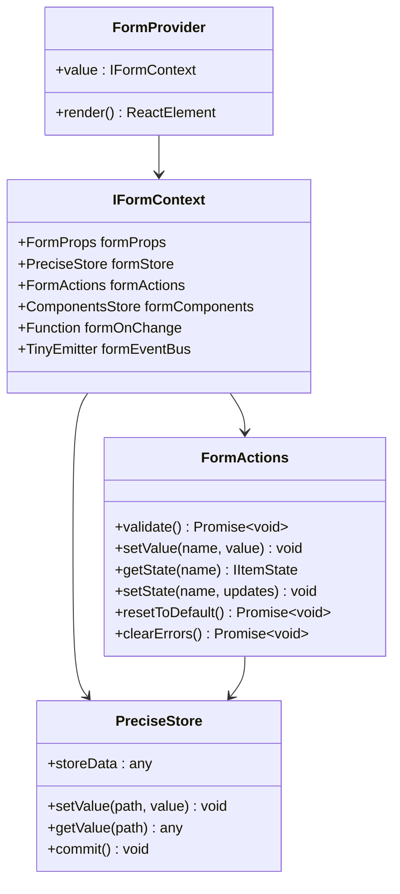
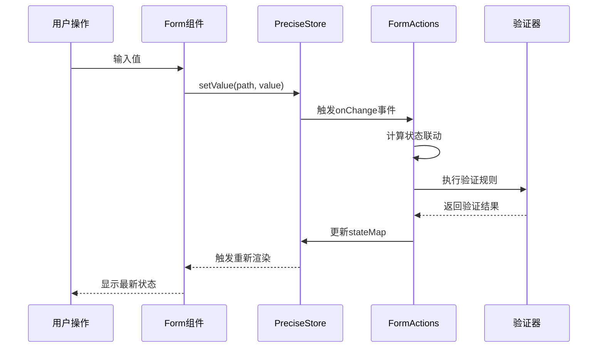
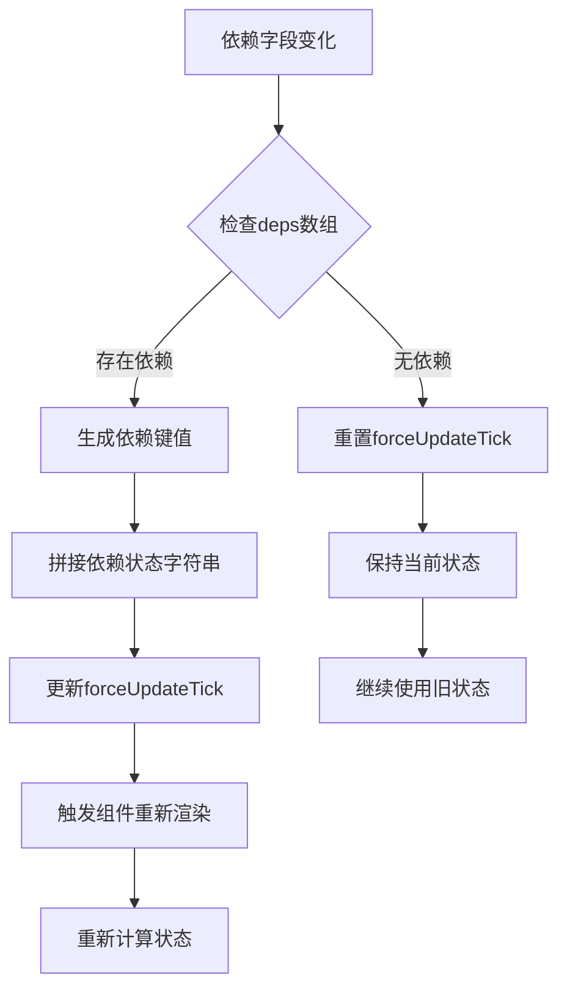
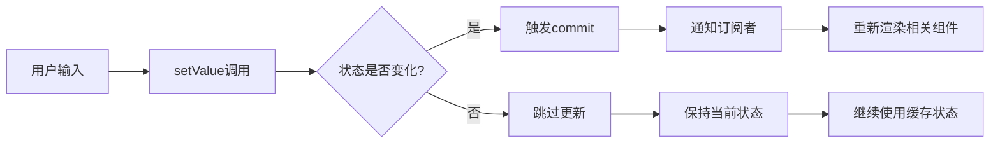

# Form2高级表单系统技术文档

<cite>
**本文档引用的文件**
- [src/form2/index.tsx](file://src/form2/index.tsx)
- [src/form2/form.tsx](file://src/form2/form.tsx)
- [src/form2/form-types.ts](file://src/form2/form-types.ts)
- [src/form2/form-item.tsx](file://src/form2/form-item.tsx)
- [src/form2/helper/useFormChildren.tsx](file://src/form2/helper/useFormChildren.tsx)
- [src/form2/helper/linkageFormState.ts](file://src/form2/helper/linkageFormState.ts)
- [src/form2/form-actions.ts](file://src/form2/form-actions.ts)
- [src/form2/form-context.ts](file://src/form2/form-context.ts)
- [src/form2/form-rules.ts](file://src/form2/form-rules.ts)
- [demo/demo-form2.tsx](file://demo/demo-form2.tsx)
</cite>

## 目录
1. [简介](#简介)
2. [项目结构](#项目结构)
3. [核心组件](#核心组件)
4. [架构概览](#架构概览)
5. [详细组件分析](#详细组件分析)
6. [表单状态管理](#表单状态管理)
7. [字段联动机制](#字段联动机制)
8. [JSON Schema配置](#json-schema配置)
9. [性能优化](#性能优化)
10. [最佳实践](#最佳实践)
11. [故障排除指南](#故障排除指南)
12. [总结](#总结)

## 简介

Form2是Fat Design框架中一个功能强大的高级表单系统，采用基于schema的声明式表单构建方式。它提供了完整的表单状态管理、字段联动逻辑、嵌套字段处理和动态字段生成能力。Form2不仅支持传统的受控组件模式，还引入了创新的声明式配置方法，使开发者能够通过JSON配置动态生成复杂的表单界面。

该系统的核心特点包括：
- 基于React Hooks的响应式状态管理
- 完整的表单验证体系
- 灵活的字段联动和条件渲染
- 支持JSON Schema动态生成表单
- 高度可扩展的组件架构
- 优秀的性能表现和内存管理

## 项目结构

Form2组件系统采用了模块化的目录结构，每个模块都有明确的职责分工：



**图表来源**
- [src/form2/index.tsx](file://src/form2/index.tsx#L1-L33)
- [src/form2/form.tsx](file://src/form2/form.tsx#L1-L50)
- [src/form2/form-item.tsx](file://src/form2/form-item.tsx#L1-L30)

**章节来源**
- [src/form2/index.tsx](file://src/form2/index.tsx#L1-L33)
- [src/form2/form.tsx](file://src/form2/form.tsx#L1-L182)

## 核心组件

### Form 主组件

Form组件是整个表单系统的核心，负责协调各个子组件的工作。它继承自React.Component，并提供了丰富的静态方法和实例属性。

```typescript
// Form组件的主要结构
class Form extends React.Component<FormProps, any> {
    static Item: typeof FormItem = FormItem;
    static ItemCard: typeof FormItemCard = FormItemCard;
    static Section: typeof FormSection = FormSection
    static Submit: typeof Submit = Submit;
    static Reset: typeof Reset = Reset;
    static Button: typeof FormButton = FormButton;
    static ButtonGroup: typeof FormButtonGroup = FormButtonGroup;
    
    static schemaToFormItems = (schema: any) => {
        return schemaToFormItems(schema, FormItem)
    };
    static useFormChildren = (props: FormProps) => {
        return useFormChildren(props, FormItem);
    }
}
```

### FormItem 表单项组件

FormItem组件负责渲染单个表单字段，包含标签、输入组件、错误提示等功能。它支持多种布局方式和状态控制。

```typescript
// FormItem的核心渲染逻辑
const FormItemImpl = React.memo((props: WrapFormItemProps) => {
    const {formItemProps, formItemState} = props;
    
    // 条件渲染处理
    if (display === false) {
        return null;
    }
    
    // 动态类名生成
    const itemClassName = classNames({
        [`${prefix}form-item`]: true,
        [`${prefix}${labelAlign}`]: labelAlign,
        [`has-${state}`]: !!state,
        [`${prefix}${size}`]: !!size,
        [`${prefix}form-item-fullwidth`]: fullWidth,
    });
    
    return (
        <FormItemTag {...cellProps} className={itemClassName} style={style}>
            {labelAlign === 'inset' ? null : getFormItemLabel(formItemProps, formItemState)}
            {getFormItemElement(props)}
        </FormItemTag>
    );
});
```

**章节来源**
- [src/form2/index.tsx](file://src/form2/index.tsx#L8-L25)
- [src/form2/form-item.tsx](file://src/form2/form-item.tsx#L80-L120)

## 架构概览

Form2采用了分层架构设计，从底层的数据存储到顶层的用户界面，每一层都有明确的职责：



**图表来源**
- [src/form2/form.tsx](file://src/form2/form.tsx#L50-L100)
- [src/form2/form-actions.ts](file://src/form2/form-actions.ts#L1-L50)

### 核心设计原则

1. **单一职责原则**：每个组件只负责一个特定的功能领域
2. **开放封闭原则**：对扩展开放，对修改封闭
3. **依赖倒置原则**：高层模块不依赖低层模块的具体实现
4. **接口隔离原则**：提供最小化的接口契约

## 详细组件分析

### 表单上下文系统

Form2使用React Context API来管理全局状态和共享数据：



**图表来源**
- [src/form2/form-types.ts](file://src/form2/form-types.ts#L400-L420)
- [src/form2/form.tsx](file://src/form2/form.tsx#L120-L150)

### 表单项状态管理

每个表单项都维护自己的状态，包括值、验证状态、显示状态等：

```typescript
// 表单项状态接口定义
export interface FormItemState extends FormItemStateSaved {
    value: any;           // 当前值
    state?: string;       // 状态标识(error/warning/ok)
    stateMessage?: string; // 状态消息
}

export interface FormItemStateSaved {
    errors?: any[];      // 验证错误
    required: boolean;   // 是否必填
    display: boolean;    // 是否显示
    disabled: boolean;   // 是否禁用
    isPreview: boolean;  // 是否预览模式
    label: string;       // 标签文本
    xProps?: any;        // 扩展属性
    forceUpdateTick?: number; // 强制更新标记
}
```

**章节来源**
- [src/form2/form-types.ts](file://src/form2/form-types.ts#L50-L80)
- [src/form2/form-actions.ts](file://src/form2/form-actions.ts#L1-L50)

## 表单状态管理

### 状态存储机制

Form2使用PreciseStore来管理表单状态，这是一种高性能的状态管理方案：



**图表来源**
- [src/form2/form.tsx](file://src/form2/form.tsx#L80-L120)
- [src/form2/form-actions.ts](file://src/form2/form-actions.ts#L50-L100)

### 状态联动计算

Form2实现了智能的状态联动机制，可以根据表单值的变化自动更新其他字段的状态：

```typescript
// 状态联动的核心逻辑
function linkageFormItemState(formStore: PreciseStore, itemProps: FormItemProps) {
    const storeData = formStore.storeData;
    const name = itemProps.name;
    const oldState = _get(storeData, 'stateMap.' + name) || {};
    const itemState = {...oldState};
    
    // 计算各种状态属性
    computeStateLinkage(itemState, itemProps, storeData, 'label', 'string');
    computeStateLinkage(itemState, itemProps, storeData, 'required', 'boolean');
    computeStateLinkage(itemState, itemProps, storeData, 'display', 'boolean');
    computeStateLinkage(itemState, itemProps, storeData, 'disabled', 'boolean');
    computeStateLinkage(itemState, itemProps, storeData, 'isPreview', 'boolean');
    computeStateLinkage(itemState, itemProps, storeData, 'xProps', 'object');
    
    // 依赖关系处理
    computeStateLinkageByDeps(itemState, itemProps, storeData);
    
    // 状态变更检测
    if (!deepEqual(oldState, itemState)) {
        formStore.setValue('stateMap.' + name, itemState)
    }
}
```

**章节来源**
- [src/form2/helper/linkageFormState.ts](file://src/form2/helper/linkageFormState.ts#L40-L80)

## 字段联动机制

### 函数式状态控制

Form2支持通过函数返回值来动态控制字段状态，这是其最强大的特性之一：

```typescript
// 字段联动的实际应用示例
const onChange = (values: any, {stateMap, formActions}: FnFormOnChangeParams) => {
    if (values.name1 === 'z') {
        // 动态设置值
        formActions.setValue('name2','zzzzz')
        
        // 动态控制状态
        formActions.setState('name4',{display:false})
        formActions.setState('name5',{disabled:false})
        
        // values.name2 === 'zzzzz';
        // stateMap.name4.display = false;
        // stateMap.name5.disabled = false;
    } else {
        formActions.setState('name4',{display:true})
        formActions.setState('name5',{disabled:true})
    }
}
```

### 依赖追踪机制

通过deps属性，可以指定字段之间的依赖关系，当依赖字段变化时，当前字段会自动重新计算状态：



**图表来源**
- [src/form2/helper/linkageFormState.ts](file://src/form2/helper/linkageFormState.ts#L30-L50)

**章节来源**
- [demo/demo-form2.tsx](file://demo/demo-form2.tsx#L40-L60)
- [src/form2/helper/linkageFormState.ts](file://src/form2/helper/linkageFormState.ts#L1-L96)

## JSON Schema配置

### Schema-to-Form转换

Form2提供了强大的JSON Schema转换能力，可以将描述性的配置直接转换为表单界面：

```typescript
// Schema转换的核心函数
function schemaToFormItems(schema: any, FormItem: any) {
    if (schema && schema.properties && typeof schema.properties === "object") {
        const properties = schema.properties;
        const keys = Object.keys(properties);
        if (keys.length > 0) {
            return keys.map((key) => {
                const formItemConfig = properties[key];
                formItemConfig.name = key;
                return (
                    <FormItem key={`schema_${key}`} {...formItemConfig} />
                );
            });
        }
    }
    return null;
}
```

### Schema配置示例

```typescript
// 复杂的JSON Schema配置示例
const formSchema = {
    type: 'object',
    properties: {
        userName: {
            label: '用户名',
            component: 'Input',
            required: true,
            maxLength: 20,
            validator: (rule, value) => {
                if (!value.match(/^[a-zA-Z0-9_]+$/)) {
                    return Promise.reject('只能包含字母、数字和下划线');
                }
                return Promise.resolve();
            }
        },
        email: {
            label: '邮箱地址',
            component: 'Input',
            format: 'email',
            required: true
        },
        age: {
            label: '年龄',
            component: 'NumberPicker',
            min: 18,
            max: 65,
            display: (values) => values.adult === true
        }
    }
};

// 使用Schema创建表单
<Form schema={formSchema} />
```

**章节来源**
- [src/form2/helper/useFormChildren.tsx](file://src/form2/helper/useFormChildren.tsx#L10-L25)

## 性能优化

### React.memo优化

Form2大量使用React.memo来避免不必要的重新渲染：

```typescript
// FormItem的memo化实现
const FormItemImpl = React.memo((props: WrapFormItemProps) => {
    // 渲染逻辑...
}, comparePropsFormItemImpl);

// 自定义比较函数
function comparePropsFormItemImpl(prevProps: WrapFormItemProps, nextProps: WrapFormItemProps) {
    const formItemProps = prevProps.formItemProps;
    const formItemState = prevProps.formItemState;
    const formComponents = prevProps.formContext.formComponents;

    const formItemProps2 = nextProps.formItemProps;
    const formItemState2 = nextProps.formItemState;
    const formComponents2 = nextProps.formContext.formComponents;

    return deepEqual(formItemProps, formItemProps2, true) &&
        deepEqual(formItemState, formItemState2) &&
        isComponentsStoreEquals(formComponents, formComponents2);
}
```

### 精确状态更新

PreciseStore提供了精确的状态更新机制，只有当状态真正发生变化时才会触发重新渲染：



**图表来源**
- [src/form2/form.tsx](file://src/form2/form.tsx#L80-L100)

**章节来源**
- [src/form2/form-item.tsx](file://src/form2/form-item.tsx#L80-L100)

## 最佳实践

### 组件设计模式

1. **组合优于继承**：使用高阶组件和Render Props模式
2. **单一职责**：每个组件只负责一个功能点
3. **可复用性**：设计通用的组件接口
4. **可测试性**：提供清晰的API和边界条件

### 状态管理建议

1. **合理使用deps**：避免过度依赖导致性能问题
2. **异步状态更新**：使用Promise处理异步状态计算
3. **状态归一化**：保持状态结构的一致性
4. **错误边界**：实现适当的错误处理机制

### 验证规则设计

1. **组合验证器**：将多个验证规则组合使用
2. **异步验证**：支持网络请求等异步验证场景
3. **自定义消息**：提供用户友好的错误提示
4. **触发时机**：合理设置验证触发时机

## 故障排除指南

### 常见问题及解决方案

#### 1. 表单状态不更新

**问题现象**：修改表单值后，UI没有相应更新

**可能原因**：
- 状态更新未正确触发
- 依赖关系配置错误
- 组件未正确使用memo

**解决方案**：
```typescript
// 确保正确使用formActions
formActions.setValue('fieldName', newValue);
formActions.setState('fieldName', {display: true});

// 检查deps配置
<FormItem 
    name="dependentField"
    deps={['sourceField']}
    // ...
/>
```

#### 2. 验证规则不生效

**问题现象**：设置了验证规则但不起作用

**可能原因**：
- 验证函数返回值格式错误
- 触发时机配置不当
- 验证规则被覆盖

**解决方案**：
```typescript
// 正确的验证函数格式
validator: (rule, value) => {
    if (!value) {
        return Promise.reject('不能为空');
    }
    if (value.length < 5) {
        return Promise.reject('长度不能小于5');
    }
    return Promise.resolve();
}
```

#### 3. 性能问题

**问题现象**：表单渲染缓慢或卡顿

**可能原因**：
- 过多的依赖关系
- 不必要的重新渲染
- 大量的异步操作

**解决方案**：
```typescript
// 优化依赖配置
<FormItem 
    name="field"
    deps={['importantField']} // 只保留必要依赖
/>

// 使用防抖处理频繁更新
const debouncedOnChange = useDebounce(onChange, 300);
```

**章节来源**
- [src/form2/form-actions.ts](file://src/form2/form-actions.ts#L100-L150)
- [src/form2/form-rules.ts](file://src/form2/form-rules.ts#L50-L100)

## 总结

Form2是一个功能强大、设计精良的高级表单系统，它成功地将声明式编程理念应用于表单开发中。通过基于schema的配置方式、智能的状态联动机制和完善的验证体系，Form2为开发者提供了构建复杂表单界面的强大工具。

### 主要优势

1. **声明式配置**：通过JSON Schema快速生成表单
2. **智能联动**：自动处理字段间的依赖关系
3. **高性能**：精确的状态管理和渲染优化
4. **高度可扩展**：支持自定义组件和验证规则
5. **类型安全**：完整的TypeScript类型定义

### 技术特色

- **基于React Hooks**：充分利用现代React特性
- **Context API**：优雅的状态共享机制
- **PreciseStore**：高性能的状态管理
- **函数式状态控制**：灵活的状态计算方式
- **模块化设计**：清晰的职责分离

Form2不仅解决了传统表单开发中的痛点，还为未来的表单系统发展提供了新的思路。它的设计理念和实现方式值得在类似项目中借鉴和应用。