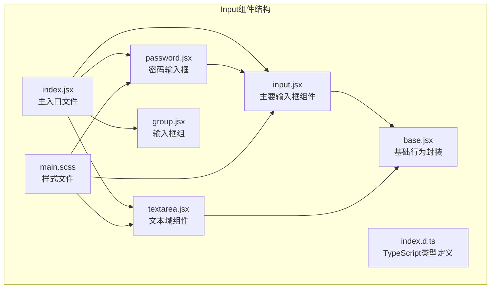
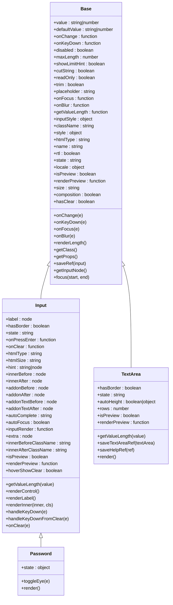

# 基础输入框

<cite>
**本文档引用的文件**
- [src/input/input.jsx](file://src/input/input.jsx)
- [src/input/base.jsx](file://src/input/base.jsx)
- [src/input/password.jsx](file://src/input/password.jsx)
- [src/input/textarea.jsx](file://src/input/textarea.jsx)
- [src/input/group.jsx](file://src/input/group.jsx)
- [src/input/index.jsx](file://src/input/index.jsx)
- [src/input/main.scss](file://src/input/main.scss)
- [types/input/index.d.ts](file://types/input/index.d.ts)
</cite>

## 目录
1. [简介](#简介)
2. [项目结构](#项目结构)
3. [核心组件](#核心组件)
4. [架构概览](#架构概览)
5. [详细组件分析](#详细组件分析)
6. [样式系统](#样式系统)
7. [使用示例](#使用示例)
8. [无障碍访问](#无障碍访问)
9. [性能考虑](#性能考虑)
10. [故障排除指南](#故障排除指南)
11. [总结](#总结)

## 简介

Fat Design的基础输入框（Input）组件是一个功能丰富且高度可定制的React组件，提供了完整的文本输入解决方案。该组件通过Base.jsx封装了基础的行为逻辑，支持文本输入、值绑定、事件处理，并提供了丰富的状态控制和样式定制选项。

Input组件设计遵循React最佳实践，支持受控和非受控两种模式，具有完整的无障碍访问支持，包括ARIA属性和键盘导航。组件还提供了多种变体，如密码输入框（Password）、文本域（TextArea）和输入框组（Group），满足不同场景的需求。

## 项目结构

Input组件的文件组织结构清晰，每个文件都有明确的职责：



**图表来源**
- [src/input/index.jsx](file://src/input/index.jsx#L1-L55)
- [src/input/input.jsx](file://src/input/input.jsx#L1-L416)
- [src/input/base.jsx](file://src/input/base.jsx#L1-L338)

**章节来源**
- [src/input/index.jsx](file://src/input/index.jsx#L1-L55)
- [src/input/input.jsx](file://src/input/input.jsx#L1-L416)

## 核心组件

### Input组件

Input组件是整个输入框系统的核心，继承自Base组件，提供了完整的输入功能：

```javascript
class Input extends Base {
    static displayName = 'Input';
    static getDerivedStateFromProps = Base.getDerivedStateFromProps;
    
    static propTypes = {
        ...Base.propTypes,
        label: PropTypes.node,
        hasBorder: PropTypes.bool,
        state: PropTypes.oneOf(['error', 'loading', 'success', 'warning']),
        onPressEnter: PropTypes.func,
        onClear: PropTypes.func,
        htmlType: PropTypes.string,
        htmlSize: PropTypes.string,
        hint: PropTypes.oneOfType([PropTypes.string, PropTypes.node]),
        innerBefore: PropTypes.node,
        innerAfter: PropTypes.node,
        addonBefore: PropTypes.node,
        addonAfter: PropTypes.node,
        addonTextBefore: PropTypes.node,
        addonTextAfter: PropTypes.node,
        autoComplete: PropTypes.string,
        autoFocus: PropTypes.bool,
        inputRender: PropTypes.func,
        extra: PropTypes.node,
        innerBeforeClassName: PropTypes.string,
        innerAfterClassName: PropTypes.string,
        isPreview: PropTypes.bool,
        renderPreview: PropTypes.func,
        hoverShowClear: PropTypes.bool,
    };
}
```

### Base组件

Base组件封装了所有输入框共有的基础行为，包括状态管理、事件处理和属性验证：

```javascript
class Base extends React.Component {
    static propTypes = {
        value: PropTypes.oneOfType([PropTypes.string, PropTypes.number]),
        defaultValue: PropTypes.oneOfType([PropTypes.string, PropTypes.number]),
        onChange: PropTypes.func,
        onKeyDown: PropTypes.func,
        disabled: PropTypes.bool,
        maxLength: PropTypes.number,
        showLimitHint: PropTypes.bool,
        cutString: PropTypes.bool,
        readOnly: PropTypes.bool,
        trim: PropTypes.bool,
        placeholder: PropTypes.string,
        onFocus: PropTypes.func,
        onBlur: PropTypes.func,
        getValueLength: PropTypes.func,
        inputStyle: PropTypes.object,
        className: PropTypes.string,
        style: PropTypes.object,
        htmlType: PropTypes.string,
        name: PropTypes.string,
        rtl: PropTypes.bool,
        state: PropTypes.oneOf(['error', 'loading', 'success', 'warning', '']),
        locale: PropTypes.object,
        isPreview: PropTypes.bool,
        renderPreview: PropTypes.func,
        size: PropTypes.oneOf(['small', 'medium', 'large']),
        composition: PropTypes.bool,
        onCompositionStart: PropTypes.func,
        onCompositionEnd: PropTypes.func,
        hasClear: PropTypes.bool,
    };
}
```

**章节来源**
- [src/input/input.jsx](file://src/input/input.jsx#L15-L100)
- [src/input/base.jsx](file://src/input/base.jsx#L8-L120)

## 架构概览

Input组件采用了分层架构设计，通过继承和组合的方式实现了功能的模块化：



**图表来源**
- [src/input/base.jsx](file://src/input/base.jsx#L8-L120)
- [src/input/input.jsx](file://src/input/input.jsx#L15-L100)
- [src/input/password.jsx](file://src/input/password.jsx#L10-L30)
- [src/input/textarea.jsx](file://src/input/textarea.jsx#L35-L80)

## 详细组件分析

### Input组件详细分析

Input组件是整个输入框系统的核心，它继承了Base组件的所有功能，并添加了特定于输入框的特性：

#### 核心功能

1. **值管理**：支持受控和非受控两种模式
2. **状态控制**：支持错误、加载、成功、警告四种状态
3. **事件处理**：完整的键盘和鼠标事件处理
4. **附加内容**：支持前后附加文字和图标
5. **清除功能**：可配置的清除按钮
6. **预览模式**：支持只读预览模式

#### 关键方法

```javascript
// 渲染控制元素（清除按钮、长度提示、状态图标）
renderControl() {
    const { hasClear, readOnly, state, prefix, hint, extra, locale, disabled, hoverShowClear } = this.props;
    // 实现细节...
}

// 处理回车键事件
handleKeyDown = e => {
    if (e.keyCode === 13) {
        this.props.onPressEnter(e);
    }
    this.onKeyDown(e);
};

// 处理清除操作
onClear(e) {
    if (this.props.disabled) {
        return;
    }
    // 非受控模式清空内部数据
    if (!('value' in this.props)) {
        this.setState({
            value: '',
        });
    }
    this.props.onChange('', e, 'clear');
    this.focus();
}
```

### Password组件分析

Password组件扩展了Input组件，添加了密码可见性切换功能：

```javascript
class Password extends Input {
    state = {
        hint: 'eye-close',
        htmlType: 'password',
    };

    toggleEye = e => {
        e.preventDefault();
        if (this.props.disabled) return;
        const eyeClose = this.state.hint === 'eye';
        
        this.setState({
            hint: eyeClose ? 'eye-close' : 'eye',
            htmlType: eyeClose || !this.props.showToggle ? 'password' : 'text',
        });
    };

    render() {
        const { showToggle, ...others } = this.props;
        const { hint, htmlType } = this.state;
        
        const extra = showToggle ? 
            <Icon type={hint} onClick={this.toggleEye} onMouseDown={preventDefault} /> : 
            null;
            
        return <Input {...others} extra={extra} htmlType={htmlType} />;
    }
}
```

### TextArea组件分析

TextArea组件专门处理多行文本输入，支持自动高度调整：

```javascript
class TextArea extends Base {
    constructor(props) {
        super(props);
        
        let value;
        if ('value' in props) {
            value = props.value;
        } else {
            value = props.defaultValue;
        }
        
        this.state = {
            value: typeof value === 'undefined' || value === null ? '' : value,
        };
    }
    
    componentDidMount() {
        const autoHeight = this.props.autoHeight;
        if (autoHeight) {
            if (typeof autoHeight === 'object') {
                this.setState(this._getMinMaxHeight(autoHeight, this.state.value));
            } else {
                this.setState({
                    height: this._getHeight(this.state.value),
                    overflowY: 'hidden',
                });
            }
        }
    }
    
    _getHeight(value) {
        const node = pReactDOM.findDOMNode(this.helpRef);
        if (!node) {
            return 0;
        }
        node.value = value;
        return node.scrollHeight;
    }
}
```

**章节来源**
- [src/input/input.jsx](file://src/input/input.jsx#L100-L200)
- [src/input/password.jsx](file://src/input/password.jsx#L10-L52)
- [src/input/textarea.jsx](file://src/input/textarea.jsx#L50-L150)

## 样式系统

Input组件采用SCSS变量和mixin系统实现主题定制和尺寸控制：

### SCSS变量系统

```scss
// 基础变量
$input-prefix: '.#{$css-prefix}input';
$input-border-width: 1px;
$input-border-color: $form-element-border-color;
$input-bg-color: $form-element-bg-color;
$input-text-color: $form-element-text-color;
$input-placeholder-color: $form-element-placeholder-color;

// 尺寸变量
$form-element-small-height: 24px;
$form-element-medium-height: 32px;
$form-element-large-height: 40px;

// 状态变量
$input-feedback-error-border-color: $color-danger;
$input-feedback-success-border-color: $color-success;
$input-feedback-warning-border-color: $color-warning;
```

### 尺寸控制MIXIN

```scss
@mixin input-size($height, $padding, $font-size, $label-padding, $icon-padding) {
    height: $height;
    padding: $padding;
    font-size: $font-size;
    line-height: $height;
    
    #{$input-prefix}-label {
        padding-left: $label-padding;
    }
    
    #{$input-prefix}-control {
        padding-right: $icon-padding;
    }
}
```

### 状态样式

```scss
// 正常状态
#{$input-prefix} {
    border: $input-border-width solid $input-border-color;
    background-color: $input-bg-color;
    
    &:hover, &.#{$css-prefix}focus {
        border-color: $input-hover-border-color;
        background-color: $input-hover-bg-color;
    }
}

// 错误状态
&.#{$css-prefix}error {
    border-color: $input-feedback-error-border-color;
    background-color: $input-feedback-error-bg-color;
    
    &.#{$css-prefix}focus {
        box-shadow: 0 0 0 $input-focus-shadow-spread $color-calculate-input-feedback-error-shadow;
    }
}

// 成功状态
&.#{$css-prefix}success {
    border-color: $input-feedback-success-border-color;
    background-color: $input-feedback-success-bg-color;
}
```

**章节来源**
- [src/input/main.scss](file://src/input/main.scss#L1-L100)
- [src/input/main.scss](file://src/input/main.scss#L200-L300)

## 使用示例

### 基本使用

```jsx
import { Input } from '@fat-foundation/design';

// 受控组件
function ControlledInput() {
    const [value, setValue] = useState('');
    
    return (
        <Input
            value={value}
            onChange={(val, e) => setValue(val)}
            placeholder="请输入内容"
        />
    );
}

// 非受控组件
function UncontrolledInput() {
    return (
        <Input
            defaultValue="初始值"
            placeholder="请输入内容"
        />
    );
}
```

### 状态控制

```jsx
// 不同状态的输入框
function StatusInputs() {
    return (
        <div>
            <Input state="error" placeholder="错误状态" />
            <Input state="success" placeholder="成功状态" />
            <Input state="warning" placeholder="警告状态" />
            <Input state="loading" placeholder="加载状态" />
        </div>
    );
}
```

### 添加功能

```jsx
// 带清除按钮的输入框
function ClearableInput() {
    return (
        <Input
            hasClear
            placeholder="点击右侧图标清除内容"
        />
    );
}

// 带标签的输入框
function LabeledInput() {
    return (
        <Input
            label="用户名"
            placeholder="请输入用户名"
        />
    );
}

// 密码输入框
function PasswordInput() {
    return (
        <Input.Password
            placeholder="请输入密码"
            showToggle
        />
    );
}
```

### 组合使用

```jsx
// 输入框组
function InputGroup() {
    return (
        <Input.Group>
            <Input addonBefore="http://" />
            <Input addonAfter=".com" />
        </Input.Group>
    );
}

// 文本域
function TextAreaExample() {
    return (
        <Input.TextArea
            placeholder="请输入多行文本"
            autoHeight
            maxLength={200}
            showLimitHint
        />
    );
}
```

## 无障碍访问

Input组件提供了完整的无障碍访问支持：

### ARIA属性

```javascript
// 在getProps方法中自动添加
getProps() {
    const props = {
        // ... 其他属性
        'aria-disabled': disabled,
        'aria-label': this.props.label,
        'aria-required': this.props.required,
        'aria-invalid': this.props.state === 'error',
    };
    
    return props;
}
```

### 键盘导航

```javascript
// 回车键处理
handleKeyDown = e => {
    if (e.keyCode === 13) {
        this.props.onPressEnter(e);
    }
    this.onKeyDown(e);
};

// 清除按钮键盘支持
handleKeyDownFromClear = e => {
    if (e.keyCode === 13) {
        this.onClear(e);
    }
};
```

### 焦点管理

```javascript
// 焦点状态管理
onFocus(e) {
    this.setState({
        focus: true,
    });
    this.props.onFocus(e);
}

onBlur(e) {
    this.setState({
        focus: false,
    });
    this.props.onBlur(e);
}

// 提供focus方法
focus(start, end) {
    this.inputRef.focus();
    if (typeof start === 'number') {
        this.inputRef.selectionStart = start;
    }
    if (typeof end === 'number') {
        this.inputRef.selectionEnd = end;
    }
}
```

**章节来源**
- [src/input/base.jsx](file://src/input/base.jsx#L280-L338)
- [src/input/input.jsx](file://src/input/input.jsx#L150-L200)

## 性能考虑

### 避免不必要的重渲染

1. **使用React.memo**：对于复杂的输入框组件，可以使用React.memo包装
2. **优化事件处理**：使用bind或箭头函数避免重复创建函数
3. **合理使用ref**：避免频繁访问DOM节点

```javascript
// 优化的事件处理
constructor(props) {
    super(props);
    this.onChange = this.onChange.bind(this);
    this.onKeyDown = this.onKeyDown.bind(this);
    this.onFocus = this.onFocus.bind(this);
    this.onBlur = this.onBlur.bind(this);
}

// 或者使用箭头函数
onChange = (e) => {
    // 处理逻辑
};
```

### 内存泄漏预防

```javascript
// 合理使用ref和事件监听器
componentWillUnmount() {
    if (this.nextFrameActionId) {
        clearNextFrameAction(this.nextFrameActionId);
    }
}
```

### 大数据量处理

```javascript
// 对于长文本输入，使用防抖
onChange = debounce((value, e) => {
    this.props.onChange(value, e);
}, 300);
```

## 故障排除指南

### 常见问题及解决方案

#### 1. 输入框不响应

**问题**：输入框无法输入内容
**原因**：disabled或readOnly属性被设置
**解决方案**：
```javascript
// 检查属性设置
<Input
    disabled={false}  // 确保disabled为false
    readOnly={false}  // 确保readOnly为false
/>
```

#### 2. 样式不生效

**问题**：自定义样式没有应用
**原因**：CSS优先级或命名空间问题
**解决方案**：
```scss
// 使用正确的选择器
.#{$css-prefix}input {
    // 确保选择器优先级足够高
}

// 或使用!important（谨慎使用）
.#{$css-prefix}input {
    background-color: red !important;
}
```

#### 3. 清除功能异常

**问题**：清除按钮不工作
**原因**：hasClear属性未启用或事件处理冲突
**解决方案**：
```javascript
<Input
    hasClear
    onClear={(value, e) => {
        console.log('清除内容:', value);
        // 自定义清除逻辑
    }}
/>
```

#### 4. 自动高度问题

**问题**：TextArea自动高度不正确
**原因**：浏览器兼容性或初始化时机问题
**解决方案**：
```javascript
// 确保组件已挂载后再设置autoHeight
useEffect(() => {
    if (textareaRef.current) {
        // 触发重新计算
    }
}, []);
```

**章节来源**
- [src/input/base.jsx](file://src/input/base.jsx#L200-L250)
- [src/input/textarea.jsx](file://src/input/textarea.jsx#L100-L150)

## 总结

Fat Design的基础输入框（Input）组件是一个功能完整、设计精良的React组件，具有以下特点：

### 主要优势

1. **完整的功能覆盖**：支持文本输入、状态管理、事件处理、样式定制等全方位功能
2. **优秀的架构设计**：通过Base组件封装公共逻辑，实现代码复用和维护性
3. **丰富的变体支持**：提供Password、TextArea、Group等多种变体满足不同需求
4. **强大的样式系统**：基于SCSS变量和mixin的样式系统，支持主题定制
5. **无障碍访问支持**：完整的ARIA属性和键盘导航支持
6. **性能优化**：合理的状态管理和事件处理机制

### 最佳实践建议

1. **合理选择组件类型**：根据具体需求选择合适的Input变体
2. **正确使用受控和非受控模式**：根据应用场景选择合适的数据管理模式
3. **充分利用状态系统**：善用error、success、warning等状态提升用户体验
4. **注意无障碍访问**：确保所有用户都能正常使用输入框功能
5. **性能优化**：避免不必要的重渲染和内存泄漏

### 扩展方向

1. **国际化支持**：完善多语言支持
2. **移动端适配**：增强移动设备上的用户体验
3. **更多输入类型**：支持更多原生input类型
4. **插件系统**：提供更灵活的功能扩展机制

通过深入理解Input组件的设计理念和实现细节，开发者可以更好地利用这个组件构建高质量的用户界面，同时也可以参考其设计模式来开发其他组件。