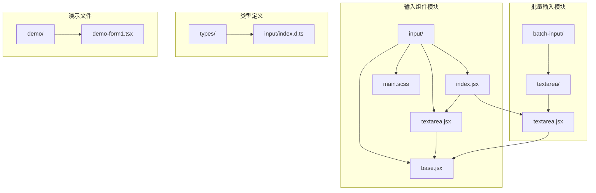
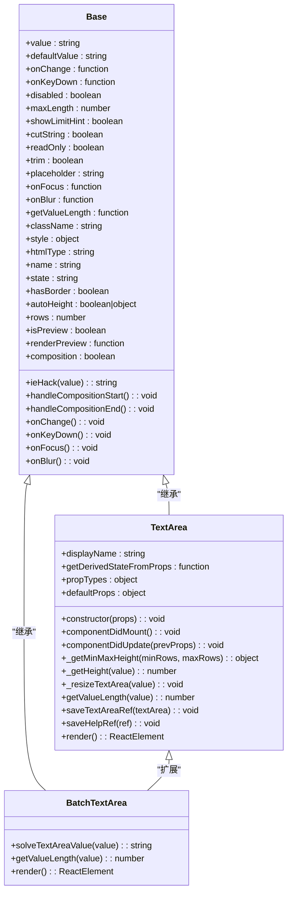
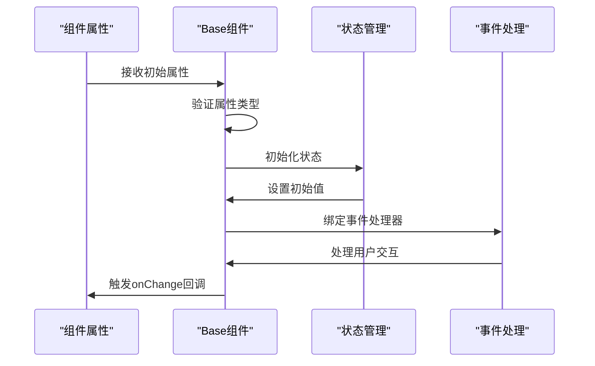
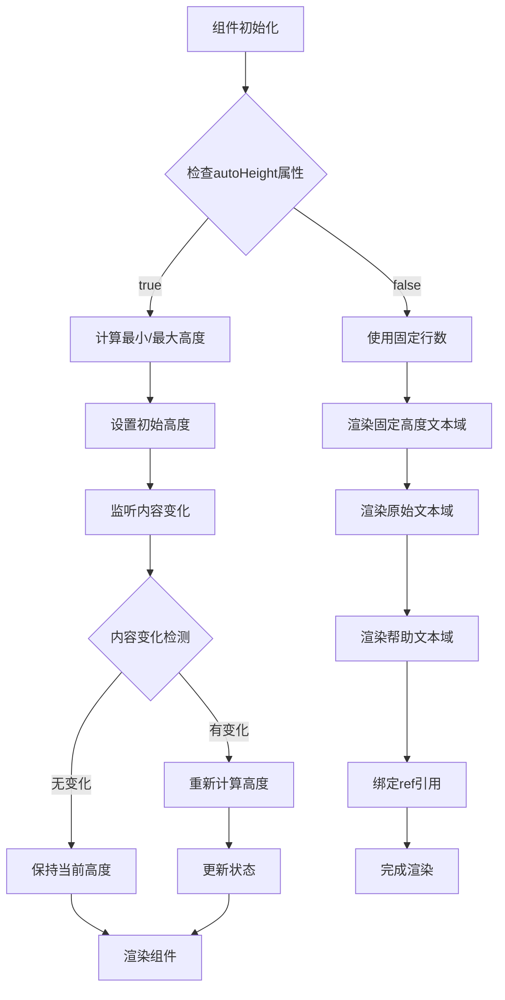

# 多行文本域（Textarea）组件文档

<cite>
**本文档引用的文件**
- [src/input/textarea.jsx](file://src/input/textarea.jsx)
- [src/input/base.jsx](file://src/input/base.jsx)
- [src/input/main.scss](file://src/input/main.scss)
- [src/input/index.jsx](file://src/input/index.jsx)
- [src/batch-input/textarea/textarea.jsx](file://src/batch-input/textarea/textarea.jsx)
- [types/input/index.d.ts](file://types/input/index.d.ts)
- [demo/demo-form1.tsx](file://demo/demo-form1.tsx)
</cite>

## 目录
1. [简介](#简介)
2. [项目结构](#项目结构)
3. [核心组件](#核心组件)
4. [架构概览](#架构概览)
5. [详细组件分析](#详细组件分析)
6. [属性详解](#属性详解)
7. [使用示例](#使用示例)
8. [样式定制](#样式定制)
9. [性能考虑](#性能考虑)
10. [故障排除指南](#故障排除指南)
11. [总结](#总结)

## 简介

Fat Design的Textarea组件是一个功能丰富的多行文本输入控件，它继承了Base组件的基础功能并扩展了行数控制、自动高度调整等特性。该组件提供了固定行数与自适应高度两种模式，支持表单集成和值验证，是构建复杂表单界面的重要组成部分。

Textarea组件的主要特点包括：
- 继承Base组件的所有基础功能
- 支持固定行数和自动高度调整
- 内置最大长度限制和字符计数
- 完整的表单状态管理
- 跨浏览器兼容性处理
- 灵活的样式定制能力

## 项目结构

Textarea组件在Fat Design项目中的组织结构如下：



**图表来源**
- [src/input/textarea.jsx](file://src/input/textarea.jsx#L1-L300)
- [src/input/base.jsx](file://src/input/base.jsx#L1-L338)
- [src/input/index.jsx](file://src/input/index.jsx#L1-L55)

**章节来源**
- [src/input/textarea.jsx](file://src/input/textarea.jsx#L1-L300)
- [src/input/base.jsx](file://src/input/base.jsx#L1-L338)

## 核心组件

Textarea组件的核心实现基于两个主要文件：

### 主要Textarea组件
主Textarea组件位于`src/input/textarea.jsx`，它继承自Base组件，提供了完整的文本域功能。

### 批量输入Textarea组件
批量输入模块中的Textarea组件位于`src/batch-input/textarea/textarea.jsx`，它扩展了主组件的功能，增加了批量处理能力。

**章节来源**
- [src/input/textarea.jsx](file://src/input/textarea.jsx#L1-L300)
- [src/batch-input/textarea/textarea.jsx](file://src/batch-input/textarea/textarea.jsx#L1-L364)

## 架构概览

Textarea组件采用分层架构设计，确保代码的可维护性和扩展性：



**图表来源**
- [src/input/base.jsx](file://src/input/base.jsx#L8-L338)
- [src/input/textarea.jsx](file://src/input/textarea.jsx#L35-L300)
- [src/batch-input/textarea/textarea.jsx](file://src/batch-input/textarea/textarea.jsx#L25-L364)

## 详细组件分析

### Base组件分析

Base组件是所有输入组件的基础，提供了通用的属性和方法：



**图表来源**
- [src/input/base.jsx](file://src/input/base.jsx#L150-L200)

Base组件的核心功能包括：

1. **属性验证**：使用PropTypes进行类型检查
2. **状态管理**：管理组件的内部状态
3. **事件处理**：处理各种用户交互事件
4. **生命周期管理**：处理组件的挂载和更新

### TextArea组件分析

Textarea组件继承了Base组件的所有功能，并添加了特定的文本域功能：



**图表来源**
- [src/input/textarea.jsx](file://src/input/textarea.jsx#L80-L120)

**章节来源**
- [src/input/textarea.jsx](file://src/input/textarea.jsx#L35-L300)
- [src/input/base.jsx](file://src/input/base.jsx#L8-L338)

## 属性详解

Textarea组件提供了丰富的属性配置选项：

### 基础属性

| 属性名 | 类型 | 默认值 | 描述 |
|--------|------|--------|------|
| `value` | string \| number | - | 当前值 |
| `defaultValue` | string \| number | - | 初始化值 |
| `onChange` | function | noop | 值改变时的回调函数 |
| `onKeyDown` | function | noop | 键盘按下时的回调函数 |
| `disabled` | boolean | false | 禁用状态 |
| `maxLength` | number | null | 最大长度 |
| `showLimitHint` | boolean | false | 是否显示最大长度提示 |
| `cutString` | boolean | true | 是否截断超出字符串 |
| `readOnly` | boolean | false | 只读状态 |
| `trim` | boolean | false | 是否自动去除头尾空字符 |
| `placeholder` | string | - | 输入提示 |

### 文本域专用属性

| 属性名 | 类型 | 默认值 | 描述 |
|--------|------|--------|------|
| `hasBorder` | boolean | true | 是否显示边框 |
| `state` | string | - | 状态（error/warning） |
| `autoHeight` | boolean \| object | false | 自动高度设置 |
| `rows` | number | 4 | 固定行数 |
| `isPreview` | boolean | false | 预览态模式 |
| `renderPreview` | function | - | 预览态渲染函数 |
| `composition` | boolean | false | 输入法组合状态 |

### autoHeight属性详解

autoHeight属性支持两种配置方式：

1. **布尔模式**：`autoHeight={true}`
   - 启用自动高度调整
   - 使用默认行数（4行）

2. **对象模式**：`autoHeight={{minRows: 2, maxRows: 4}}`
   - 指定最小和最大行数
   - 动态调整高度范围

**章节来源**
- [src/input/textarea.jsx](file://src/input/textarea.jsx#L40-L60)
- [types/input/index.d.ts](file://types/input/index.d.ts#L100-L130)

## 使用示例

### 基础固定行数文本域

```jsx
import { Input } from 'fat-design';

function BasicTextarea() {
    return (
        <Input.TextArea
            rows={4}
            placeholder="请输入内容"
            maxLength={200}
            showLimitHint
        />
    );
}
```

### 自动高度文本域

```jsx
function AutoHeightTextarea() {
    return (
        <Input.TextArea
            autoHeight
            placeholder="内容会自动调整高度"
            maxLength={500}
            showLimitHint
        />
    );
}
```

### 带最小最大高度限制

```jsx
function LimitedHeightTextarea() {
    return (
        <Input.TextArea
            autoHeight={{ minRows: 2, maxRows: 6 }}
            placeholder="内容会在2-6行之间自动调整"
            maxLength={1000}
            showLimitHint
        />
    );
}
```

### 表单集成示例

```jsx
import { Form, Input } from 'fat-design';

function FormWithTextarea() {
    return (
        <Form onSubmit={handleSubmit}>
            <Form.Item
                label="描述"
                name="description"
                component="Input.TextArea"
                maxLength={200}
                xProps={{
                    hasClear: true,
                    showLimitHint: true,
                    autoHeight: true
                }}
            />
        </Form>
    );
}
```

**章节来源**
- [demo/demo-form1.tsx](file://demo/demo-form1.tsx#L60-L70)

## 样式定制

Textarea组件提供了灵活的样式定制能力，通过SCSS变量和CSS类名实现：

### SCSS变量定制

```scss
// 自定义边框颜色
$input-border-color: #1890ff;
$input-hover-border-color: #40a9ff;
$input-focus-border-color: #40a9ff;

// 自定义内边距
$input-multiple-padding-tb: 8px;
$input-multiple-padding-lr: 12px;

// 自定义字体大小
$input-multiple-font-size: 14px;

// 自定义圆角
$input-multiple-corner: 4px;
```

### CSS类名定制

```jsx
<Input.TextArea
    className="custom-textarea"
    style={{
        border: '2px solid #1890ff',
        borderRadius: '8px'
    }}
/>
```

### 预览态样式

```scss
// 预览态文本域样式
.fat-input-textarea.fat-form-preview {
    background-color: #f5f5f5;
    padding: 8px 12px;
    border-radius: 4px;
    
    p {
        margin: 0;
        line-height: 1.5;
    }
}
```

**章节来源**
- [src/input/main.scss](file://src/input/main.scss#L1-L473)

## 性能考虑

Textarea组件在设计时充分考虑了性能优化：

### 高度计算优化

1. **防抖处理**：使用requestAnimationFrame避免频繁重绘
2. **缓存机制**：缓存DOM节点引用减少查询开销
3. **条件更新**：只在必要时重新计算高度

### 内存管理

1. **事件解绑**：组件卸载时正确清理事件监听器
2. **引用释放**：及时释放DOM引用避免内存泄漏
3. **状态清理**：清理定时器和动画帧请求

### 浏览器兼容性

1. **IE兼容**：特殊处理IE浏览器的文本高度计算
2. **Safari优化**：针对macOS Safari的特殊处理
3. **跨浏览器一致性**：统一不同浏览器的文本渲染差异

## 故障排除指南

### 常见问题及解决方案

#### 1. 自动高度不生效

**问题**：设置了autoHeight但文本域高度没有变化

**解决方案**：
```jsx
// 确保正确设置autoHeight
<Input.TextArea
    autoHeight={true}  // 或者 autoHeight={{minRows: 2, maxRows: 6}}
    // 其他属性...
/>

// 检查是否有CSS样式影响
<style>
    .fat-input-textarea textarea {
        height: auto !important;  // 确保高度可以自动调整
    }
</style>
```

#### 2. 最大长度限制不准确

**问题**：maxLength设置后字符计数不准确

**解决方案**：
```jsx
<Input.TextArea
    maxLength={100}
    getValueLength={(value) => {
        // 自定义字符长度计算逻辑
        return value.replace(/\r\n/g, '\n').length;
    }}
/>
```

#### 3. 预览态显示异常

**问题**：isPreview=true时内容显示不正常

**解决方案**：
```jsx
<Input.TextArea
    isPreview={true}
    renderPreview={(value) => {
        // 自定义预览内容渲染
        return value.split('\n').map((line, index) => (
            <p key={index}>{line}</p>
        ));
    }}
/>
```

**章节来源**
- [src/input/textarea.jsx](file://src/input/textarea.jsx#L150-L200)

## 总结

Fat Design的Textarea组件是一个功能完整、性能优化的多行文本输入控件。它通过继承Base组件的基础功能，扩展了自动高度调整、最大长度限制、表单状态管理等高级特性。

### 主要优势

1. **功能丰富**：支持固定行数和自动高度两种模式
2. **性能优化**：采用防抖和缓存机制提升性能
3. **样式灵活**：支持SCSS变量和CSS类名定制
4. **兼容性强**：处理各种浏览器的兼容性问题
5. **易于集成**：与表单系统无缝集成

### 最佳实践

1. **合理使用autoHeight**：根据实际需求选择合适的高度模式
2. **设置适当的maxLength**：配合showLimitHint提供更好的用户体验
3. **自定义样式**：利用SCSS变量定制符合设计规范的外观
4. **性能监控**：在大量文本输入场景下注意性能表现
5. **兼容性测试**：在目标浏览器环境中进行全面测试

Textarea组件为开发者提供了强大而灵活的多行文本输入解决方案，是构建现代化Web应用不可或缺的组件之一。