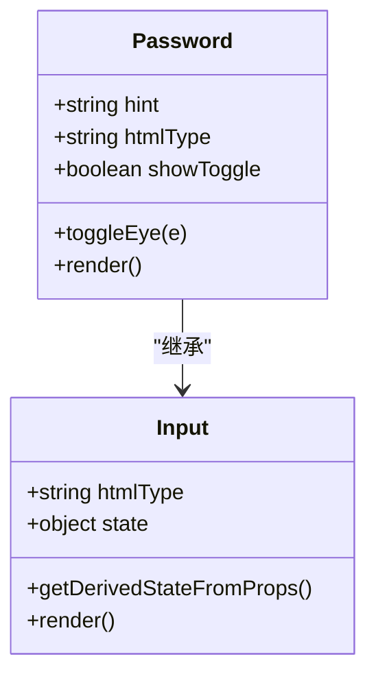
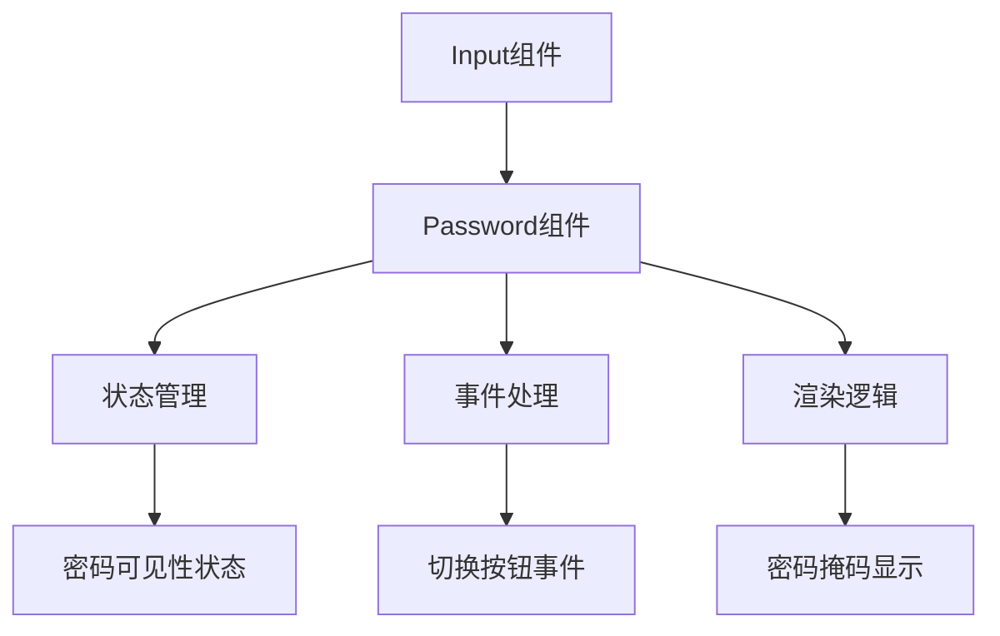
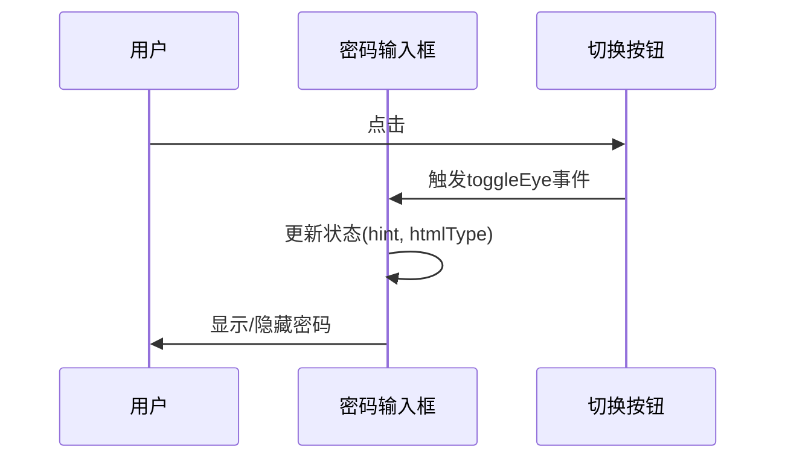
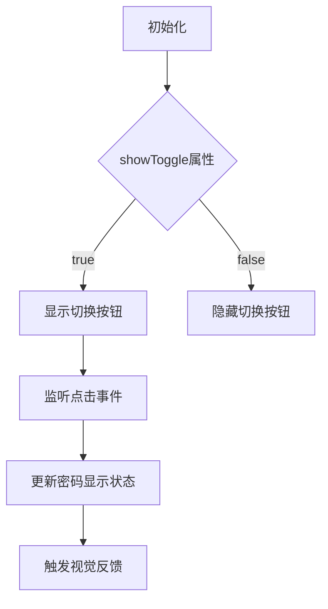
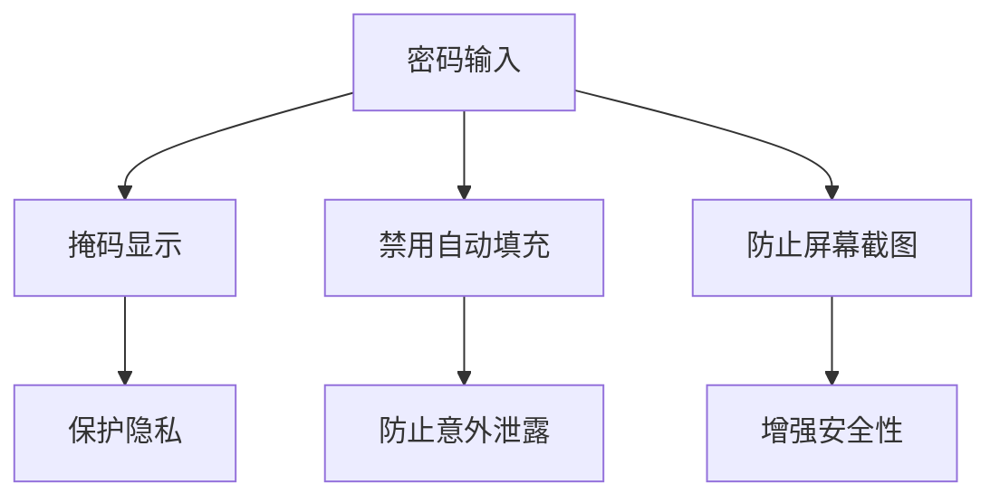
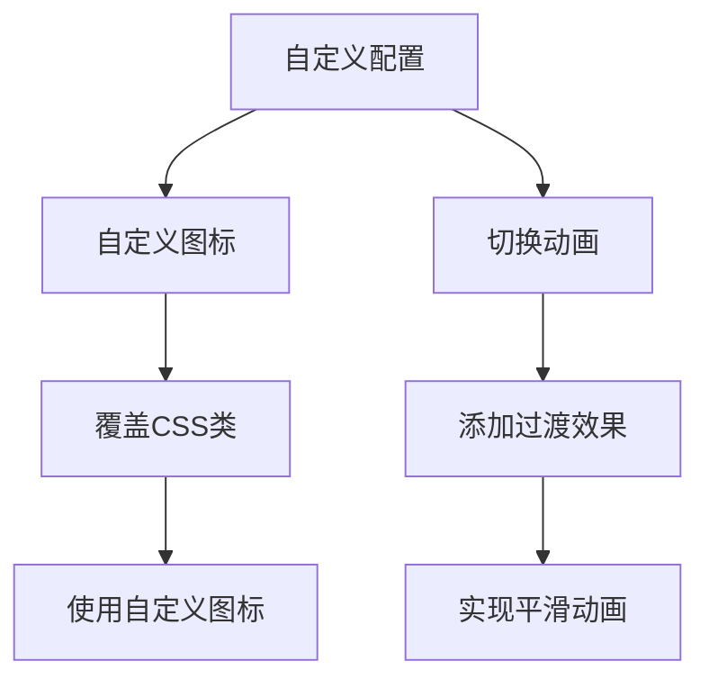
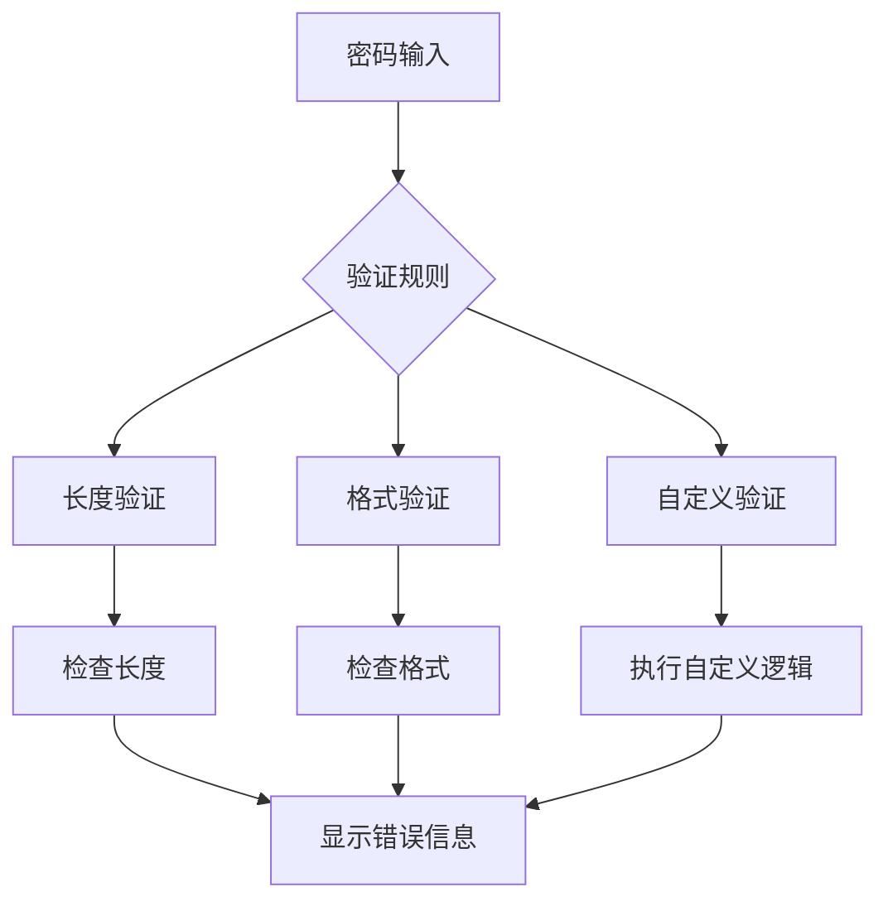

# 密码输入框

<cite>
**本文档引用的文件**
- [password.jsx](file://src/input/password.jsx)
- [input.jsx](file://src/input/input.jsx)
- [main.scss](file://src/input/main.scss)
- [Form组件使用文档.md](file://demo-doc/Form组件使用文档.md)
- [demo-form1.tsx](file://demo/demo-form1.tsx)
- [pattern.js](file://src/validate/rules/pattern.js)
- [format.js](file://src/validate/rules/format.js)
</cite>

## 目录
1. [简介](#简介)
2. [核心组件分析](#核心组件分析)
3. [架构与继承关系](#架构与继承关系)
4. [交互行为与视觉反馈](#交互行为与视觉反馈)
5. [属性与回调函数](#属性与回调函数)
6. [安全考虑](#安全考虑)
7. [自定义配置](#自定义配置)
8. [表单验证集成](#表单验证集成)
9. [组合使用示例](#组合使用示例)
10. [结论](#结论)

## 简介
密码输入框（Password）是基于基础输入组件（Input）扩展的专用组件，主要用于安全地输入密码信息。该组件提供了密码可见性切换功能，允许用户在输入密码时选择是否显示明文。通过集成密码强度校验和与其他表单组件的组合使用，Password组件为开发者提供了完整的密码输入解决方案。

**Section sources**
- [password.jsx](file://src/input/password.jsx#L1-L50)

## 核心组件分析

密码输入框组件的核心实现基于基础输入组件的扩展，通过继承和重写方式实现密码特有的功能。组件主要包含状态管理、事件处理和渲染逻辑三个部分。



**Diagram sources**
- [password.jsx](file://src/input/password.jsx#L1-L50)
- [input.jsx](file://src/input/input.jsx#L1-L415)

**Section sources**
- [password.jsx](file://src/input/password.jsx#L1-L50)
- [input.jsx](file://src/input/input.jsx#L1-L415)

## 架构与继承关系

Password组件通过继承Input组件来复用其基础功能，并在此基础上添加密码特有的功能。这种设计模式遵循了面向对象的继承原则，实现了代码的重用和功能的扩展。



**Diagram sources**
- [password.jsx](file://src/input/password.jsx#L1-L50)
- [input.jsx](file://src/input/input.jsx#L1-L415)

**Section sources**
- [password.jsx](file://src/input/password.jsx#L1-L50)
- [input.jsx](file://src/input/input.jsx#L1-L415)

## 交互行为与视觉反馈

密码输入框的交互行为主要体现在切换按钮的功能上。当用户点击切换按钮时，密码的显示状态会在掩码和明文之间切换，同时按钮图标也会相应变化。



视觉反馈机制通过图标变化来实现：
- 当密码被掩码时，显示"eye-close"图标
- 当密码可见时，显示"eye"图标
- 鼠标悬停时，图标颜色会变深，提供视觉反馈

**Diagram sources**
- [password.jsx](file://src/input/password.jsx#L1-L50)
- [main.scss](file://src/input/main.scss#L1-L473)

**Section sources**
- [password.jsx](file://src/input/password.jsx#L1-L50)
- [main.scss](file://src/input/main.scss#L1-L473)

## 属性与回调函数

Password组件提供了丰富的属性和回调函数，以满足不同的使用需求。

### visibilityToggle属性
`showToggle`属性控制是否显示密码可见性切换按钮：
- 当`showToggle=true`时，显示切换按钮
- 当`showToggle=false`时，隐藏切换按钮

### onVisibilityChange回调函数
虽然代码中没有直接暴露`onVisibilityChange`回调函数，但可以通过监听组件状态变化来实现类似功能。开发者可以通过父组件的状态管理来跟踪密码可见性状态的变化。



**Diagram sources**
- [password.jsx](file://src/input/password.jsx#L1-L50)

**Section sources**
- [password.jsx](file://src/input/password.jsx#L1-L50)

## 安全考虑

密码输入框在设计时充分考虑了安全性，主要体现在以下几个方面：

### 输入内容的掩码显示
默认情况下，密码输入框会将输入内容显示为掩码字符（通常是圆点），防止旁观者窥视密码内容。

### 防止屏幕截图泄露
通过使用原生的`type="password"`属性，确保浏览器和操作系统能够正确识别这是一个密码输入字段，从而在屏幕截图、录屏等场景下提供额外的保护。

### 禁用自动填充
组件默认设置`autoComplete="off"`，防止浏览器自动填充密码，减少密码泄露的风险。



**Diagram sources**
- [password.jsx](file://src/input/password.jsx#L1-L50)
- [input.jsx](file://src/input/input.jsx#L1-L415)

**Section sources**
- [password.jsx](file://src/input/password.jsx#L1-L50)
- [input.jsx](file://src/input/input.jsx#L1-L415)

## 自定义配置

Password组件支持多种自定义配置，以满足不同的设计需求。

### 自定义图标
虽然组件默认使用"eye"和"eye-close"图标，但开发者可以通过CSS覆盖默认样式来使用自定义图标。

### 切换动画
组件的切换动画效果可以通过CSS进行自定义。默认情况下，图标变化是即时的，但可以通过添加CSS过渡效果来实现平滑的动画效果。



**Diagram sources**
- [main.scss](file://src/input/main.scss#L1-L473)

**Section sources**
- [main.scss](file://src/input/main.scss#L1-L473)

## 表单验证集成

Password组件可以与表单验证系统无缝集成，支持多种验证方式。

### 密码强度校验
通过使用`pattern`规则或自定义`validator`函数，可以实现密码强度校验。常见的密码强度要求包括：
- 最小长度限制
- 必须包含大小写字母
- 必须包含数字
- 必须包含特殊字符



**Diagram sources**
- [pattern.js](file://src/validate/rules/pattern.js#L1-L42)
- [format.js](file://src/validate/rules/format.js#L1-L108)
- [Form组件使用文档.md](file://demo-doc/Form组件使用文档.md#L397-L596)

**Section sources**
- [pattern.js](file://src/validate/rules/pattern.js#L1-L42)
- [format.js](file://src/validate/rules/format.js#L1-L108)
- [Form组件使用文档.md](file://demo-doc/Form组件使用文档.md#L397-L596)

## 组合使用示例

Password组件可以与其他表单组件组合使用，构建完整的用户认证界面。

### 登录表单示例
```jsx
<Form>
  <FormItem 
    name="username"
    label="用户名"
    component="Input"
    required
  />
  <FormItem 
    name="password"
    label="密码"
    component="InputPassword"
    required
    validator={customValidator}
  />
  <FormItem 
    name="remember"
    label=""
    component="Checkbox"
    xProps={{ children: '记住我' }}
  />
</Form>
```

### 注册表单示例
```jsx
<Form>
  <FormItem 
    name="email"
    label="邮箱"
    component="Input"
    required
    rules={[{ pattern: /^[^\s@]+@[^\s@]+\.[^\s@]+$/, message: '请输入有效的邮箱地址' }]}
  />
  <FormItem 
    name="password"
    label="密码"
    component="InputPassword"
    required
    validator={passwordStrengthValidator}
  />
  <FormItem 
    name="confirmPassword"
    label="确认密码"
    component="InputPassword"
    required
    validator={confirmPasswordValidator}
  />
</Form>
```

**Section sources**
- [demo-form1.tsx](file://demo/demo-form1.tsx#L1-L331)
- [Form组件使用文档.md](file://demo-doc/Form组件使用文档.md#L397-L596)

## 结论

密码输入框组件通过继承基础输入组件，实现了密码输入的专用功能。其核心特性包括密码可见性切换、安全的掩码显示、防止屏幕截图泄露等。组件提供了丰富的自定义选项，包括图标和动画的自定义，以及与表单验证系统的无缝集成。通过与其他表单组件的组合使用，可以构建出安全、易用的用户认证界面。