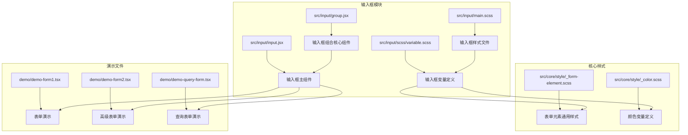
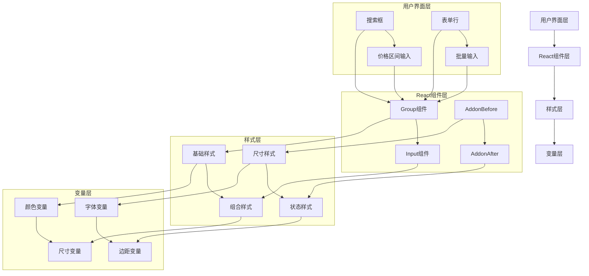
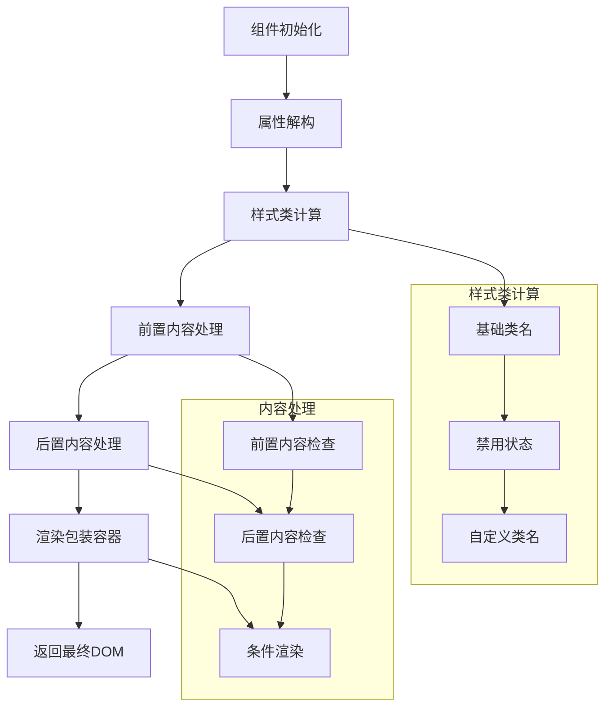
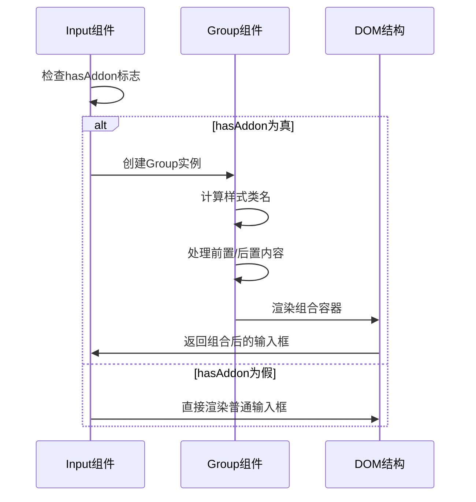
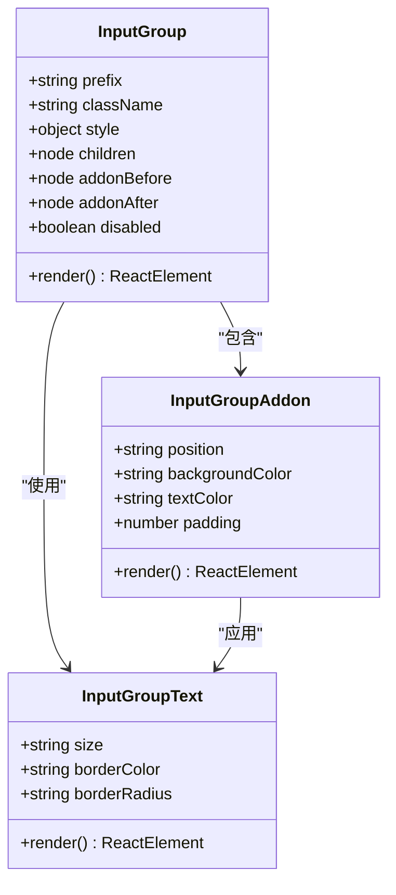
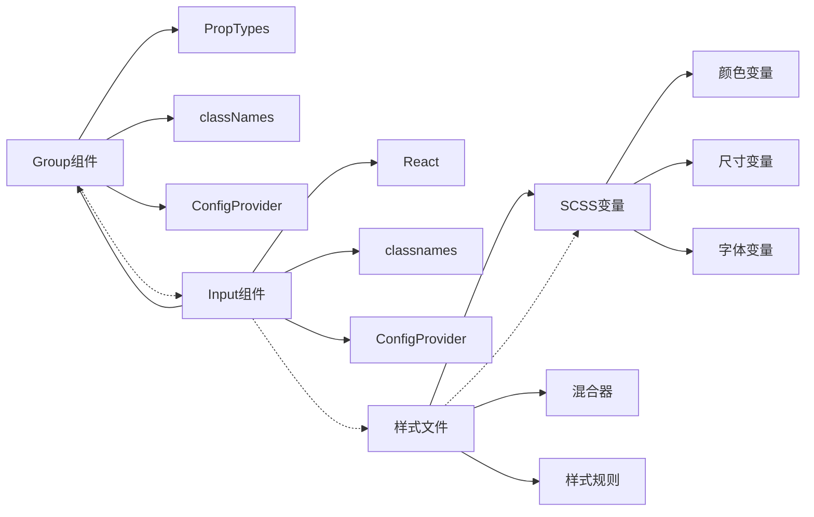

# 输入框组合（Input.Group）

<cite>
**本文档引用的文件**
- [src/input/group.jsx](file://src/input/group.jsx)
- [src/input/input.jsx](file://src/input/input.jsx)
- [src/input/main.scss](file://src/input/main.scss)
- [src/input/scss/variable.scss](file://src/input/scss/variable.scss)
- [src/core/style/_form-element.scss](file://src/core/style/_form-element.scss)
- [src/core/style/_color.scss](file://src/core/style/_color.scss)
- [demo/demo-form1.tsx](file://demo/demo-form1.tsx)
- [demo/demo-form2.tsx](file://demo/demo-form2.tsx)
- [demo/demo-form3.tsx](file://demo/demo-form3.tsx)
- [demo/demo-query-form.tsx](file://demo/demo-query-form.tsx)
</cite>

## 目录
1. [简介](#简介)
2. [项目结构](#项目结构)
3. [核心组件](#核心组件)
4. [架构概览](#架构概览)
5. [详细组件分析](#详细组件分析)
6. [依赖关系分析](#依赖关系分析)
7. [性能考虑](#性能考虑)
8. [故障排除指南](#故障排除指南)
9. [结论](#结论)

## 简介

输入框组合（Input.Group）是Fat Design设计系统中的一个重要组件，用于将多个输入控件水平或垂直组合成一个复合输入界面。该组件提供了紧凑模式下的边框合并逻辑和精确的间距控制，支持在搜索框、价格区间、表单行等多种场景中使用。

输入框组合的核心优势在于：
- **统一的视觉体验**：通过边框合并和间距控制，提供一致的用户界面
- **灵活的布局**：支持水平和垂直排列，适应不同的设计需求
- **组件兼容性**：与Button、Select、DatePicker等其他组件无缝配合
- **响应式设计**：在不同屏幕尺寸下保持良好的显示效果
- **无障碍支持**：确保键盘导航的连续性和可访问性

## 项目结构

输入框组合组件的文件组织结构如下：



**图表来源**
- [src/input/group.jsx](file://src/input/group.jsx#L1-L92)
- [src/input/input.jsx](file://src/input/input.jsx#L1-L416)
- [src/input/main.scss](file://src/input/main.scss#L1-L473)

**章节来源**
- [src/input/group.jsx](file://src/input/group.jsx#L1-L92)
- [src/input/input.jsx](file://src/input/input.jsx#L1-L416)

## 核心组件

### Group 组件类

输入框组合的核心组件是一个React类组件，继承自`React.Component`，提供了以下主要功能：

```javascript
class Group extends React.Component {
    static displayName = 'Group';
    
    static propTypes = {
        prefix: PropTypes.string,
        className: PropTypes.string,
        style: PropTypes.object,
        children: PropTypes.node,
        addonBefore: PropTypes.node,
        addonBeforeClassName: PropTypes.string,
        addonAfter: PropTypes.node,
        addonAfterClassName: PropTypes.string,
        rtl: PropTypes.bool,
    };
    
    static defaultProps = {
        prefix: ConfigProvider.defaultPrefix,
    };
}
```

### 主要特性

1. **属性验证**：使用PropTypes确保传入参数的正确性
2. **默认前缀**：自动获取配置提供者的默认前缀
3. **条件渲染**：根据是否存在前置/后置内容动态渲染
4. **样式类管理**：使用classNames库动态生成CSS类名
5. **RTL支持**：支持从右到左的语言环境

**章节来源**
- [src/input/group.jsx](file://src/input/group.jsx#L8-L35)

## 架构概览

输入框组合的整体架构采用分层设计，从底层的样式定义到上层的React组件实现：



**图表来源**
- [src/input/group.jsx](file://src/input/group.jsx#L53-L90)
- [src/input/input.jsx](file://src/input/input.jsx#L357-L415)
- [src/input/main.scss](file://src/input/main.scss#L200-L473)

## 详细组件分析

### Group 组件实现

Group组件的核心实现逻辑如下：



**图表来源**
- [src/input/group.jsx](file://src/input/group.jsx#L53-L90)

#### 核心渲染逻辑

Group组件的渲染方法实现了以下关键逻辑：

1. **属性解构**：从props中提取必要的属性
2. **样式类计算**：使用classNames库动态生成CSS类名
3. **内容条件渲染**：根据是否存在前置/后置内容决定是否渲染
4. **DOM结构构建**：构建包含所有内容的span元素

```javascript
render() {
    const {
        className,
        style,
        children,
        prefix,
        addonBefore,
        addonAfter,
        addonBeforeClassName,
        addonAfterClassName,
        rtl,
        disabled,
        ...others
    } = this.props;

    const cls = classNames({
        [`${prefix}input-group`]: true,
        [`${prefix}disabled`]: disabled,
        [className]: !!className,
    });

    const addonCls = `${prefix}input-group-addon`;
    const beforeCls = classNames(addonCls, {
        [`${prefix}before`]: true,
        [addonBeforeClassName]: addonBeforeClassName,
    });
    const afterCls = classNames(addonCls, {
        [`${prefix}after`]: true,
        [addonAfterClassName]: addonAfterClassName,
    });

    const before = addonBefore ? <span className={beforeCls}>{addonBefore}</span> : null;
    const after = addonAfter ? <span className={afterCls}>{addonAfter}</span> : null;

    return (
        <span {...others} disabled={disabled} dir={rtl ? 'rtl' : undefined} className={cls} style={style}>
            {before}
            {children}
            {after}
        </span>
    );
}
```

### 输入框与Group的集成

输入框组件通过条件渲染的方式与Group组件集成：



**图表来源**
- [src/input/input.jsx](file://src/input/input.jsx#L357-L415)

### 样式系统分析

输入框组合的样式系统采用SCSS变量和混合器的设计模式：

#### 变量定义层次

1. **基础变量**：定义颜色、尺寸、字体等基础样式属性
2. **组件变量**：针对输入框特定的样式变量
3. **组合变量**：专门用于输入框组合的样式变量

#### 样式类层次



**图表来源**
- [src/input/group.jsx](file://src/input/group.jsx#L53-L90)
- [src/input/main.scss](file://src/input/main.scss#L200-L473)

**章节来源**
- [src/input/group.jsx](file://src/input/group.jsx#L53-L90)
- [src/input/input.jsx](file://src/input/input.jsx#L357-L415)
- [src/input/main.scss](file://src/input/main.scss#L200-L473)

## 依赖关系分析

输入框组合组件的依赖关系体现了清晰的分层架构：



**图表来源**
- [src/input/group.jsx](file://src/input/group.jsx#L1-L5)
- [src/input/input.jsx](file://src/input/input.jsx#L1-L5)
- [src/input/main.scss](file://src/input/main.scss#L1-L5)

### 外部依赖

1. **React生态系统**：使用React作为基础框架
2. **PropTypes**：用于属性类型验证
3. **classnames**：用于动态CSS类名生成
4. **ConfigProvider**：提供全局配置和主题支持

### 内部依赖

1. **核心样式系统**：依赖于统一的样式变量和混合器
2. **表单元素规范**：遵循统一的表单组件设计原则
3. **无障碍支持**：确保组件符合WCAG标准

**章节来源**
- [src/input/group.jsx](file://src/input/group.jsx#L1-L5)
- [src/input/input.jsx](file://src/input/input.jsx#L1-L5)

## 性能考虑

### 渲染优化

1. **条件渲染**：只有在存在前置/后置内容时才渲染相应的DOM节点
2. **样式类缓存**：使用classNames库的高效类名生成机制
3. **最小DOM树**：保持简洁的DOM结构，减少浏览器重绘

### 内存管理

1. **事件委托**：避免在每个子组件上绑定过多事件处理器
2. **组件复用**：通过合理的组件设计实现高效的组件复用
3. **生命周期优化**：合理利用React的生命周期方法进行资源管理

### 样式性能

1. **CSS变量**：使用CSS变量减少重复计算
2. **选择器优化**：采用高效的CSS选择器策略
3. **样式缓存**：浏览器原生的样式计算缓存机制

## 故障排除指南

### 常见问题及解决方案

#### 1. 边框合并不生效

**症状**：输入框组合的边框没有正确合并

**原因**：
- CSS样式优先级问题
- 样式文件未正确加载
- 组件属性配置错误

**解决方案**：
```javascript
// 检查样式类名生成
console.log(cls); // 应包含 'fat-input-group'
console.log(beforeCls); // 应包含 'fat-input-group-addon fat-before'

// 确保样式文件正确导入
import '../input/main.scss';

// 验证属性配置
<Input addonBefore="$" addonAfter=".00">
```

#### 2. 响应式布局异常

**症状**：在小屏幕设备上显示异常

**原因**：
- 样式变量未正确设置
- 容器宽度限制
- 组合内容过多

**解决方案**：
```scss
// 在SCSS中添加响应式规则
.fat-input-group {
    @media (max-width: 768px) {
        flex-direction: column;
        
        > .fat-input {
            width: 100%;
        }
    }
}
```

#### 3. 无障碍访问问题

**症状**：键盘导航不连续或屏幕阅读器无法识别

**原因**：
- 缺少适当的ARIA属性
- Tab索引顺序不正确
- 语义化标签缺失

**解决方案**：
```javascript
// 添加ARIA属性
<span 
    role="group"
    aria-label="价格区间输入"
    tabIndex={0}
    onKeyDown={this.handleKeyDown}
>
    {children}
</span>
```

### 调试技巧

1. **开发者工具**：使用浏览器开发者工具检查DOM结构和样式
2. **React DevTools**：分析组件层级和属性传递
3. **网络面板**：确保样式文件正确加载
4. **控制台日志**：添加调试信息输出关键变量值

**章节来源**
- [src/input/group.jsx](file://src/input/group.jsx#L53-L90)
- [src/input/main.scss](file://src/input/main.scss#L200-L473)

## 结论

输入框组合（Input.Group）是Fat Design设计系统中一个功能强大且设计精良的组件。它通过以下特点为开发者提供了优秀的用户体验：

### 主要优势

1. **设计理念先进**：采用现代CSS Grid和Flexbox技术，确保最佳的布局效果
2. **组件生态完善**：与整个Fat Design组件库无缝集成，提供一致的用户体验
3. **样式系统强大**：基于SCSS的变量和混合器系统，支持高度定制化
4. **性能表现优秀**：通过合理的架构设计和优化策略，确保良好的运行性能
5. **无障碍支持全面**：严格遵循WCAG标准，确保所有用户都能正常使用

### 最佳实践建议

1. **合理使用**：仅在确实需要组合输入控件时使用Group组件
2. **样式定制**：充分利用SCSS变量系统进行样式定制
3. **响应式设计**：考虑不同屏幕尺寸下的显示效果
4. **无障碍访问**：确保组件符合无障碍访问标准
5. **性能监控**：定期检查组件的性能表现，及时优化

### 发展方向

随着Web技术的不断发展，输入框组合组件将继续演进：

1. **更多交互模式**：支持拖拽排序、动态增减等功能
2. **增强的无障碍支持**：进一步提升对辅助技术的支持
3. **更好的移动端体验**：优化在移动设备上的显示和交互
4. **更丰富的定制选项**：提供更多样化的样式和行为配置

通过深入理解和合理使用输入框组合组件，开发者可以构建出更加专业和用户友好的表单界面，提升整体的产品质量和用户体验。