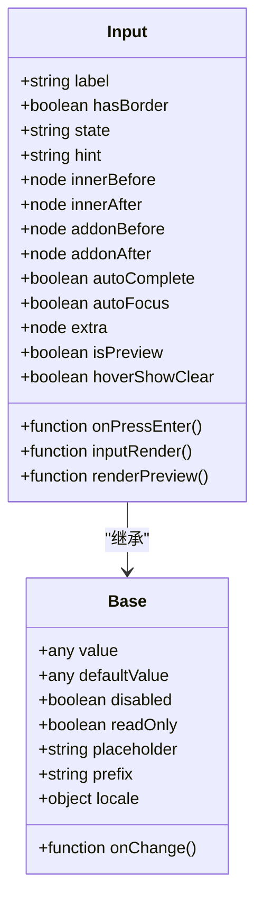
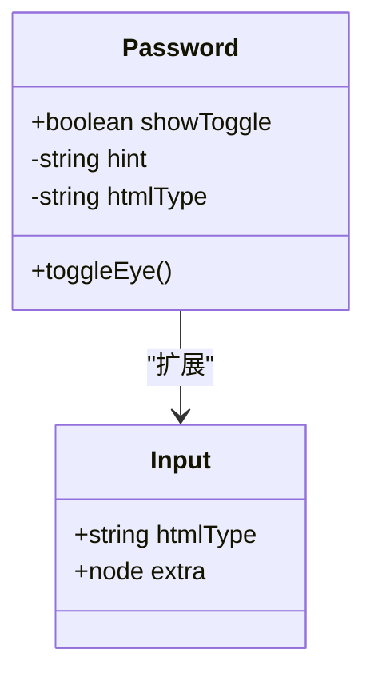
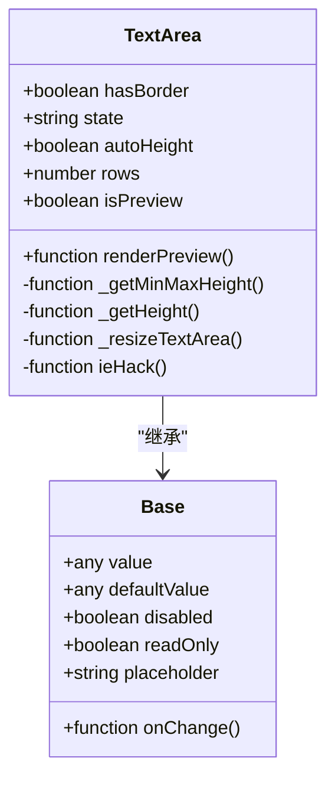
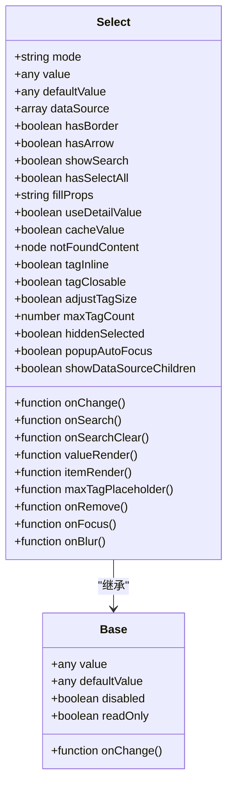
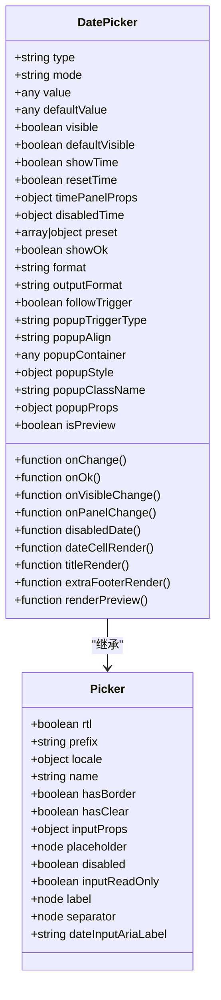
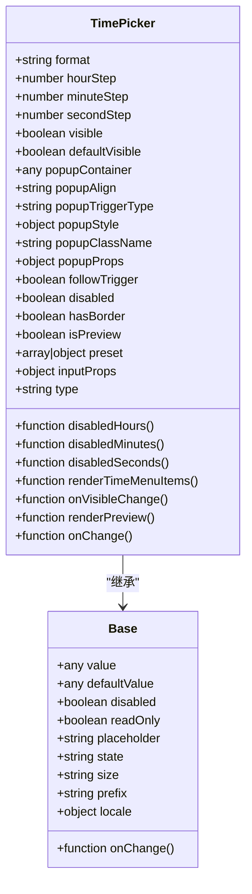
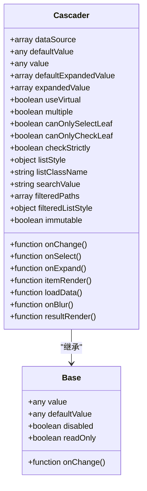
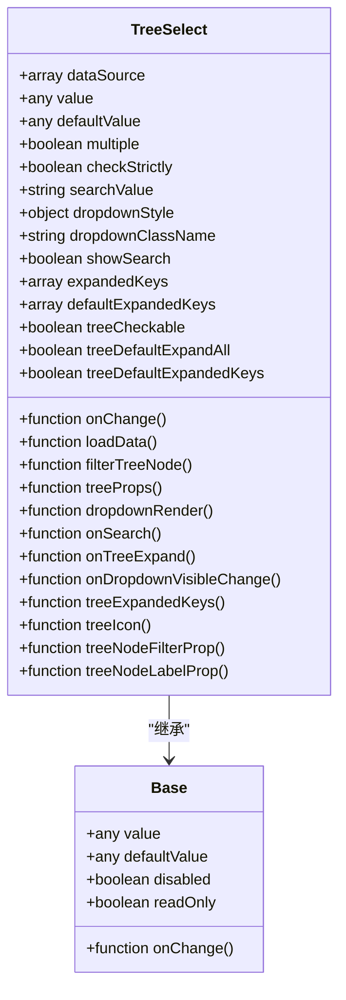

# 输入组件

<cite>
**本文档引用文件**  
- [input.jsx](file://src/input/input.jsx)
- [password.jsx](file://src/input/password.jsx)
- [textarea.jsx](file://src/input/textarea.jsx)
- [index.jsx](file://src/input/index.jsx)
- [select.jsx](file://src/select/select.jsx)
- [picker.jsx](file://src/date-picker/picker.jsx)
- [time-picker.jsx](file://src/time-picker/time-picker.jsx)
- [cascader.jsx](file://src/cascader/cascader.jsx)
- [tree-select.jsx](file://src/tree-select/tree-select.jsx)
- [main.scss](file://src/input/main.scss)
- [variable.scss](file://src/input/scss/variable.scss)
- [util.js](file://src/select/util.js)
- [constant.js](file://src/date-picker/constant.js)
- [utils.js](file://src/cascader/utils.js)
</cite>

## 目录
1. [简介](#简介)
2. [基础输入组件](#基础输入组件)
3. [选择器组件](#选择器组件)
4. [日期时间选择器](#日期时间选择器)
5. [级联选择器](#级联选择器)
6. [树形选择器](#树形选择器)
7. [无障碍访问与键盘导航](#无障碍访问与键盘导航)
8. [性能考量与最佳实践](#性能考量与最佳实践)

## 简介
Fat Design 提供了一套完整的输入组件体系，涵盖从基础输入控件到复杂复合组件的完整解决方案。本文档详细说明了Input、Textarea、Password等基础输入组件的API设计、状态管理机制和样式定制方案。深入分析了Select选择器的下拉菜单实现、搜索过滤和多选模式。文档化了DatePicker和TimePicker的日期时间选择逻辑、格式化选项和国际化支持。解释了Cascader级联选择器的数据结构要求和懒加载实现。说明了TreeSelect树形选择器的节点渲染和选中逻辑。提供了无障碍访问（a11y）支持和键盘导航的详细说明，并包含各组件的性能考量和最佳实践。

## 基础输入组件

### Input 基础输入框
Input 组件是基础的单行文本输入控件，支持多种状态和附加元素。通过 `ConfigProvider.config` 高阶函数进行配置，支持受控和非受控模式。

**核心特性：**
- 支持 `hasBorder` 属性控制边框显示
- 提供 `state` 属性支持错误、加载、成功、警告四种状态
- 支持 `hint` 属性显示水印图标
- 可通过 `innerBefore` 和 `innerAfter` 添加前后附加内容
- 支持 `addonBefore` 和 `addonAfter` 添加输入框前后附加内容
- 提供 `onPressEnter` 回调处理回车事件

**代码结构来源**
- [input.jsx](file://src/input/input.jsx#L20-L199)
- [base.jsx](file://src/input/base.jsx)

### Password 密码输入框
Password 组件基于 Input 组件扩展，专门用于密码输入场景，提供密码可见性切换功能。

**核心特性：**
- 继承所有 Input 组件的属性和功能
- 默认 `htmlType` 为 'password'
- 通过 `showToggle` 属性控制是否显示切换按钮
- 点击眼睛图标可切换密码可见性
- 支持 `hoverShowClear` 属性在悬停时显示清除按钮

**代码结构来源**
- [password.jsx](file://src/password/password.jsx#L1-L52)
- [input.jsx](file://src/input/input.jsx)

### Textarea 多行文本框
Textarea 组件提供多行文本输入功能，支持自动高度调整和预览模式。

**核心特性：**
- 支持 `autoHeight` 属性实现自动高度，可配置最小和最大行数
- 提供 `rows` 属性设置初始行数
- 支持 `isPreview` 预览模式
- 内置兼容性处理，解决 IE 和 Safari 中换行符长度计算问题
- 使用 requestAnimationFrame 优化高度调整性能

**代码结构来源**
- [textarea.jsx](file://src/input/textarea.jsx#L1-L199)
- [base.jsx](file://src/input/base.jsx)

## 选择器组件

### Select 选择器
Select 组件提供下拉选择功能，支持单选、多选和标签模式，具备强大的搜索和过滤能力。

**核心特性：**
- 支持 `mode` 属性设置 'single'、'multiple'、'tag' 三种模式
- 提供 `showSearch` 属性启用搜索功能
- 支持 `dataSource` 数据源动态渲染
- 多选模式下支持 `hasSelectAll` 全选功能
- 提供 `valueRender` 和 `itemRender` 自定义渲染函数
- 支持 `maxTagCount` 限制标签显示数量
- 提供 `tagClosable` 控制标签是否可关闭

**代码结构来源**
- [select.jsx](file://src/select/select.jsx#L1-L199)
- [util.js](file://src/select/util.js)
- [base.jsx](file://src/select/base.jsx)

## 日期时间选择器

### DatePicker 日期选择器
DatePicker 组件提供完整的日期选择功能，支持多种选择模式和格式化选项。

**核心特性：**
- 支持 `type` 属性设置 'date'、'range' 等多种类型
- 提供 `mode` 属性控制面板显示模式
- 支持 `format` 属性自定义日期显示格式
- 提供 `outputFormat` 控制 onChange 事件的输出值格式
- 支持 `disabledDate` 函数禁用特定日期
- 提供 `preset` 预设值功能
- 支持国际化 `locale` 配置

**代码结构来源**
- [picker.jsx](file://src/date-picker/picker.jsx#L1-L199)
- [constant.js](file://src/date-picker/constant.js)
- [util.js](file://src/date-picker/util.js)

### TimePicker 时间选择器
TimePicker 组件提供时间选择功能，支持小时、分钟、秒的选择和步长配置。

**核心特性：**
- 支持 `format` 属性自定义时间格式
- 提供 `hourStep`、`minuteStep`、`secondStep` 设置选项步长
- 支持 `disabledHours`、`disabledMinutes`、`disabledSeconds` 禁用特定时间
- 提供 `renderTimeMenuItems` 自定义时间菜单渲染
- 支持 `preset` 预设值功能
- 提供 `popupContainer` 自定义弹层容器

**代码结构来源**
- [time-picker.jsx](file://src/time-picker/time-picker.jsx#L1-L199)
- [panel.jsx](file://src/time-picker/panel.jsx)
- [utils.js](file://src/time-picker/utils.js)

## 级联选择器

### Cascader 级联选择器
Cascader 组件提供级联选择功能，适用于多层级数据的选择场景。

**核心特性：**
- 支持 `dataSource` 属性定义多层级数据结构
- 提供 `multiple` 属性支持多选模式
- 支持 `canOnlySelectLeaf` 限制只能选择叶子节点
- 提供 `checkStrictly` 控制父子节点选中关联性
- 支持 `loadData` 异步加载数据
- 提供 `expandTriggerType` 设置展开触发方式
- 支持虚拟滚动 `useVirtual` 提升大数据集性能

**代码结构来源**
- [cascader.jsx](file://src/cascader/cascader.jsx#L1-L199)
- [menu.jsx](file://src/cascader/menu.jsx)
- [item.jsx](file://src/cascader/item.jsx)
- [utils.js](file://src/cascader/utils.js)

## 树形选择器

### TreeSelect 树形选择器
TreeSelect 组件提供树形结构的选择功能，结合了树组件和选择器的优点。

**核心特性：**
- 基于树形数据结构展示选项
- 支持节点展开/折叠操作
- 提供多种选择模式
- 支持搜索过滤功能
- 可自定义节点渲染
- 支持异步加载子节点

**代码结构来源**
- [tree-select.jsx](file://src/tree-select/tree-select.jsx)
- [index.jsx](file://src/tree-select/index.jsx)
- [main.scss](file://src/tree-select/main.scss)

## 无障碍访问与键盘导航

### 无障碍访问支持
所有输入组件均遵循 WAI-ARIA 标准，提供完整的无障碍访问支持。

**核心特性：**
- 所有可交互元素都有适当的 `role` 属性
- 提供 `aria-label` 和 `aria-labelledby` 属性
- 支持键盘导航和操作
- 提供焦点管理机制
- 错误状态有适当的 ARIA 属性

### 键盘导航
各组件提供完整的键盘操作支持：

**Input 组件：**
- Tab：移动到下一个可聚焦元素
- Enter：触发 `onPressEnter` 回调
- Esc：清除输入内容（当 `hasClear` 为 true 时）

**Select 组件：**
- Arrow Down：打开下拉菜单，移动到第一个选项
- Arrow Up：打开下拉菜单，移动到最后一个选项
- Arrow Down/Up：在选项间移动
- Enter：选择当前高亮的选项
- Esc：关闭下拉菜单

**DatePicker 组件：**
- Arrow Down：打开日期面板
- Arrow Keys：在日期间移动
- Enter：选择当前高亮的日期
- Esc：关闭面板

**Cascader 组件：**
- Arrow Down：移动到下一个可展开节点
- Arrow Right：展开当前节点
- Arrow Left：折叠当前节点
- Enter：选择当前节点
- Esc：关闭面板

**代码结构来源**
- [input.jsx](file://src/input/input.jsx#L150-L199)
- [select.jsx](file://src/select/select.jsx#L500-L700)
- [picker.jsx](file://src/date-picker/picker.jsx#L300-L500)
- [cascader.jsx](file://src/cascader/cascader.jsx#L400-L600)

## 性能考量与最佳实践

### 性能优化策略
1. **虚拟滚动**：对于大数据集，使用 `useVirtual` 属性启用虚拟滚动
2. **防抖处理**：搜索操作使用防抖技术减少渲染次数
3. **memoization**：使用 React.memo 和 useMemo 优化组件渲染
4. **懒加载**：对于级联选择器，使用 `loadData` 实现按需加载

### 最佳实践
1. **受控组件**：优先使用受控模式管理组件状态
2. **合理使用 defaultValue**：仅在需要非受控模式时使用
3. **性能监控**：对于大数据集，监控组件渲染性能
4. **样式定制**：通过 CSS 变量而非直接修改样式文件进行定制
5. **国际化**：使用 `locale` 属性支持多语言

### 常见问题与解决方案
1. **大数据集卡顿**：启用虚拟滚动或分页加载
2. **搜索性能问题**：实现服务端搜索而非客户端过滤
3. **内存泄漏**：确保在组件卸载时清理定时器和事件监听器
4. **样式冲突**：使用 CSS 模块或命名空间避免样式污染

**代码结构来源**
- [select.jsx](file://src/select/select.jsx#L1000-L1160)
- [cascader.jsx](file://src/cascader/cascader.jsx#L800-L850)
- [picker.jsx](file://src/date-picker/picker.jsx#L700-L734)
- [time-picker.jsx](file://src/time-picker/time-picker.jsx#L700-L724)