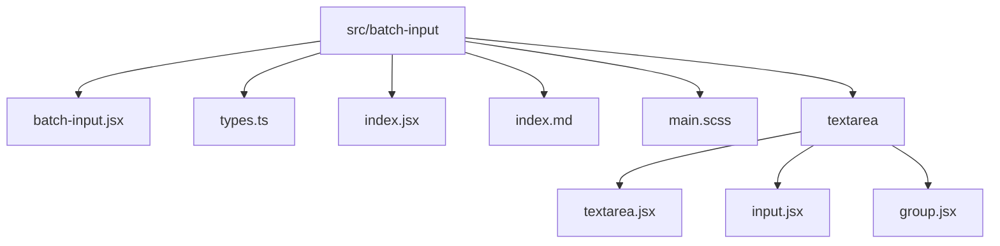
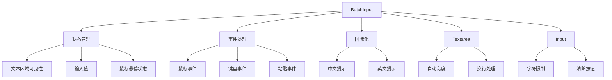
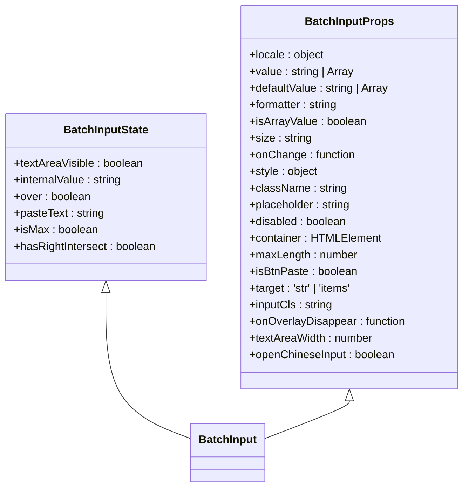
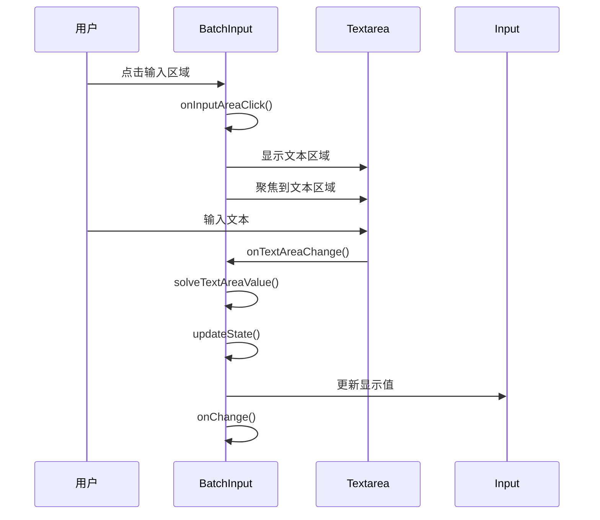
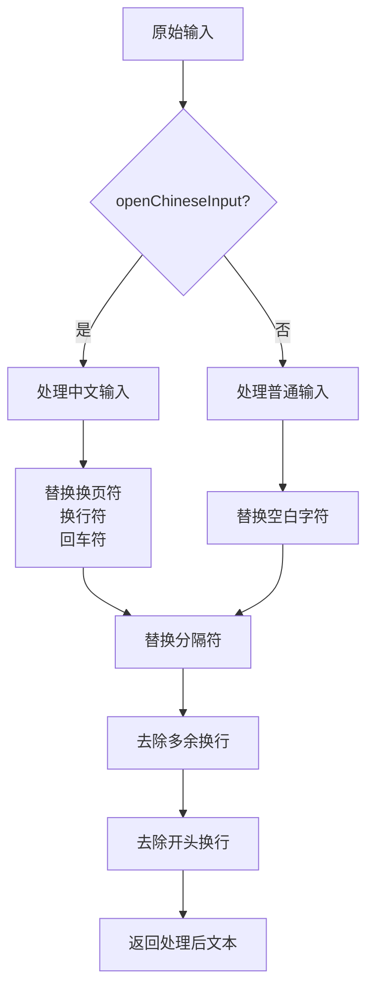
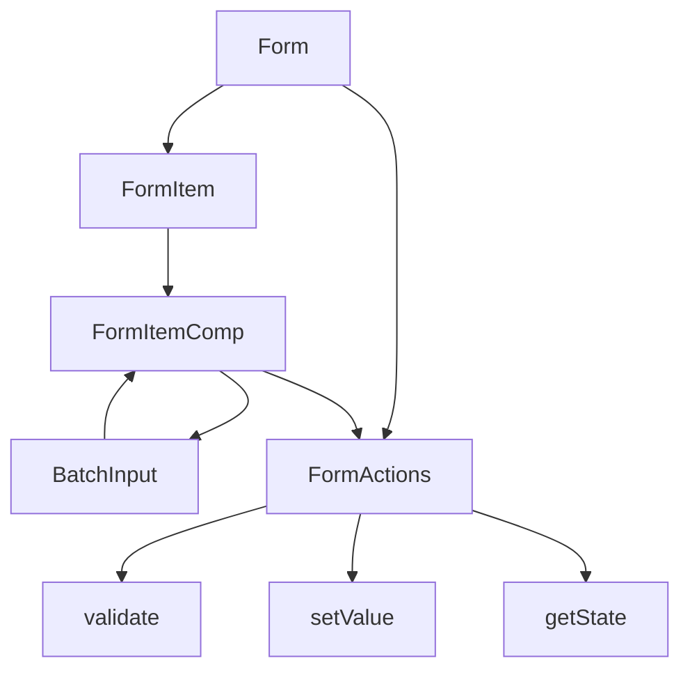
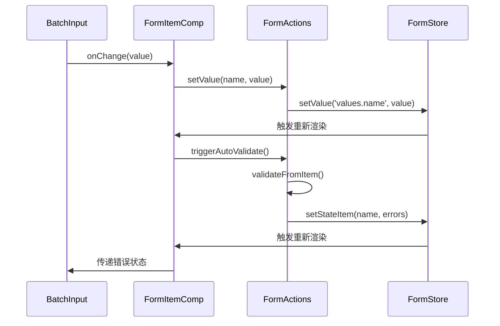
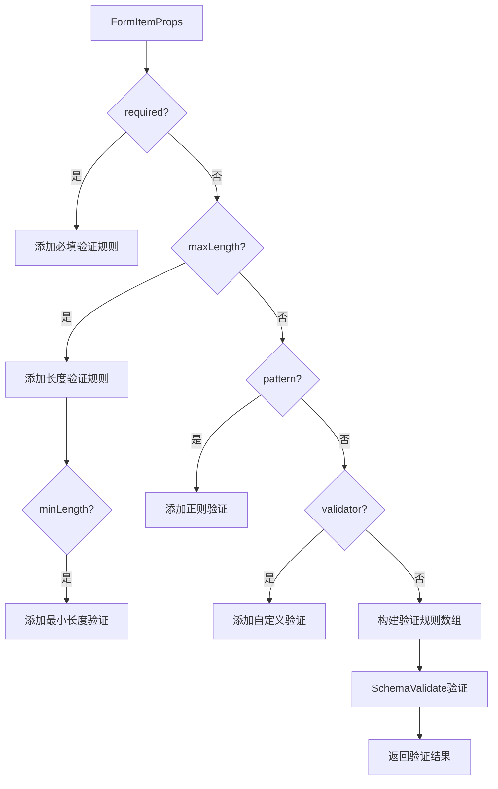
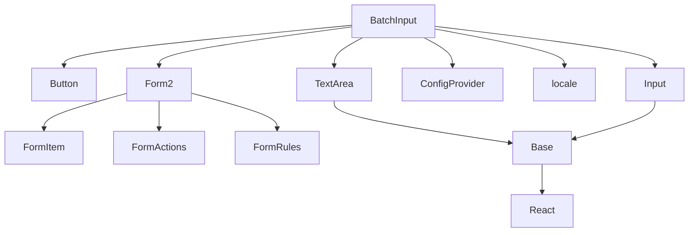

# BatchInput 批量输入

<cite>
**本文档引用的文件**  
- [batch-input.jsx](file://src/batch-input/batch-input.jsx)
- [types.ts](file://src/batch-input/types.ts)
- [textarea.jsx](file://src/batch-input/textarea/textarea.jsx)
- [input.jsx](file://src/batch-input/textarea/input.jsx)
- [index.md](file://src/batch-input/index.md)
- [form-item-comp.tsx](file://src/form2/form-item-comp.tsx)
- [form-actions.ts](file://src/form2/form-actions.ts)
- [form-rules.ts](file://src/form2/form-rules.ts)
- [form.tsx](file://src/form2/form.tsx)
- [demo-form3.tsx](file://demo/demo-form3.tsx)
- [demo-doc\BatchInput组件使用文档.md](file://demo-doc/BatchInput组件使用文档.md)
</cite>

## 目录
1. [简介](#简介)
2. [项目结构](#项目结构)
3. [核心组件](#核心组件)
4. [架构概述](#架构概述)
5. [详细组件分析](#详细组件分析)
6. [依赖分析](#依赖分析)
7. [性能考虑](#性能考虑)
8. [故障排除指南](#故障排除指南)
9. [结论](#结论)

## 简介
BatchInput 批量输入组件是专为高效处理大量文本数据快速录入场景而设计的高级输入控件。该组件支持从Excel等外部来源复制粘贴大量数据，通过换行符或指定分隔符（如逗号）将输入的文本解析为结构化数据数组。组件提供了自动高度调整的文本区域，用户可以直观地查看和编辑多行输入内容。它继承了标准输入组件的API，并扩展了批量处理功能，包括数据清洗、格式化和计数限制。组件与Form2表单系统深度集成，支持表单验证、联动更新和错误状态显示，确保数据质量和用户体验。BatchInput广泛应用于用户导入名单、标签批量添加、订单号批量处理等需要高效数据录入的业务场景。

## 项目结构
BatchInput组件位于`src/batch-input`目录下，采用模块化设计，由多个子组件构成。主组件`batch-input.jsx`负责整体逻辑和状态管理，`textarea`子目录包含文本区域和输入框的具体实现。类型定义文件`types.ts`提供了组件的TypeScript接口，`index.md`包含API文档和使用指南。组件通过`index.jsx`导出，经过ConfigProvider配置化处理，确保主题和国际化的一致性。

**图源**  
- [batch-input.jsx](file://src/batch-input/batch-input.jsx)
- [types.ts](file://src/batch-input/types.ts)
- [textarea.jsx](file://src/batch-input/textarea/textarea.jsx)

**本节来源**  
- [batch-input.jsx](file://src/batch-input/batch-input.jsx)
- [types.ts](file://src/batch-input/types.ts)

## 核心组件
BatchInput组件的核心功能包括文本区域的自动高度调整、基于分隔符的数据解析、数据清洗和格式化。组件通过`autoHeight`属性实现文本区域的动态高度调整，提升用户体验。`solveTextAreaValue`方法处理换行分割逻辑，将输入的文本按换行符或指定分隔符（如逗号）分割为数组。`format`方法实现数据清洗策略，根据`formatter`属性对输入值进行过滤和标准化。组件通过`onChange`回调将解析后的结构化数据返回给父组件，支持受控和非受控两种使用模式。`maxLength`和`maxItems`属性用于限制输入条目数量，防止性能问题。

**本节来源**  
- [batch-input.jsx](file://src/batch-input/batch-input.jsx#L1-L440)
- [textarea.jsx](file://src/batch-input/textarea/textarea.jsx#L1-L363)

## 架构概述
BatchInput组件采用分层架构设计，上层为`batch-input.jsx`主组件，负责状态管理和用户交互逻辑；中层为`textarea`和`input`子组件，提供具体的UI渲染和输入处理；底层为`Base`基类组件，提供输入控件的通用功能。组件通过React的ref机制访问底层DOM节点，实现焦点控制和样式操作。事件处理系统包括鼠标事件（onMouseEnter/onMouseLeave）、键盘事件（onKeyDown）和粘贴事件（onPaste），确保各种输入场景的兼容性。国际化支持通过`locale`属性注入，允许自定义各种状态下的提示文本。

**图源**  
- [batch-input.jsx](file://src/batch-input/batch-input.jsx#L1-L440)
- [textarea.jsx](file://src/batch-input/textarea/textarea.jsx#L1-L363)
- [input.jsx](file://src/batch-input/textarea/input.jsx#L1-L456)

## 详细组件分析

### BatchInput 主组件分析
BatchInput主组件实现了批量输入的核心逻辑，包括状态管理、事件处理和UI渲染。组件使用`useState`和`useRef`钩子管理内部状态和DOM引用，通过`useEffect`钩子处理生命周期事件。`useMouseOver`自定义钩子管理鼠标悬停状态，`useGlobalEvent`处理全局点击和滚动事件，确保下拉文本区域在页面滚动时正确定位。

#### 状态管理

**图源**  
- [batch-input.jsx](file://src/batch-input/batch-input.jsx#L1-L440)
- [types.ts](file://src/batch-input/types.ts#L1-L33)

#### 事件处理流程

**图源**  
- [batch-input.jsx](file://src/batch-input/batch-input.jsx#L1-L440)
- [textarea.jsx](file://src/batch-input/textarea/textarea.jsx#L1-L363)

#### 数据处理流程

**图源**  
- [batch-input.jsx](file://src/batch-input/batch-input.jsx#L1-L440)
- [textarea.jsx](file://src/batch-input/textarea/textarea.jsx#L1-L363)

**本节来源**  
- [batch-input.jsx](file://src/batch-input/batch-input.jsx#L1-L440)
- [types.ts](file://src/batch-input/types.ts#L1-L33)

### 与Form2集成分析
BatchInput组件与Form2表单系统深度集成，支持表单验证、联动更新和错误状态显示。集成通过Form2的`FormItem`组件实现，BatchInput作为`component`属性的值传递给`FormItem`。Form2的`form-item-comp.tsx`文件中的`FormItemComp`组件负责处理所有表单控件的通用逻辑，包括状态管理、事件处理和验证。

#### 集成架构

**图源**  
- [form-item-comp.tsx](file://src/form2/form-item-comp.tsx#L1-L199)
- [form-actions.ts](file://src/form2/form-actions.ts#L1-L199)

#### 数据流分析

**图源**  
- [form-item-comp.tsx](file://src/form2/form-item-comp.tsx#L1-L199)
- [form-actions.ts](file://src/form2/form-actions.ts#L1-L199)
- [form-rules.ts](file://src/form2/form-rules.ts#L1-L136)

#### 验证规则处理

**图源**  
- [form-rules.ts](file://src/form2/form-rules.ts#L1-L136)
- [form-actions.ts](file://src/form2/form-actions.ts#L1-L199)

**本节来源**  
- [form-item-comp.tsx](file://src/form2/form-item-comp.tsx#L1-L199)
- [form-actions.ts](file://src/form2/form-actions.ts#L1-L199)
- [form-rules.ts](file://src/form2/form-rules.ts#L1-L136)
- [form.tsx](file://src/form2/form.tsx#L1-L181)

## 依赖分析
BatchInput组件依赖多个核心模块，包括`Button`、`TextArea`、`Input`、`ConfigProvider`和`locale`。`Button`用于实现"重复上次"功能，`TextArea`和`Input`提供基础输入功能，`ConfigProvider`处理主题和配置，`locale`提供国际化支持。组件通过`ConfigProvider.configFn`进行配置化处理，确保与应用整体风格一致。与Form2的集成依赖`form-item-comp.tsx`、`form-actions.ts`和`form-rules.ts`等文件，实现表单状态管理和验证功能。

**图源**  
- [batch-input.jsx](file://src/batch-input/batch-input.jsx#L1-L440)
- [form-item-comp.tsx](file://src/form2/form-item-comp.tsx#L1-L199)

**本节来源**  
- [batch-input.jsx](file://src/batch-input/batch-input.jsx#L1-L440)
- [form-item-comp.tsx](file://src/form2/form-item-comp.tsx#L1-L199)
- [form-actions.ts](file://src/form2/form-actions.ts#L1-L199)

## 性能考虑
BatchInput组件在处理超长文本输入时采用了多种性能优化策略。首先，使用`requestAnimationFrame`进行防抖处理，避免频繁的DOM操作。`onNextFrame`和`clearNextFrameAction`函数确保文本区域高度调整在浏览器重绘周期内执行，减少重排和重绘的开销。其次，通过`maxLength`属性限制输入条目数量，防止内存占用过高。对于大量数据的粘贴操作，组件在`onTextAreaPaste`事件中进行批量处理，避免逐字符处理的性能瓶颈。此外，使用`IntersectionObserver`检测文本区域是否超出视口，动态调整位置，避免不必要的样式计算。

**本节来源**  
- [textarea.jsx](file://src/batch-input/textarea/textarea.jsx#L1-L363)
- [batch-input.jsx](file://src/batch-input/batch-input.jsx#L1-L440)

## 故障排除指南
在使用BatchInput组件时可能遇到一些常见问题，以下是解决方案：

1. **中文输入法问题**：当`openChineseInput`为`true`时才能正确处理中文输入，否则换行符可能无法正确识别。
2. **数据格式问题**：当`isArrayValue`为`true`时，`value`应为数组类型，否则可能导致解析错误。
3. **性能问题**：处理大量数据时建议设置合理的`maxLength`限制，避免浏览器卡顿。
4. **集成问题**：与Form2集成时，确保`FormItem`的`name`属性唯一，否则可能导致状态管理混乱。
5. **样式问题**：自定义样式时应通过`className`和`style`属性，避免直接修改组件内部样式。

**本节来源**  
- [demo-doc\BatchInput组件使用文档.md](file://demo-doc/BatchInput组件使用文档.md#L522-L528)
- [batch-input.jsx](file://src/batch-input/batch-input.jsx#L1-L440)

## 结论
BatchInput批量输入组件是一个功能强大且高度可定制的输入控件，专为高效处理大量文本数据而设计。组件通过自动高度调整的文本区域、灵活的分隔符解析和数据清洗策略，提供了优秀的用户体验。与Form2表单系统的深度集成确保了数据验证和状态管理的一致性。组件的模块化设计和清晰的API使其易于使用和扩展。通过合理的性能优化策略，组件能够高效处理大规模数据输入场景。在用户导入名单、标签批量添加等业务场景中，BatchInput显著提升了数据录入效率和准确性。