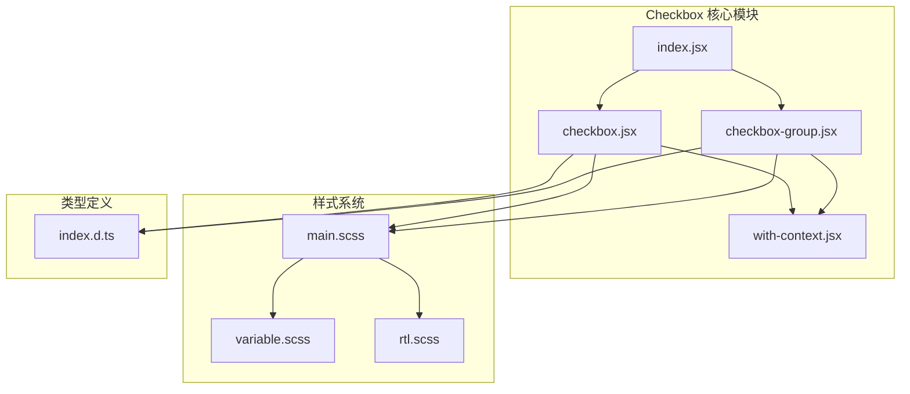
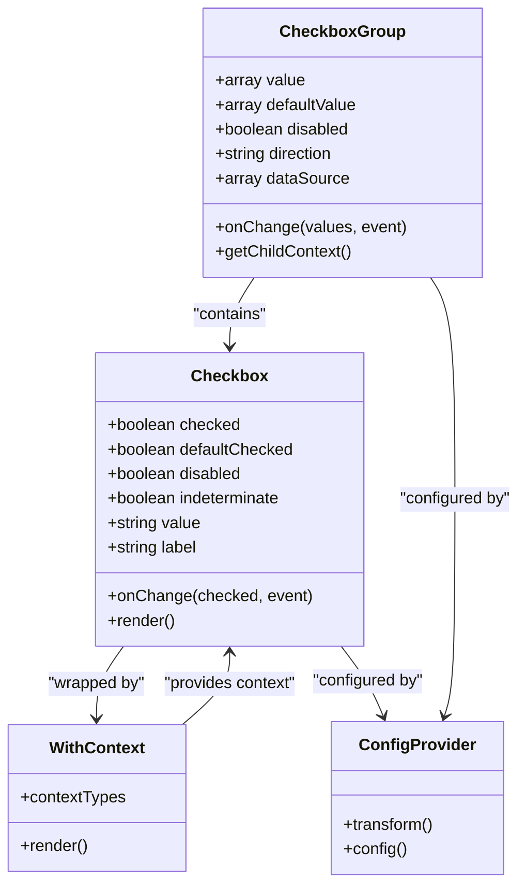
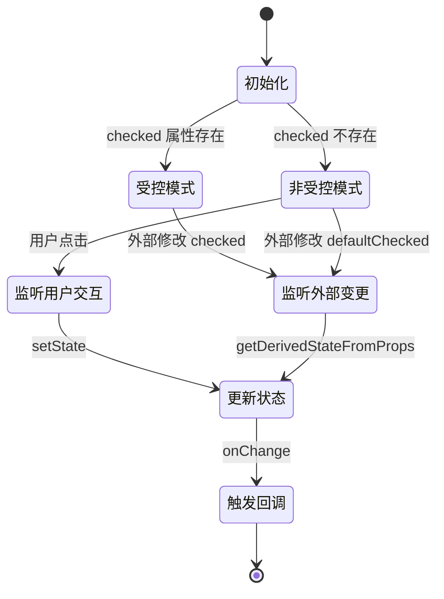
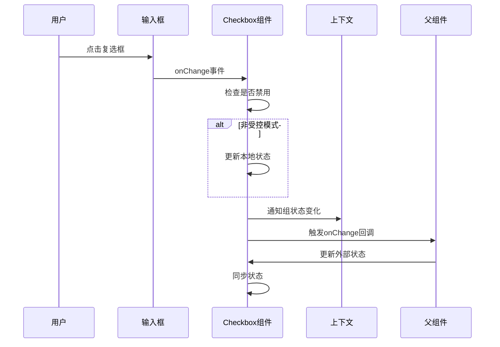

# Checkbox 复选框组件技术文档

<cite>
**本文档引用的文件**
- [checkbox.jsx](file://src/checkbox/checkbox.jsx)
- [checkbox-group.jsx](file://src/checkbox/checkbox-group.jsx)
- [index.jsx](file://src/checkbox/index.jsx)
- [with-context.jsx](file://src/checkbox/with-context.jsx)
- [main.scss](file://src/checkbox/main.scss)
- [variable.scss](file://src/checkbox/scss/variable.scss)
- [rtl.scss](file://src/checkbox/rtl.scss)
- [index.d.ts](file://types/checkbox/index.d.ts)
- [demo-form1.tsx](file://demo/demo-form1.tsx)
</cite>

## 目录
1. [简介](#简介)
2. [项目结构](#项目结构)
3. [核心组件](#核心组件)
4. [架构概览](#架构概览)
5. [详细组件分析](#详细组件分析)
6. [Form2 集成](#form2-集成)
7. [无障碍访问支持](#无障碍访问支持)
8. [自定义样式和主题](#自定义样式和主题)
9. [性能优化](#性能优化)
10. [实际代码示例](#实际代码示例)
11. [故障排除指南](#故障排除指南)
12. [总结](#总结)

## 简介

Checkbox 复选框组件是 Fat Design 设计系统中的核心数据输入组件之一，提供了单个选项和分组选择的完整功能。该组件支持受控与非受控模式，具有完整的表单验证集成能力，同时具备优秀的无障碍访问支持和高度可定制的外观。

组件设计遵循 React 最佳实践，采用面向对象的组件架构，通过 Context 提供跨层级通信能力，确保在复杂表单场景下的稳定性和可维护性。

## 项目结构

Checkbox 组件的文件组织结构清晰明确，每个文件都有特定的职责：



**图表来源**
- [index.jsx](file://src/checkbox/index.jsx#L1-L23)
- [checkbox.jsx](file://src/checkbox/checkbox.jsx#L1-L311)
- [checkbox-group.jsx](file://src/checkbox/checkbox-group.jsx#L1-L241)

**章节来源**
- [index.jsx](file://src/checkbox/index.jsx#L1-L23)
- [main.scss](file://src/checkbox/main.scss#L1-L210)

## 核心组件

Checkbox 组件由三个核心部分组成：单个 Checkbox、CheckboxGroup 分组组件和上下文包装器。

### 单个 Checkbox 组件

单个 Checkbox 组件负责处理独立的复选框状态管理，支持受控和非受控两种模式：

```javascript
// 受控模式
<Checkbox checked={isChecked} onChange={handleChange} />

// 非受控模式  
<Checkbox defaultChecked={true} />
```

### CheckboxGroup 分组组件

CheckboxGroup 提供了多个复选框的统一管理，支持数组形式的值绑定：

```javascript
// 基本用法
<Checkbox.Group
    value={selectedValues}
    onChange={handleGroupChange}
    dataSource={[
        { value: 'A', label: '选项A' },
        { value: 'B', label: '选项B' },
        { value: 'C', label: '选项C' }
    ]}
/>
```

### 上下文包装器

withContext 包装器提供了跨层级的状态共享能力：

```javascript
// 内部状态共享
const context = {
    __group__: true,
    onChange: this.onChange,
    selectedValue: this.state.value,
    disabled: this.props.disabled
};
```

**章节来源**
- [checkbox.jsx](file://src/checkbox/checkbox.jsx#L1-L311)
- [checkbox-group.jsx](file://src/checkbox/checkbox-group.jsx#L1-L241)
- [with-context.jsx](file://src/checkbox/with-context.jsx#L1-L20)

## 架构概览

Checkbox 组件采用了分层架构设计，确保了组件的可扩展性和可维护性：



**图表来源**
- [checkbox.jsx](file://src/checkbox/checkbox.jsx#L20-L100)
- [checkbox-group.jsx](file://src/checkbox/checkbox-group.jsx#L10-L80)
- [with-context.jsx](file://src/checkbox/with-context.jsx#L1-L20)

**章节来源**
- [checkbox.jsx](file://src/checkbox/checkbox.jsx#L1-L311)
- [checkbox-group.jsx](file://src/checkbox/checkbox-group.jsx#L1-L241)

## 详细组件分析

### Checkbox 单个组件

#### 状态管理机制

Checkbox 组件实现了复杂的受控与非受控状态管理：



**图表来源**
- [checkbox.jsx](file://src/checkbox/checkbox.jsx#L70-L120)

#### 半选状态处理

组件支持半选（indeterminate）状态，用于表示部分选中：

```javascript
// 半选状态的实现
const indeterminate = !!this.state.indeterminate;
const type = indeterminate ? 'semi-select' : 'select';

// ARIA 属性设置
<input
    aria-checked={indeterminate ? 'mixed' : checked}
/>
```

#### 事件处理流程



**图表来源**
- [checkbox.jsx](file://src/checkbox/checkbox.jsx#L170-L200)

### CheckboxGroup 分组组件

#### 数据源处理

CheckboxGroup 支持多种数据源格式：

```javascript
// 字符串数组格式
dataSource={['Apple', 'Banana', 'Cherry']}

// 对象数组格式
dataSource={[
    { value: 'A', label: '选项A', disabled: true },
    { value: 'B', label: '选项B' }
]}

// 子元素方式
<Checkbox.Group>
    <Checkbox value="A">选项A</Checkbox>
    <Checkbox value="B">选项B</Checkbox>
</Checkbox.Group>
```

#### 排列方向控制

```javascript
// 水平排列（默认）
direction="hoz"

// 垂直排列
direction="ver"
```

**章节来源**
- [checkbox.jsx](file://src/checkbox/checkbox.jsx#L170-L311)
- [checkbox-group.jsx](file://src/checkbox/checkbox-group.jsx#L1-L241)

## Form2 集成

Checkbox 组件与 Form2 表单系统深度集成，提供了完整的表单验证和联动功能：

### 表单验证集成

```javascript
// 在 FormItem 中使用
<FormItem 
    label="复选框组"
    name="checkboxgroup1"
    component="CheckboxGroup"
    rules={[{ required: true, message: '请选择至少一个选项' }]}
/>
```

### 联动逻辑

```javascript
// 条件显示
<FormItem 
    label="条件复选框"
    name="conditionalCheckbox"
    display={(values) => values.someCondition === true}
/>

// 条件禁用
<FormItem 
    label="条件禁用"
    name="disabledCheckbox"
    disabled={(values) => values.disableCondition === true}
/>
```

### 布尔组件适配

```javascript
// BoolCheckbox 适配布尔值
Checkbox.BoolCheckbox = ConfigProvider.createBoolComponent(Checkbox, 'BoolCheckbox');

// 使用示例
<Checkbox.BoolCheckbox 
    value={booleanValue}
    onChange={setBooleanValue}
/>
```

**章节来源**
- [index.jsx](file://src/checkbox/index.jsx#L10-L23)
- [demo-form1.tsx](file://demo/demo-form1.tsx#L70-L85)

## 无障碍访问支持

Checkbox 组件全面支持无障碍访问标准，确保残障用户能够正常使用：

### ARIA 属性设置

```javascript
// 核心 ARIA 属性
<input
    aria-checked={indeterminate ? 'mixed' : checked}
    aria-labelledby={labelId}
    aria-describedby={descriptionId}
/>
```

### 键盘导航支持

```javascript
// Tab 键导航
<div className="checkbox-wrapper">
    <input type="checkbox" tabIndex={0} />
</div>

// Space 键切换
<div 
    onKeyDown={this.handleKeyDown}
    role="checkbox"
    tabIndex={0}
    aria-checked={checked}
>
    <input type="checkbox" />
</div>
```

### 屏幕阅读器友好

```javascript
// 语义化的标签结构
<label className="checkbox-wrapper">
    <span className="checkbox">
        <span className="checkbox-inner">
            <Icon type={type} size="xs" />
        </span>
        <input type="checkbox" />
    </span>
    <span className="checkbox-label">{label}</span>
</label>
```

**章节来源**
- [checkbox.jsx](file://src/checkbox/checkbox.jsx#L230-L240)
- [main.scss](file://src/checkbox/main.scss#L1-L210)

## 自定义样式和主题

### SCSS 变量系统

Checkbox 组件提供了完整的 SCSS 变量系统，支持主题定制：

```scss
// 尺寸变量
$checkbox-size: $s-4 !default;
$checkbox-border-radius: $corner-1 !default;
$checkbox-circle-size: $icon-xxs !default;

// 颜色变量
$checkbox-border-color: $color-line1-3 !default;
$checkbox-checked-border-color: $color-transparent !default;
$checkbox-checked-bg-color: $color-brand1-6 !default;
$checkbox-disabled-border-color: $color-line1-1 !default;

// 状态变量
$checkbox-checked-circle-color: $color-white !default;
$checkbox-disabled-circle-color: $color-text1-1 !default;
```

### 主题覆盖方法

```scss
// 自定义主题
@import '~@alifd/fat-design/src/checkbox/main.scss';

// 覆盖默认变量
$checkbox-size: 20px;
$checkbox-checked-bg-color: #ff5722;

// 重新编译样式
@include checkbox-theme();
```

### CSS 类名定制

```javascript
// 自定义类名
<Checkbox 
    className="custom-checkbox"
    style={{ color: '#ff5722' }}
/>

// 预览态样式
<Checkbox 
    isPreview={true}
    renderPreview={(checked, props) => (
        <span>{checked ? '已选中' : '未选中'}</span>
    )}
/>
```

**章节来源**
- [variable.scss](file://src/checkbox/scss/variable.scss#L1-L96)
- [main.scss](file://src/checkbox/main.scss#L1-L210)

## 性能优化

### 大型列表优化策略

对于包含大量选项的场景，推荐使用以下优化策略：

#### 虚拟滚动集成

```javascript
// 结合虚拟列表组件
import { VirtualList } from '@alifd/fat-design';

<VirtualList
    height={400}
    itemHeight={40}
    itemCount={largeDataSource.length}
    renderItem={({ index }) => {
        const item = largeDataSource[index];
        return (
            <Checkbox
                key={item.value}
                value={item.value}
                checked={selectedValues.includes(item.value)}
            >
                {item.label}
            </Checkbox>
        );
    }}
/>
```

#### 分页加载

```javascript
// 分页处理
const [page, setPage] = useState(1);
const pageSize = 50;

<Checkbox.Group
    dataSource={paginatedData}
    value={selectedValues}
    onChange={handlePageChange}
/>
```

#### 选择器优化

```javascript
// 全选/取消全选优化
const handleSelectAll = useCallback(() => {
    if (selectedValues.length === dataSource.length) {
        // 已全选，执行取消
        onChange([], event);
    } else {
        // 未全选，执行全选
        onChange(dataSource.map(item => item.value), event);
    }
}, [selectedValues, dataSource]);
```

**章节来源**
- [checkbox-group.jsx](file://src/checkbox/checkbox-group.jsx#L164-L205)

## 实际代码示例

### 基本用法示例

```javascript
// 单个复选框
function BasicCheckboxExample() {
    const [checked, setChecked] = useState(false);
    
    return (
        <Checkbox 
            checked={checked}
            onChange={setChecked}
            label="同意条款"
        />
    );
}

// 复选框组
function CheckboxGroupExample() {
    const [selected, setSelected] = useState(['A']);
    
    return (
        <Checkbox.Group
            value={selected}
            onChange={setSelected}
            dataSource={[
                { value: 'A', label: '选项A' },
                { value: 'B', label: '选项B' },
                { value: 'C', label: '选项C' }
            ]}
        />
    );
}
```

### 半选状态示例

```javascript
// 全选/部分选中状态
function IndeterminateCheckboxExample() {
    const [selected, setSelected] = useState(['A', 'B']);
    const dataSource = ['A', 'B', 'C'];
    
    const isAllSelected = selected.length === dataSource.length;
    const isIndeterminate = selected.length > 0 && !isAllSelected;
    
    const handleSelectAll = () => {
        setSelected(isAllSelected ? [] : dataSource);
    };
    
    return (
        <>
            <Checkbox
                checked={isAllSelected}
                indeterminate={isIndeterminate}
                onChange={handleSelectAll}
                label="全选"
            />
            <Checkbox.Group
                value={selected}
                onChange={setSelected}
                dataSource={dataSource.map(value => ({ value, label: `选项${value}` }))}
            />
        </>
    );
}
```

### 禁用状态示例

```javascript
// 动态禁用
function DisabledCheckboxExample() {
    const [enabled, setEnabled] = useState(true);
    
    return (
        <>
            <Checkbox
                disabled={!enabled}
                label="启用复选框"
                onChange={setEnabled}
            />
            <Checkbox
                disabled
                label="禁用的复选框"
            />
        </>
    );
}
```

### 分组布局示例

```javascript
// 不同排列方向
function LayoutExamples() {
    return (
        <div>
            <h4>水平排列</h4>
            <Checkbox.Group
                direction="hoz"
                dataSource={['A', 'B', 'C']}
            />
            
            <h4>垂直排列</h4>
            <Checkbox.Group
                direction="ver"
                dataSource={['A', 'B', 'C']}
            />
        </div>
    );
}
```

**章节来源**
- [demo-form1.tsx](file://demo/demo-form1.tsx#L70-L85)
- [checkbox-group.jsx](file://src/checkbox/checkbox-group.jsx#L164-L205)

## 故障排除指南

### 常见问题及解决方案

#### 1. 状态不更新问题

**问题**: 受控模式下，外部状态改变但组件不更新

**解决方案**:
```javascript
// 确保正确传递 key
<Checkbox
    key={componentKey} // 添加唯一 key
    checked={externalValue}
    onChange={handleChange}
/>
```

#### 2. 性能问题

**问题**: 大量复选框导致页面卡顿

**解决方案**:
```javascript
// 使用虚拟滚动
<VirtualList
    itemCount={items.length}
    itemHeight={40}
    renderItem={({ index }) => (
        <Checkbox
            value={items[index].value}
            checked={selected.includes(items[index].value)}
        />
    )}
/>
```

#### 3. 无障碍访问问题

**问题**: 屏幕阅读器无法识别复选框状态

**解决方案**:
```javascript
// 添加正确的 ARIA 属性
<Checkbox
    id="unique-checkbox-id"
    label="选项名称"
    aria-describedby="description-id"
/>
```

#### 4. 样式冲突

**问题**: 自定义样式与其他组件样式冲突

**解决方案**:
```javascript
// 使用更具体的选择器
.checkbox-wrapper.custom-class {
    // 自定义样式
}
```

**章节来源**
- [checkbox.jsx](file://src/checkbox/checkbox.jsx#L120-L170)

## 总结

Checkbox 复选框组件是一个功能完整、设计精良的数据输入组件，具有以下特点：

### 核心优势

1. **完整的状态管理**: 支持受控和非受控模式，灵活适应不同使用场景
2. **强大的表单集成**: 与 Form2 系统无缝集成，支持表单验证和联动逻辑
3. **无障碍访问支持**: 完整的 ARIA 属性和键盘导航支持
4. **高度可定制**: 丰富的 SCSS 变量系统和 CSS 类名定制能力
5. **性能优化**: 支持虚拟滚动和分页等性能优化策略

### 技术特色

- 采用面向对象的组件架构，确保代码的可维护性
- 通过 Context 提供跨层级状态共享能力
- 实现了复杂的半选状态处理机制
- 提供了完整的 TypeScript 类型定义

### 最佳实践建议

1. 在大型表单中优先考虑使用 CheckboxGroup 组件
2. 合理使用半选状态来提升用户体验
3. 注意无障碍访问的实现，特别是 ARIA 属性的正确设置
4. 在性能敏感场景下，优先考虑虚拟滚动方案
5. 利用主题变量系统实现一致的品牌视觉效果

Checkbox 组件作为 Fat Design 设计系统的重要组成部分，为开发者提供了强大而灵活的数据输入解决方案，满足了从简单表单到复杂业务场景的各种需求。