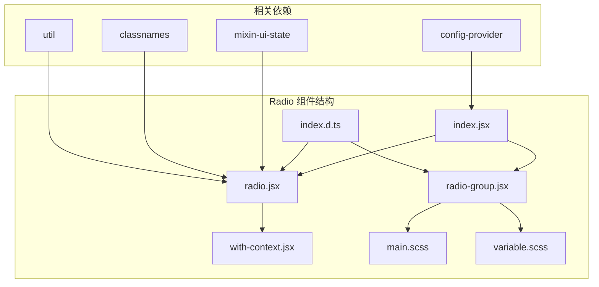
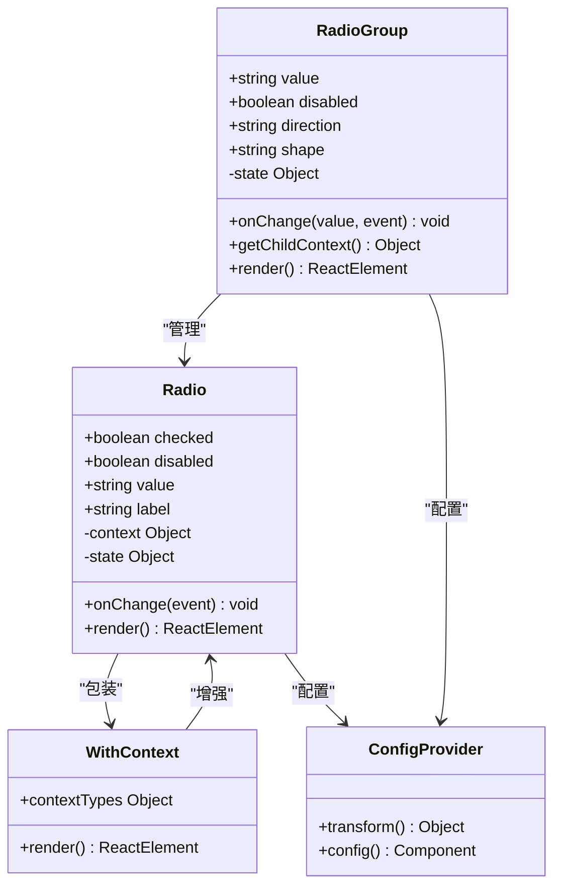
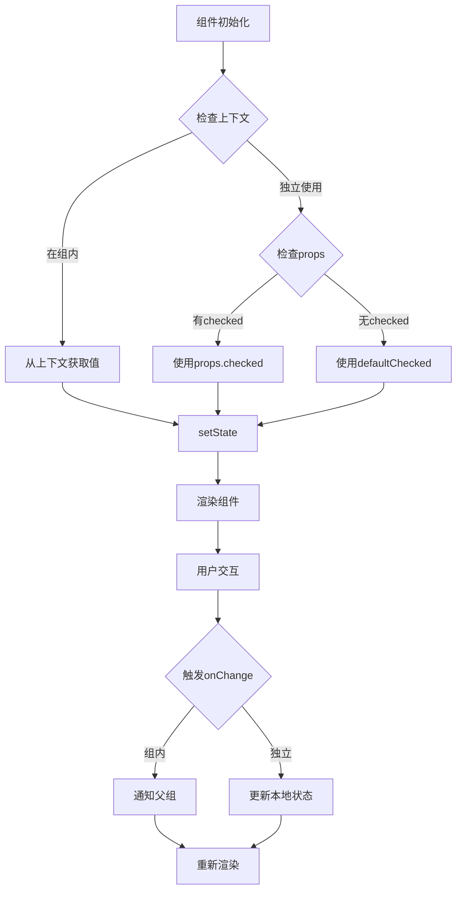
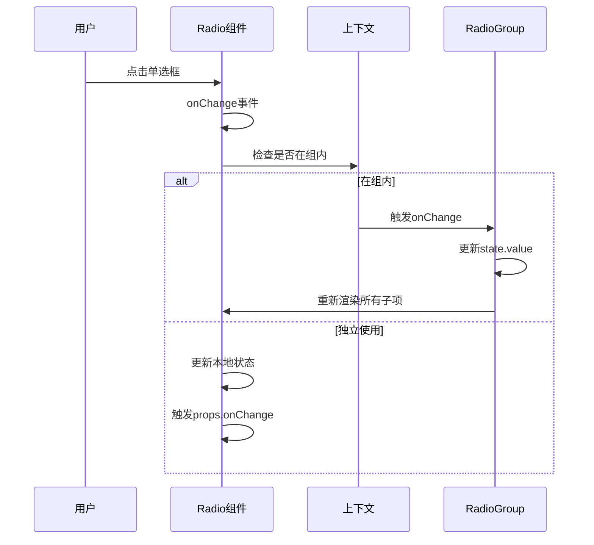
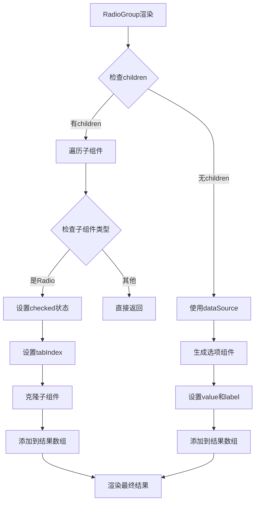
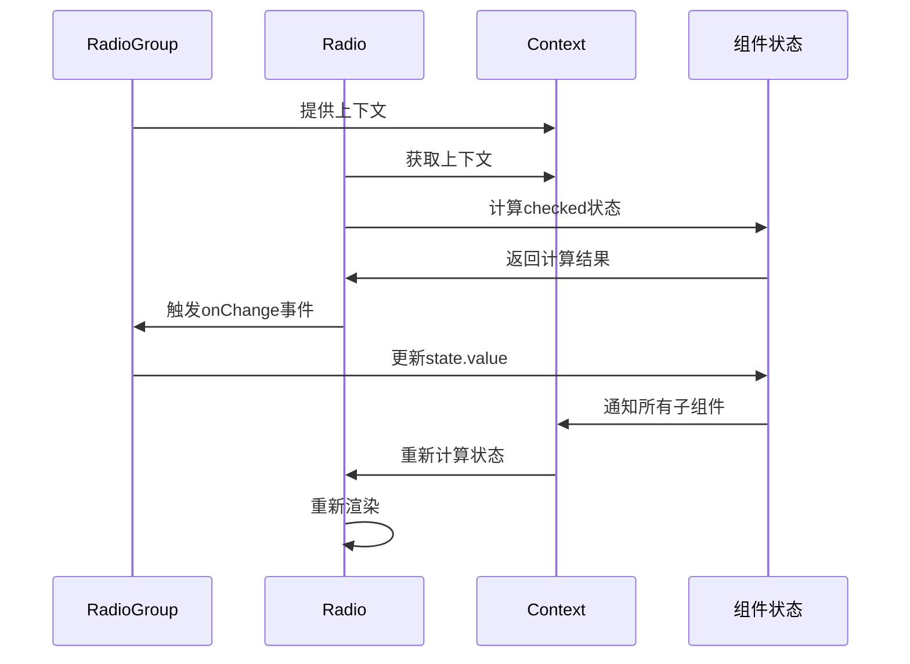
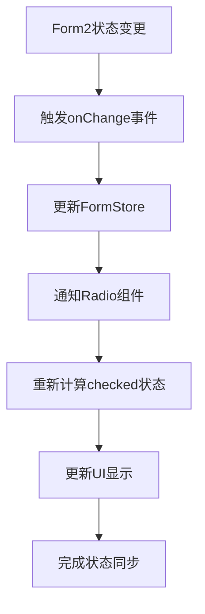
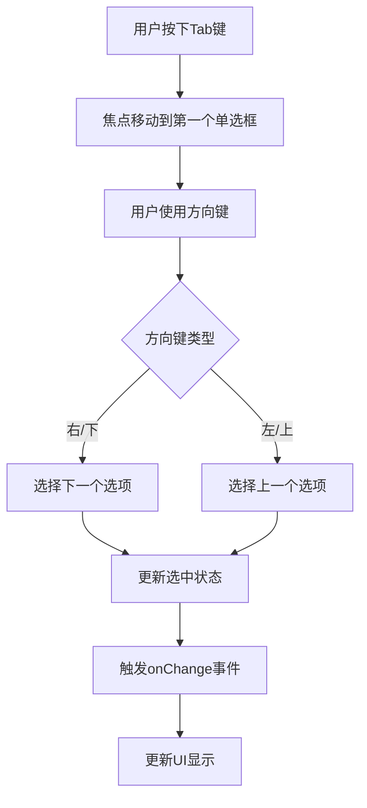

# Radio 单选框组件技术文档

<cite>
**本文档引用的文件**
- [radio.jsx](file://src/radio/radio.jsx)
- [radio-group.jsx](file://src/radio/radio-group.jsx)
- [index.jsx](file://src/radio/index.jsx)
- [with-context.jsx](file://src/radio/with-context.jsx)
- [main.scss](file://src/radio/main.scss)
- [variable.scss](file://src/radio/scss/variable.scss)
- [index.d.ts](file://types/radio/index.d.ts)
- [demo-form2.tsx](file://demo/demo-form2.tsx)
</cite>

## 目录
1. [简介](#简介)
2. [项目结构](#项目结构)
3. [核心组件](#核心组件)
4. [架构概览](#架构概览)
5. [详细组件分析](#详细组件分析)
6. [父子关系实现机制](#父子关系实现机制)
7. [Form2表单系统集成](#form2表单系统集成)
8. [主题定制指南](#主题定制指南)
9. [无障碍访问实现](#无障碍访问实现)
10. [性能考虑](#性能考虑)
11. [故障排除指南](#故障排除指南)
12. [结论](#结论)

## 简介

Radio 单选框组件是 Fat Design 设计系统中的核心数据输入组件之一，提供了完整的单选功能。该组件采用 React 架构，支持多种布局模式（水平、垂直）、按钮样式、表单集成，并具备完善的无障碍访问支持。

Radio 组件的核心特性包括：
- 完整的父子关系管理机制
- 支持垂直和水平布局
- 内置按钮样式的单选框
- 与 Form2 表单系统的无缝集成
- 丰富的主题定制能力
- 完善的无障碍访问支持
- 灵活的自定义内容渲染

## 项目结构

Radio 组件的文件组织结构清晰，遵循模块化设计原则：



**图表来源**
- [index.jsx](file://src/radio/index.jsx#L1-L19)
- [radio.jsx](file://src/radio/radio.jsx#L1-L10)
- [radio-group.jsx](file://src/radio/radio-group.jsx#L1-L10)

**章节来源**
- [index.jsx](file://src/radio/index.jsx#L1-L19)
- [radio.jsx](file://src/radio/radio.jsx#L1-L299)
- [radio-group.jsx](file://src/radio/radio-group.jsx#L1-L272)

## 核心组件

Radio 组件由两个核心部分组成：`Radio` 单个组件和 `RadioGroup` 组合组件。

### Radio 组件

`Radio` 是单个单选框的实现，负责处理单个选项的状态管理和用户交互。

### RadioGroup 组件

`RadioGroup` 负责管理一组单选框的共同状态，确保同一组内只能选择一个选项。

**章节来源**
- [radio.jsx](file://src/radio/radio.jsx#L18-L299)
- [radio-group.jsx](file://src/radio/radio-group.jsx#L18-L272)

## 架构概览

Radio 组件采用了基于上下文（Context）的设计模式，实现了父子组件间的通信和状态同步。



**图表来源**
- [radio.jsx](file://src/radio/radio.jsx#L18-L50)
- [radio-group.jsx](file://src/radio/radio-group.jsx#L18-L80)
- [with-context.jsx](file://src/radio/with-context.jsx#L1-L24)

## 详细组件分析

### Radio 组件详细分析

`Radio` 组件继承自 `UIState` 混入类，提供了完整的状态管理功能。

#### 核心属性

```typescript
interface RadioProps {
    className?: string;
    id?: string;
    style?: React.CSSProperties;
    checked?: boolean;
    defaultChecked?: boolean;
    label?: React.ReactNode;
    onChange?: (checked: boolean, e: any) => void;
    onMouseEnter?: (e: React.MouseEvent<HTMLInputElement>) => void;
    onMouseLeave?: (e: React.MouseEvent<HTMLInputElement>) => void;
    disabled?: boolean;
    value?: string | number | boolean;
    name?: string;
    isPreview?: boolean;
    renderPreview?: (values: string | number | boolean, props: any) => React.ReactNode;
}
```

#### 状态管理机制



**图表来源**
- [radio.jsx](file://src/radio/radio.jsx#L75-L95)
- [radio.jsx](file://src/radio/radio.jsx#L110-L130)

#### 事件处理流程



**图表来源**
- [radio.jsx](file://src/radio/radio.jsx#L130-L150)
- [radio-group.jsx](file://src/radio/radio-group.jsx#L120-L140)

**章节来源**
- [radio.jsx](file://src/radio/radio.jsx#L18-L299)
- [index.d.ts](file://types/radio/index.d.ts#L60-L120)

### RadioGroup 组件详细分析

`RadioGroup` 组件负责管理一组单选框的共同状态，确保互斥性。

#### 核心属性

```typescript
interface GroupProps {
    prefix?: string;
    className?: string;
    style?: React.CSSProperties;
    name?: string;
    value?: string | number | boolean;
    defaultValue?: string | number | boolean;
    component?: React.ReactHTML | (() => void);
    onChange?: (value: string | number | boolean, e: any) => void;
    disabled?: boolean;
    shape?: 'button';
    size?: 'large' | 'medium' | 'small';
    dataSource?: Array<string> | Array<data> | Array<number>;
    children?: Array<any> | React.ReactElement<any>;
    direction?: 'hoz' | 'ver';
    isPreview?: boolean;
    renderPreview?: (previewed: { label: string | React.ReactNode; value: string | number | boolean }, props: any) => React.ReactNode;
}
```

#### 子组件管理机制



**图表来源**
- [radio-group.jsx](file://src/radio/radio-group.jsx#L170-L200)

**章节来源**
- [radio-group.jsx](file://src/radio/radio-group.jsx#L18-L272)
- [index.d.ts](file://types/radio/index.d.ts#L15-L60)

## 父子关系实现机制

Radio 组件通过 React Context 实现父子关系的通信和状态同步。

### Context 提供者

```javascript
getChildContext() {
    const { disabled } = this.props;

    return {
        __group__: true,
        isButton: this.props.shape === 'button',
        onChange: this.onChange,
        selectedValue: this.state.value,
        disabled: disabled,
    };
}
```

### Context 接收者

```javascript
static contextTypes = {
    onChange: PropTypes.func,
    __group__: PropTypes.bool,
    isButton: PropTypes.bool,
    selectedValue: PropTypes.oneOfType([
        PropTypes.string,
        PropTypes.number,
        PropTypes.bool,
    ]),
    disabled: PropTypes.bool,
};
```

### 状态同步机制



**图表来源**
- [radio-group.jsx](file://src/radio/radio-group.jsx#L100-L120)
- [with-context.jsx](file://src/radio/with-context.jsx#L5-L20)

**章节来源**
- [radio-group.jsx](file://src/radio/radio-group.jsx#L100-L120)
- [radio.jsx](file://src/radio/radio.jsx#L75-L95)
- [with-context.jsx](file://src/radio/with-context.jsx#L1-L24)

## Form2表单系统集成

Radio 组件与 Form2 表单系统深度集成，支持自动验证、动态更新和状态管理。

### 初始值设置

```javascript
// 在Form2中使用Radio
<Form defaultValues={{ gender: 'male' }}>
    <FormItem 
        label="性别" 
        name="gender"
        component="Radio.Group"
        enums={[
            { label: '男', value: 'male' },
            { label: '女', value: 'female' }
        ]}
    />
</Form>
```

### 动态更新机制



**图表来源**
- [demo-form2.tsx](file://demo/demo-form2.tsx#L40-L80)

### 验证规则应用

```javascript
// 表单验证规则
const formRules = {
    gender: [
        { required: true, message: '请选择性别' }
    ]
};

<Form rules={formRules}>
    <FormItem 
        label="性别" 
        name="gender"
        component="Radio.Group"
    />
</Form>
```

**章节来源**
- [demo-form2.tsx](file://demo/demo-form2.tsx#L1-L229)

## 主题定制指南

Radio 组件提供了完整的 SCSS 变量系统，支持深度的主题定制。

### 核心变量定义

```scss
// 基础尺寸变量
$radio-width: $s-4 !default;
$radio-circle-border-width: $line-1 !default;
$radio-circle-size: $s-1 !default;
$radio-font-margin-left: $s-1 !default;
$radio-font-size: $font-size-body-1 !default;

// 正常状态样式
$radio-bg-color: $color-white !default;
$radio-border-color: $color-line1-3 !default;
$radio-shadow: $shadow-zero !default;
$radio-radius-size: $corner-circle !default;

// 选中状态样式
$radio-checked-bg-color: $color-brand1-6 !default;
$radio-checked-border-color: $color-brand1-6 !default;
$radio-checked-circle-color: $color-white !default;

// 禁用状态样式
$radio-disabled-bg-color: $color-fill1-1 !default;
$radio-disabled-border-color: $color-line1-1 !default;
$radio-disabled-circle-color: $color-text1-1 !default;
```

### 按钮样式变量

```scss
// 按钮高度
$radio-button-height-large: $s-10 !default;
$radio-button-height-medium: $s-7 !default;
$radio-button-height-small: $s-5 !default;

// 按钮内边距
$radio-button-padding-large: $s-2 !default;
$radio-button-padding-medium: $s-2 !default;
$radio-button-padding-small: $s-2 !default;

// 按钮圆角
$radio-button-corner-large: $corner-1 !default;
$radio-button-corner-medium: $corner-1 !default;
$radio-button-corner-small: $corner-1 !default;
```

### 自定义主题示例

```scss
// 自定义蓝色主题
$radio-prefix: '.fd-radio';

.fd-radio {
    // 修改选中状态颜色
    &.checked {
        #{$radio-prefix}-inner {
            border-color: #1890ff;
            background: #1890ff;
            
            &:after {
                background: white;
            }
        }
        
        &:hover {
            #{$radio-prefix}-inner {
                border-color: #40a9ff;
                background: #40a9ff;
            }
        }
    }
    
    // 修改禁用状态
    &.disabled {
        #{$radio-prefix}-inner {
            border-color: #d9d9d9;
            background: #f5f5f5;
            
            &:after {
                background: #bfbfbf;
            }
        }
    }
}
```

**章节来源**
- [variable.scss](file://src/radio/scss/variable.scss#L1-L198)
- [main.scss](file://src/radio/main.scss#L1-L341)

## 无障碍访问实现

Radio 组件完全支持无障碍访问标准，确保键盘导航和屏幕阅读器兼容性。

### ARIA 属性支持

```javascript
// 关键的ARIA属性
aria-checked={checked}
aria-disabled={disabled}
role="radio"
tabIndex={tabIndex}
```

### 键盘导航支持



### 屏幕阅读器支持

```javascript
// 预览态支持屏幕阅读器
if (isPreview) {
    const previewCls = classnames(className, `${prefix}form-preview`);
    
    return (
        <p id={id} dir={rtl ? 'rtl' : 'ltr'} {...others} className={previewCls}>
            {checked && (children || label || value)}
        </p>
    );
}
```

### 语义化HTML结构

```html
<!-- 完整的语义化结构 -->
<label class="fd-radio-wrapper">
    <span class="fd-radio">
        <span class="fd-radio-inner"></span>
        <input type="radio" class="fd-radio-input" />
    </span>
    <span class="fd-radio-label">选项文本</span>
</label>
```

**章节来源**
- [radio.jsx](file://src/radio/radio.jsx#L260-L290)
- [main.scss](file://src/radio/main.scss#L1-L50)

## 性能考虑

### 渲染优化

1. **shouldComponentUpdate 优化**
```javascript
shouldComponentUpdate(nextProps, nextState, nextContext) {
    const { shallowEqual } = obj;
    return (
        !shallowEqual(this.props, nextProps) ||
        !shallowEqual(this.state, nextState) ||
        !shallowEqual(this.context, nextContext)
    );
}
```

2. **状态更新优化**
```javascript
// 使用 getDerivedStateFromProps 减少不必要的重渲染
static getDerivedStateFromProps(nextProps) {
    const { context: nextContext } = nextProps;
    
    if (nextContext.__group__ && 'selectedValue' in nextContext) {
        return {
            checked: nextContext.selectedValue === nextProps.value,
        };
    } else if ('checked' in nextProps) {
        return {
            checked: nextProps.checked,
        };
    }
    
    return null;
}
```

### 内存管理

```javascript
// 组件卸载时清理状态
componentDidUpdate() {
    // 当禁用时重置UIState
    if (this.disabled) {
        this.resetUIState();
    }
}
```

## 故障排除指南

### 常见问题及解决方案

#### 1. 单选框无法选中

**问题描述**: 单选框点击后不改变状态

**可能原因**:
- 缺少 RadioGroup 包裹
- value 属性未正确设置
- onChange 事件被阻止

**解决方案**:
```javascript
// 正确的使用方式
<RadioGroup value={selectedValue} onChange={handleChange}>
    <Radio value="option1">选项1</Radio>
    <Radio value="option2">选项2</Radio>
</RadioGroup>
```

#### 2. 样式不生效

**问题描述**: 自定义样式没有应用到组件

**可能原因**:
- CSS 优先级问题
- SCSS 变量未正确覆盖
- 类名冲突

**解决方案**:
```scss
// 使用更高优先级的选择器
.fd-radio-wrapper {
    .fd-radio-inner {
        // 样式规则
    }
}
```

#### 3. 表单验证失效

**问题描述**: Radio 组件在表单中验证规则不生效

**可能原因**:
- 未正确绑定 name 属性
- 验证规则配置错误
- Form2 状态同步问题

**解决方案**:
```javascript
<Form rules={{ gender: [{ required: true }] }}>
    <FormItem name="gender" component="Radio.Group">
        <Radio value="male">男</Radio>
        <Radio value="female">女</Radio>
    </FormItem>
</Form>
```

**章节来源**
- [radio.jsx](file://src/radio/radio.jsx#L100-L120)
- [radio-group.jsx](file://src/radio/radio-group.jsx#L80-L100)

## 结论

Fat Design 的 Radio 单选框组件是一个功能完整、设计精良的数据输入组件。它通过以下特点为开发者提供了优秀的用户体验：

### 核心优势

1. **完整的功能支持**: 支持独立使用和组合使用，满足不同场景需求
2. **优雅的架构设计**: 基于 React Context 的父子关系管理，确保状态一致性
3. **强大的表单集成**: 与 Form2 系统无缝集成，支持自动验证和动态更新
4. **灵活的主题定制**: 完整的 SCSS 变量系统，支持深度定制
5. **完善的无障碍支持**: 全面的 ARIA 属性和键盘导航支持
6. **优秀的性能表现**: 通过多种优化手段确保流畅的用户体验

### 最佳实践建议

1. **合理使用 RadioGroup**: 对于互斥的选项组，始终使用 RadioGroup 包裹
2. **正确设置 value 和 onChange**: 确保双向数据绑定的完整性
3. **充分利用主题系统**: 通过 SCSS 变量快速适配项目主题
4. **注意无障碍访问**: 确保所有用户都能正常使用组件
5. **性能优化**: 合理使用 shouldComponentUpdate 和 getDerivedStateFromProps

Radio 组件的设计体现了现代前端组件库的最佳实践，为构建高质量的用户界面提供了坚实的基础。随着项目的持续发展，该组件将继续演进，为用户提供更加丰富和便捷的功能体验。