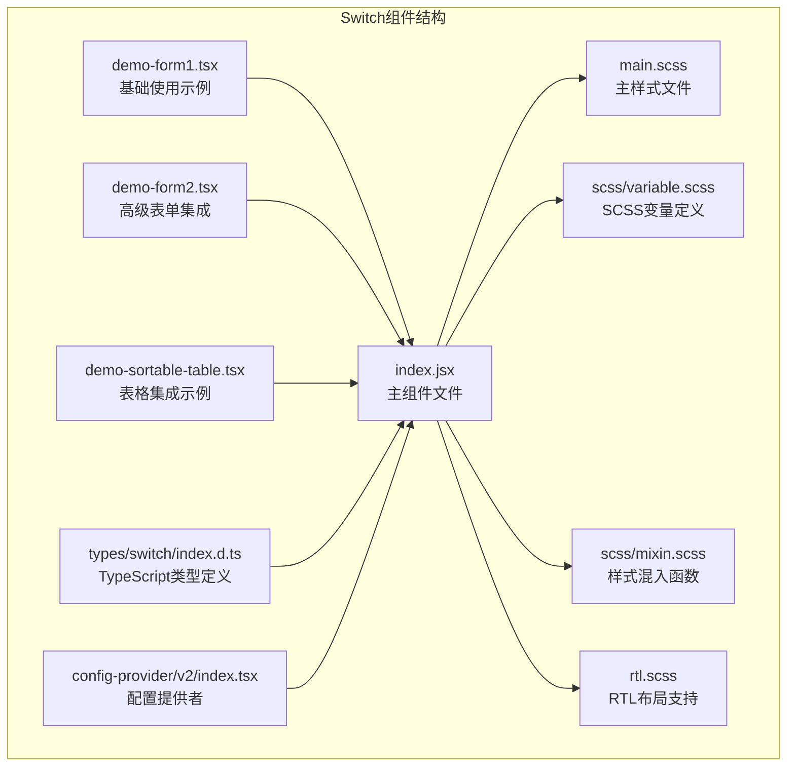
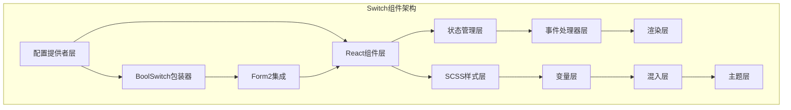
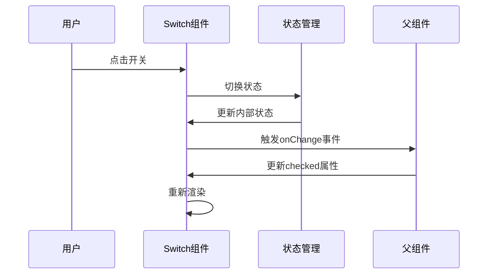
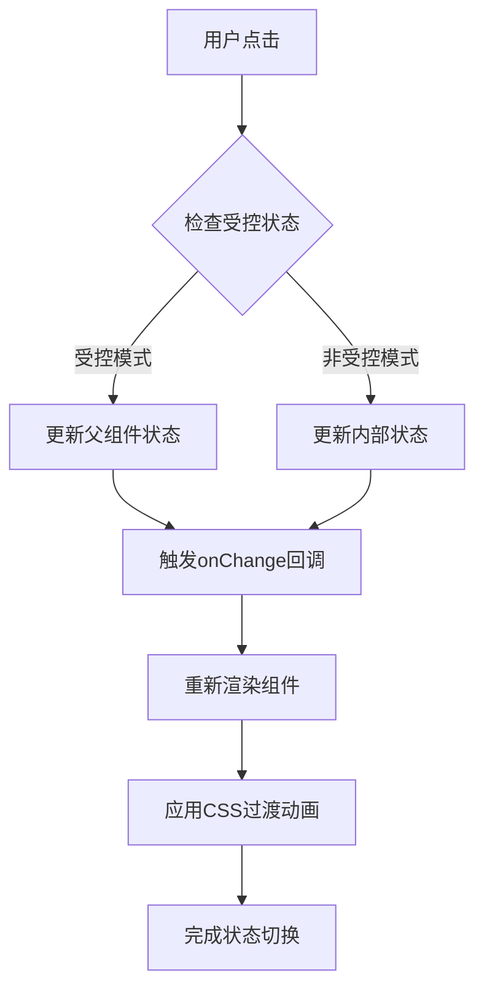
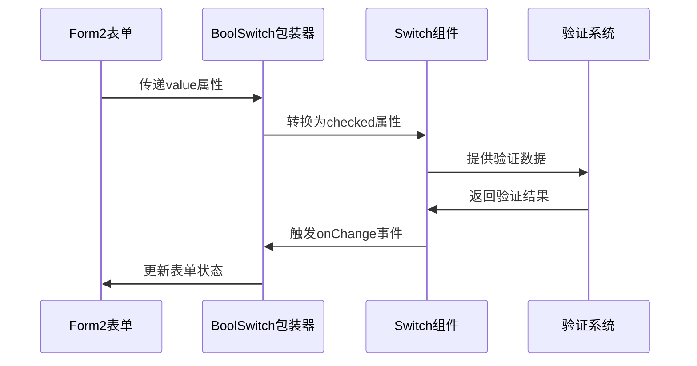
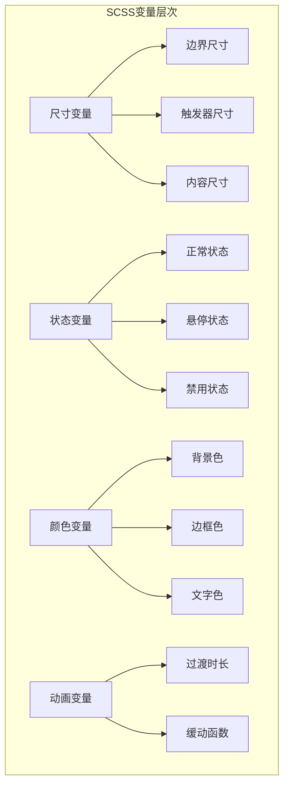

# Switch 开关组件技术文档

<cite>
**本文档引用的文件**
- [src/switch/index.jsx](file://src/switch/index.jsx)
- [src/switch/main.scss](file://src/switch/main.scss)
- [src/switch/scss/variable.scss](file://src/switch/scss/variable.scss)
- [src/switch/scss/mixin.scss](file://src/switch/scss/mixin.scss)
- [src/switch/rtl.scss](file://src/switch/rtl.scss)
- [types/switch/index.d.ts](file://types/switch/index.d.ts)
- [src/config-provider/v2/index.tsx](file://src/config-provider/v2/index.tsx)
- [demo/demo-form1.tsx](file://demo/demo-form1.tsx)
- [demo/demo-form2.tsx](file://demo/demo-form2.tsx)
- [demo/demo-sortable-table.tsx](file://demo/demo-sortable-table.tsx)
</cite>

## 目录
1. [简介](#简介)
2. [项目结构](#项目结构)
3. [核心组件](#核心组件)
4. [架构概览](#架构概览)
5. [详细组件分析](#详细组件分析)
6. [状态管理与动画](#状态管理与动画)
7. [Form2集成](#form2集成)
8. [无障碍访问支持](#无障碍访问支持)
9. [性能优化](#性能优化)
10. [故障排除指南](#故障排除指南)
11. [结论](#结论)

## 简介

Switch开关组件是Fat Design设计系统中的核心表单元素之一，用于表示二进制选择状态。该组件提供了丰富的功能特性，包括受控与非受控模式、多种尺寸、加载状态、自定义内容、无障碍访问支持以及与Form2表单系统的深度集成。

Switch组件采用React.createClass模式构建，结合CSS过渡效果实现流畅的状态切换动画。它支持多种使用场景，从简单的布尔值切换到复杂的表单验证和数据绑定。

## 项目结构

Switch组件位于`src/switch/`目录下，具有清晰的模块化结构：



**图表来源**
- [src/switch/index.jsx](file://src/switch/index.jsx#L1-L243)
- [src/switch/main.scss](file://src/switch/main.scss#L1-L164)

**章节来源**
- [src/switch/index.jsx](file://src/switch/index.jsx#L1-L243)
- [src/switch/main.scss](file://src/switch/main.scss#L1-L164)

## 核心组件

### Switch主组件

Switch组件是一个完整的React类组件，继承自React.Component基类。它实现了完整的生命周期管理和状态控制机制。

```javascript
class Switch extends React.Component {
    static contextTypes = {
        prefix: PropTypes.string,
    };
    
    static propTypes = {
        // 属性定义...
    };
    
    static defaultProps = {
        prefix: defaultPrefix,
        size: 'medium',
        disabled: false,
        defaultChecked: false,
        isPreview: false,
        loading: false,
        readOnly: false,
        autoWidth: false,
        onChange: () => {},
        locale: zhCN.Switch,
    };
}
```

### 核心属性接口

Switch组件提供了丰富的属性接口，支持各种使用场景：

- **基础属性**：`checked`、`defaultChecked`、`disabled`、`loading`、`size`
- **内容属性**：`checkedChildren`、`unCheckedChildren`、`autoWidth`
- **事件处理**：`onChange`、`onClick`、`onKeyDown`
- **表单集成**：`isPreview`、`renderPreview`、`locale`
- **样式定制**：`className`、`style`、`prefix`、`pure`、`rtl`

**章节来源**
- [src/switch/index.jsx](file://src/switch/index.jsx#L10-L100)
- [types/switch/index.d.ts](file://types/switch/index.d.ts#L1-L84)

## 架构概览

Switch组件采用了分层架构设计，将业务逻辑、样式处理和交互行为分离：



**图表来源**
- [src/switch/index.jsx](file://src/switch/index.jsx#L1-L243)
- [src/switch/main.scss](file://src/switch/main.scss#L1-L164)

## 详细组件分析

### 受控与非受控模式

Switch组件同时支持受控和非受控两种模式，这是React组件设计的最佳实践：

```javascript
constructor(props, context) {
    super(props, context);
    
    const checked = props.checked || props.defaultChecked;
    this.onChange = this.onChange.bind(this);
    this.onKeyDown = this.onKeyDown.bind(this);
    this.state = {
        checked,
    };
}

static getDerivedStateFromProps(props, state) {
    if ('checked' in props && props.checked !== state.checked) {
        return {
            checked: !!props.checked,
        };
    }
    return null;
}
```

**受控模式**：
- 使用`checked`属性控制开关状态
- 状态变化由父组件完全控制
- 适用于需要精确状态管理的场景

**非受控模式**：
- 使用`defaultChecked`属性设置初始状态
- 内部维护自己的状态
- 适用于简单的开关操作

### 状态切换逻辑



**图表来源**
- [src/switch/index.jsx](file://src/switch/index.jsx#L100-L120)

### 样式系统架构

Switch组件的样式系统基于SCSS，采用模块化设计：

```scss
.#{$css-prefix}switch {
    @include box-sizing;
    outline: none;
    text-align: left;
    cursor: pointer;
    vertical-align: middle;
    user-select: none;
    overflow: hidden;
    transition: background .1s $motion-default, border-color .1s $motion-default;
    
    &-btn {
        transition: all .15s $motion-default;
        transform-origin: left center;
    }
}
```

**章节来源**
- [src/switch/index.jsx](file://src/switch/index.jsx#L120-L200)
- [src/switch/main.scss](file://src/switch/main.scss#L1-L50)

## 状态管理与动画

### CSS过渡动画

Switch组件的动画效果通过CSS过渡实现，提供了流畅的状态切换体验：

```scss
& {
    transition: background .1s $motion-default, border-color .1s $motion-default;
}

&-btn {
    transition: all .15s $motion-default;
    transform-origin: left center;
}
```

### 动画时序图



**图表来源**
- [src/switch/index.jsx](file://src/switch/index.jsx#L100-L120)
- [src/switch/main.scss](file://src/switch/main.scss#L10-L20)

### 尺寸系统

Switch组件支持两种尺寸：`medium`和`small`，每种尺寸都有对应的SCSS变量：

```scss
// Medium尺寸
$switch-size-m-width: $s-14 !default;
$switch-size-m-trigger: $s-6 !default;
$switch-size-m-radius-container: $corner-3 !default;

// Small尺寸  
$switch-size-s-width: $s-11 !default;
$switch-size-s-trigger: $s-5 !default;
$switch-size-s-radius-container: $corner-3 !default;
```

**章节来源**
- [src/switch/scss/variable.scss](file://src/switch/scss/variable.scss#L1-L100)
- [src/switch/main.scss](file://src/switch/main.scss#L30-L80)

## Form2集成

### BoolSwitch包装器

Switch组件通过ConfigProvider.createBoolComponent方法创建了BoolSwitch包装器，专门用于与Form2表单系统集成：

```javascript
// 解决在Form表单情况下标准value，onChange协议的问题
SwitchConfigured.BoolSwitch = ConfigProvider.createBoolComponent((props)=>{
    return <SwitchConfigured {...props} isBoolSwitch={true}/>
}, 'BoolSwitch');
```

### Form2集成流程



**图表来源**
- [src/switch/index.jsx](file://src/switch/index.jsx#L235-L241)
- [src/config-provider/v2/index.tsx](file://src/config-provider/v2/index.tsx#L86-L120)

### 实际使用示例

在Form2中使用Switch组件：

```typescript
<FormItem label={'开关'}
          name={'Switch'}
          component={'Switch'}
          xProps={{
              // size: 'small'
          }}
/>
```

**章节来源**
- [src/switch/index.jsx](file://src/switch/index.jsx#L235-L241)
- [demo/demo-form1.tsx](file://demo/demo-form1.tsx#L140-L150)

## 无障碍访问支持

### ARIA属性支持

Switch组件实现了完整的无障碍访问支持，遵循WCAG标准：

```javascript
return (
    <div
        role="switch"
        dir={rtl ? 'rtl' : undefined}
        tabIndex="0"
        {...others}
        className={classes}
        {...attrs}
        aria-checked={checked}
    >
        {/* 组件内容 */}
    </div>
);
```

### 键盘导航支持

```javascript
onKeyDown(e) {
    if (e.keyCode === KEYCODE.ENTER || e.keyCode === KEYCODE.SPACE) {
        this.onChange(e);
    }
    this.props.onKeyDown && this.props.onKeyDown(e);
}
```

### 无障碍特性列表

- **角色标识**：使用`role="switch"`明确语义
- **焦点管理**：支持Tab键导航
- **键盘操作**：支持Enter和Space键切换
- **状态指示**：通过`aria-checked`属性反映当前状态
- **RTL支持**：自动适配从右到左的语言环境

**章节来源**
- [src/switch/index.jsx](file://src/switch/index.jsx#L120-L180)

## 性能优化

### 渲染优化策略

1. **条件渲染**：根据isPreview属性决定渲染模式
2. **事件绑定**：在构造函数中绑定事件处理器
3. **状态更新**：使用getDerivedStateFromProps避免不必要的重渲染
4. **CSS优化**：利用CSS硬件加速提升动画性能

### 主题定制方法

Switch组件支持通过SCSS变量进行主题定制：

```scss
// 自定义颜色方案
$switch-normal-on-bg-color: $color-brand1-6 !default;
$switch-normal-off-bg-color: $color-fill1-3 !default;
$switch-hover-on-bg-color: $color-brand1-9 !default;
$switch-hover-off-bg-color: $color-fill1-3 !default;
```

### SCSS变量体系



**图表来源**
- [src/switch/scss/variable.scss](file://src/switch/scss/variable.scss#L1-L209)

**章节来源**
- [src/switch/scss/variable.scss](file://src/switch/scss/variable.scss#L1-L209)
- [src/switch/main.scss](file://src/switch/main.scss#L1-L164)

## 故障排除指南

### 常见问题及解决方案

**问题1：Switch组件无法响应点击事件**
- 检查disabled属性是否设置为true
- 确认事件处理器是否正确绑定
- 验证CSS z-index层级冲突

**问题2：动画效果不流畅**
- 检查CSS transition属性设置
- 确认浏览器对CSS3动画的支持
- 验证硬件加速设置

**问题3：Form2集成失效**
- 确认使用BoolSwitch而非普通Switch
- 检查value和onChange属性的正确传递
- 验证Form2的配置是否正确

### 调试技巧

1. **开发者工具**：使用React DevTools检查组件状态
2. **CSS调试**：检查元素的computed styles和伪类状态
3. **事件监听**：添加console.log跟踪事件触发
4. **网络监控**：检查是否有资源加载失败

**章节来源**
- [src/switch/index.jsx](file://src/switch/index.jsx#L100-L150)

## 结论

Switch开关组件是Fat Design设计系统中一个功能完整、设计精良的UI组件。它不仅提供了丰富的功能特性，还展现了优秀的架构设计和用户体验。

### 主要优势

1. **完整的功能覆盖**：支持受控/非受控模式、多种尺寸、加载状态等
2. **优秀的用户体验**：流畅的动画效果和完善的无障碍支持
3. **强大的集成能力**：与Form2表单系统无缝集成
4. **灵活的定制性**：通过SCSS变量支持主题定制
5. **良好的性能表现**：优化的渲染策略和动画效果

### 最佳实践建议

1. 在复杂表单场景中优先使用BoolSwitch包装器
2. 合理选择尺寸以适应不同的设计需求
3. 充分利用无障碍特性提升产品包容性
4. 通过SCSS变量定制满足品牌视觉需求
5. 注意动画性能优化，避免影响整体页面流畅度

Switch组件的设计理念和实现方式为其他UI组件的开发提供了宝贵的参考价值，体现了现代前端组件库的设计最佳实践。