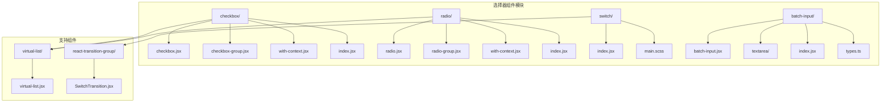
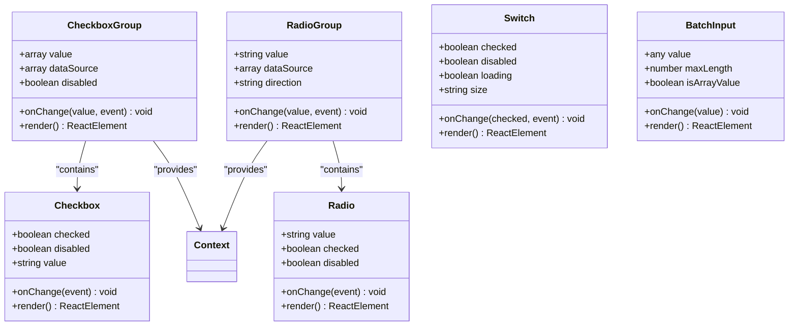
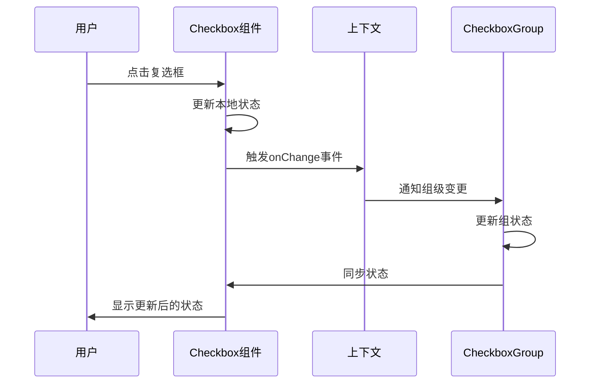
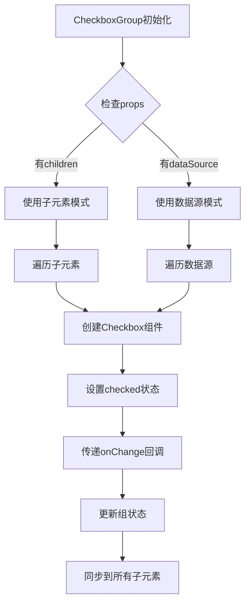
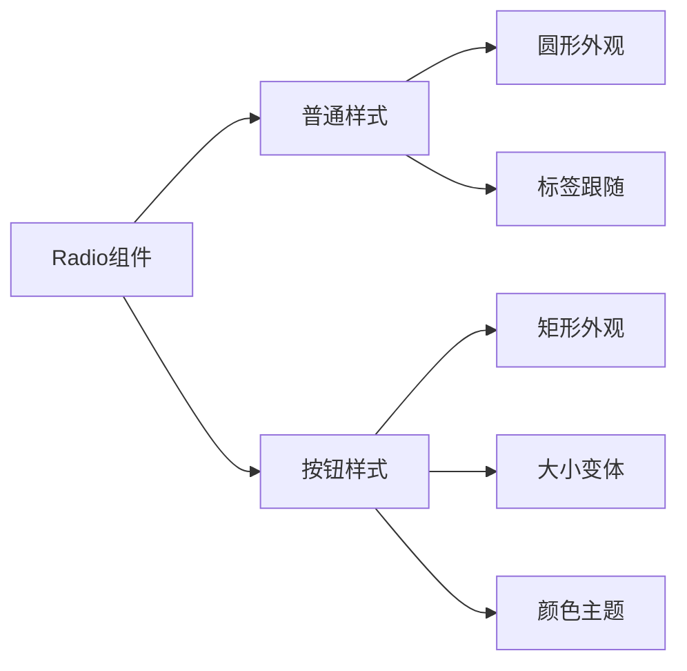
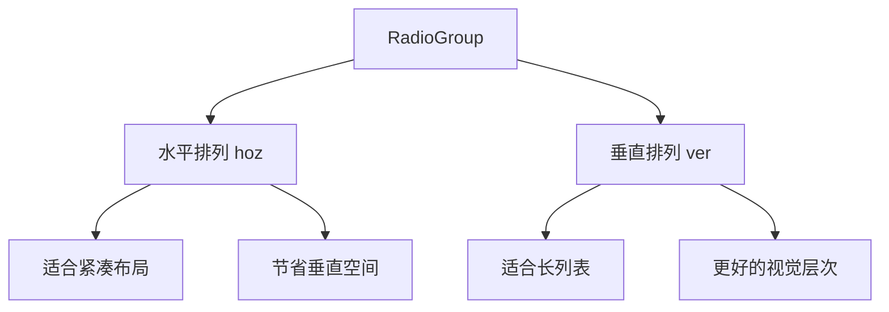
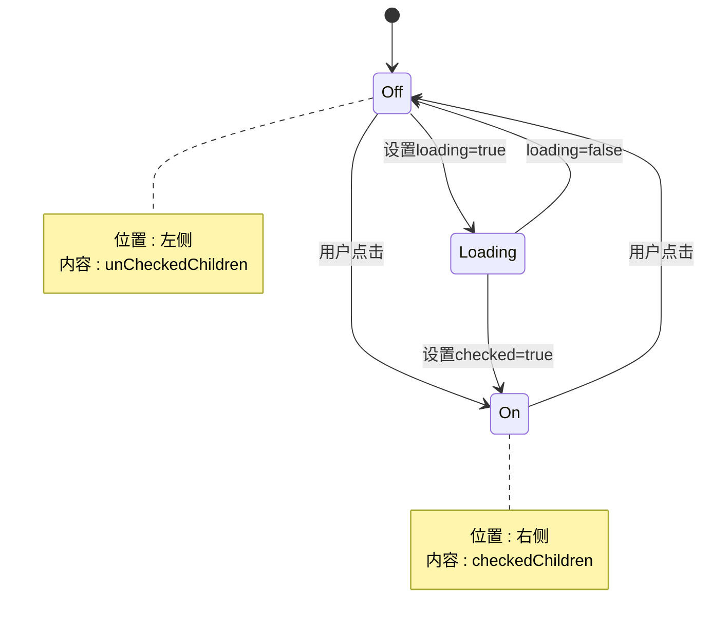
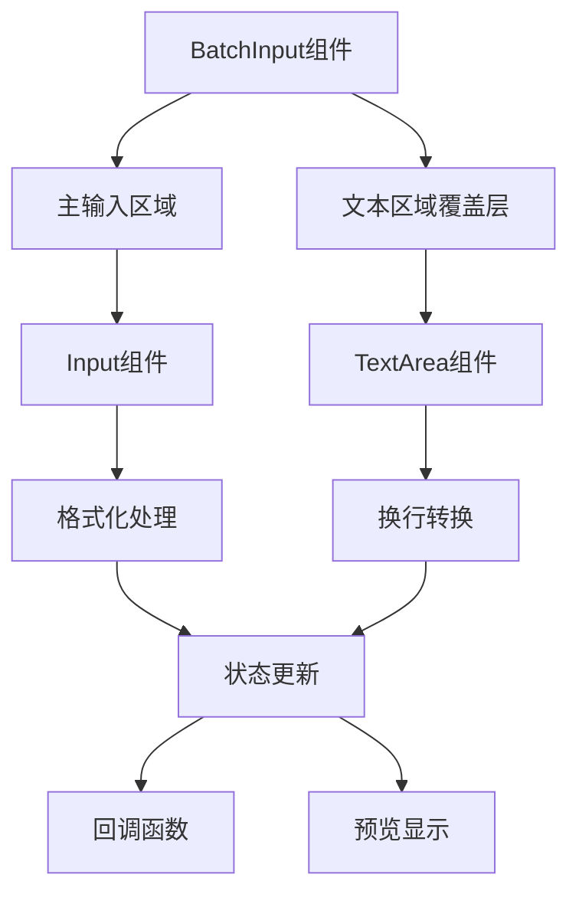
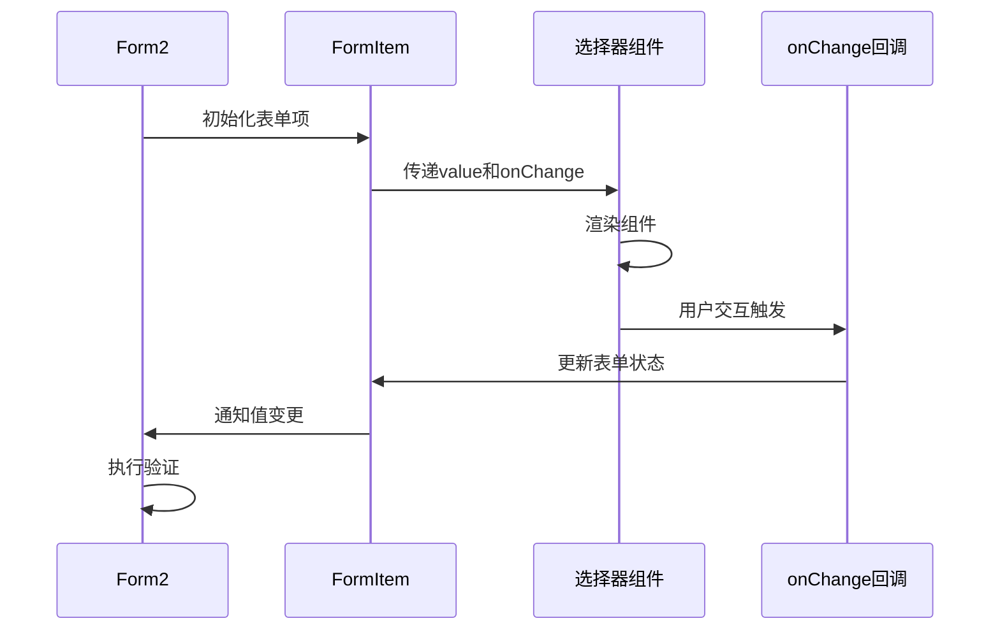

# 选择器组件技术文档

<cite>
**本文档引用的文件**
- [checkbox/checkbox.jsx](file://src/checkbox/checkbox.jsx)
- [checkbox/checkbox-group.jsx](file://src/checkbox/checkbox-group.jsx)
- [checkbox/with-context.jsx](file://src/checkbox/with-context.jsx)
- [radio/radio.jsx](file://src/radio/radio.jsx)
- [radio/radio-group.jsx](file://src/radio/radio-group.jsx)
- [switch/index.jsx](file://src/switch/index.jsx)
- [batch-input/batch-input.jsx](file://src/batch-input/batch-input.jsx)
- [batch-input/index.jsx](file://src/batch-input/index.jsx)
- [virtual-list/virtual-list.jsx](file://src/virtual-list/virtual-list.jsx)
- [react-transition-group/SwitchTransition.jsx](file://src/react-transition-group/SwitchTransition.jsx)
- [demo/demo-form1.tsx](file://demo/demo-form1.tsx)
- [demo/demo-form2.tsx](file://demo/demo-form2.tsx)
- [demo-doc/BatchInput组件使用文档.md](file://demo-doc/BatchInput组件使用文档.md)
</cite>

## 目录
1. [简介](#简介)
2. [项目结构](#项目结构)
3. [核心组件概览](#核心组件概览)
4. [Checkbox组件详解](#checkbox组件详解)
5. [Radio组件详解](#radio组件详解)
6. [Switch开关组件详解](#switch开关组件详解)
7. [BatchInput批量输入组件详解](#batchinput批量输入组件详解)
8. [无障碍访问支持](#无障碍访问支持)
9. [与Form2集成](#与form2集成)
10. [性能优化策略](#性能优化策略)
11. [故障排除指南](#故障排除指南)
12. [总结](#总结)

## 简介

Fat Design选择器组件库提供了完整的用户界面选择控件解决方案，包括Checkbox（复选框）、Radio（单选按钮）、Switch（开关）和BatchInput（批量输入）等核心组件。这些组件不仅具有丰富的功能特性，还特别注重无障碍访问支持、性能优化和与Form2表单系统的无缝集成。

本文档将深入探讨每个组件的设计原理、实现机制、API接口以及最佳实践，帮助开发者充分利用这些组件的强大功能。

## 项目结构

选择器组件在Fat Design项目中的组织结构如下：



**图表来源**
- [checkbox/checkbox.jsx](file://src/checkbox/checkbox.jsx#L1-L55)
- [radio/radio.jsx](file://src/radio/radio.jsx#L1-L185)
- [switch/index.jsx](file://src/switch/index.jsx#L1-L243)
- [batch-input/batch-input.jsx](file://src/batch-input/batch-input.jsx#L1-L441)

## 核心组件概览

选择器组件库包含四个主要组件，每个都有其独特的功能和应用场景：



**图表来源**
- [checkbox/checkbox.jsx](file://src/checkbox/checkbox.jsx#L25-L55)
- [checkbox/checkbox-group.jsx](file://src/checkbox/checkbox-group.jsx#L10-L80)
- [radio/radio.jsx](file://src/radio/radio.jsx#L25-L185)
- [radio/radio-group.jsx](file://src/radio/radio-group.jsx#L25-L100)
- [switch/index.jsx](file://src/switch/index.jsx#L25-L100)
- [batch-input/batch-input.jsx](file://src/batch-input/batch-input.jsx#L70-L150)

## Checkbox组件详解

### 单选框组件（Checkbox）

Checkbox组件是多选的基础单元，支持受控和非受控两种模式。

#### 核心特性

1. **状态管理**：支持受控和非受控模式
2. **样式变体**：多种尺寸和主题
3. **无障碍支持**：完整的ARIA属性支持
4. **组合模式**：与CheckboxGroup配合使用

#### 实现原理



**图表来源**
- [checkbox/checkbox.jsx](file://src/checkbox/checkbox.jsx#L150-L180)
- [checkbox/with-context.jsx](file://src/checkbox/with-context.jsx#L1-L18)

#### API接口

```typescript
interface CheckboxProps {
    checked?: boolean;           // 受控模式下的选中状态
    defaultChecked?: boolean;    // 非受控模式下的默认状态
    disabled?: boolean;          // 是否禁用
    value?: any;                 // 复选框的值
    onChange?: (checked: boolean, event: Event) => void;
    className?: string;          // 自定义类名
    style?: React.CSSProperties; // 自定义样式
}
```

**章节来源**
- [checkbox/checkbox.jsx](file://src/checkbox/checkbox.jsx#L25-L100)

### 复选框组（CheckboxGroup）

CheckboxGroup提供了多选框的容器和统一的状态管理。

#### 组合模式实现



**图表来源**
- [checkbox/checkbox-group.jsx](file://src/checkbox/checkbox-group.jsx#L120-L180)

#### 状态同步机制

CheckboxGroup通过React的Context API实现状态同步：

```javascript
// 上下文提供者
getChildContext() {
    return {
        __group__: true,
        onChange: this.onChange,
        selectedValue: this.state.value,
        disabled: this.props.disabled,
    };
}

// 子组件监听
onChange(currentValue, e) {
    const { value } = this.state;
    const index = value.indexOf(currentValue);
    const valTemp = [...value];

    if (index === -1) {
        valTemp.push(currentValue);
    } else {
        valTemp.splice(index, 1);
    }

    if (!('value' in this.props)) {
        this.setState({ value: valTemp });
    }
    this.props.onChange(valTemp, e);
}
```

**章节来源**
- [checkbox/checkbox-group.jsx](file://src/checkbox/checkbox-group.jsx#L80-L120)

## Radio组件详解

### 单选按钮组件（Radio）

Radio组件实现了单选功能，支持按钮样式和普通样式的切换。

#### 样式变体



**图表来源**
- [radio/radio.jsx](file://src/radio/radio.jsx#L1-L185)
- [radio/radio-group.jsx](file://src/radio/radio-group.jsx#L1-L272)

#### 事件处理机制

Radio组件的事件处理遵循单选逻辑：

```javascript
onChange(e) {
    const checked = e.target.checked;
    const { context, value } = this.props;

    if (context.__group__) {
        context.onChange(value, e);
    } else if (this.state.checked !== checked) {
        if (!('checked' in this.props)) {
            this.setState({
                checked: checked,
            });
        }
        this.props.onChange(checked, e);
    }
}
```

**章节来源**
- [radio/radio.jsx](file://src/radio/radio.jsx#L150-L185)

### 单选按钮组（RadioGroup）

RadioGroup提供了单选按钮的容器和互斥选择功能。

#### 方向控制



**图表来源**
- [radio/radio-group.jsx](file://src/radio/radio-group.jsx#L150-L200)

#### 预览模式

RadioGroup支持预览模式，用于只读场景：

```javascript
if (isPreview) {
    const previewCls = classnames(className, `${prefix}form-preview`);
    
    if ('renderPreview' in this.props) {
        return (
            <div {...others} className={previewCls}>
                {renderPreview(previewed, this.props)}
            </div>
        );
    }
    
    return (
        <p {...others} className={previewCls}>
            {previewed.label}
        </p>
    );
}
```

**章节来源**
- [radio/radio-group.jsx](file://src/radio/radio-group.jsx#L200-L250)

## Switch开关组件详解

### 状态切换机制

Switch组件实现了直观的开关状态切换，支持动画效果和多种状态。

#### 动画系统



**图表来源**
- [switch/index.jsx](file://src/switch/index.jsx#L100-L150)

#### 受控模式实现

Switch组件支持受控和非受控两种模式：

```javascript
constructor(props, context) {
    super(props, context);
    
    const checked = props.checked || props.defaultChecked;
    this.onChange = this.onChange.bind(this);
    this.onKeyDown = this.onKeyDown.bind(this);
    this.state = {
        checked,
    };
}

static getDerivedStateFromProps(props, state) {
    if ('checked' in props && props.checked !== state.checked) {
        return {
            checked: !!props.checked,
        };
    }
    return null;
}

onChange(ev) {
    const checked = !this.state.checked;
    
    if (!('checked' in this.props)) {
        this.setState({
            checked,
        });
    }
    this.props.onChange(checked, ev);
    this.props.onClick && this.props.onClick(ev);
}
```

**章节来源**
- [switch/index.jsx](file://src/switch/index.jsx#L80-L120)

### 尺寸和主题

Switch组件提供多种尺寸和主题选项：

```javascript
// 尺寸处理
let _size = size;
if (_size !== 'small' && _size !== 'medium') {
    _size = 'medium';
}

// 类名生成
const classes = classNames({
    [`${prefix}switch`]: true,
    [`${prefix}switch-boolean`]: !!isBoolSwitch,
    [`${prefix}switch-loading`]: loading,
    [`${prefix}switch-${status}`]: true,
    [`${prefix}switch-${_size}`]: true,
    [`${prefix}switch-auto-width`]: autoWidth,
    [className]: className,
});
```

**章节来源**
- [switch/index.jsx](file://src/switch/index.jsx#L150-L200)

## BatchInput批量输入组件详解

### 特殊用途和设计理念

BatchInput组件专为处理大量数据的快速输入而设计，提供了文本和表格两种输入方式。

#### 核心功能

1. **多格式输入**：支持逗号分隔和换行分隔
2. **实时预览**：提供输入内容的实时预览
3. **数据验证**：内置长度限制和格式验证
4. **中文输入支持**：完整的中文输入法兼容性

#### 架构设计



**图表来源**
- [batch-input/batch-input.jsx](file://src/batch-input/batch-input.jsx#L70-L150)

#### 数据处理流程

```javascript
const solveActualInputValue = (value) => {
    return value
        .toString()
        .replace(/\s+/g, defaultSeparator)
        .replace(new RegExp(`${defaultSeparator}+`, 'g'), defaultSeparator)
        .replace(new RegExp(`^${defaultSeparator}`), '');
};

const handleValue = (inputValue) => {
    if (!inputValue) return inputValue;
    if (isArrayValue) {
        if (Array.isArray(inputValue)) {
            return inputValue;
        } else {
            return String(inputValue).split(',');
        }
    } else {
        return inputValue;
    }
};
```

**章节来源**
- [batch-input/batch-input.jsx](file://src/batch-input/batch-input.jsx#L150-L200)

### 性能优化特性

#### 事件处理优化

BatchInput使用自定义的事件钩子来优化性能：

```javascript
function useGlobalEvent(options) {
    const {
        over,
        batch,
        overlay,
        textArea,
        input,
        setTextAreaVisible,
        container,
        textAreaVisible,
        hasRightIntersect,
    } = options;
    
    useEffect(() => {
        const documentClickHook = () => {
            if (!over) setTextAreaVisible(false);
        };
        
        const renderTooltipPos = () => {
            const bound = batch.current.getBoundingClientRect();
            if (overlay.current) {
                // 位置计算逻辑
            }
        };
        
        documentEventTag.addEventListener('click', documentClickHook);
        windowEventTag.addEventListener('scroll', renderTooltipPos, true);
        
        return () => {
            documentEventTag.removeEventListener('click', documentClickHook);
            windowEventTag.removeEventListener('scroll', renderTooltipPos, true);
        };
    }, [over, textAreaVisible]);
}
```

**章节来源**
- [batch-input/batch-input.jsx](file://src/batch-input/batch-input.jsx#L40-L80)

#### 宽度计算优化

```javascript
const countWidth = () => {
    const OPTIMIZE_WIDTH = 88;
    const overlayWidth = parseInt(window.getComputedStyle(batch.current).width);
    return typeof textAreaWidth !== 'number'
        ? `${overlayWidth + OPTIMIZE_WIDTH}px`
        : `${textAreaWidth}px`;
};
```

**章节来源**
- [batch-input/batch-input.jsx](file://src/batch-input/batch-input.jsx#L250-L280)

## 无障碍访问支持

### ARIA属性实现

所有选择器组件都实现了完整的无障碍访问支持：

#### Checkbox组件的ARIA支持

```javascript
// Checkbox渲染时的ARIA属性
return (
    <span
        role="checkbox"
        aria-checked={checked}
        aria-disabled={disabled}
        tabIndex={disabled ? -1 : 0}
        {...others}
        className={cls}
        onClick={this.onChange}
    >
        {/* 内容 */}
    </span>
);
```

#### RadioGroup的ARIA支持

```javascript
// RadioGroup的ARIA属性
return (
    <TagName 
        {...others} 
        aria-disabled={disabled} 
        role="radiogroup" 
        className={cls} 
        style={style}
    >
        {children}
    </TagName>
);
```

#### Switch组件的ARIA支持

```javascript
// Switch的ARIA属性
return (
    <div
        role="switch"
        dir={rtl ? 'rtl' : undefined}
        tabIndex="0"
        {...others}
        className={classes}
        {...attrs}
        aria-checked={checked}
    >
        {/* 内容 */}
    </div>
);
```

**章节来源**
- [checkbox/checkbox.jsx](file://src/checkbox/checkbox.jsx#L180-L200)
- [radio/radio-group.jsx](file://src/radio/radio-group.jsx#L250-L270)
- [switch/index.jsx](file://src/switch/index.jsx#L200-L220)

### 键盘导航支持

各组件都支持键盘操作：

```javascript
onKeyDown(e) {
    if (e.keyCode === KEYCODE.ENTER || e.keyCode === KEYCODE.SPACE) {
        this.onChange(e);
    }
    this.props.onKeyDown && this.props.onKeyDown(e);
}
```

**章节来源**
- [switch/index.jsx](file://src/switch/index.jsx#L90-L100)

## 与Form2集成

### 表单集成示例

选择器组件与Form2表单系统完美集成，支持自动验证和状态管理：

```typescript
// CheckboxGroup集成
<FormItem 
    label={'CheckboxGroup'}
    name={'checkboxgroup1'}
    component={'CheckboxGroup'}
    enums={() => {
        return Promise.resolve([
            {label: 'Label A', value: 'A'},
            {label: 'Label B', value: 'B'},
            {label: 'Label C', value: 'C'},
        ]);
    }}
/>

// RadioGroup集成
<FormItem 
    label={'RadioGroup'}
    name={'radiogroup1'}
    component={'RadioGroup'}
    enums={() => {
        return Promise.resolve([
            {label: 'Label A', value: 'A'},
            {label: 'Label B', value: 'B'},
            {label: 'Label C', value: 'C'},
        ]);
    }}
/>
```

**章节来源**
- [demo/demo-form1.tsx](file://demo/demo-form1.tsx#L100-L130)

### 数据绑定机制



**图表来源**
- [demo/demo-form1.tsx](file://demo/demo-form1.tsx#L1-L50)

## 性能优化策略

### 虚拟滚动优化

对于大量选项的场景，组件库集成了虚拟滚动技术：

```javascript
// 虚拟列表的核心算法
updateVariableFrame(cb) {
    if (!this.props.itemSizeGetter) {
        this.cacheSizes();
    }

    const { start, end } = this.getStartAndEnd();
    const { pageSize, children } = this.props;
    const length = children.length;
    let space = 0;
    let from = 0;
    let size = 0;
    const maxFrom = length - 1;

    while (from < maxFrom) {
        const itemSize = this.getSizeOf(from);
        if (itemSize === null || itemSize === undefined || space + itemSize > start) {
            break;
        }
        space += itemSize;
        ++from;
    }

    const maxSize = length - from;

    while (size < maxSize && space < end) {
        const itemSize = this.getSizeOf(from + size);
        if (itemSize === null || itemSize === undefined) {
            size = Math.min(size + pageSize, maxSize);
            break;
        }
        space += itemSize;
        ++size;
    }

    this.maybeSetState({ from, size }, cb);
}
```

**章节来源**
- [virtual-list/virtual-list.jsx](file://src/virtual-list/virtual-list.jsx#L250-L300)

### 状态更新优化

```javascript
shouldComponentUpdate(nextProps, nextState, nextContext) {
    const { shallowEqual } = obj;
    return (
        !shallowEqual(this.props, nextProps) ||
        !shallowEqual(this.state, nextState) ||
        !shallowEqual(this.context, nextContext)
    );
}
```

**章节来源**
- [radio/radio.jsx](file://src/radio/radio.jsx#L135-L150)

### 内存泄漏防护

```javascript
useEffect(() => {
    const visibleObserver = new IntersectionObserver((entries) => {
        if (overlay.current && batch.current && entries[0].rootBounds) {
            // 交叉检测逻辑
        }
    });
    
    overlay.current && visibleObserver.observe(overlay.current);
    
    return () => {
        overlay.current && visibleObserver.disconnect();
    };
}, []);
```

**章节来源**
- [batch-input/batch-input.jsx](file://src/batch-input/batch-input.jsx#L220-L250)

## 故障排除指南

### 常见问题及解决方案

#### 1. CheckboxGroup状态不同步

**问题**：多个Checkbox的状态没有正确同步

**解决方案**：
```javascript
// 确保使用正确的上下文
<CheckboxGroup value={selectedValues} onChange={handleChange}>
    <Checkbox value="A">选项A</Checkbox>
    <Checkbox value="B">选项B</Checkbox>
</CheckboxGroup>
```

#### 2. Switch组件动画异常

**问题**：Switch切换时动画不流畅

**解决方案**：
```javascript
// 确保CSS过渡效果正确配置
.switch-transition {
    transition: all 0.3s ease;
}
```

#### 3. BatchInput中文输入问题

**问题**：中文输入法下无法正常输入

**解决方案**：
```javascript
<BatchInput 
    openChineseInput={true}
    // 其他配置
/>
```

#### 4. 性能问题诊断

**问题**：大量选项时性能下降

**解决方案**：
```javascript
// 使用虚拟滚动
<CheckboxGroup dataSource={largeDataset} virtualList={{itemHeight: 30}} />

// 或者分页加载
<CheckboxGroup dataSource={paginatedData} loadMore={loadMoreHandler} />
```

### 调试工具

#### 开发环境调试

```javascript
// 启用调试模式
console.log('CheckboxGroup state:', checkboxGroupState);
console.log('Switch current value:', switchCurrentValue);
console.log('BatchInput formatted value:', batchInputValue);
```

#### 性能监控

```javascript
// 监控组件渲染时间
const startTime = performance.now();
// 组件渲染逻辑
const endTime = performance.now();
console.log(`Component rendered in ${endTime - startTime}ms`);
```

## 总结

Fat Design选择器组件库提供了完整、高性能的选择器解决方案。通过深入理解各个组件的设计原理和实现细节，开发者可以：

1. **高效使用**：充分利用各组件的功能特性
2. **性能优化**：在处理大量数据时采用适当的优化策略
3. **无障碍支持**：确保应用符合无障碍访问标准
4. **表单集成**：与Form2系统无缝协作
5. **故障排除**：快速定位和解决常见问题

这些组件不仅满足了现代Web应用的需求，还为未来的扩展和维护奠定了坚实的基础。随着Web技术的发展，这些组件将继续演进，为用户提供更好的体验。