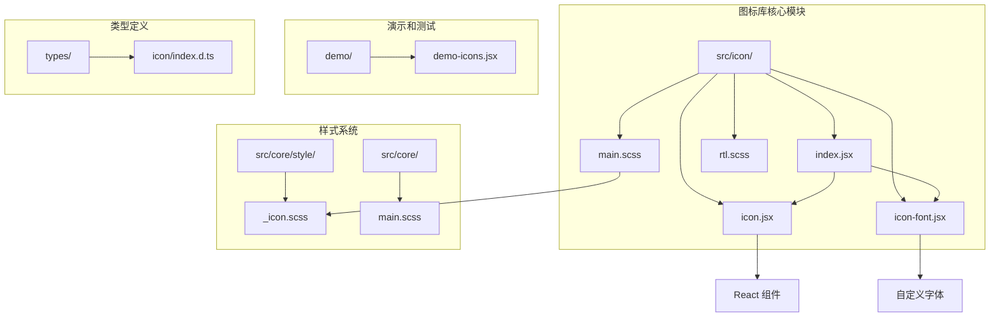
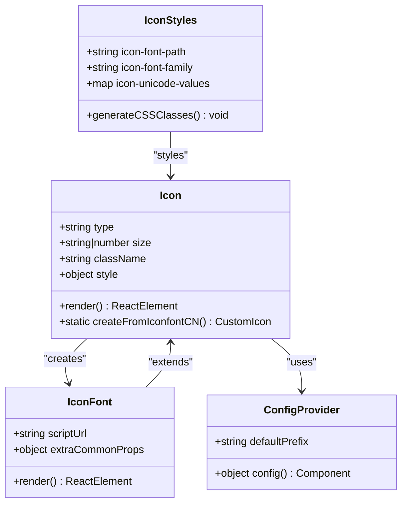
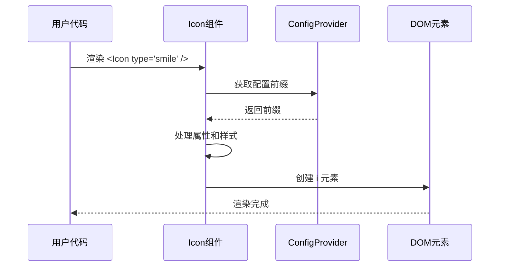
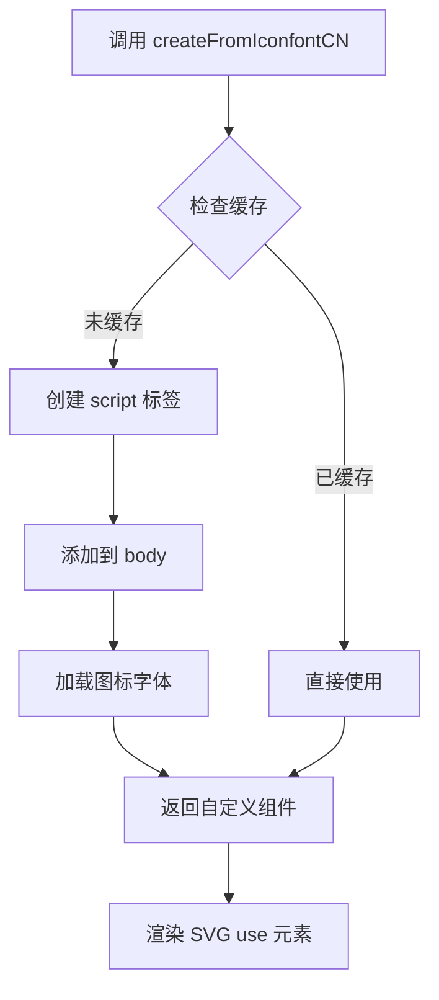
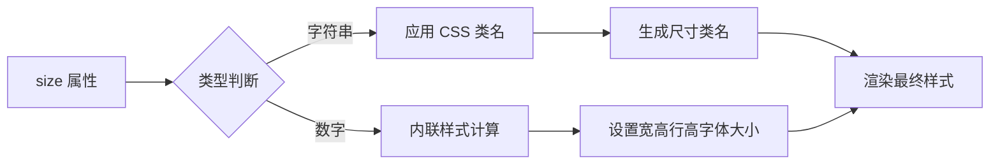

# fat-design 图标库

<cite>
**本文档引用的文件**
- [src/icon/index.jsx](file://src/icon/index.jsx)
- [src/icon/icon.jsx](file://src/icon/icon.jsx)
- [src/icon/icon-font.jsx](file://src/icon/icon-font.jsx)
- [src/icon/main.scss](file://src/icon/main.scss)
- [src/core/style/_icon.scss](file://src/core/style/_icon.scss)
- [demo/demo-icons.jsx](file://demo/demo-icons.jsx)
- [src/button/view/button.jsx](file://src/button/view/button.jsx)
- [src/menu/view/item.jsx](file://src/menu/view/item.jsx)
- [types/icon/index.d.ts](file://types/icon/index.d.ts)
</cite>

## 目录
1. [简介](#简介)
2. [项目结构](#项目结构)
3. [核心组件](#核心组件)
4. [架构概览](#架构概览)
5. [详细组件分析](#详细组件分析)
6. [图标类型和使用方法](#图标类型和使用方法)
7. [尺寸和样式控制](#尺寸和样式控制)
8. [集成使用示例](#集成使用示例)
9. [性能考虑](#性能考虑)
10. [故障排除指南](#故障排除指南)
11. [总结](#总结)

## 简介

fat-design 图标库是一个功能强大且灵活的 React 图标系统，提供了丰富的内置图标集合和自定义扩展能力。该图标库采用现代化的设计理念，支持多种使用方式，包括组件式使用和 CSS 类名使用，并提供了完整的尺寸控制、颜色管理和国际化支持。

主要特性：
- 内置 50+ 种常用图标
- 支持组件式使用和 CSS 类名使用
- 多种尺寸规格（从 xxs 到 xxxl）
- 自定义图标字体支持
- 完整的 RTL 国际化支持
- 与主题系统的无缝集成
- 性能优化的字体加载机制

## 项目结构

fat-design 图标库的项目结构清晰明了，主要包含以下关键目录和文件：



**图表来源**
- [src/icon/index.jsx](file://src/icon/index.jsx#L1-L8)
- [src/icon/icon.jsx](file://src/icon/icon.jsx#L1-L83)
- [src/icon/icon-font.jsx](file://src/icon/icon-font.jsx#L1-L78)

**章节来源**
- [src/icon/index.jsx](file://src/icon/index.jsx#L1-L8)
- [src/icon/icon.jsx](file://src/icon/icon.jsx#L1-L83)
- [src/icon/icon-font.jsx](file://src/icon/icon-font.jsx#L1-L78)

## 核心组件

fat-design 图标库的核心组件包括三个主要部分：基础 Icon 组件、自定义图标字体支持和样式系统。

### 基础 Icon 组件

基础 Icon 组件是整个图标系统的核心，提供了统一的图标渲染接口和属性管理：

```javascript
// 基础使用方式
<Icon type="smile" />
<Icon type="arrow-right" size="large" />

// 嵌套使用
<Icon type="loading">
  <Icon type="close" />
</Icon>
```

### 自定义图标字体支持

通过 `createFromIconfontCN` 方法，可以轻松集成自定义的 iconfont 资源：

```javascript
// 创建自定义图标组件
const CustomIcon = Icon.createFromIconfontCN({
  scriptUrl: '//at.alicdn.com/t/font_1234567_abcdefg.js'
});

// 使用自定义图标
<CustomIcon type="custom-icon-name" />
```

**章节来源**
- [src/icon/icon.jsx](file://src/icon/icon.jsx#L1-L83)
- [src/icon/icon-font.jsx](file://src/icon/icon-font.jsx#L1-L78)

## 架构概览

fat-design 图标库采用了分层架构设计，确保了良好的可维护性和扩展性：



**图表来源**
- [src/icon/icon.jsx](file://src/icon/icon.jsx#L10-L83)
- [src/icon/icon-font.jsx](file://src/icon/icon-font.jsx#L15-L78)
- [src/icon/main.scss](file://src/icon/main.scss#L1-L151)

## 详细组件分析

### Icon 基础组件分析

Icon 组件是整个图标系统的基础，具有以下核心特性：



**图表来源**
- [src/icon/icon.jsx](file://src/icon/icon.jsx#L35-L83)

#### 属性配置

Icon 组件支持丰富的属性配置：

- `type`: 指定要显示的图标类型
- `size`: 控制图标大小（xxs, xs, small, medium, large, xl, xxl, xxxl, inherit）
- `className`: 自定义 CSS 类名
- `style`: 内联样式对象
- `children`: 子组件或内容

#### 尺寸处理逻辑

```javascript
// 尺寸样式计算
const sizeStyle =
    typeof size === 'number'
        ? {
              width: size,
              height: size,
              lineHeight: `${size}px`,
              fontSize: size,
          }
        : {};
```

### 自定义图标字体组件

自定义图标字体组件提供了灵活的外部资源集成能力：



**图表来源**
- [src/icon/icon-font.jsx](file://src/icon/icon-font.jsx#L15-L78)

**章节来源**
- [src/icon/icon.jsx](file://src/icon/icon.jsx#L1-L83)
- [src/icon/icon-font.jsx](file://src/icon/icon-font.jsx#L1-L78)

## 图标类型和使用方法

fat-design 提供了丰富的内置图标类型，涵盖了日常开发中的各种场景需求。

### 内置图标列表

根据 demo 文件分析，fat-design 包含以下图标类型：

#### 基础状态图标
- `smile` - 微笑表情
- `cry` - 哭泣表情  
- `success` - 成功状态
- `warning` - 警告状态
- `prompt` - 提示状态
- `error` - 错误状态
- `help` - 帮助图标
- `clock` - 时钟图标

#### 导航相关图标
- `arrow-up` - 向上箭头
- `arrow-down` - 向下箭头
- `arrow-left` - 向左箭头
- `arrow-right` - 向右箭头
- `arrow-double-left` - 双向左箭头
- `arrow-double-right` - 双向右箭头
- `switch` - 切换图标
- `sorting` - 排序图标
- `descending` - 降序排序
- `ascending` - 升序排序

#### 操作相关图标
- `add` - 添加图标
- `minus` - 减少图标
- `close` - 关闭图标
- `search` - 搜索图标
- `refresh` - 刷新图标
- `filter` - 筛选图标
- `upload` - 上传图标
- `download` - 下载图标
- `edit` - 编辑图标
- `copy` - 复制图标
- `eye` - 显示眼睛
- `eye-close` - 隐藏眼睛
- `lock` - 锁定图标
- `unlock` - 解锁图标

#### 功能相关图标
- `loading` - 加载动画
- `picture` - 图片图标
- `calendar` - 日历图标
- `ashbin` - 垃圾桶图标
- `set` - 设置图标
- `attachment` - 附件图标
- `account` - 账户图标
- `email` - 邮箱图标
- `atm` - ATM图标
- `toggle-left` - 左侧切换
- `toggle-right` - 右侧切换
- `exit` - 退出图标
- `chart-pie` - 饼图图标
- `chart-bar` - 柱状图图标
- `form` - 表单图标
- `detail` - 详情图标
- `list` - 列表图标
- `dashboard` - 仪表板图标

### 使用方法详解

#### 组件式使用

```jsx
// 基本使用
<Icon type="smile" />

// 指定尺寸
<Icon type="arrow-right" size="large" />
<Icon type="add" size={24} />

// 自定义样式
<Icon type="warning" className="custom-class" style={{ color: '#ff0000' }} />

// 嵌套使用
<Icon type="loading">
  <Icon type="close" />
</Icon>
```

#### CSS 类名使用

```html
<!-- 通过 CSS 类名使用 -->
<i class="fat-icon fat-icon-smile"></i>
<i class="fat-icon fat-icon-arrow-right fat-large"></i>
<i class="fat-icon fat-icon-loading"></i>
```

**章节来源**
- [demo/demo-icons.jsx](file://demo/demo-icons.jsx#L1-L79)
- [src/core/style/_icon.scss](file://src/core/style/_icon.scss#L40-L403)

## 尺寸和样式控制

fat-design 图标库提供了灵活的尺寸控制系统，支持预定义尺寸和自定义尺寸两种方式。

### 预定义尺寸规格

```scss
// 尺寸变量定义
$icon-xxs: $s-2 !default;  // 8px
$icon-xs: $s-3 !default;   // 12px  
$icon-s: $s-4 !default;    // 16px
$icon-m: $s-5 !default;    // 20px
$icon-l: $s-6 !default;    // 24px
$icon-xl: $s-8 !default;   // 32px
$icon-xxl: $s-12 !default; // 48px
$icon-xxxl: $s-16 !default;// 64px
```

### 尺寸使用方式

#### 通过 size 属性使用

```jsx
// 使用预定义尺寸
<Icon type="smile" size="xxs" />      // 8px
<Icon type="smile" size="xs" />       // 12px
<Icon type="smile" size="small" />    // 16px
<Icon type="smile" size="medium" />   // 20px
<Icon type="smile" size="large" />    // 24px
<Icon type="smile" size="xl" />       // 32px
<Icon type="smile" size="xxl" />      // 48px
<Icon type="smile" size="xxxl" />     // 64px

// 使用继承尺寸
<Icon type="smile" size="inherit" />

// 使用数字尺寸
<Icon type="smile" size={24} />       // 24px
```

#### 通过 CSS 类名使用

```html
<!-- 对应的 CSS 类名 -->
<i class="fat-icon fat-icon-smile fat-xxs"></i>
<i class="fat-icon fat-icon-smile fat-small"></i>
<i class="fat-icon fat-icon-smile fat-large"></i>
<i class="fat-icon fat-icon-smile fat-xxl"></i>
```

### 样式控制机制



**图表来源**
- [src/icon/icon.jsx](file://src/icon/icon.jsx#L60-L75)

**章节来源**
- [src/core/style/_icon.scss](file://src/core/style/_icon.scss#L20-L35)
- [src/icon/icon.jsx](file://src/icon/icon.jsx#L60-L75)

## 集成使用示例

fat-design 图标库与各种组件紧密集成，提供了丰富的使用场景。

### 在按钮组件中使用图标

```jsx
// 基础按钮图标
<Button iconType="add" type="primary">
  添加新项目
</Button>

// 自定义图标尺寸
<Button iconType="search" iconSize="small">
  搜索
</Button>

// 带加载状态的按钮
<Button iconType="upload" loading>
  上传中...
</Button>

// 图标嵌套使用
<Button iconType="loading">
  <Icon type="close" />
  取消操作
</Button>
```

### 在菜单组件中使用图标

```jsx
<Menu>
  <MenuItem iconType="home">
    首页
  </MenuItem>
  <MenuItem iconType="setting">
    设置
  </MenuItem>
  <SubMenu iconType="user" label="用户管理">
    <MenuItem>用户列表</MenuItem>
    <MenuItem>权限设置</MenuItem>
  </SubMenu>
</Menu>
```

### 在表单组件中使用图标

```jsx
<Form>
  <FormItem label="用户名" iconType="account">
    <Input placeholder="请输入用户名" />
  </FormItem>
  
  <FormItem label="邮箱地址" iconType="email">
    <Input placeholder="请输入邮箱地址" />
  </FormItem>
  
  <FormItem label="密码" iconType="lock">
    <Input.Password placeholder="请输入密码" />
  </FormItem>
</Form>
```

### 在卡片组件中使用图标

```jsx
<Card title="系统设置" iconType="set">
  <div>这里是系统设置的内容区域</div>
</Card>

<Card title="通知中心" iconType="bell">
  <div>这里是通知消息的内容</div>
</Card>
```

### 实际应用场景示例

#### 数据表格中的图标使用

```jsx
const columns = [
  {
    title: '操作',
    dataIndex: 'operation',
    render: (text, record) => (
      <>
        <Icon type="edit" className="action-icon" />
        <Icon type="delete" className="action-icon danger" />
        <Icon type="detail" className="action-icon" />
      </>
    ),
  },
];
```

#### 导航栏中的图标使用

```jsx
<Nav mode="horizontal">
  <NavItem iconType="dashboard">仪表盘</NavItem>
  <NavItem iconType="chart-bar">统计报表</NavItem>
  <NavItem iconType="user">个人中心</NavItem>
  <NavItem iconType="settings">系统设置</NavItem>
</Nav>
```

**章节来源**
- [src/button/view/button.jsx](file://src/button/view/button.jsx#L100-L120)
- [src/menu/view/item.jsx](file://src/menu/view/item.jsx#L1-L213)

## 性能考虑

fat-design 图标库在设计时充分考虑了性能优化，采用了多种策略来提升用户体验。

### 字体加载优化

1. **字体格式支持**：支持多种字体格式（EOT、WOFF2、WOFF、TTF、SVG），确保最佳兼容性
2. **字体显示策略**：使用 `font-display: swap` 确保字体快速显示
3. **缓存机制**：实现了自定义图标字体的缓存机制，避免重复加载

### 渲染性能优化

1. **CSS 类名优化**：使用高效的 CSS 类名生成策略
2. **条件渲染**：根据属性动态决定渲染内容
3. **样式计算优化**：智能的尺寸样式计算逻辑

### 内存管理

1. **组件实例管理**：合理的组件生命周期管理
2. **事件处理器优化**：使用防抖等技术优化事件处理
3. **DOM 节点管理**：有效的 DOM 节点引用管理

## 故障排除指南

### 常见问题及解决方案

#### 图标不显示

**问题描述**：图标无法正常显示

**可能原因**：
1. 图标类型名称错误
2. 字体文件加载失败
3. CSS 样式冲突

**解决方案**：
```jsx
// 检查图标类型是否正确
<Icon type="smile" /> // 正确
<Icon type="invalid-type" /> // 错误

// 检查网络连接
// 确保字体文件能够正常加载

// 检查 CSS 冲突
// 使用开发者工具检查样式应用情况
```

#### 尺寸控制失效

**问题描述**：图标尺寸设置不生效

**可能原因**：
1. 使用了错误的尺寸值
2. 样式优先级问题
3. 内联样式被覆盖

**解决方案**：
```jsx
// 使用正确的尺寸值
<Icon type="smile" size="medium" /> // 推荐
<Icon type="smile" size="invalid" /> // 错误

// 检查样式优先级
// 使用更高优先级的选择器或内联样式

// 使用数字尺寸
<Icon type="smile" size={24} /> // 更可靠
```

#### 自定义图标字体加载失败

**问题描述**：自定义图标字体无法加载

**可能原因**：
1. scriptUrl 地址错误
2. CORS 策略限制
3. 脚本加载超时

**解决方案**：
```jsx
// 检查 scriptUrl 地址
const CustomIcon = Icon.createFromIconfontCN({
  scriptUrl: '//at.alicdn.com/t/font_1234567_abcdefg.js' // 确保地址正确
});

// 检查网络请求
// 使用浏览器开发者工具查看网络请求状态
```

**章节来源**
- [src/icon/icon-font.jsx](file://src/icon/icon-font.jsx#L15-L45)

## 总结

fat-design 图标库是一个功能完善、设计精良的 React 图标系统。它不仅提供了丰富的内置图标资源，还具备强大的自定义扩展能力，能够满足各种复杂的业务需求。

### 主要优势

1. **丰富的图标库**：包含 50+ 种常用图标，涵盖各种使用场景
2. **灵活的使用方式**：支持组件式和 CSS 类名两种使用方式
3. **完善的尺寸系统**：提供预定义和自定义两种尺寸控制方式
4. **优秀的性能表现**：采用多种优化策略，确保良好的用户体验
5. **完整的国际化支持**：支持 RTL 和多语言环境
6. **良好的集成性**：与主题系统和各种组件无缝集成

### 最佳实践建议

1. **合理选择使用方式**：根据具体场景选择合适的图标使用方式
2. **注意性能优化**：避免过度使用自定义图标字体，合理利用缓存机制
3. **保持样式一致性**：遵循项目的整体设计规范，确保图标风格统一
4. **及时更新图标库**：关注版本更新，获取最新的图标和功能改进

fat-design 图标库为开发者提供了强大而灵活的图标解决方案，是构建现代化 React 应用的重要组成部分。通过合理使用这些功能，可以显著提升应用的用户体验和开发效率。