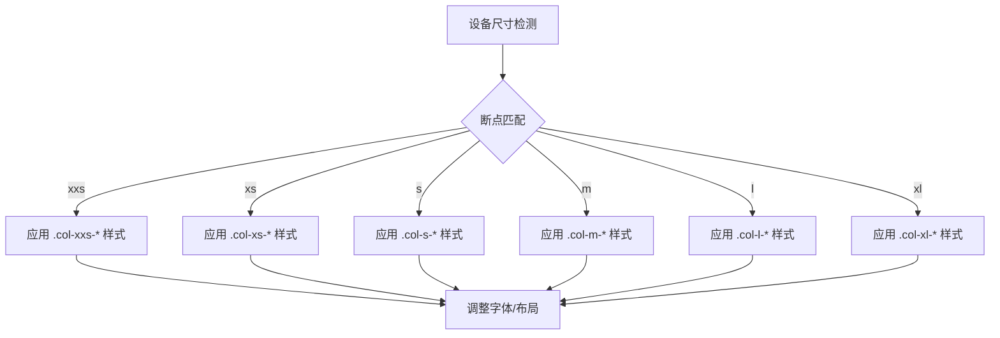

# 字体与排版

<cite>
**本文档引用的文件**  
- [\_typography.scss](file://src/core/base/_typography.scss)
- [\_font.scss](file://src/core/style/_font.scss)
- [mixin.scss](file://src/grid/scss/mixin.scss)
- [variable.scss](file://src/grid/scss/variable.scss)
</cite>

## 目录
1. [引言](#引言)
2. [字体层级体系](#字体层级体系)
3. [排版类名与SCSS变量](#排版类名与scss变量)
4. [响应式排版实现机制](#响应式排版实现机制)
5. [最佳实践指南](#最佳实践指南)
6. [自定义字体系统](#自定义字体系统)
7. [结论](#结论)

## 引言
fat-design 排版系统提供了一套完整的字体与文本样式规范，旨在确保设计的一致性与可读性。本系统通过 SCSS 变量和语义化类名实现灵活的排版控制，支持从标题到辅助文本的完整层级表达，并通过响应式机制适配不同设备场景。

**Section sources**
- [\_typography.scss](file://src/core/base/_typography.scss#L1-L148)
- [\_font.scss](file://src/core/style/_font.scss#L1-L176)

## 字体层级体系

### 标题层级（h1-h6）
fat-design 定义了六级标题的视觉层级，确保信息结构清晰：

- **h1（headline）**：字号 24px，字重 500，行高 36px，用于主标题
- **h2（title）**：字号 20px，字重 500，行高 30px，用于次级标题
- **h3（subhead）**：字号 16px，字重 normal，行高 24px，用于小标题
- **h4（subhead）**：字号 16px，字重 normal，行高 24px，用于辅助标题
- **h5（body-2）**：字号 14px，字重 normal，行高 24px，用于强调文本
- **h6（body-1）**：字号 12px，字重 500，行高 20px，用于最小标题或标签

### 正文与辅助文本
- **正文（body-1）**：字号 12px，字重 normal，行高 20px，颜色 $color-text1-4
- **强调正文（body-2）**：字号 14px，字重 normal，行高 24px
- **辅助文本（caption）**：字号 12px，常用于水印或说明文字
- **小字号文本（small）**：字号为父元素的 75%，用于注释或次要信息

所有文本元素均继承 `font-family-base` 字体栈，确保跨平台一致性。

**Section sources**
- [\_typography.scss](file://src/core/base/_typography.scss#L70-L147)
- [\_font.scss](file://src/core/style/_font.scss#L110-L150)

## 排版类名与SCSS变量

### 字体大小变量
| 语义名称 | SCSS 变量 | 字号 | 用途 |
|---------|----------|------|------|
| 运营标题-大 | `$font-size-display-3` | 56px | 大型运营活动标题 |
| 运营标题-中 | `$font-size-display-2` | 48px | 中型运营活动标题 |
| 运营标题-小 | `$font-size-display-1` | 36px | 小型运营活动标题 |
| 标题-大 | `$font-size-headline` | 24px | 页面主标题 |
| 标题-中 | `$font-size-title` | 20px | 模块标题 |
| 标题-小 | `$font-size-subhead` | 16px | 子模块标题 |
| 正文-强调 | `$font-size-body-2` | 14px | 强调性正文 |
| 正文-常规 | `$font-size-body-1` | 12px | 常规正文内容 |
| 水印文本 | `$font-size-caption` | 12px | 水印、辅助说明 |

### 字重变量
| 语义名称 | SCSS 变量 | 数值 | 用途 |
|---------|----------|------|------|
| Ultra light | `$font-weight-1` | lighter | 极细文本 |
| Extra Light | `$font-weight-thin` | 200 | 超轻文本 |
| Light | `$font-weight-light` | 300 | 轻量文本 |
| Regular | `$font-weight-2` | normal | 常规文本 |
| Medium | `$font-weight-medium` | 500 | 中等字重 |
| Semi Bold | `$font-weight-semi-bold` | 600 | 半粗体 |
| Bold | `$font-weight-3` | bold | 粗体 |
| Extra Bold | `$font-weight-extra-bold` | 800 | 超粗体 |
| Ultra Bold | `$font-weight-ultra-bold` | 900 | 极粗体 |

### 行高变量
| 语义名称 | SCSS 变量 | 数值 | 用途 |
|---------|----------|------|------|
| 密集 | `$font-lineheight-1` | 1.5 | 紧凑排版 |
| 常规 | `$font-lineheight-2` | 1.7 | 标准行高 |
| 宽松 | `$font-lineheight-3` | 2 | 宽松阅读体验 |

**Section sources**
- [\_font.scss](file://src/core/style/_font.scss#L110-L176)

## 响应式排版实现机制

### 断点系统
fat-design 使用基于 CSS 媒体查询的响应式系统，定义了六个断点：

```scss
$breakpoints: (
    "xxs": 320px,   // 超小屏/手机
    "xs": 480px,    // 小屏/手机
    "s": 720px,     // 中屏/平板
    "m": 990px,     // 中大屏/桌面
    "l": 1200px,    // 大屏/桌面
    "xl": 1500px    // 超大屏/桌面
);
```

### 响应式混合宏
通过 `@mixin breakpoint($point, $type)` 实现条件样式：

```scss
@mixin breakpoint($point, $type: "min") {
    @each $breakpoint in $breakpoints {
        $name: nth($breakpoint, 1);
        $minQuery: nth($breakpoint, 2);
        $maxQuery: nth($breakpoint, 3);

        @if ($name == $point) {
            @if ($type == "min") {
                @media #{$minQuery} { @content; }
            }
        }
    }
}
```

### 响应式列布局
`make-columns()` 混合宏为每个断点生成对应的列类名，如 `.col-xs-12` 在小屏上占据 12 列宽度。



**Diagram sources**
- [mixin.scss](file://src/grid/scss/mixin.scss#L1-L42)
- [variable.scss](file://src/grid/scss/variable.scss#L1-L49)

**Section sources**
- [mixin.scss](file://src/grid/scss/mixin.scss#L1-L167)
- [variable.scss](file://src/grid/scss/variable.scss#L1-L49)

## 最佳实践指南

### 场景化使用建议
- **运营页面**：使用 `$font-size-display-*` 系列变量创建视觉冲击力
- **数据仪表盘**：h1-h3 用于指标标题，body-1 用于数值说明
- **表单界面**：h4-h6 作为字段分组标题，body-1 作为输入提示
- **移动端**：优先使用响应式类名确保小屏可读性

### 排版原则
1. **层级清晰**：确保标题层级不跳跃，h2 后应为 h3 而非 h5
2. **对比适度**：字重变化不超过两级，避免视觉混乱
3. **留白合理**：通过 `margin-bottom` 与行高配合创造呼吸感
4. **可读优先**：正文行高不低于 1.5，字号不小于 12px

### 常见错误避免
- 避免直接使用像素值，应通过 SCSS 变量引用
- 不要手动设置 `font-family`，应继承系统定义
- 响应式场景下避免固定宽度导致文本溢出

**Section sources**
- [\_typography.scss](file://src/core/base/_typography.scss#L1-L148)
- [mixin.scss](file://src/grid/scss/mixin.scss#L1-L167)

## 自定义字体系统

### 修改SCSS变量
通过覆盖默认变量值来自定义整个项目的字体系统：

```scss
// 自定义字体栈
$font-family-base: "PingFang SC", "Microsoft YaHei", sans-serif;

// 调整字号层级
$font-size-body-1: 14px;
$font-size-subhead: 18px;

// 修改字重映射
$font-weight-medium: 600;
$font-weight-2: 400;

// 调整行高标准
$font-lineheight-base: 1.4;
```

### 字体加载配置
通过以下变量控制自定义字体加载：

```scss
$font-custom-path: "//your-cdn.com/fonts/";
$font-custom-name: "CustomFont";
$font-name-thin: "custom-thin";
$font-name-light: "custom-light";
$font-name-regular: "custom-regular";
$font-name-medium: "custom-medium";
$font-name-bold: "custom-bold";
```

### 主题化扩展
可为不同主题创建独立的字体变量文件，通过主题切换机制动态加载。

**Section sources**
- [\_font.scss](file://src/core/style/_font.scss#L1-L176)
- [\_typography.scss](file://src/core/base/_typography.scss#L1-L148)

## 结论
fat-design 的排版系统通过结构化的 SCSS 变量和响应式机制，提供了强大而灵活的文本样式控制能力。开发者应遵循既定的层级规范，善用语义化变量，确保跨组件、跨页面的视觉一致性。通过合理的自定义配置，可快速适配不同产品风格需求，同时保持核心排版原则不变。