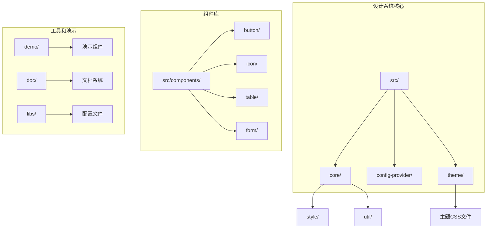
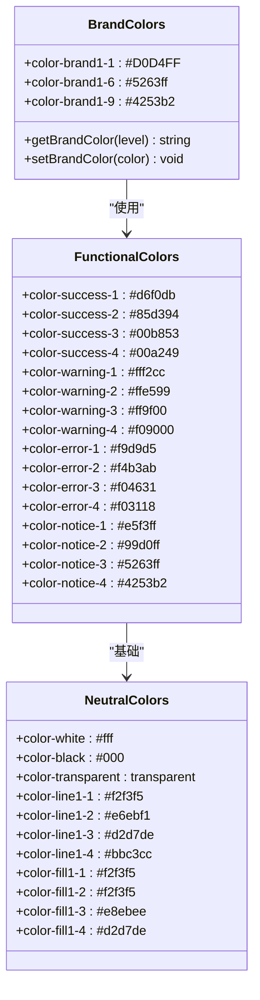
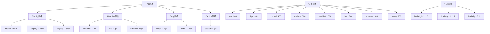
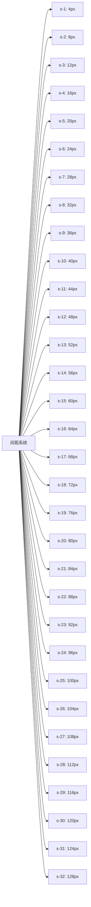
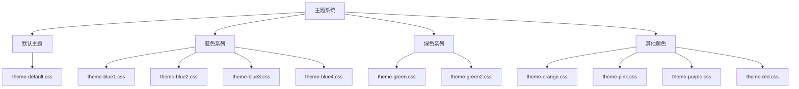
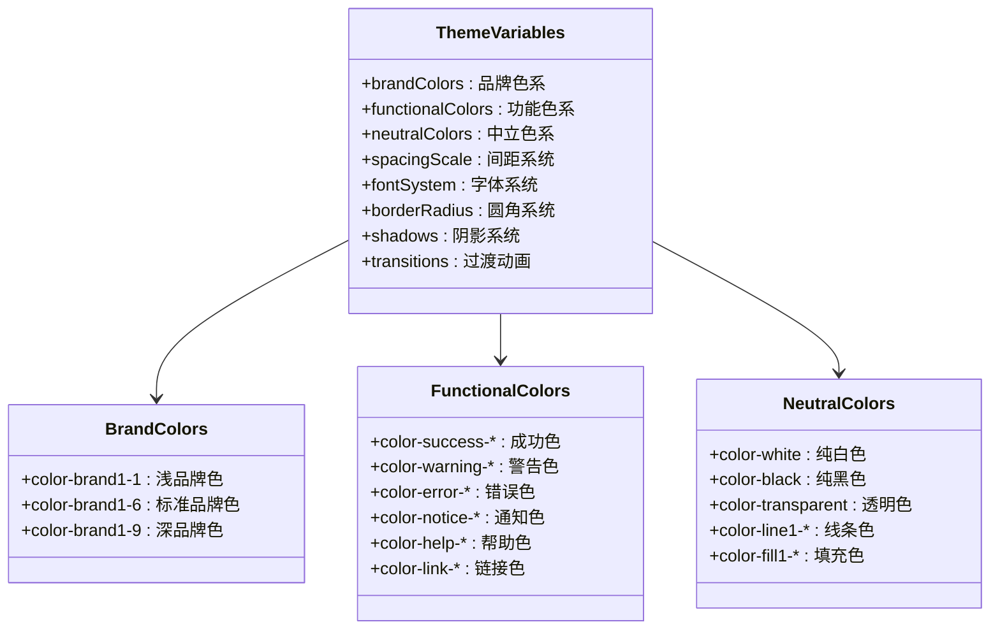
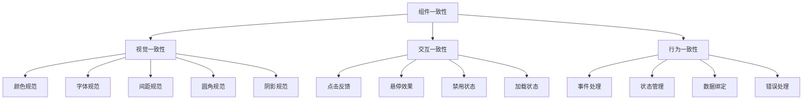

# Fat Design 设计系统文档

<cite>
**本文档引用的文件**
- [theme-default.css](file://libs/theme/theme-default.css)
- [theme-blue1.css](file://libs/theme/theme-blue1.css)
- [theme-blue2.css](file://libs/theme/theme-blue2.css)
- [theme-blue3.css](file://libs/theme/theme-blue3.css)
- [theme-blue4.css](file://libs/theme/theme-blue4.css)
- [theme-green.css](file://libs/theme/theme-green.css)
- [theme-green2.css](file://libs/theme/theme-green2.css)
- [theme-orange.css](file://libs/theme/theme-orange.css)
- [theme-pink.css](file://libs/theme/theme-pink.css)
- [theme-purple.css](file://libs/theme/theme-purple.css)
- [theme-red.css](file://libs/theme/theme-red.css)
- [_font.scss](file://src/core/style/_font.scss)
- [_size.scss](file://src/core/style/_size.scss)
- [_color.scss](file://src/core/style/_color.scss)
- [icon.jsx](file://src/icon/icon.jsx)
- [icon-font.jsx](file://src/icon/icon-font.jsx)
- [demo-icons.jsx](file://demo/demo-icons.jsx)
- [provider.tsx](file://src/config-provider/v2/provider.tsx)
- [context.ts](file://src/config-provider/v2/context.ts)
- [button/main.scss](file://src/button/main.scss)
- [README.md](file://README.md)
</cite>

## 目录
1. [简介](#简介)
2. [项目结构](#项目结构)
3. [颜色体系](#颜色体系)
4. [字体系统](#字体系统)
5. [间距系统](#间距系统)
6. [图标库](#图标库)
7. [主题定制](#主题定制)
8. [设计Token](#设计token)
9. [组件一致性](#组件一致性)
10. [最佳实践](#最佳实践)

## 简介

Fat Design 是一个现代化的 React 组件库，专为构建企业级应用而设计。该设计系统提供了完整的视觉语言和交互模式，确保产品的一致性和用户体验的统一性。

### 核心特性

- **轻量级架构**：构建后仅 761KB，比 Next 组件库更轻量
- **功能丰富**：包含 Form2、Table、Image、QueryForm 等高级组件
- **多主题支持**：内置多种预设主题，支持自定义主题
- **响应式设计**：完全响应式布局，适配各种设备
- **无障碍支持**：遵循 WCAG 标准，支持无障碍访问

## 项目结构



**图表来源**
- [theme-default.css](file://libs/theme/theme-default.css#L1-L61)
- [provider.tsx](file://src/config-provider/v2/provider.tsx#L1-L78)

**章节来源**
- [README.md](file://README.md#L1-L35)

## 颜色体系

Fat Design 的颜色体系采用分层设计，包含品牌色、功能色、中立色三大类别，每种颜色都有多个层次用于不同场景。

### 主色系统



**图表来源**
- [_color.scss](file://src/core/style/_color.scss#L1-L199)
- [theme-default.css](file://libs/theme/theme-default.css#L1-L61)

### 颜色层次规范

每个颜色类别都遵循相同的层次规范：

- **Level 1**：最浅的颜色，用于背景或弱化状态
- **Level 2**：次浅的颜色，用于次要元素
- **Level 3**：标准颜色，用于主要内容
- **Level 4**：深色版本，用于强调或重要状态

**章节来源**
- [_color.scss](file://src/core/style/_color.scss#L1-L199)
- [theme-default.css](file://libs/theme/theme-default.css#L1-L61)

## 字体系统

Fat Design 采用科学的字体层级系统，包含 9 个级别的字体大小，配合 3 种行高设置，确保内容的可读性和层次感。

### 字体层级结构



**图表来源**
- [_font.scss](file://src/core\style\_font.scss#L1-L176)

### 字体配置详解

#### 字体家族
- **英文**：Roboto, "Helvetica Neue", Helvetica, Tahoma, Arial
- **中文**："Microsoft YaHei", SimSun, Arial

#### 字重规范
- **Ultra Light (Thin)**：200
- **Extra Light**：300
- **Light**：300
- **Regular**：400
- **Medium**：500
- **Semi Bold**：600
- **Bold**：700
- **Extra Bold**：800
- **Ultra Bold (Heavy)**：900

#### 行高设置
- **密集**：1.5（适用于紧凑布局）
- **常规**：1.7（适用于正文内容）
- **宽松**：2（适用于长篇阅读）

**章节来源**
- [_font.scss](file://src/core\style\_font.scss#L1-L176)

## 间距系统

Fat Design 的间距系统采用 32 个级别的网格系统，从 0px 到 128px，提供精确的空间控制。

### 间距层级图



**图表来源**
- [_size.scss](file://src/core\style\_size.scss#L1-L199)

### 间距使用指南

- **s-1 到 s-4**：用于微小间距，如内边距
- **s-5 到 s-8**：用于标准间距，如组件间距离
- **s-9 到 s-12**：用于较大间距，如模块间距离
- **s-13 到 s-16**：用于标题间距
- **s-17 到 s-20**：用于页面级间距
- **s-21 到 s-32**：用于特殊场景的大间距

**章节来源**
- [_size.scss](file://src/core\style\_size.scss#L1-L199)

## 图标库

Fat Design 提供了丰富的图标库，支持多种使用方式，包括内置图标和自定义图标字体。

### 内置图标类型

```mermaid
mindmap
root((内置图标))
社交图标
smile
cry
favorites-filling
account
email
状态图标
success
warning
prompt
error
help
loading
导航图标
arrow-up
arrow-down
arrow-left
arrow-right
arrow-double-left
arrow-double-right
switch
功能图标
add
minus
delete-filling
edit
copy
refresh
search
close
ellipsis
数据可视化
chart-pie
chart-bar
form
detail
list
dashboard
文件操作
picture
calendar
ashbin
upload
download
attachment
lock
unlock
```

**图表来源**
- [demo-icons.jsx](file://demo/demo-icons.jsx#L1-L79)

### 图标使用方式

#### 1. 内置图标组件
```jsx
import { Icon } from 'fat-design';

// 基本使用
<Icon type="success" />

// 指定大小
<Icon type="warning" size="large" />
<Icon type="error" size={24} />

// 自定义样式
<Icon type="search" style={{ color: '#ff0000' }} />
```

#### 2. 自定义图标字体
```jsx
import { Icon } from 'fat-design';
import createFromIconfontCN from 'fat-design/lib/icon/icon-font';

const MyIcon = createFromIconfontCN({
  scriptUrl: '//at.alicdn.com/t/font_1234567_abcdefg.js'
});

// 使用自定义图标
<MyIcon type="custom-icon-name" />
```

### 图标尺寸规范

- **xxs**：12px
- **xs**：16px  
- **small**：20px
- **medium**：24px（默认）
- **large**：32px
- **xl**：40px
- **xxl**：48px
- **xxxl**：56px
- **inherit**：继承父级尺寸

**章节来源**
- [icon.jsx](file://src\icon\icon.jsx#L1-L83)
- [icon-font.jsx](file://src\icon\icon-font.jsx#L1-L78)
- [demo-icons.jsx](file://demo\demo-icons.jsx#L1-L79)

## 主题定制

Fat Design 支持灵活的主题定制机制，可以通过引入不同的主题CSS文件或自定义CSS变量来实现主题切换。

### 预设主题



**图表来源**
- [theme-default.css](file://libs\theme\theme-default.css#L1-L61)
- [theme-blue1.css](file://libs\theme\theme-blue1.css#L1-L61)
- [theme-blue2.css](file://libs\theme\theme-blue2.css#L1-L61)

### 主题切换机制

#### 1. 引入预设主题
```jsx
// 在入口文件中引入主题
import 'fat-design/libs/theme/theme-blue3.css';

// 或者动态切换
const switchTheme = (themeName) => {
  const link = document.createElement('link');
  link.rel = 'stylesheet';
  link.href = `/libs/theme/${themeName}.css`;
  document.head.appendChild(link);
};
```

#### 2. 自定义CSS变量
```css
/* 自定义主题 */
.fatd-custom-theme {
  --color-brand1-1: #ff6b6b;
  --color-brand1-6: #ff5252;
  --color-brand1-9: #e54d42;
  --color-success-1: #e6ffed;
  --color-success-2: #b3f0c9;
  --color-success-3: #52c41a;
  --color-success-4: #389e0d;
  /* 更多变量... */
}
```

#### 3. 通过配置提供者
```jsx
import { ConfigProvider } from 'fat-design';

const App = () => (
  <ConfigProvider prefix="my-app">
    {/* 应用内容 */}
  </ConfigProvider>
);
```

### 主题变量映射



**图表来源**
- [theme-default.css](file://libs\theme\theme-default.css#L1-L61)
- [provider.tsx](file://src\config-provider\v2\provider.tsx#L1-L78)

**章节来源**
- [theme-default.css](file://libs\theme\theme-default.css#L1-L61)
- [provider.tsx](file://src\config-provider\v2\provider.tsx#L1-L78)
- [context.ts](file://src\config-provider\v2\context.ts#L1-L20)

## 设计Token

Fat Design 的设计Token系统基于CSS变量，提供了完整的样式变量管理。

### Token分类体系

```mermaid
graph TB
A[设计Token] --> B[颜色Token]
A --> C[尺寸Token]
A --> D[字体Token]
A --> E[间距Token]
A --> F[圆角Token]
A --> G[阴影Token]
A --> H[过渡Token]
B --> B1[品牌色: --color-brand1-*
B --> B2[功能色: --color-*
B --> B3[中立色: --color-*
C --> C1[基础尺寸: $size-base
C --> C2[间距变量: $s-*
D --> D1[字体大小: $font-size-*
D --> D2[字体权重: $font-weight-*
D --> D3[行高: $font-lineheight-*
E --> E1[间距系统: $s-*
F --> F1[圆角: $corner-*
G --> G1[阴影: $shadow-*
H --> H1[过渡时间: $motion-duration-*
H --> H2[缓动函数: $motion-easing-*
```

### Token使用示例

#### 1. CSS变量使用
```css
.button {
  background-color: var(--color-brand1-6);
  color: var(--color-white);
  padding: var(--spacing-s-2);
  border-radius: var(--corner-s-1);
  font-size: var(--font-size-body-1);
  line-height: var(--font-lineheight-2);
}
```

#### 2. SCSS变量使用
```scss
@import 'fat-design/src/core/util/_varMap.scss';

.component {
  background: map-get($color-map, 'brand1-6');
  padding: map-get($spacing-map, 's-2');
  font-size: map-get($font-size-map, 'body-1');
}
```

#### 3. JavaScript动态获取
```javascript
// 获取当前主题的变量
const brandColor = getComputedStyle(document.documentElement)
  .getPropertyValue('--color-brand1-6')
  .trim();

// 动态修改主题
document.documentElement.style.setProperty('--color-brand1-6', '#007bff');
```

**章节来源**
- [_color.scss](file://src\core\style\_color.scss#L1-L199)
- [_font.scss](file://src\core\style\_font.scss#L1-L176)
- [_size.scss](file://src\core\style\_size.scss#L1-L199)

## 组件一致性

Fat Design 通过统一的设计Token和样式规范，确保所有组件在视觉和交互上保持一致。

### 组件设计原则



### 组件样式模板

#### 按钮组件样式模板
```scss
// 基础按钮样式
.next-btn {
  // 尺寸变体
  &-small {
    padding: $btn-size-s-padding;
    height: $btn-size-s-height;
    font-size: $btn-size-s-font;
  }
  
  &-medium {
    padding: $btn-size-m-padding;
    height: $btn-size-m-height;
    font-size: $btn-size-m-font;
  }
  
  // 状态变体
  &-primary {
    background-color: var(--color-brand1-6);
    border-color: var(--color-brand1-6);
    color: var(--color-white);
  }
  
  &:hover {
    background-color: var(--color-brand1-9);
    border-color: var(--color-brand1-9);
  }
  
  &:disabled {
    background-color: var(--color-fill1-1);
    border-color: var(--color-line1-1);
    color: var(--color-text1-2);
  }
}
```

### 组件开发规范

1. **使用统一的Token**：所有组件必须使用设计Token，不能硬编码颜色、尺寸等
2. **遵循层级规范**：合理使用字体层级和间距层级
3. **状态管理**：正确处理正常、悬停、激活、禁用等状态
4. **无障碍支持**：确保组件支持键盘导航和屏幕阅读器
5. **响应式设计**：适配不同屏幕尺寸和设备

**章节来源**
- [button/main.scss](file://src\button\main.scss#L1-L199)

## 最佳实践

### 1. 主题定制最佳实践

#### 推荐的自定义流程
```javascript
// 1. 创建自定义主题文件
const createCustomTheme = (primaryColor) => {
  return `
    .fatd-custom-theme {
      --color-brand1-1: ${lighten(primaryColor, 0.8)};
      --color-brand1-6: ${primaryColor};
      --color-brand1-9: ${darken(primaryColor, 0.1)};
      
      --color-success-1: ${lighten('#52c41a', 0.8)};
      --color-success-2: ${lighten('#52c41a', 0.6)};
      --color-success-3: #52c41a;
      --color-success-4: ${darken('#52c41a', 0.1)};
      
      --color-warning-1: ${lighten('#faad14', 0.8)};
      --color-warning-2: ${lighten('#faad14', 0.6)};
      --color-warning-3: #faad14;
      --color-warning-4: ${darken('#faad14', 0.1)};
      
      --color-error-1: ${lighten('#ff4d4f', 0.8)};
      --color-error-2: ${lighten('#ff4d4f', 0.6)};
      --color-error-3: #ff4d4f;
      --color-error-4: ${darken('#ff4d4f', 0.1)};
    }
  `;
};

// 2. 动态应用主题
const applyTheme = (themeCSS) => {
  const styleElement = document.createElement('style');
  styleElement.textContent = themeCSS;
  document.head.appendChild(styleElement);
};
```

#### 主题切换的最佳实践
```javascript
class ThemeManager {
  constructor() {
    this.currentTheme = 'default';
    this.themes = new Map();
  }
  
  registerTheme(name, css) {
    this.themes.set(name, css);
  }
  
  switchTheme(themeName) {
    if (this.themes.has(themeName)) {
      // 移除旧主题
      const oldTheme = document.querySelector('.fatd-theme');
      if (oldTheme) {
        oldTheme.remove();
      }
      
      // 应用新主题
      const style = document.createElement('style');
      style.className = 'fatd-theme';
      style.textContent = this.themes.get(themeName);
      document.head.appendChild(style);
      
      this.currentTheme = themeName;
    }
  }
}
```

### 2. 开发环境配置

#### Webpack配置示例
```javascript
module.exports = {
  module: {
    rules: [
      {
        test: /\.scss$/,
        use: [
          'style-loader',
          {
            loader: 'css-loader',
            options: {
              importLoaders: 2,
              modules: {
                localIdentName: '[name]__[local]--[hash:base64:5]'
              }
            }
          },
          'sass-loader'
        ]
      }
    ]
  },
  plugins: [
    new MiniCssExtractPlugin({
      filename: '[name].css'
    })
  ]
};
```

#### TypeScript配置
```typescript
// tsconfig.json
{
  "compilerOptions": {
    "baseUrl": ".",
    "paths": {
      "fat-design": ["src/index"],
      "fat-design/*": ["src/*"]
    },
    "types": ["fat-design/types"]
  }
}
```

### 3. 性能优化建议

#### 1. 按需加载
```javascript
// 按需引入组件
import Button from 'fat-design/lib/button';
import 'fat-design/lib/button/style';

// 或使用 babel-plugin-import
import { Button } from 'fat-design';
```

#### 2. 主题按需加载
```javascript
// 只加载需要的主题
const loadTheme = async (themeName) => {
  try {
    const themeModule = await import(`fat-design/libs/theme/theme-${themeName}.css`);
    return themeModule.default;
  } catch (error) {
    console.warn(`Theme ${themeName} not found, falling back to default`);
    return await import('fat-design/libs/theme/theme-default.css');
  }
};
```

#### 3. 缓存策略
```javascript
class ThemeCache {
  constructor() {
    this.cache = new Map();
  }
  
  async getTheme(themeName) {
    if (this.cache.has(themeName)) {
      return this.cache.get(themeName);
    }
    
    const theme = await loadTheme(themeName);
    this.cache.set(themeName, theme);
    return theme;
  }
}
```

### 4. 团队协作规范

#### 1. 设计Token命名规范
- 使用 kebab-case 命名
- 遵循语义化原则
- 添加适当的注释

```scss
// ✅ 推荐
$font-size-body-1: 12px; // 正文-常规
$color-success-3: #00b853; // 成功色-标准

// ❌ 不推荐
$fs1: 12px;
$green: #00b853;
```

#### 2. 组件开发规范
- 使用 TypeScript 类型定义
- 提供完整的 Storybook 文档
- 编写单元测试和集成测试
- 遵循 ARIA 规范

#### 3. 版本管理
- 使用语义化版本号
- 维护变更日志
- 提供迁移指南
- 保持向后兼容性

**章节来源**
- [README.md](file://README.md#L1-L35)

## 结论

Fat Design 设计系统通过其完善的颜色体系、字体系统、间距系统和图标库，为企业级应用提供了强大的视觉语言基础。其灵活的主题定制机制和设计Token系统，使得开发者能够轻松创建符合品牌需求的用户界面。

通过遵循本文档中的最佳实践和设计原则，开发团队可以构建出既美观又实用的用户界面，同时保持代码的一致性和可维护性。随着项目的不断发展，Fat Design 将继续演进，为更多的开发者提供优秀的组件库解决方案。