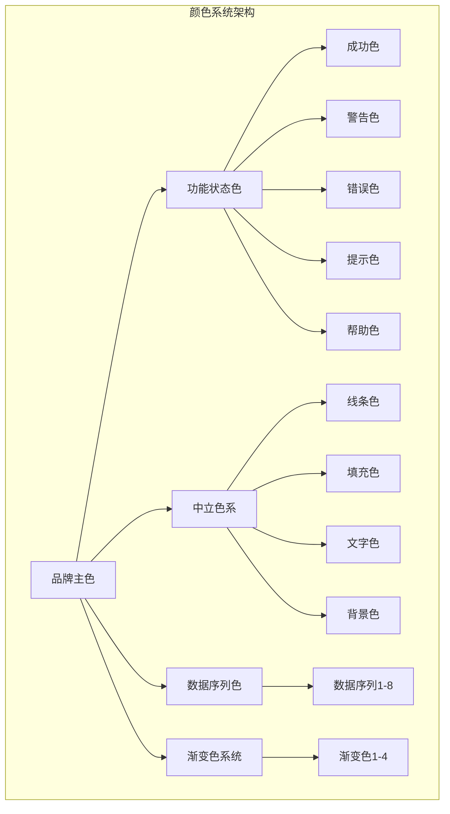
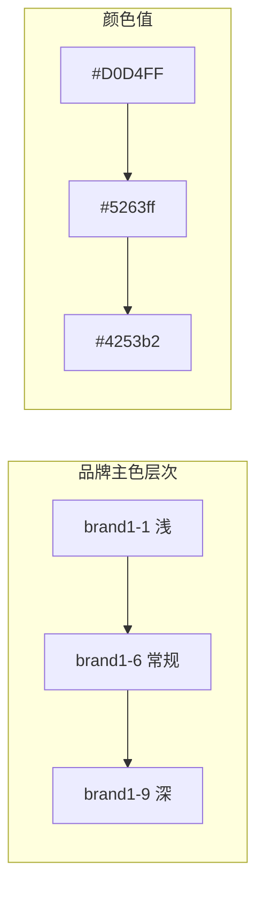
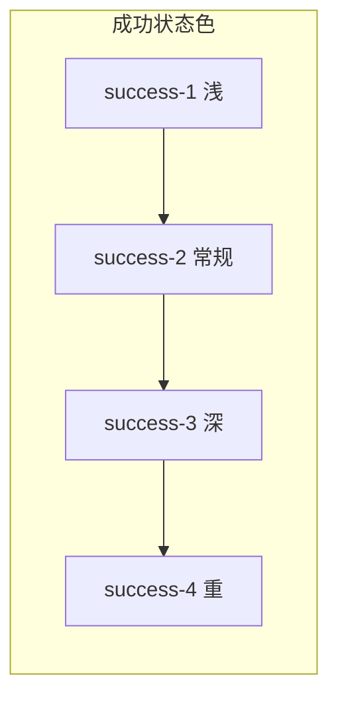
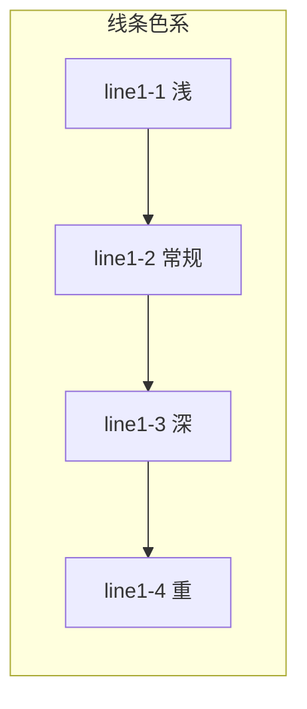
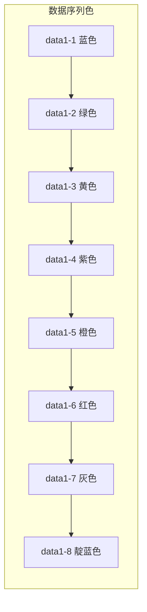
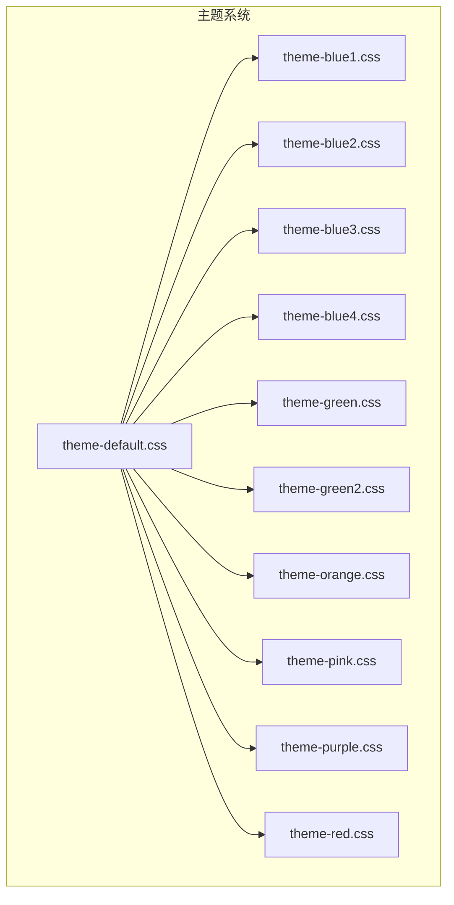
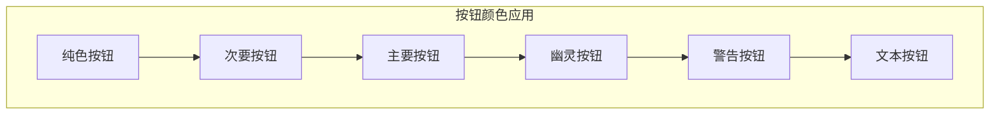
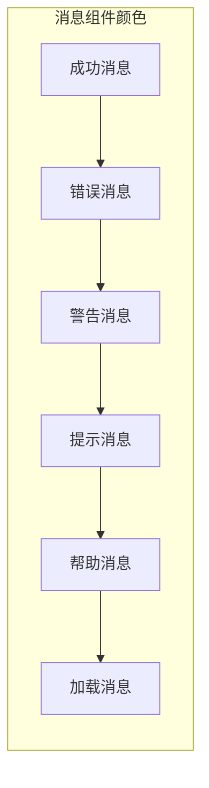
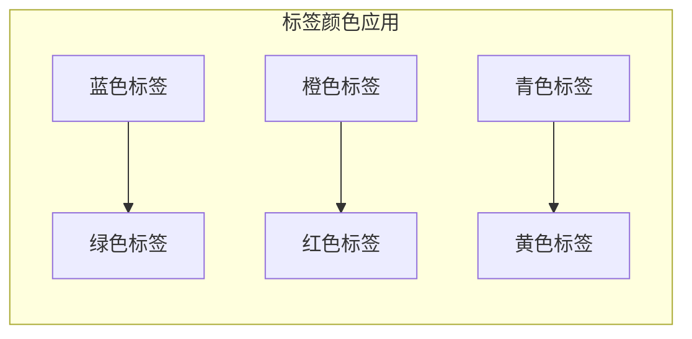

# Fat Design 颜色体系

<cite>
**本文档引用的文件**
- [src/core/style/_color.scss](file://src/core/style/_color.scss)
- [libs/theme/theme-default.css](file://libs/theme/theme-default.css)
- [libs/theme/theme-blue1.css](file://libs/theme/theme-blue1.css)
- [libs/theme/theme-blue2.css](file://libs/theme/theme-blue2.css)
- [libs/theme/theme-blue3.css](file://libs/theme/theme-blue3.css)
- [libs/theme/theme-blue4.css](file://libs/theme/theme-blue4.css)
- [libs/theme/theme-green.css](file://libs/theme/theme-green.css)
- [libs/theme/theme-green2.css](file://libs/theme/theme-green2.css)
- [libs/theme/theme-orange.css](file://libs/theme/theme-orange.css)
- [libs/theme/theme-pink.css](file://libs/theme/theme-pink.css)
- [libs/theme/theme-purple.css](file://libs/theme/theme-purple.css)
- [libs/theme/theme-red.css](file://libs/theme/theme-red.css)
- [src/button/scss/variable.scss](file://src/button/scss/variable.scss)
- [src/message/scss/variable.scss](file://src/message/scss/variable.scss)
- [src/tag/scss/variable.scss](file://src/tag/scss/variable.scss)
</cite>

## 目录
1. [简介](#简介)
2. [颜色系统架构](#颜色系统架构)
3. [品牌主色系统](#品牌主色系统)
4. [功能状态色](#功能状态色)
5. [中立色系](#中立色系)
6. [数据序列色](#数据序列色)
7. [渐变色系统](#渐变色系统)
8. [主题定制](#主题定制)
9. [颜色变量使用指南](#颜色变量使用指南)
10. [组件中的颜色应用](#组件中的颜色应用)
11. [最佳实践](#最佳实践)

## 简介

Fat Design 是一个现代化的 React 组件库，其颜色系统采用基于 CSS 变量的设计理念，提供了完整的色彩体系和灵活的主题定制能力。该系统支持多种预设主题，并允许开发者通过覆盖 CSS 变量来自定义项目专属的颜色主题。

## 颜色系统架构

Fat Design 的颜色系统采用分层设计，将颜色分为以下主要类别：



**图表来源**
- [src/core/style/_color.scss](file://src/core/style/_color.scss#L1-L332)

## 品牌主色系统

品牌主色是 Fat Design 颜色系统的核心，采用蓝紫色调为主的品牌色彩方案。

### 主色层次结构



**图表来源**
- [src/core/style/_color.scss](file://src/core/style/_color.scss#L12-L18)

### 品牌主色变量定义

| 变量名 | 十六进制值 | 描述 |
|--------|------------|------|
| `$color-brand1-1` | `#D0D4FF` | 品牌主色 - 浅色 |
| `$color-brand1-6` | `#5263ff` | 品牌主色 - 常规色 |
| `$color-brand1-9` | `#4253b2` | 品牌主色 - 深色 |

**章节来源**
- [src/core/style/_color.scss](file://src/core/style/_color.scss#L12-L18)

## 功能状态色

功能状态色用于表示不同的操作状态和信息类型，每种状态色都有四个明度层级。

### 成功状态色



**图表来源**
- [src/core/style/_color.scss](file://src/core/style/_color.scss#L20-L26)

| 状态色 | success-1 | success-2 | success-3 | success-4 |
|--------|-----------|-----------|-----------|-----------|
| 十六进制 | `#d6f0db` | `#85d394` | `#00b853` | `#00a249` |
| 描述 | 浅绿色 | 常规绿色 | 深绿色 | 重绿色 |

### 警告状态色

| 状态色 | warning-1 | warning-2 | warning-3 | warning-4 |
|--------|-----------|-----------|-----------|-----------|
| 十六进制 | `#fff2cc` | `#ffe599` | `#ff9f00` | `#f09000` |
| 描述 | 浅黄色 | 常规黄色 | 橙黄色 | 深橙色 |

### 错误状态色

| 状态色 | error-1 | error-2 | error-3 | error-4 |
|--------|---------|---------|---------|---------|
| 十六进制 | `#f9d9d5` | `#f4b3ab` | `#f04631` | `#f03118` |
| 描述 | 浅红色 | 常规红色 | 深红色 | 重红色 |

### 提示状态色

| 状态色 | notice-1 | notice-2 | notice-3 | notice-4 |
|--------|----------|----------|----------|----------|
| 十六进制 | `#e5f3ff` | `#99d0ff` | `#5263ff` | `#4253b2` |
| 描述 | 浅蓝色 | 常规蓝色 | 深蓝色 | 重蓝色 |

### 帮助状态色

| 状态色 | help-1 | help-2 | help-3 | help-4 |
|--------|--------|--------|--------|--------|
| 十六进制 | `#d8ebf7` | `#b1d6ef` | `#3c99d8` | `#2e76a6` |
| 描述 | 浅青色 | 常规青色 | 深青色 | 重青色 |

**章节来源**
- [src/core/style/_color.scss](file://src/core/style/_color.scss#L20-L56)

## 中立色系

中立色系提供界面的基础色彩，包括线条、填充、文字和背景等基础元素。

### 线条色系



**图表来源**
- [src/core/style/_color.scss](file://src/core/style/_color.scss#L108-L114)

| 线条色 | line1-1 | line1-2 | line1-3 | line1-4 |
|--------|---------|---------|---------|---------|
| 十六进制 | `#f2f3f5` | `#e6ebf1` | `#d2d7de` | `#bbc3cc` |
| 描述 | 浅灰色 | 常规灰色 | 深灰色 | 重灰色 |

### 填充色系

| 填充色 | fill1-1 | fill1-2 | fill1-3 | fill1-4 |
|--------|---------|---------|---------|---------|
| 十六进制 | `#f2f3f5` | `#f2f3f5` | `#e8ebee` | `#d2d7de` |
| 描述 | 浅灰色 | 常规灰色 | 深灰色 | 重灰色 |

### 文字色系

| 文字色 | text1-1 | text1-2 | text1-3 | text1-4 |
|--------|---------|---------|---------|---------|
| 十六进制 | `#ccc` | `#999` | `#666` | `#333` |
| 描述 | 禁用色 | 水印/提示 | 正文/标题 | 正文/标题 |

### 背景色系

| 背景色 | bg1-1 | bg1-2 |
|--------|-------|-------|
| 十六进制 | `#f4f6f9` | `#f2f3f5` |
| 描述 | 浅背景色 | 常规背景色 |

**章节来源**
- [src/core/style/_color.scss](file://src/core/style/_color.scss#L108-L140)

## 数据序列色

数据序列色为图表和数据可视化提供标准化的颜色选择，共8个预设颜色。

### 数据序列色表



**图表来源**
- [src/core/style/_color.scss](file://src/core/style/_color.scss#L142-L150)

| 序列色 | data1-1 | data1-2 | data1-3 | data1-4 | data1-5 | data1-6 | data1-7 | data1-8 |
|--------|---------|---------|---------|---------|---------|---------|---------|---------|
| 十六进制 | `#29a5ff` | `#82cb79` | `#ffcc2c` | `#c45dd8` | `#f68e4f` | `#fc555d` | `#c2c2c2` | `#6a76ff` |
| 描述 | 蓝色 | 绿色 | 黄色 | 紫色 | 橙色 | 红色 | 灰色 | 靛蓝色 |

**章节来源**
- [src/core/style/_color.scss](file://src/core/style/_color.scss#L142-L150)

## 渐变色系统

渐变色系统提供四种预设的线性渐变效果，适用于按钮、卡片等组件的视觉增强。

### 渐变色定义

| 渐变色 | 渐变1 | 渐变2 | 渐变3 | 渐变4 |
|--------|-------|-------|-------|-------|
| 定义 | `linear-gradient(270deg, rgb(121, 232, 199) 0%, rgb(8, 194, 158) 100%)` | `linear-gradient(270deg, rgb(125, 238, 255) 0%, rgb(3, 193, 253) 100%)` | `linear-gradient(270deg, rgb(255, 237, 117) 0%, rgb(245, 203, 34) 100%)` | `linear-gradient(270deg, rgb(255, 163, 166) 0%, rgb(245, 39, 67) 100%)` |

**章节来源**
- [src/core/style/_color.scss](file://src/core/style/_color.scss#L315-L325)

## 主题定制

Fat Design 支持多种预设主题，每个主题都有一套完整的 CSS 变量定义。

### 主题文件结构



**图表来源**
- [libs/theme/theme-default.css](file://libs/theme/theme-default.css#L1-L61)
- [libs/theme/theme-blue1.css](file://libs/theme/theme-blue1.css#L1-L59)

### 默认主题颜色配置

默认主题采用标准的蓝紫色调，提供完整的颜色变量覆盖：

```css
.fatd-theme-default {
    --color-bg1-1: #f4f6f9;
    --color-bg1-2: #f2f3f5;
    --color-black: #000;
    --color-brand1-1: #D0D4FF;
    --color-brand1-6: #5263ff;
    --color-brand1-9: #4253b2;
    --color-data1-1: #29a5ff;
    --color-data1-2: #82cb79;
    // ... 更多颜色变量
}
```

### 蓝色主题颜色配置

蓝色主题采用更明亮的蓝色调，提供不同的颜色变量值：

```css
.fatd-theme-blue1 {
    --color-brand1-1: rgba(230, 253, 255, 1);
    --color-brand1-5: rgba(43, 213, 255, 1);
    --color-brand1-6: rgba(3, 193, 253, 1);
    --color-brand1-9: rgba(0, 157, 214, 1);
    --color-data1-1: rgba(12, 184, 198, 1);
    // ... 更多蓝色主题颜色变量
}
```

**章节来源**
- [libs/theme/theme-default.css](file://libs/theme/theme-default.css#L1-L61)
- [libs/theme/theme-blue1.css](file://libs/theme/theme-blue1.css#L1-L59)

## 颜色变量使用指南

### CSS 变量语法

Fat Design 使用 CSS 变量作为颜色系统的底层实现，支持降级处理：

```scss
// 使用 CSS 变量
$color-brand1-6: var(--color-brand1-6, #5263ff);

// 在组件中使用
.button {
    background-color: var(--color-brand1-6, #5263ff);
    color: var(--color-white, #fff);
}
```

### 变量命名规范

颜色变量遵循统一的命名规范：

- **品牌色**: `--color-brand1-{level}`
- **功能色**: `--color-{status}-{level}`
- **中立色**: `--color-{type}-{level}`
- **数据色**: `--color-data1-{index}`
- **渐变色**: `--color-gradient-{index}`

### 自定义颜色主题

通过覆盖 CSS 变量可以轻松定制项目专属的颜色主题：

```css
/* 自定义主题 */
.custom-theme {
    --color-brand1-6: #3498db; /* 替换品牌主色 */
    --color-success-3: #2ecc71; /* 替换成功色 */
    --color-error-3: #e74c3c; /* 替换错误色 */
    --color-bg1-1: #f8f9fa; /* 替换背景色 */
}
```

## 组件中的颜色应用

### 按钮组件颜色应用

按钮组件广泛使用颜色系统中的各种颜色变量：



**图表来源**
- [src/button/scss/variable.scss](file://src/button/scss/variable.scss#L200-L300)

#### 主要按钮颜色配置

```scss
// 主要按钮 - 品牌色
$btn-pure-primary-bg: $color-brand1-6;
$btn-pure-primary-bg-hover: var(--color-brand1-9, #4253b2);
$btn-pure-primary-bg-active: var(--color-brand1-9, #4253b2);

// 幽灵按钮 - 品牌色
$btn-ghost-light-color: $color-brand1-6;
$btn-ghost-light-border-color: $color-brand1-6;
```

#### 警告按钮颜色配置

```scss
// 警告按钮 - 错误色
$btn-warning-primary-bg: #f04631;
$btn-warning-primary-bg-hover: #f03118;
$btn-warning-primary-border-color: #f04631;

// 警告按钮 - 常规色
$btn-warning-normal-color: #f04631;
$btn-warning-normal-bg: #fff;
$btn-warning-normal-bg-hover: #f9d9d5;
```

**章节来源**
- [src/button/scss/variable.scss](file://src/button/scss/variable.scss#L200-L350)

### 消息组件颜色应用

消息组件根据不同状态使用相应的颜色变量：



**图表来源**
- [src/message/scss/variable.scss](file://src/message/scss/variable.scss#L80-L200)

#### 成功消息颜色配置

```scss
// 成功消息 - 背景色
$message-success-color-bg-inline: $color-success-1;
$message-success-color-bg-toast: $color-white;

// 成功消息 - 边框色
$message-success-color-border-inline: $color-success-1;
$message-success-color-border-toast: $color-white;

// 成功消息 - 图标色
$message-success-color-icon-inline: $color-success-3;
$message-success-color-icon-addon: $color-success-3;
$message-success-color-icon-toast: $color-success-3;
```

#### 错误消息颜色配置

```scss
// 错误消息 - 背景色
$message-error-color-bg-inline: $color-error-1;
$message-error-color-bg-toast: $color-white;

// 错误消息 - 图标色
$message-error-color-icon-inline: $color-error-3;
$message-error-color-icon-addon: $color-error-3;
$message-error-color-icon-toast: $color-error-3;
```

**章节来源**
- [src/message/scss/variable.scss](file://src/message/scss/variable.scss#L80-L150)

### 标签组件颜色应用

标签组件支持多种颜色预设和状态：



**图表来源**
- [src/tag/scss/variable.scss](file://src/tag/scss/variable.scss#L500-L569)

#### 预设颜色配置

```scss
// 预设颜色 - 不可配置
$tag-color-preset-blue: #4494F9;
$tag-color-preset-green: #46BC15;
$tag-color-preset-orange: #FF9300;
$tag-color-preset-red: #FF3000;
$tag-color-preset-turquoise: #01C1B2;
$tag-color-preset-yellow: #FCCC12;
```

#### 标签状态颜色配置

```scss
// 正常状态
$tag-normal-text-color: $color-text1-4;
$tag-fill-text-color: $color-text1-3;
$tag-bordered-text-color: $color-text1-3;
$tag-secondary-text-color: $color-brand1-6;

// 悬停状态
$tag-normal-text-color-hover: $color-brand1-6;
$tag-fill-text-color-hover: $color-text1-4;
$tag-bordered-text-color-hover: $color-text1-4;
$tag-secondary-text-color-hover: $color-brand1-9;
```

**章节来源**
- [src/tag/scss/variable.scss](file://src/tag/scss/variable.scss#L500-L569)

## 最佳实践

### 颜色使用原则

1. **一致性**: 在整个应用中保持颜色使用的统一性
2. **对比度**: 确保文本与背景之间有足够的对比度
3. **语义化**: 使用颜色传达明确的信息含义
4. **无障碍**: 考虑色盲用户的需求，避免仅依赖颜色传递信息

### 颜色变量使用建议

```scss
// 推荐：使用颜色变量
.button {
    background-color: var(--color-brand1-6, #5263ff);
    color: var(--color-white, #fff);
}

// 不推荐：直接使用硬编码颜色
.button {
    background-color: #5263ff;
    color: #ffffff;
}
```

### 主题切换实现

```javascript
// 主题切换函数
function changeTheme(themeName) {
    const root = document.documentElement;
    
    // 移除现有主题类
    document.body.classList.remove('fatd-theme-default');
    document.body.classList.remove('fatd-theme-blue1');
    
    // 添加新主题类
    document.body.classList.add(`fatd-theme-${themeName}`);
}
```

### 颜色调试技巧

1. **浏览器开发者工具**: 使用开发者工具检查元素的 CSS 变量值
2. **颜色对比度检查器**: 确保符合 WCAG 2.1 AA 级别的对比度要求
3. **主题预览**: 在开发环境中实时预览不同主题的效果

## 总结

Fat Design 的颜色系统是一个完整、灵活且易于扩展的色彩解决方案。通过基于 CSS 变量的设计，它不仅提供了丰富的颜色选择，还支持便捷的主题定制。开发者可以根据项目需求选择合适的预设主题，或者通过覆盖 CSS 变量来自定义专属的颜色方案。这种设计既保证了用户体验的一致性，又提供了充分的灵活性来满足不同项目的个性化需求。