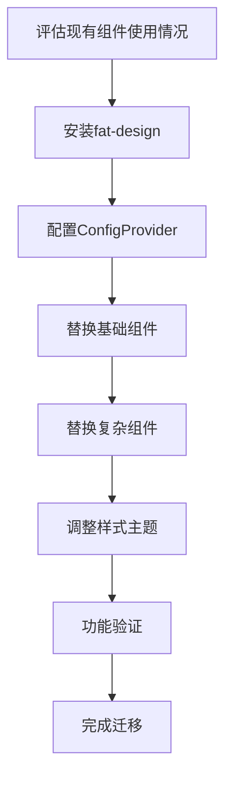
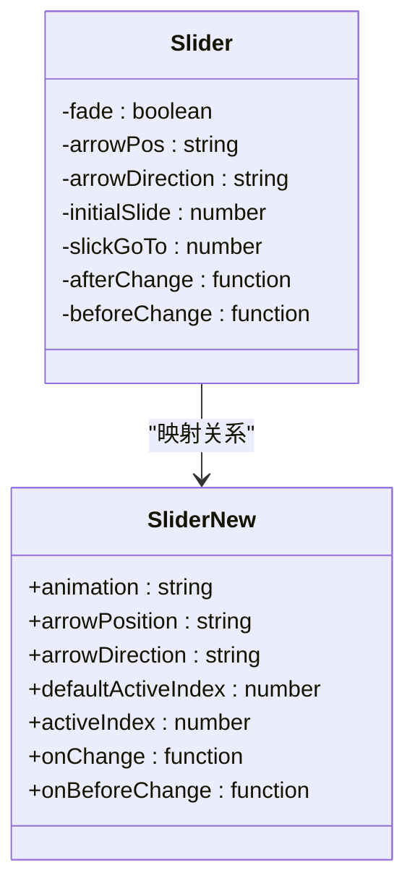
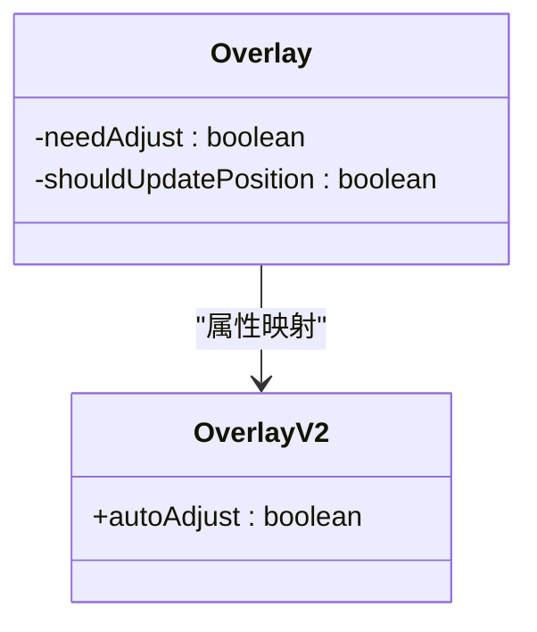
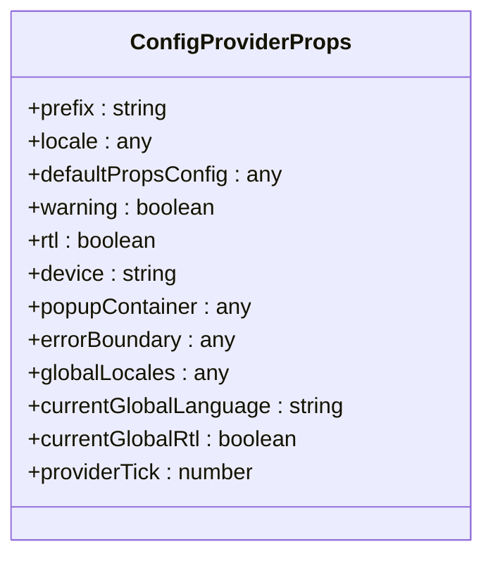
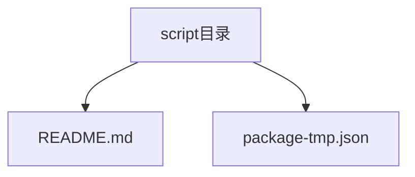

# 迁移指南

<cite>
**本文档中引用的文件**  
- [README.md](file://README.md)
- [package.json](file://package.json)
- [src/config-provider/v2/provider.tsx](file://src/config-provider/v2/provider.tsx)
- [src/config-provider/v2/context.ts](file://src/config-provider/v2/context.ts)
- [src/config-provider/index.ts](file://src/config-provider/index.ts)
- [src/slider/index.jsx](file://src/slider/index.jsx)
- [src/overlay/index.jsx](file://src/overlay/index.jsx)
- [src/util/comp.tsx](file://src/util/comp.tsx)
- [src/form2/form-item-comp.tsx](file://src/form2/form-item-comp.tsx)
- [types/0buildTypes/config-provider/v2/types.d.ts](file://types/0buildTypes/config-provider/v2/types.d.ts)
- [script/README.md](file://script/README.md)
- [doc/comp-docs/dialog-doc/dialog-api.md](file://doc/comp-docs/dialog-doc/dialog-api.md)
</cite>

## 目录
1. [简介](#简介)
2. [版本迁移指南](#版本迁移指南)
3. [从其他UI库迁移](#从其他ui库迁移)
4. [API变更说明](#api变更说明)
5. [样式类名变更](#样式类名变更)
6. [配置项变更](#配置项变更)
7. [自动化迁移工具](#自动化迁移工具)
8. [最佳实践与建议](#最佳实践与建议)

## 简介
`fat-design` 是一个轻量级且功能强大的React UI组件库，支持React 16和React 18。相比其他主流UI库，它具有更小的体积（构建后761k）和更丰富的功能，如Form2、Table、Image和QueryForm等高级组件。

本迁移指南旨在帮助开发者从旧版本升级到新版本，或从其他主流UI库（如Ant Design、Element Plus）迁移到`fat-design`。文档详细说明了breaking changes、迁移步骤、API变更、样式类名变更、配置项变更的影响范围和应对方法，并提供转换策略和最佳实践。

**Section sources**
- [README.md](file://README.md#L1-L34)

## 版本迁移指南
`fat-design`的版本迁移主要涉及配置提供者（ConfigProvider）、核心组件属性和主题系统的变更。新版本引入了更灵活的配置机制和更清晰的组件API。

在迁移过程中，需要注意以下关键变化：
- `ConfigProvider`已重构为v2版本，提供了更强大的上下文管理和配置能力
- 组件的前缀（prefix）默认值已标准化为`fatd-`
- 部分组件的废弃属性已被替换为新的命名规范

迁移建议分阶段进行：首先更新`ConfigProvider`的使用方式，然后逐个组件进行属性更新，最后验证样式和功能的完整性。

**Section sources**
- [src/config-provider/v2/provider.tsx](file://src/config-provider/v2/provider.tsx#L0-L47)
- [src/config-provider/index.ts](file://src/config-provider/index.ts#L0-L6)
- [types/0buildTypes/config-provider/constants.d.ts](file://types/0buildTypes/config-provider/constants.d.ts#L0-L2)

## 从其他UI库迁移
### 与Ant Design的对比分析
`fat-design`与Ant Design在设计理念上有相似之处，但在实现细节和功能特性上有显著差异：

| 特性 | fat-design | Ant Design |
|------|------------|------------|
| 体积大小 | 构建后761k | 约1.1M |
| React版本支持 | 支持React 16和18 | 主要支持最新版本 |
| 表单功能 | 提供Form2高级表单 | 标准表单系统 |
| 表格功能 | 提供Table-Pro增强表格 | 标准表格组件 |
| 主题系统 | 多套预设主题 | Less变量定制 |

**Diagram sources**
- [README.md](file://README.md#L1-L34)

### 与Element Plus的对比分析
`fat-design`作为React库与Vue的Element Plus在技术栈上不同，但可以进行功能对比：

| 特性 | fat-design | Element Plus |
|------|------------|--------------|
| 技术栈 | React | Vue 3 |
| 响应式设计 | 内置支持 | 内置支持 |
| 国际化 | 多语言支持 | 多语言支持 |
| 可访问性 | 高 | 高 |
| 开发体验 | JSX语法 | Template语法 |

**Diagram sources**
- [README.md](file://README.md#L1-L34)

### 转换策略
从其他UI库迁移到`fat-design`的策略如下：

1. **评估阶段**：分析现有项目中使用的组件类型和频率，确定迁移优先级
2. **环境准备**：安装`fat-design`并配置`ConfigProvider`
3. **逐步替换**：从基础组件（按钮、输入框）开始，逐步替换到复杂组件（表格、表单）
4. **样式调整**：根据`fat-design`的主题系统调整样式
5. **功能验证**：确保所有功能正常工作，特别是交互和验证逻辑

**Diagram sources**
- [src/config-provider/index.ts](file://src/config-provider/index.ts#L0-L6)
- [src/config-provider/v2/provider.tsx](file://src/config-provider/v2/provider.tsx#L0-L47)

## API变更说明
### Slider组件API变更
Slider组件经历了显著的API变更，废弃了多个旧属性并引入了新命名：

**Diagram sources**
- [src/slider/index.jsx](file://src/slider/index.jsx#L0-L64)

具体变更包括：
- `fade` 属性已映射到 `animation` 属性
- `arrowPos` 属性已重命名为 `arrowPosition`
- `arrowDirection`、`dotsDirection`、`slideDirection` 的值从 `horizontal`/`vertical` 变更为 `hoz`/`ver`
- `initialSlide` 已重命名为 `defaultActiveIndex`
- `slickGoTo` 已重命名为 `activeIndex`
- `afterChange` 已重命名为 `onChange`
- `beforeChange` 已重命名为 `onBeforeChange`

**Section sources**
- [src/slider/index.jsx](file://src/slider/index.jsx#L0-L64)

### Overlay组件API变更
Overlay组件的API变更主要涉及v2版本的引入：

**Diagram sources**
- [src/overlay/index.jsx](file://src/overlay/index.jsx#L49-L103)

具体变更：
- `needAdjust` 属性已重命名为 `autoAdjust`
- `shouldUpdatePosition` 属性在v2中已被移除

**Section sources**
- [src/overlay/index.jsx](file://src/overlay/index.jsx#L49-L103)

## 样式类名变更
`fat-design`的样式类名遵循统一的前缀规范，所有组件的默认前缀为`fatd-`。这一变更确保了样式的隔离性和可维护性。

主要变更包括：
- 所有组件样式类名前缀从可能的自定义值统一为`fatd-`
- 内部组件的复合类名生成逻辑已标准化
- 响应式样式类名的命名更加一致

通过`ConfigProvider`的`prefix`属性可以自定义前缀，但建议保持默认值以确保一致性。

**Section sources**
- [src/config-provider/v2/provider.tsx](file://src/config-provider/v2/provider.tsx#L43-L76)
- [types/0buildTypes/config-provider/constants.d.ts](file://types/0buildTypes/config-provider/constants.d.ts#L0-L2)

## 配置项变更
### ConfigProvider配置变更
`ConfigProvider`是`fat-design`的核心配置组件，其配置项发生了重要变更：

**Diagram sources**
- [types/0buildTypes/config-provider/v2/types.d.ts](file://types/0buildTypes/config-provider/v2/types.d.ts#L0-L21)

这些配置项通过上下文（Context）传递给所有子组件，影响全局行为和外观。迁移时需要确保所有配置项都使用新名称。

**Section sources**
- [types/0buildTypes/config-provider/v2/types.d.ts](file://types/0buildTypes/config-provider/v2/types.d.ts#L0-L21)
- [src/config-provider/v2/provider.tsx](file://src/config-provider/v2/provider.tsx#L43-L76)

## 自动化迁移工具
目前`fat-design`项目中未提供专门的自动化迁移脚本。迁移过程主要依赖手动代码修改和重构。

然而，项目结构中包含`script`目录，可能用于构建和发布相关的脚本工具：

**Diagram sources**
- [script/README.md](file://script/README.md#L0-L1)

建议开发者创建自定义的迁移脚本，利用AST（抽象语法树）解析技术批量处理API变更。例如，可以编写脚本来自动替换废弃的属性名称。

**Section sources**
- [script/README.md](file://script/README.md#L0-L1)

## 最佳实践与建议
### 迁移步骤建议
1. **备份代码**：在开始迁移前，确保有完整的代码备份
2. **更新依赖**：将`fat-design`更新到最新版本
3. **配置ConfigProvider**：在应用根部添加`ConfigProvider`组件
4. **逐个组件迁移**：按照组件复杂度从简单到复杂进行迁移
5. **测试验证**：每个组件迁移后都要进行功能测试
6. **性能优化**：迁移完成后进行性能评估和优化

### 常见问题与解决方案
- **问题**：组件样式丢失
  **解决方案**：检查是否正确引入了主题CSS文件
  
- **问题**：API调用报错
  **解决方案**：查阅API变更文档，更新废弃的属性名称
  
- **问题**：国际化不工作
  **解决方案**：确保`ConfigProvider`的`locale`属性正确设置

### 长期维护建议
- 定期关注`fat-design`的发布日志
- 保持依赖版本的及时更新
- 建立内部组件封装层，减少直接依赖
- 编写自动化测试以确保迁移后的功能完整性