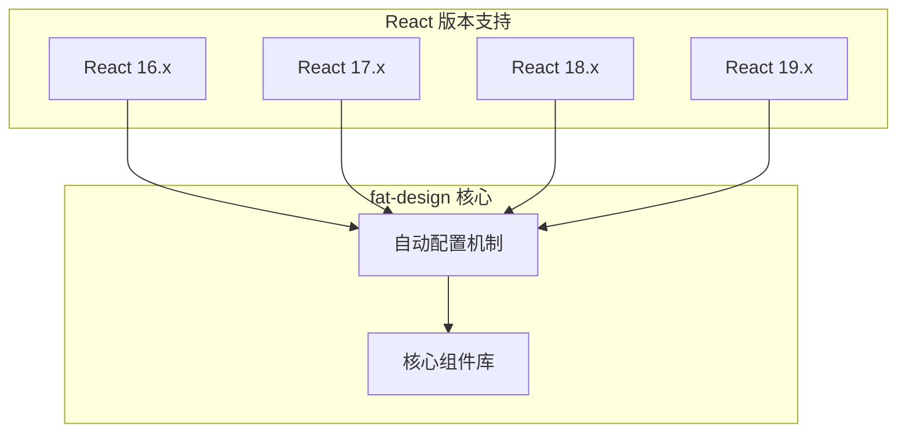
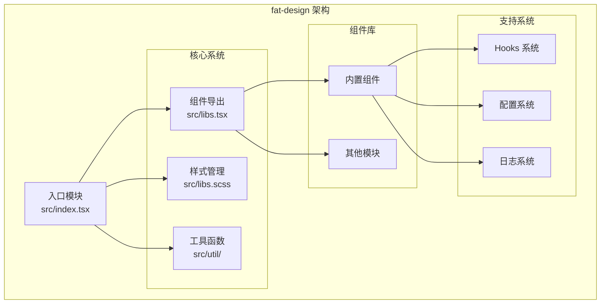
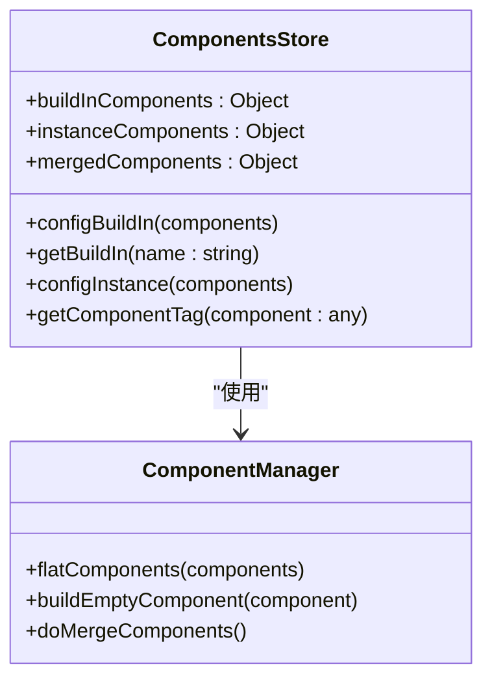
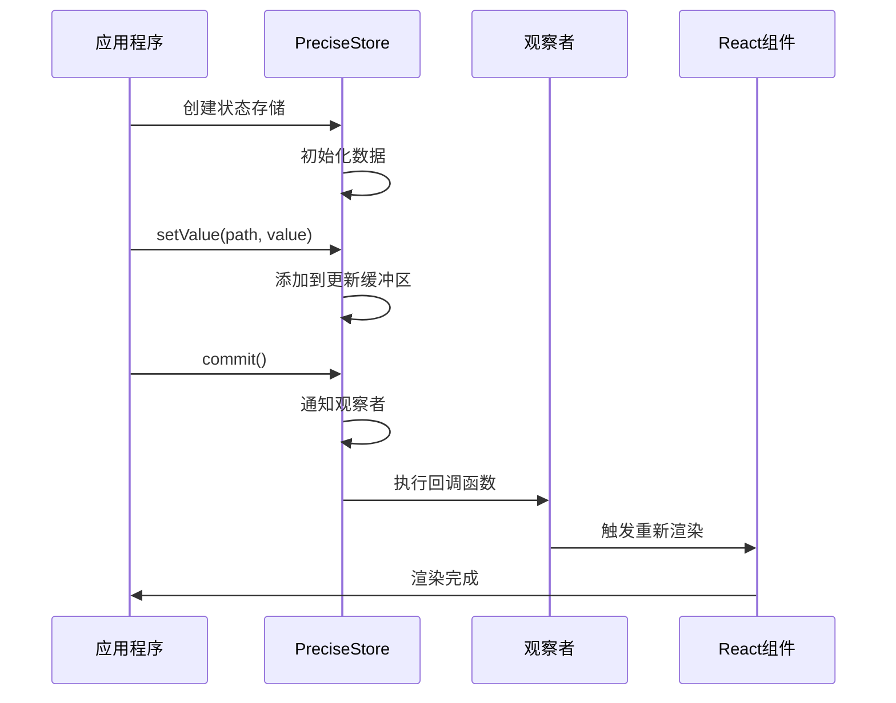
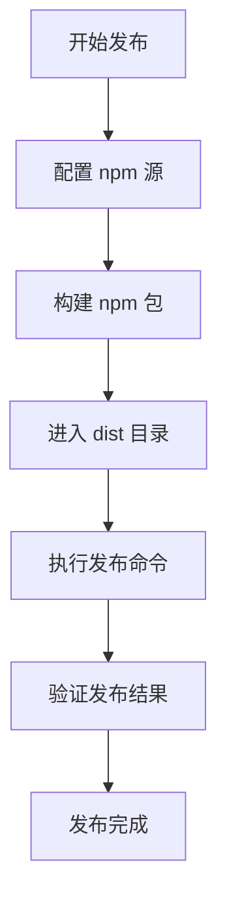

# fat-design 项目介绍

<cite>
**本文档引用的文件**
- [README.md](file://README.md)
- [package.json](file://package.json)
- [src/index.tsx](file://src/index.tsx)
- [src/libs.scss](file://src/libs.scss)
- [src/libs.tsx](file://src/libs.tsx)
- [src/others.ts](file://src/others.ts)
- [src/util/comp.tsx](file://src/util/comp.tsx)
- [src/util/log.ts](file://src/util/log.ts)
- [src/util/constants.ts](file://src/util/constants.ts)
- [src/util/env.ts](file://src/util/env.ts)
- [src/util/types.ts](file://src/util/types.ts)
- [src/hooks/index.ts](file://src/hooks/index.ts)
- [src/hooks/usePreciseStore.ts](file://src/hooks/usePreciseStore.ts)
</cite>

## 目录
1. [项目概述](#项目概述)
2. [核心特性](#核心特性)
3. [技术架构](#技术架构)
4. [组件体系](#组件体系)
5. [设计理念](#设计理念)
6. [目标用户](#目标用户)
7. [性能优势](#性能优势)
8. [开发环境](#开发环境)
9. [贡献指南](#贡献指南)
10. [总结](#总结)

## 项目概述

fat-design 是一个现代化的 React 前端组件库，专为企业级应用和数据密集型界面设计。该项目在保持轻量级特性的基础上，提供了丰富的功能组件和强大的定制能力，是 Next.js 组件库的优秀替代方案。

### 核心定位

fat-design 定位于：
- **轻量级组件库**：构建后仅 761KB，远小于 Next.js 的 1.1MB
- **高性能解决方案**：针对 React 多版本（16、17、18、19）提供完美兼容
- **多主题支持**：内置多种预设主题，支持自定义主题配置
- **企业级应用**：专注于复杂业务场景的界面构建

**章节来源**
- [README.md](file://README.md#L1-L35)
- [package.json](file://package.json#L1-L54)

## 核心特性

### 1. 轻量级设计

fat-design 采用极简主义设计哲学，通过以下方式实现轻量化：

- **模块化加载**：支持按需导入，避免不必要的代码打包
- **优化的 CSS 结构**：统一的样式管理，减少重复样式定义
- **高效的组件实现**：最小化 DOM 操作和状态管理开销

### 2. 多版本兼容性

项目实现了对 React 生态系统的全面兼容：



**图表来源**
- [src/others.ts](file://src/others.ts#L20-L45)

### 3. 强大的功能组件

fat-design 提供了业界领先的特色组件：

- **Form2**：新一代表单系统，支持复杂表单逻辑和动态验证
- **TablePro**：专业级表格组件，支持虚拟滚动和大数据处理
- **Image**：增强图片组件，内置预览和编辑功能
- **QueryForm**：智能查询表单，简化搜索条件构建

### 4. 主题系统

支持多种内置主题和自定义主题配置：

- 默认主题
- 蓝色系主题（蓝1-蓝4）
- 绿色系主题（绿1-绿2）
- 其他色彩主题（橙色、粉色、紫色、红色）

**章节来源**
- [src/libs.scss](file://src/libs.scss#L1-L74)
- [src/libs.tsx](file://src/libs.tsx#L1-L67)

## 技术架构

### 整体架构设计



**图表来源**
- [src/index.tsx](file://src/index.tsx#L1-L13)
- [src/libs.tsx](file://src/libs.tsx#L1-L67)

### 组件存储机制

fat-design 实现了独特的组件存储和管理机制：



**图表来源**
- [src/util/comp.tsx](file://src/util/comp.tsx#L30-L124)

### 状态管理

项目提供了精确的状态管理工具：



**图表来源**
- [src/hooks/usePreciseStore.ts](file://src/hooks/usePreciseStore.ts#L100-L200)

**章节来源**
- [src/util/comp.tsx](file://src/util/comp.tsx#L1-L125)
- [src/hooks/usePreciseStore.ts](file://src/hooks/usePreciseStore.ts#L1-L299)

## 组件体系

### 组件分类

fat-design 将组件分为以下几大类：

1. **基础组件**：Button、Icon、Avatar、Badge 等
2. **布局组件**：Grid、Box、Divider 等
3. **表单组件**：Input、Select、DatePicker、Form2 等
4. **数据展示**：Table、TablePro、Tree、Tag 等
5. **反馈组件**：Message、Notification、Loading 等
6. **导航组件**：Menu、Breadcrumb、Nav、Pagination 等
7. **操作组件**：Dialog、Drawer、Modal 等
8. **高级组件**：Image、Upload、SortableList 等

### 组件命名规范

项目采用统一的组件命名规范：

- **驼峰命名法**：如 `DatePicker`、`EditableTable`
- **功能组合**：如 `DetailPage`、`QueryForm`
- **版本标识**：如 `Form2`、`DatePicker2` 表示新版本

**章节来源**
- [src/libs.tsx](file://src/libs.tsx#L1-L67)

## 设计理念

### 1. 用户体验优先

fat-design 始终将用户体验放在首位：

- **一致性设计**：统一的视觉语言和交互模式
- **无障碍支持**：完整的键盘导航和屏幕阅读器支持
- **响应式设计**：适配各种设备和屏幕尺寸

### 2. 开发效率导向

- **类型安全**：完整的 TypeScript 支持
- **智能提示**：IDE 友好的类型定义
- **文档完善**：详细的组件文档和使用示例

### 3. 可维护性原则

- **模块化设计**：清晰的模块边界和职责划分
- **可测试性**：易于单元测试和集成测试
- **版本控制**：语义化版本管理和向后兼容

## 目标用户

### 1. 企业级开发者

适合需要构建复杂业务系统的开发团队：
- **大型企业应用**：ERP、CRM、OA 系统
- **数据密集型应用**：报表系统、数据分析平台
- **多租户系统**：SaaS 平台、云服务应用

### 2. 前端架构师

适用于需要选择合适组件库的技术决策者：
- **技术选型**：对比 Next.js 和其他组件库
- **性能优化**：关注 bundle 大小和运行时性能
- **长期维护**：考虑社区活跃度和文档质量

### 3. 初学者和进阶开发者

- **学习资源**：丰富的示例和最佳实践
- **渐进式学习**：从简单组件到复杂应用的完整路径
- **社区支持**：活跃的开发者社区和问题解答

## 性能优势

### 1. 构建性能

- **体积优势**：761KB vs Next.js 1.1MB
- **加载速度**：更快的首屏渲染时间
- **缓存友好**：合理的代码分割策略

### 2. 运行时性能

- **内存占用**：优化的组件生命周期管理
- **渲染效率**：高效的 DOM 更新机制
- **事件处理**：智能的事件委托和防抖处理

### 3. 开发体验

- **热重载**：快速的开发服务器启动
- **类型检查**：实时的 TypeScript 错误提示
- **调试支持**：完善的开发工具链

**章节来源**
- [README.md](file://README.md#L10-L15)

## 开发环境

### 技术栈

fat-design 使用现代化的前端技术栈：

- **构建工具**：Vite（4.1+）
- **编程语言**：TypeScript（4.9+）
- **样式处理**：SCSS（1.58.3）
- **React 版本**：18.2.0+
- **包管理**：pnpm

### 开发脚本

```json
{
  "scripts": {
    "dev": "cross-env NODE_ENV=development vite",
    "build": "tsc && cross-env TARGET_ENV=npm vite build",
    "build:prod": "tsc && cross-env TARGET_ENV=npm vite build",
    "build:demo": "tsc && cross-env TARGET_ENV=demo vite build",
    "preview": "vite preview"
  }
}
```

### 依赖管理

项目采用灵活的依赖策略：

- **核心依赖**：React、Lodash、Day.js 等稳定库
- **开发依赖**：TypeScript、Vite、SCSS 编译工具
- **跨版本兼容**：通过 `react-lifecycles-compat` 支持旧版 React

**章节来源**
- [package.json](file://package.json#L4-L15)

## 贡献指南

### 1. 开源协议

fat-design 采用开放的开源协议，欢迎社区贡献：

- **协议类型**：MIT 协议或其他开源许可证
- **贡献方式**：代码提交、文档改进、问题报告
- **社区参与**：GitHub Issues 和 Discussions

### 2. 版本发布策略

项目遵循标准的版本发布流程：

1. **版本规划**：明确的功能需求和修复计划
2. **代码审查**：严格的代码质量检查
3. **测试验证**：自动化测试和人工测试
4. **发布部署**：通过 npm 正式发布

### 3. 发布流程



**图表来源**
- [README.md](file://README.md#L17-L25)

**章节来源**
- [README.md](file://README.md#L17-L35)

## 总结

fat-design 作为一个现代化的 React 组件库，在保持轻量级特性的基础上，提供了丰富的企业级功能和优秀的开发体验。其核心优势包括：

### 技术优势

- **轻量化设计**：761KB 的构建体积，显著优于同类产品
- **多版本兼容**：完美支持 React 16-19 各个版本
- **高性能表现**：优化的渲染机制和状态管理
- **类型安全**：完整的 TypeScript 类型定义

### 功能特色

- **创新组件**：Form2、TablePro、Image 等特色组件
- **主题系统**：丰富的预设主题和自定义能力
- **国际化支持**：多语言本地化解决方案
- **无障碍设计**：完整的可访问性支持

### 社区价值

- **开源生态**：活跃的社区贡献和持续维护
- **学习资源**：丰富的文档和示例代码
- **企业应用**：广泛的实际应用案例和成功经验

fat-design 不仅仅是一个组件库，更是现代前端开发的最佳实践体现。它为开发者提供了构建高质量企业应用的完整解决方案，是 React 生态系统中不可或缺的重要组成部分。

无论是初学者还是资深开发者，都能在 fat-design 中找到适合自己需求的组件和工具。随着项目的持续发展，相信它将在前端组件库领域发挥更大的作用，为整个开发者社区创造更多价值。