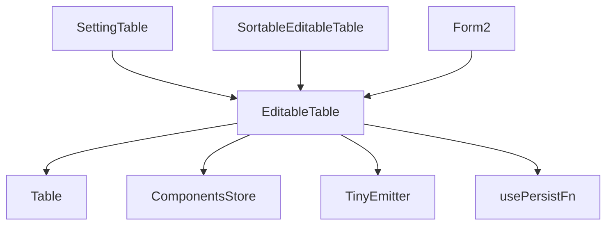
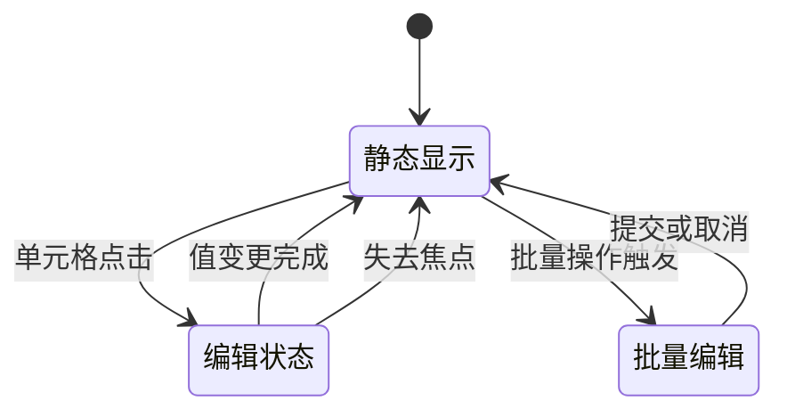
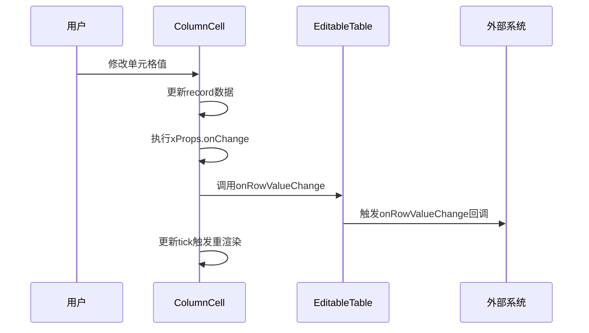
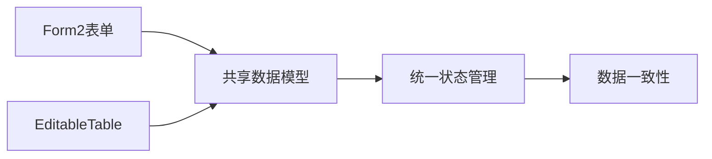
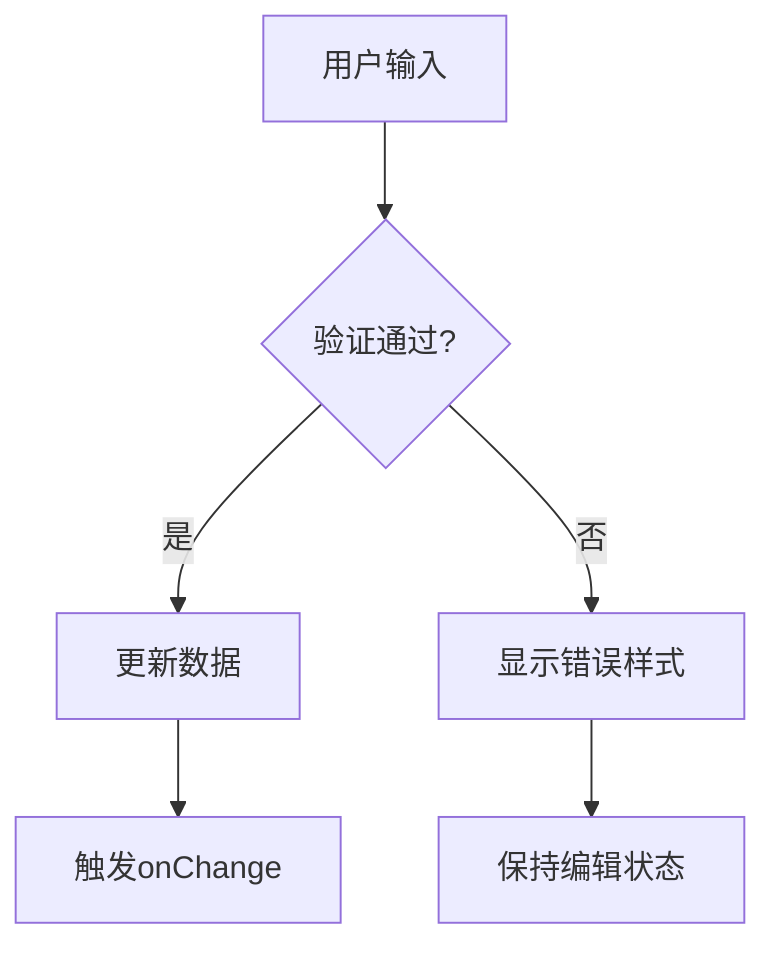
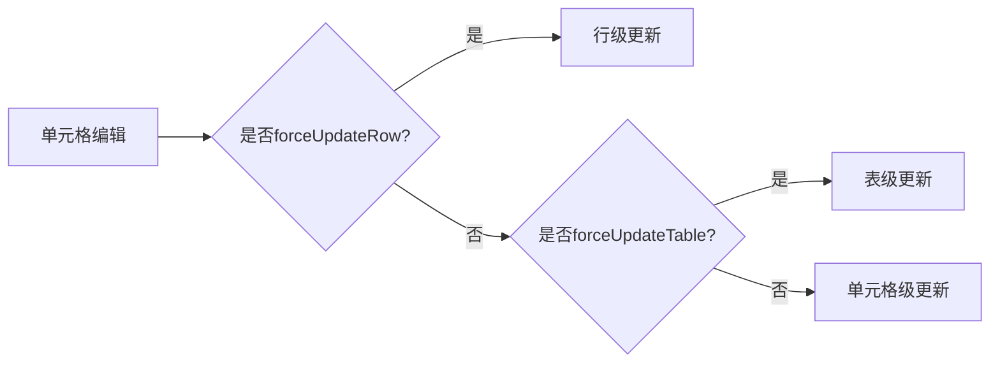

# EditableTable 可编辑表格

<cite>
**本文档中引用的文件**  
- [editable-table.jsx](file://src/editable-table/editable-table.jsx)
- [types.ts](file://src/editable-table/types.ts)
- [setting-table.jsx](file://src/editable-table/setting-table.jsx)
- [demo-sortable-table.tsx](file://demo/demo-sortable-table.tsx)
- [form2.tsx](file://src/form2/form.tsx)
</cite>

## 目录
1. [简介](#简介)
2. [核心组件与架构](#核心组件与架构)
3. [单元格编辑模式](#单元格编辑模式)
4. [数据提交流程](#数据提交流程)
5. [与Form2系统的集成](#与form2系统的集成)
6. [自定义编辑器接入](#自定义编辑器接入)
7. [错误处理与UI反馈](#错误处理与ui反馈)
8. [性能优化策略](#性能优化策略)
9. [实际应用场景示例](#实际应用场景示例)
10. [结论](#结论)

## 简介
EditableTable 是一个功能丰富的可编辑表格组件，支持行内编辑、批量编辑等多种交互模式。该组件通过灵活的配置机制实现了与表单系统的深度集成，并提供了完整的状态管理、数据验证和变更捕获能力。本文档将深入解析其技术实现细节，涵盖从单元格编辑触发机制到与Form2系统集成的完整技术参考。

## 核心组件与架构

EditableTable 的核心架构基于React函数式组件构建，采用组合式设计模式，通过高阶函数 `ConfigProvider.configFn` 进行配置注入。组件主要由以下几个部分构成：

- **EditableTableImpl**：主实现组件，负责处理表格的可编辑逻辑
- **ColumnCell**：单元格渲染组件，封装了编辑状态管理和值变更处理
- **SettingTable**：扩展组件，提供行操作（上移、下移、删除）和添加功能
- **SortableEditableTable**：基于SortableList的可排序可编辑表格变体



**Diagram sources**
- [editable-table.jsx](file://src/editable-table/editable-table.jsx#L1-L166)
- [setting-table.jsx](file://src/editable-table/setting-table.jsx#L1-L118)

**Section sources**
- [editable-table.jsx](file://src/editable-table/editable-table.jsx#L1-L166)
- [types.ts](file://src/editable-table/types.ts#L1-L18)

## 单元格编辑模式

EditableTable 支持多种编辑模式，其触发机制基于列配置中的 `component` 属性和 `xProps` 配置。

### 编辑模式触发机制
- **单击编辑**：默认模式，当单元格配置了 `component` 属性时，点击单元格即进入编辑状态
- **双击编辑**：可通过自定义编辑器实现双击触发逻辑
- **批量编辑**：通过 `onRowValueChange` 回调统一处理多行数据变更

### 状态管理
组件使用 `useState` 管理局部渲染状态（`tick`），并通过 `actionEmitter` 事件系统实现跨层级状态同步：



**Diagram sources**
- [editable-table.jsx](file://src/editable-table/editable-table.jsx#L20-L85)
- [types.ts](file://src/editable-table/types.ts#L1-L18)

**Section sources**
- [editable-table.jsx](file://src/editable-table/editable-table.jsx#L20-L85)
- [types.ts](file://src/editable-table/types.ts#L1-L18)

## 数据提交流程

EditableTable 的数据提交流程是一个完整的状态变更处理链，包含编辑同步、验证执行、变更捕获和回调调用。

### 编辑状态同步
当单元格值发生变化时，通过 `handleOnChange` 函数更新数据源并触发相应级别的重新渲染：



### 验证规则执行
验证规则通过 `xProps` 中的验证属性实现，组件本身不内置验证逻辑，而是将验证责任委托给具体的表单控件。

### 变更数据捕获
变更数据通过 `onRowValueChange` 回调函数捕获，该回调接收修改后的行数据和对应的列配置对象。

### 回调函数调用时机
- **onSave**：需要外部系统在适当时机调用，通常在批量编辑完成后
- **onCancel**：同上，由外部逻辑控制取消操作

**Diagram sources**
- [editable-table.jsx](file://src/editable-table/editable-table.jsx#L30-L85)
- [types.ts](file://src/editable-table/types.ts#L1-L18)

**Section sources**
- [editable-table.jsx](file://src/editable-table/editable-table.jsx#L30-L85)
- [types.ts](file://src/editable-table/types.ts#L1-L18)

## 与Form2系统的集成

EditableTable 与Form2系统的集成主要通过共享数据模型和事件系统实现。

### 集成方式
1. **数据绑定**：通过 `dataSource` 和 `onRowValueChange` 实现双向数据绑定
2. **表单化编辑**：利用Form2的表单控件作为表格单元格编辑器
3. **状态同步**：通过 `actionEmitter` 事件系统实现跨组件状态同步

### 实现机制
在 `getColumnCell` 函数中，通过 `comps.getComponentTag` 获取注册的组件，这使得Form2中的表单控件可以直接在表格中使用。



**Diagram sources**
- [editable-table.jsx](file://src/editable-table/editable-table.jsx#L90-L130)
- [form2.tsx](file://src/form2/form.tsx#L1-L50)

**Section sources**
- [editable-table.jsx](file://src/editable-table/editable-table.jsx#L90-L130)
- [form2.tsx](file://src/form2/form.tsx#L1-L50)

## 自定义编辑器接入

EditableTable 提供了灵活的自定义编辑器接入机制。

### 接入方法
通过列配置的 `component` 属性指定自定义编辑器：

```typescript
interface Column {
    component: string | React.ComponentType;
    xProps: Record<string, any>;
}
```

### 类型定义
```typescript
export interface EditableTableProps {
    prefix: string;
    columns?: Array<{
        component?: string | React.ComponentType;
        xProps?: Record<string, any>;
        forceUpdateRow?: boolean;
        forceUpdateTable?: boolean;
        [key: string]: any;
    }>;
    dataSource?: any[];
    onRowValueChange?: (row: any, column: any) => void;
    actionEmitter?: any;
}
```

自定义编辑器需要支持 `value` 和 `onChange` 属性，以实现受控组件模式。

**Section sources**
- [editable-table.jsx](file://src/editable-table/editable-table.jsx#L70-L90)
- [types.ts](file://src/editable-table/types.ts#L1-L18)

## 错误处理与UI反馈

### 错误处理策略
1. **验证失败处理**：通过 `xProps` 中的验证属性由底层表单控件处理
2. **异常捕获**：组件使用 `useEffect` 和错误边界进行异常捕获
3. **数据一致性保障**：通过不可变数据模式确保状态一致性

### UI反馈机制
- **即时反馈**：编辑器自身提供输入验证反馈
- **操作反馈**：通过 `Message` 组件提供操作成功/失败提示
- **状态可视化**：通过CSS类名控制不同状态的样式



**Diagram sources**
- [setting-table.jsx](file://src/editable-table/setting-table.jsx#L50-L70)
- [main.scss](file://src/editable-table/main.scss#L1-L4)

**Section sources**
- [setting-table.jsx](file://src/editable-table/setting-table.jsx#L50-L70)
- [main.scss](file://src/editable-table/main.scss#L1-L4)

## 性能优化策略

### 局部更新机制
通过 `tick` 状态实现精确的局部更新，避免不必要的全表重渲染。

### 批量操作优化
- **延迟更新**：通过 `forceUpdateRow` 和 `forceUpdateTable` 控制更新粒度
- **事件节流**：使用 `usePersistFn` 确保回调函数的稳定引用

### 内存管理
- **组件缓存**：通过 `ComponentsStore` 缓存组件实例
- **事件管理**：使用 `TinyEmitter` 进行轻量级事件管理



**Diagram sources**
- [editable-table.jsx](file://src/editable-table/editable-table.jsx#L80-L85)
- [hooks/usePersistFn.ts](file://src/hooks/usePersistFn.ts#L1-L10)

**Section sources**
- [editable-table.jsx](file://src/editable-table/editable-table.jsx#L80-L85)
- [hooks/usePersistFn.ts](file://src/hooks/usePersistFn.ts#L1-L10)

## 实际应用场景示例

### 行内编辑
通过配置 `component` 属性实现行内编辑，如 `Input`、`Switch` 等控件直接嵌入表格单元格。

### 批量保存
结合 `onRowValueChange` 回调收集所有变更，在用户点击保存按钮时统一提交。

### 撤销操作
通过维护数据快照实现撤销功能，利用 `dataSource` 的不可变更新模式。

### 可排序表格
通过 `SortableEditableTable` 组件实现拖拽排序功能，结合 `draggable` 属性配置。

**Section sources**
- [demo-sortable-table.tsx](file://demo/demo-sortable-table.tsx#L1-L90)
- [setting-table.jsx](file://src/editable-table/setting-table.jsx#L1-L118)

## 结论
EditableTable 是一个功能强大且灵活的可编辑表格组件，通过简洁的API设计和模块化的架构实现了丰富的编辑功能。其与Form2系统的无缝集成、灵活的自定义编辑器支持以及高效的性能优化策略，使其能够满足各种复杂的业务场景需求。通过合理利用其提供的各种机制，开发者可以快速构建出高效、易用的数据编辑界面。