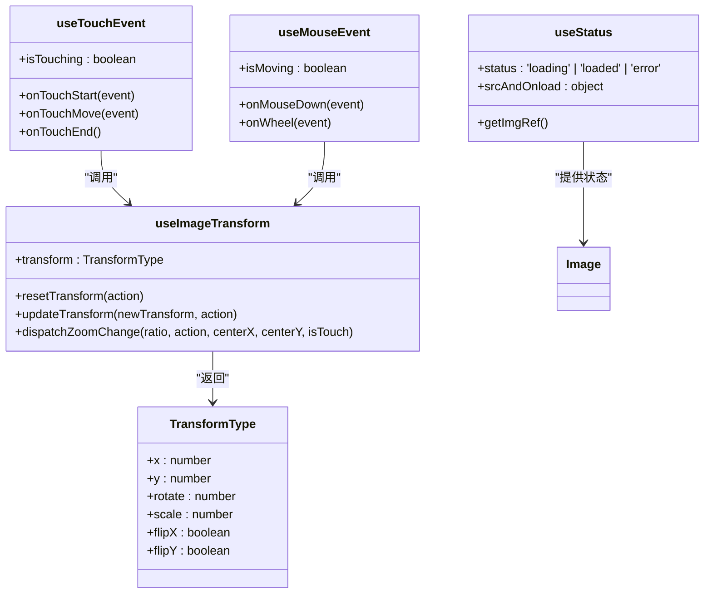
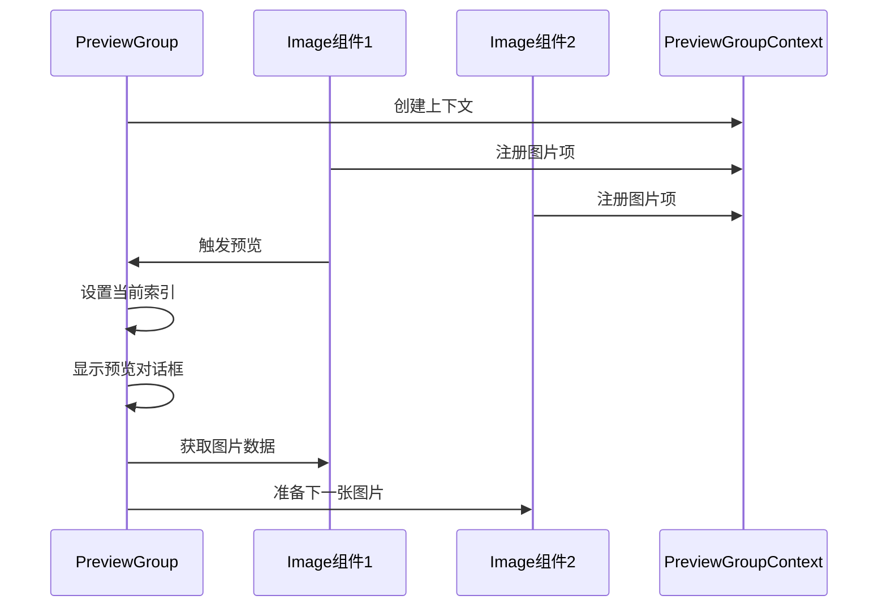

# Image 图片预览组件

<cite>
**本文档引用的文件**
- [Image.tsx](file://src/image/Image.tsx)
- [Preview.tsx](file://src/image/Preview.tsx)
- [PreviewGroup.tsx](file://src/image/PreviewGroup.tsx)
- [useImageTransform.ts](file://src/image/hooks/useImageTransform.ts)
- [useTouchEvent.ts](file://src/image/hooks/useTouchEvent.ts)
- [demo-image.tsx](file://demo/demo-image.tsx)
</cite>

## 目录
1. [简介](#简介)
2. [视觉外观与用户交互](#视觉外观与用户交互)
3. [核心API详解](#核心api详解)
4. [内部状态管理机制](#内部状态管理机制)
5. [图片预览组（PreviewGroup）](#图片预览组previewgroup)
6. [无障碍访问与键盘导航](#无障碍访问与键盘导航)
7. [性能优化策略](#性能优化策略)
8. [高级用法与定制](#高级用法与定制)

## 简介
Image图片预览组件提供了一套完整的图片展示与交互解决方案，支持单张图片预览和多图批量预览。组件具备丰富的交互功能，包括缩放、旋转、拖拽和下载等操作，并针对响应式设计进行了优化。通过灵活的API配置和强大的内部状态管理机制，开发者可以轻松实现复杂的图片浏览需求。

**Section sources**
- [Image.tsx](file://src/image/Image.tsx#L1-L50)
- [demo-image.tsx](file://demo/demo-image.tsx#L1-L10)

## 视觉外观与用户交互
Image组件在普通模式下呈现为标准的图片元素，当启用预览功能时，用户可以通过点击图片进入全屏预览模式。预览界面提供直观的操作控件，包括缩放、旋转、翻转和导航按钮。组件支持鼠标和触摸两种交互方式：

- **缩放**：通过鼠标滚轮或双指捏合手势实现图片缩放
- **旋转**：点击旋转按钮或使用快捷键实现90度旋转
- **拖拽**：在缩放状态下按住鼠标或手指拖动图片进行平移
- **下载**：提供下载按钮，允许用户保存当前预览的图片

组件的视觉设计遵循现代化UI规范，操作控件在非交互状态下自动隐藏，鼠标悬停或触摸时显示，确保界面简洁美观。

**Section sources**
- [Preview.tsx](file://src/image/Preview.tsx#L1-L50)
- [Operations.tsx](file://src/image/Operations.tsx#L1-L30)

## 核心API详解
Image组件提供了一系列核心属性来控制其行为和外观：

### src属性
指定图片的源地址，接受标准的URL字符串。这是最基本的属性，用于定义要显示的图片内容。

### alt属性
提供图片的替代文本，用于无障碍访问和图片加载失败时的提示。

### preview属性
控制预览功能的开启与配置，支持布尔值和对象两种形式：
- `true`：启用默认预览功能
- `false`：禁用预览功能
- 对象形式：可配置预览的详细参数，如`visible`、`mask`、`icons`等

### onPreview回调
当用户触发预览操作时调用的回调函数，可用于自定义预览前的逻辑处理。

### transform属性
通过`imageRender`和`toolbarRender`属性，开发者可以完全自定义预览界面的渲染方式和工具栏布局。`imageRender`允许替换默认的图片渲染逻辑，`toolbarRender`则用于定制操作工具栏。

默认值配置：
- `preview`: `true`
- `movable`: `true`
- `scaleStep`: `0.5`
- `minScale`: `1`
- `maxScale`: `50`

**Section sources**
- [Image.tsx](file://src/image/Image.tsx#L50-L150)
- [interface.ts](file://src/image/interface.ts#L1-L20)

## 内部状态管理机制
Image组件采用React Hooks架构实现复杂的状态管理，核心包括以下几个自定义Hook：

### useImageTransform Hook
该Hook是图片变换逻辑的核心，管理图片的平移、缩放、旋转和翻转状态。它维护一个`TransformType`对象，包含以下属性：
- `x`, `y`：图片的平移坐标
- `rotate`：旋转角度（以90度为单位）
- `scale`：缩放比例
- `flipX`, `flipY`：水平和垂直翻转状态

`useImageTransform`提供`updateTransform`和`dispatchZoomChange`两个主要方法，用于更新变换状态。变换操作通过`requestAnimationFrame`进行节流，确保动画流畅性。

### useTouchEvent Hook
处理移动端触摸事件，支持双指缩放和单指拖拽操作。该Hook通过监听`touchstart`、`touchmove`和`touchend`事件，计算触摸点的距离和中心位置，实现自然的手势交互。

### useMouseEvent Hook
处理桌面端鼠标事件，包括滚轮缩放和鼠标拖拽。通过`onWheel`和`onMouseDown`事件监听，实现与触摸事件类似的操作体验。

### useStatus Hook
管理图片的加载状态，包括`loading`、`loaded`和`error`三种状态。该Hook还处理图片的错误回退机制，当主图片加载失败时自动显示备用图片。



**Diagram sources**
- [useImageTransform.ts](file://src/image/hooks/useImageTransform.ts#L1-L30)
- [useTouchEvent.ts](file://src/image/hooks/useTouchEvent.ts#L1-L20)
- [useMouseEvent.ts](file://src/image/hooks/useMouseEvent.ts#L1-L20)

**Section sources**
- [useImageTransform.ts](file://src/image/hooks/useImageTransform.ts#L1-L154)
- [useTouchEvent.ts](file://src/image/hooks/useTouchEvent.ts#L1-L179)
- [useMouseEvent.ts](file://src/image/hooks/useMouseEvent.ts#L1-L100)

## 图片预览组（PreviewGroup）
PreviewGroup组件用于管理多个图片的批量预览，提供图片间的导航功能。通过`PreviewGroupContext`上下文，将多个Image组件连接成一个预览组。

### 批量操作示例
```jsx
<Image.PreviewGroup
    preview={{
        countRender: (current, total) => `第 ${current} 张 / 总共 ${total} 张`,
        onChange: (current, prev) =>
            console.log(`当前第${current}张，上一次第${prev === undefined ? '-' : prev}张`),
    }}
>
    <Image src={imageSrc1} />
    <Image src={imageSrc2} />
    <Image src={imageSrc3} />
</Image.PreviewGroup>
```

### 实现机制
PreviewGroup使用`usePreviewItems` Hook来注册和管理预览项，每个Image组件在渲染时通过`useRegisterImage` Hook向预览组注册自己。当用户点击某张图片时，预览组会根据注册的ID定位到对应的图片并显示。

组件支持`current`属性来指定初始显示的图片索引，并通过`onChange`回调通知图片切换事件。`countRender`属性允许自定义图片计数器的显示格式。



**Diagram sources**
- [PreviewGroup.tsx](file://src/image/PreviewGroup.tsx#L1-L50)
- [context.ts](file://src/image/context.ts#L1-L20)

**Section sources**
- [PreviewGroup.tsx](file://src/image/PreviewGroup.tsx#L1-L172)
- [usePreviewItems.ts](file://src/image/hooks/usePreviewItems.ts#L1-L30)

## 无障碍访问与键盘导航
Image组件充分考虑了无障碍访问需求，提供了完整的键盘导航支持：

- **Enter/Space键**：触发图片预览
- **Esc键**：关闭预览对话框
- **左右箭头键**：在预览组中切换图片
- **加号/减号键**：放大/缩小图片
- **R键**：顺时针旋转图片
- **F键**：水平翻转图片

组件通过`aria-hidden`属性管理预览对话框的可访问性状态，确保屏幕阅读器能够正确识别当前界面结构。图片的`alt`属性被严格遵循，为视觉障碍用户提供必要的图片描述信息。

预览对话框实现了完整的焦点管理，当打开时自动将焦点设置到关闭按钮，用户可以通过Tab键在各个操作按钮间导航。所有操作按钮都配备了适当的`aria-label`属性，确保键盘用户能够理解每个按钮的功能。

**Section sources**
- [Preview.tsx](file://src/image/Preview.tsx#L100-L150)
- [Image.tsx](file://src/image/Image.tsx#L200-L250)

## 性能优化策略
Image组件采用多种技术手段确保高性能运行：

### 懒加载
组件内置图片加载状态管理，只有当图片进入可视区域或被主动点击时才开始加载高分辨率图片。通过`useStatus` Hook实现加载状态的精确控制，避免不必要的网络请求。

### 内存释放
当预览对话框关闭时，`useImageTransform` Hook会调用`resetTransform`方法重置所有变换状态，释放相关内存。组件还实现了完善的事件清理机制，在组件卸载时自动移除所有事件监听器，防止内存泄漏。

### 事件节流
所有变换操作都通过`requestAnimationFrame`进行节流处理，确保动画流畅且不阻塞主线程。`useImageTransform`中的`updateTransform`方法使用队列机制，将多个状态更新合并为一次渲染，减少不必要的重绘。

### 资源预加载
在预览组模式下，组件会预加载相邻图片的元数据，确保图片切换时的流畅体验。通过`usePreviewItems` Hook管理的图片项列表，可以提前获取图片尺寸等信息，优化布局计算。

### CSS硬件加速
变换操作充分利用CSS3 Transform和Transition，利用GPU加速实现流畅的动画效果。通过`transform`属性而非修改`left`/`top`来实现平移，确保高性能渲染。

**Section sources**
- [useImageTransform.ts](file://src/image/hooks/useImageTransform.ts#L50-L100)
- [raf.ts](file://src/image/utils/raf.ts#L1-L20)
- [css.ts](file://src/image/utils/css.ts#L1-L30)

## 高级用法与定制
Image组件提供丰富的定制选项，满足各种复杂场景的需求：

### 自定义工具栏
通过`toolbarRender`属性，开发者可以完全重写预览界面的工具栏：
```jsx
<Image 
    src={src}
    preview={{
        toolbarRender: (originalNode, info) => (
            <div className="custom-toolbar">
                <button onClick={info.actions.onZoomOut}>缩小</button>
                <span>{info.transform.scale.toFixed(2)}x</span>
                <button onClick={info.actions.onZoomIn}>放大</button>
            </div>
        )
    }}
/>
```

### 图片后处理
`imageRender`属性允许在图片渲染前进行各种视觉处理：
```jsx
<Image 
    src={src}
    preview={{
        imageRender: (originalNode, info) => (
            <div style={{filter: `blur(${5 - info.transform.scale}px)`}}>
                {originalNode}
            </div>
        )
    }}
/>
```

### 全局配置
通过`config-provider`可以设置Image组件的全局前缀和其他默认配置，确保组件风格与应用整体一致。

**Section sources**
- [Preview.tsx](file://src/image/Preview.tsx#L150-L200)
- [Image.tsx](file://src/image/Image.tsx#L150-L200)
- [demo-image.tsx](file://demo/demo-image.tsx#L20-L40)