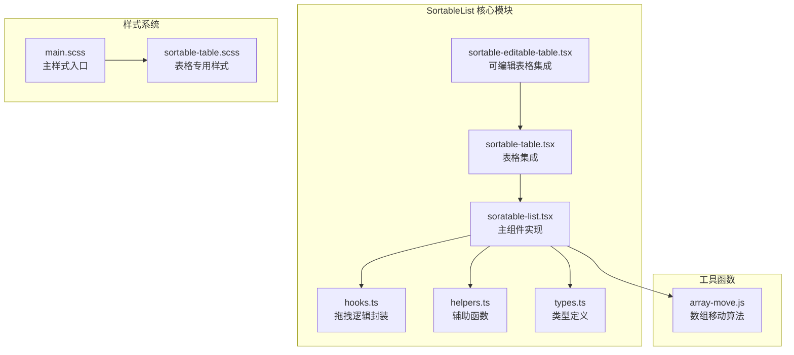
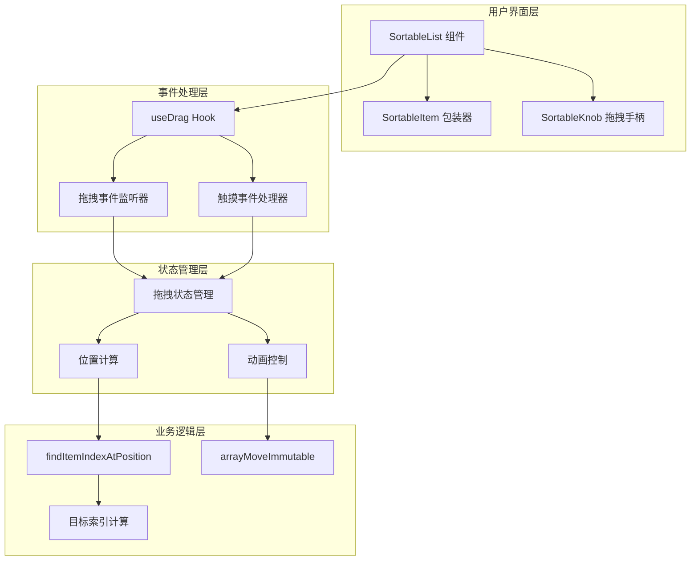
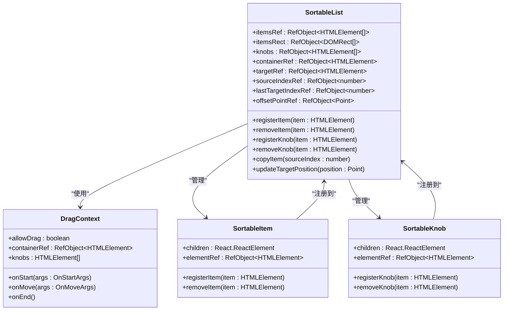
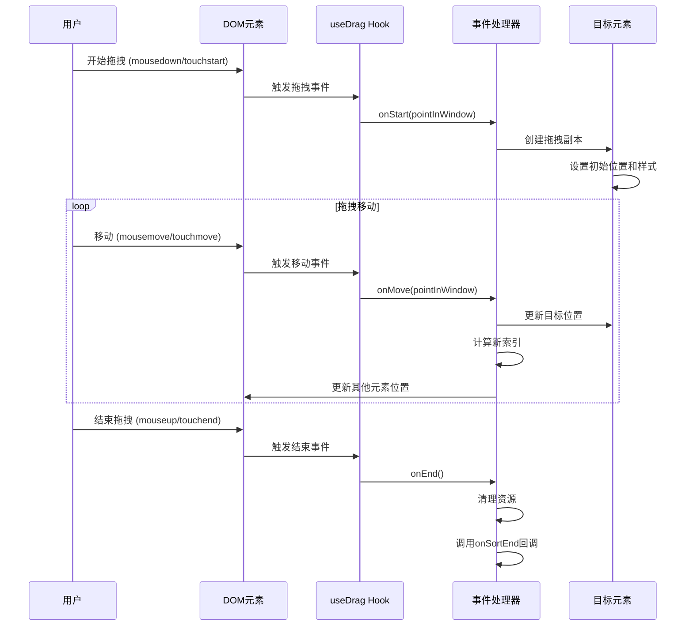
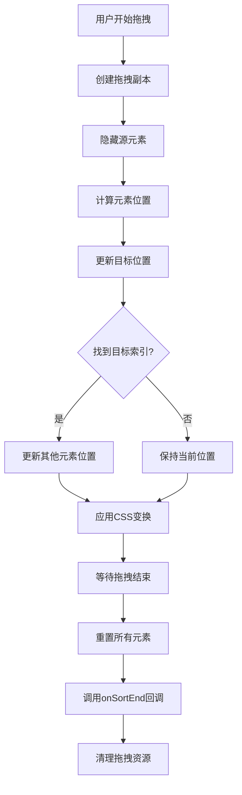
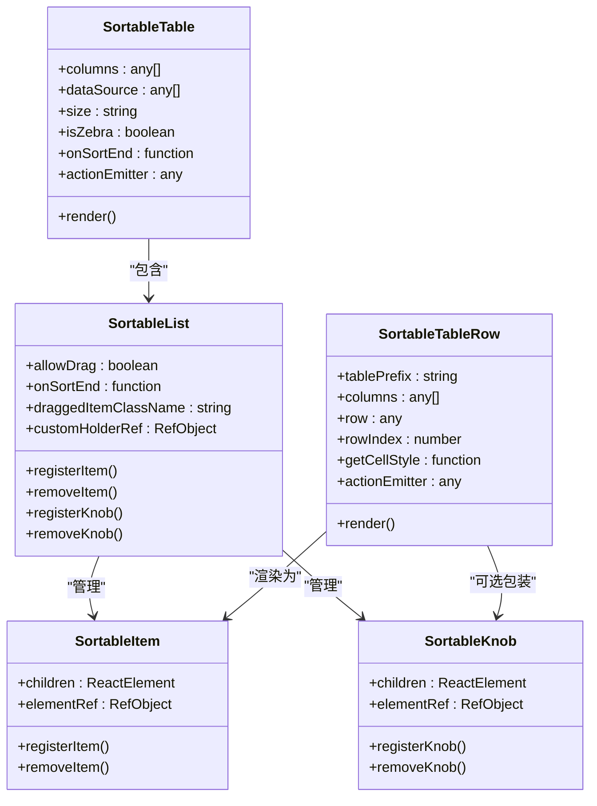

# SortableList 可排序列表

<cite>
**本文档中引用的文件**
- [sortable-list.tsx](file://src/sortable-list/sortable-list.tsx)
- [hooks.ts](file://src/sortable-list/hooks.ts)
- [helpers.ts](file://src\soratable-list\helpers.ts)
- [types.ts](file://src\soratable-list\types.ts)
- [sortable-table.tsx](file://src\soratable-list\sortable-table.tsx)
- [sortable-editable-table.tsx](file://src\soratable-list\sortable-editable-table.tsx)
- [main.scss](file://src\soratable-list\main.scss)
- [sortable-table.scss](file://src\soratable-list\sortable-table.scss)
- [array-move.js](file://src\util\array-move.js)
- [index.tsx](file://src\soratable-list\index.tsx)
</cite>

## 目录
1. [简介](#简介)
2. [项目结构](#项目结构)
3. [核心组件](#核心组件)
4. [架构概览](#架构概览)
5. [详细组件分析](#详细组件分析)
6. [拖拽事件处理机制](#拖拽事件处理机制)
7. [状态同步策略](#状态同步策略)
8. [与SortableTable的集成](#与sortabletable的集成)
9. [性能优化](#性能优化)
10. [可访问性支持](#可访问性支持)
11. [故障排除指南](#故障排除指南)
12. [结论](#结论)

## 简介

SortableList 是一个基于 React 的可排序列表组件，提供了强大的拖拽排序功能。该组件实现了现代 Web 应用程序中常见的拖拽排序交互，支持鼠标和触摸设备，具有良好的性能表现和可访问性支持。

SortableList 的设计遵循 React 最佳实践，采用 Hooks 架构模式，提供了灵活的配置选项和扩展能力。它不仅可以直接用于简单的列表排序，还可以与表格组件无缝集成，为用户提供直观的数据管理体验。

## 项目结构

SortableList 组件位于 `src/sortable-list` 目录下，包含以下核心文件：



**图表来源**
- [sortable-list.tsx](file://src/sortable-list/sortable-list.tsx#L1-L365)
- [hooks.ts](file://src/sortable-list/hooks.ts#L1-L271)
- [helpers.ts](file://src/sortable-list/helpers.ts#L1-L34)
- [types.ts](file://src/sortable-list/types.ts#L1-L18)

**章节来源**
- [index.tsx](file://src/sortable-list/index.tsx#L1-L16)

## 核心组件

### SortableList 主组件

SortableList 是整个排序功能的核心组件，负责管理拖拽状态、处理用户交互并协调各个子组件的工作。

```typescript
type Props<TTag extends keyof JSX.IntrinsicElements> = HTMLAttributes<TTag> & {
  children: React.ReactNode
  /** 是否启用拖拽功能，默认为true */
  allowDrag?: boolean
  /** 拖拽结束时的回调函数 */
  onSortEnd: (oldIndex: number, newIndex: number) => void
  /** 拖拽中的元素应用的CSS类名 */
  draggedItemClassName?: string
  /** 容器元素使用的HTML标签类型 */
  as?: TTag
  /** 锁定轴向（x/y） */
  lockAxis?: 'x' | 'y'
  /** 自定义容器引用 */
  customHolderRef?: React.RefObject<HTMLElement | null>
}
```

### 上下文系统

SortableList 使用 React Context 来管理子组件的注册和注销：

```typescript
type Context = {
  registerItem: (item: HTMLElement) => void
  removeItem: (item: HTMLElement) => void
  registerKnob: (item: HTMLElement) => void
  removeKnob: (item: HTMLElement) => void
}
```

**章节来源**
- [sortable-list.tsx](file://src/sortable-list/sortable-list.tsx#L1-L58)

## 架构概览

SortableList 采用了分层架构设计，将不同职责分离到独立的模块中：



**图表来源**
- [sortable-list.tsx](file://src/sortable-list/sortable-list.tsx#L30-L58)
- [hooks.ts](file://src/sortable-list/hooks.ts#L30-L50)

## 详细组件分析

### SortableList 实现分析

SortableList 组件的核心实现包含了复杂的拖拽逻辑和状态管理：



**图表来源**
- [sortable-list.tsx](file://src/sortable-list/sortable-list.tsx#L30-L58)
- [sortable-list.tsx](file://src/sortable-list/sortable-list.tsx#L303-L363)

### 拖拽状态管理

SortableList 使用多个 Ref 对象来跟踪拖拽过程中的关键状态：

```typescript
// 元素引用
const itemsRef = React.useRef<HTMLElement[]>([])           // 可排序元素列表
const itemsRect = React.useRef<DOMRect[]>([])             // 元素位置缓存
const knobs = React.useRef<HTMLElement[]>([])              // 拖拽手柄列表
const containerRef = React.useRef<HTMLElement | null>(null) // 容器引用
const targetRef = React.useRef<HTMLElement | null>(null)   // 目标元素引用

// 状态引用
const sourceIndexRef = React.useRef<number | undefined>(undefined)     // 源元素索引
const lastTargetIndexRef = React.useRef<number | undefined>(undefined) // 最后目标索引
const offsetPointRef = React.useRef<Point>({ x: 0, y: 0 })             // 偏移点
```

**章节来源**
- [sortable-list.tsx](file://src/sortable-list/sortable-list.tsx#L40-L50)

## 拖拽事件处理机制

### HTML5 Drag API 和 Pointer Events 集成

SortableList 通过自定义的 `useDrag` Hook 实现了对 HTML5 Drag API 和 Pointer Events 的支持：



**图表来源**
- [hooks.ts](file://src/sortable-list/hooks.ts#L30-L50)
- [sortable-list.tsx](file://src/sortable-list/sortable-list.tsx#L128-L167)

### 事件监听器实现

`useDrag` Hook 提供了跨平台的拖拽支持：

```typescript
// 鼠标事件处理
const onMouseDown = React.useCallback(
  (e: React.MouseEvent<HTMLElement, MouseEvent>) => {
    if (e.button !== 0) return // 只处理左键
    if (knobs?.length && !knobs.find((knob) => knob.contains(e.target as Node))) return
    
    document.addEventListener('mousemove', onMouseMove)
    document.addEventListener('mouseup', onMouseUp)
    saveContainerPosition()
    isFirstMoveRef.current = true
  },
  [onMouseMove, onMouseUp, saveContainerPosition, knobs]
)

// 触摸事件处理
const onTouchStart = React.useCallback(
  (e: TouchEvent) => {
    if (knobs?.length && !knobs.find((knob) => knob.contains(e.target as Node))) return
    
    saveContainerPosition()
    const pointInWindow = getTouchPoint(e.touches[0])
    const point = getPointInContainer(pointInWindow, containerPositionRef.current)
    
    // 延迟启动拖拽以避免滚动干扰
    handleTouchStartTimerRef.current = window.setTimeout(
      () => handleTouchStart(point, pointInWindow),
      120
    )
  },
  [handleTouchStart, saveContainerPosition, knobs]
)
```

**章节来源**
- [hooks.ts](file://src/sortable-list/hooks.ts#L140-L180)

### dragStart 事件处理

拖拽开始时，组件执行以下关键步骤：

1. **验证拖拽起点**：检查点击位置是否在可拖拽元素上
2. **创建拖拽副本**：复制源元素并添加到文档体
3. **隐藏源元素**：设置透明度和可见性
4. **计算偏移量**：确定拖拽起始点相对于元素的位置
5. **触发物理反馈**：在支持的设备上提供震动反馈

```typescript
onStart: ({ pointInWindow }) => {
  // 获取元素位置信息
  itemsRect.current = itemsRef.current.map((item) => item.getBoundingClientRect())
  
  // 找到被拖拽的元素索引
  const sourceIndex = findItemIndexAtPosition(pointInWindow, itemsRect.current)
  if (sourceIndex === -1) return
  
  // 保存源元素索引
  sourceIndexRef.current = sourceIndex
  
  // 创建拖拽副本
  copyItem(sourceIndex)
  
  // 隐藏源元素
  const source = itemsRef.current[sourceIndex]
  source.style.opacity = '0'
  source.style.visibility = 'hidden'
  
  // 计算偏移量
  const sourceRect = source.getBoundingClientRect()
  offsetPointRef.current = {
    x: pointInWindow.x - sourceRect.left,
    y: pointInWindow.y - sourceRect.top,
  }
  
  // 物理反馈
  if (window.navigator.vibrate) {
    window.navigator.vibrate(100)
  }
}
```

**章节来源**
- [sortable-list.tsx](file://src/sortable-list/sortable-list.tsx#L128-L167)

### dragOver 事件处理

拖拽过程中，组件动态更新元素位置：

```typescript
onMove: ({ pointInWindow }) => {
  // 更新目标元素位置
  updateTargetPosition(pointInWindow)
  
  const sourceIndex = sourceIndexRef.current
  if (sourceIndex === undefined) return
  
  // 计算目标位置
  const sourceRect = itemsRect.current[sourceIndex]
  const targetPoint: Point = {
    x: lockAxis === 'y' ? sourceRect.left : pointInWindow.x,
    y: lockAxis === 'x' ? sourceRect.top : pointInWindow.y,
  }
  
  // 查找目标索引
  const targetIndex = findItemIndexAtPosition(targetPoint, itemsRect.current, {
    fallbackToClosest: true,
  })
  if (targetIndex === -1) return
  
  // 更新其他元素位置
  for (let index = 0; index < itemsRef.current.length; index += 1) {
    const currentItem = itemsRef.current[index]
    const currentItemRect = itemsRect.current[index]
    
    // 判断是否需要移动
    if (
      (isMovingRight && index >= sourceIndex && index <= targetIndex) ||
      (!isMovingRight && index >= targetIndex && index <= sourceIndex)
    ) {
      // 移动到下一个位置
      const nextItemRects = itemsRect.current[isMovingRight ? index - 1 : index + 1]
      if (nextItemRects) {
        const translateX = nextItemRects.left - currentItemRect.left
        const translateY = nextItemRects.top - currentItemRect.top
        currentItem.style.transform = `translate3d(${translateX}px, ${translateY}px, 0px)`
      }
    } else {
      // 恢复原位
      currentItem.style.transform = 'translate3d(0,0,0)'
    }
    
    // 添加过渡效果
    currentItem.style.transitionDuration = '300ms'
  }
}
```

**章节来源**
- [sortable-list.tsx](file://src/sortable-list/sortable-list.tsx#L163-L194)

### drop 事件处理

拖拽结束时，组件清理资源并触发最终的排序回调：

```typescript
onEnd: () => {
  // 重置所有元素的变换
  for (let index = 0; index < itemsRef.current.length; index += 1) {
    const currentItem = itemsRef.current[index]
    currentItem.style.transform = ''
    currentItem.style.transitionDuration = ''
  }
  
  const sourceIndex = sourceIndexRef.current
  if (sourceIndex !== undefined) {
    // 显示源元素
    const source = itemsRef.current[sourceIndex]
    if (source) {
      source.style.opacity = '1'
      source.style.visibility = ''
    }
    
    const targetIndex = lastTargetIndexRef.current
    if (targetIndex !== undefined && sourceIndex !== targetIndex) {
      // 内部数组重新排序
      itemsRef.current = arrayMoveImmutable(itemsRef.current, sourceIndex, targetIndex)
      
      // 调用父组件回调
      onSortEnd(sourceIndex, targetIndex)
    }
  }
  
  // 清理拖拽副本
  if (targetRef.current) {
    const holder = customHolderRef?.current || document.body
    holder.removeChild(targetRef.current)
    targetRef.current = null
  }
}
```

**章节来源**
- [sortable-list.tsx](file://src/sortable-list/sortable-list.tsx#L196-L225)

## 状态同步策略

### useSortableState 或类似 Hook

虽然 SortableList 本身不直接使用 `useSortableState` Hook，但它通过 React 的 Ref 和 Context 系统实现了类似的状态管理：



**图表来源**
- [sortable-list.tsx](file://src/sortable-list/sortable-list.tsx#L163-L225)

### 数据一致性保证

SortableList 通过以下机制确保数据一致性：

1. **原子性操作**：使用 `arrayMoveImmutable` 确保数组操作的不可变性
2. **状态隔离**：每个拖拽操作都有独立的状态空间
3. **错误恢复**：在异常情况下能够正确清理资源
4. **回调同步**：通过 `onSortEnd` 回调确保外部状态更新

```typescript
// 数组移动的不可变版本
export function arrayMoveImmutable(array, fromIndex, toIndex) {
  array = [...array];
  arrayMoveMutable(array, fromIndex, toIndex);
  return array;
}

// 在拖拽结束时使用
onSortEnd(sourceIndex, targetIndex) {
  setItems((array) => {
    const nextArray = arrayMoveImmutable(array, oldIndex, newIndex);
    if (typeof onSortEnd === "function") {
      onSortEnd(nextArray, oldIndex, newIndex);
    }
    return nextArray;
  })
}
```

**章节来源**
- [array-move.js](file://src/util/array-move.js#L10-L16)
- [sortable-table.tsx](file://src/soratable-list\sortable-table.tsx#L180-L190)

## 与SortableTable的集成

### SortableTable 组件架构

SortableTable 是 SortableList 的高级封装，专门用于表格场景：



**图表来源**
- [sortable-table.tsx](file://src/soratable-list\sortable-table.tsx#L1-L311)
- [sortable-list.tsx](file://src/soratable-list\sortable-list.tsx#L303-L363)

### 表格列配置

SortableTable 支持通过列配置实现拖拽功能：

```typescript
const columns = [
  {
    title: '拖动排序',
    dataIndex: 'display',
    width: '74px',
    component: 'Icon',
    draggable: true, // 启用拖拽
    xProps: {
      type: 'list'
    },
  },
  {
    title: '字段名',
    dataIndex: 'title',
  },
  {
    title: '是否显示',
    dataIndex: 'display',
    width: '74px',
    component: 'Switch',
  }
]
```

### 行级拖拽处理

SortableTable 通过 SortableTableRow 组件实现行级别的拖拽支持：

```typescript
function SortableTableRow(props: SortableTableRowProps) {
  const {tablePrefix, row, columns, getCellStyle, rowIndex, actionEmitter} = props;
  
  return (
    <SortableItem key={row.tmpRowKey}>
      <div className={`${tablePrefix}-tr`} key={`tr-${row.tmpRowKey}`}>
        {columns.map((col: any, colIndex: number) => {
          const draggable = col.draggable;
          const value = row[col.dataIndex];
          
          const cell = (
            <div className={cls} key={colIndex} style={getCellStyle(colIndex)}>
              {typeof col.cell === "function" ? col.cell(value, rowIndex, row) : value}
            </div>
          );
          
          if (draggable) {
            return (<SortableKnob key={colIndex}>{cell}</SortableKnob>);
          }
          
          return cell;
        })}
      </div>
    </SortableItem>
  )
}
```

**章节来源**
- [sortable-table.tsx](file://src/soratable-list\sortable-table.tsx#L20-L60)

### 差异对比

| 特性 | SortableList | SortableTable |
|------|-------------|---------------|
| **适用场景** | 通用列表排序 | 表格行排序 |
| **拖拽区域** | 整个元素 | 可配置的拖拽手柄 |
| **数据绑定** | 无内置数据管理 | 内置数据源管理 |
| **样式系统** | 基础样式 | 表格专用样式 |
| **扩展性** | 高度可定制 | 表格特定功能 |

## 性能优化

### 虚拟滚动集成

对于大型数据集，SortableList 可以与虚拟滚动结合使用：

```typescript
// 虚拟滚动配置
const virtualListConfig = {
  height: 400,
  itemHeight: 50,
  overscan: 5,
  onSortEnd: (oldIndex, newIndex) => {
    // 处理排序后的数据更新
    updateVirtualData(arrayMoveImmutable(data, oldIndex, newIndex));
  }
}
```

### 防抖配置

为了防止频繁的重新渲染，可以使用防抖技术：

```typescript
// 防抖的拖拽位置更新
const debouncedUpdatePosition = debounce((position: Point) => {
  updateTargetPosition(position);
}, 16); // 16ms ≈ 60fps

// 在拖拽移动时使用
onMove: ({ pointInWindow }) => {
  debouncedUpdatePosition(pointInWindow);
}
```

### GPU 加速

SortableList 使用 CSS3D 变换来利用 GPU 加速：

```typescript
// 使用 translate3d 强制 GPU 加速
updateTargetPosition = (position: Point) => {
  if (targetRef.current && sourceIndexRef.current !== undefined) {
    const offset = offsetPointRef.current;
    const sourceRect = itemsRect.current[sourceIndexRef.current];
    const newX = lockAxis === 'y' ? sourceRect.left : position.x - offset.x;
    const newY = lockAxis === 'x' ? sourceRect.top : position.y - offset.y;
    
    // 使用 translate3d 强制 GPU 使用
    targetRef.current.style.transform = `translate3d(${newX}px, ${newY}px, 0px)`;
  }
}
```

**章节来源**
- [sortable-list.tsx](file://src/soratable-list\sortable-list.tsx#L60-L70)

### 锁定轴向优化

支持锁定 X 或 Y 轴的拖拽，减少不必要的计算：

```typescript
const targetPoint: Point = {
  x: lockAxis === 'y' ? sourceRect.left : pointInWindow.x,
  y: lockAxis === 'x' ? sourceRect.top : pointInWindow.y,
}
```

## 可访问性支持

### 键盘操作支持

虽然当前实现主要针对鼠标和触摸设备，但可以通过扩展支持键盘操作：

```typescript
// 键盘导航支持
const handleKeyDown = (e: KeyboardEvent) => {
  if (!sourceIndexRef.current) return;
  
  switch (e.key) {
    case 'ArrowUp':
      moveItem(sourceIndexRef.current, -1);
      break;
    case 'ArrowDown':
      moveItem(sourceIndexRef.current, 1);
      break;
    case 'Enter':
      // 触发拖拽开始
      break;
  }
}
```

### 屏幕阅读器支持

为拖拽元素添加适当的 ARIA 属性：

```typescript
<div 
  role="row"
  aria-grabbed={isDragging ? 'true' : 'false'}
  aria-dropeffect="move"
  tabIndex={0}
>
  {/* 行内容 */}
</div>
```

### 无障碍提示

提供视觉和听觉的拖拽状态提示：

```scss
// 拖拽状态样式
&.dragging {
  outline: 2px dashed #007bff;
  opacity: 0.8;
  transition: all 0.2s ease;
}

// 屏幕阅读器友好的提示
.sr-only {
  position: absolute;
  width: 1px;
  height: 1px;
  padding: 0;
  margin: -1px;
  overflow: hidden;
  clip: rect(0, 0, 0, 0);
  white-space: nowrap;
  border: 0;
}
```

## 故障排除指南

### 常见问题及解决方案

#### 1. 样式错位问题

**问题描述**：拖拽过程中元素位置不准确

**解决方案**：
```typescript
// 确保正确的容器定位
saveContainerPosition = React.useCallback(() => {
  if (containerRef.current) {
    const bounds = containerRef.current.getBoundingClientRect();
    containerPositionRef.current = { x: bounds.left, y: bounds.top };
  }
}, [containerRef]);
```

#### 2. 事件冒泡冲突

**问题描述**：拖拽事件与其他交互冲突

**解决方案**：
```typescript
// 阻止事件冒泡
const onMouseDown = React.useCallback((e: React.MouseEvent) => {
  e.stopPropagation(); // 阻止事件冒泡
  // 其他逻辑...
}, []);

// 或者使用事件委托
const handleEvent = React.useCallback((e: Event) => {
  if (!shouldHandleEvent(e)) return;
  // 处理事件
}, []);
```

#### 3. 性能问题

**问题描述**：大量元素时拖拽卡顿

**解决方案**：
```typescript
// 使用 requestAnimationFrame 优化
const updateTargetPosition = React.useCallback((position: Point) => {
  requestAnimationFrame(() => {
    // 更新位置的逻辑
  });
}, []);

// 或者使用 CSS 变换缓存
const cachedTransforms = new Map();
```

#### 4. 移动端兼容性

**问题描述**：触摸设备上的拖拽行为异常

**解决方案**：
```typescript
// 延迟启动拖拽以避免滚动干扰
const onTouchStart = React.useCallback((e: TouchEvent) => {
  clearTimeout(touchStartTimer);
  touchStartTimer = setTimeout(() => {
    startDragGesture();
  }, 120);
}, []);

// 禁用页面滚动
const disablePageScroll = () => {
  document.body.style.overflow = 'hidden';
};

const enablePageScroll = () => {
  document.body.style.overflow = '';
};
```

### 调试技巧

#### 1. 启用调试模式

```typescript
// 开发环境下的调试信息
if (process.env.NODE_ENV === 'development') {
  console.log('Drag state:', {
    sourceIndex: sourceIndexRef.current,
    targetIndex: lastTargetIndexRef.current,
    itemsCount: itemsRef.current.length,
    containerBounds: containerRef.current?.getBoundingClientRect()
  });
}
```

#### 2. 性能监控

```typescript
// 监控拖拽性能
const measurePerformance = () => {
  const startTime = performance.now();
  
  // 执行拖拽操作
  
  const endTime = performance.now();
  console.log(`Drag operation took ${endTime - startTime} milliseconds`);
};
```

#### 3. 状态检查

```typescript
// 检查拖拽状态
const debugDragState = () => {
  console.group('Drag State Debug');
  console.log('Source Index:', sourceIndexRef.current);
  console.log('Last Target Index:', lastTargetIndexRef.current);
  console.log('Items Length:', itemsRef.current.length);
  console.log('Items Rects:', itemsRect.current);
  console.groupEnd();
};
```

**章节来源**
- [hooks.ts](file://src/sortable-list/hooks.ts#L80-L120)
- [sortable-list.tsx](file://src/soratable-list\sortable-list.tsx#L60-L80)

## 结论

SortableList 是一个功能强大且设计精良的可排序列表组件，它成功地解决了现代 Web 应用程序中拖拽排序的核心需求。通过深入分析其架构和实现，我们可以看到以下几个关键优势：

### 技术优势

1. **模块化设计**：清晰的职责分离使得代码易于维护和扩展
2. **跨平台支持**：同时支持鼠标和触摸设备，提供一致的用户体验
3. **性能优化**：通过 GPU 加速、防抖技术和智能缓存提升性能
4. **可访问性考虑**：为屏幕阅读器和其他辅助技术提供支持

### 架构特点

1. **React Hooks 架构**：充分利用 React 的现代特性，提供更好的状态管理和生命周期控制
2. **Context 系统**：优雅地处理子组件注册和通信
3. **事件驱动设计**：通过事件监听器实现松耦合的组件交互
4. **类型安全**：完整的 TypeScript 类型定义确保代码质量

### 扩展潜力

SortableList 不仅可以作为独立的列表排序组件使用，还可以通过 SortableTable 等高级封装满足更复杂的应用场景。其灵活的配置选项和插件化架构为未来的功能扩展奠定了坚实基础。

### 最佳实践

1. **合理使用拖拽手柄**：通过 SortableKnob 组件精确控制拖拽区域
2. **性能监控**：在生产环境中持续监控拖拽性能
3. **错误处理**：完善的错误边界和资源清理机制
4. **测试覆盖**：全面的单元测试和集成测试确保稳定性

SortableList 代表了现代前端组件开发的最佳实践，为开发者提供了一个既强大又易用的拖拽排序解决方案。随着 Web 技术的不断发展，这个组件也有望继续演进，为用户提供更加丰富和流畅的交互体验。